# 基于 Web 的自然语言驱动 UI 测试平台 URS（MVP）

## 1. 概述

### 1.1 项目信息
- **版本/日期**：v1.2 / 2025-10-22
- **读者**：产品、前后端、测试、运维、安全
- **技术栈**：后端 Python；数据库 MySQL；前端 Vue；执行引擎 Playwright（通过 MCP 协议）

### 1.2 核心目标
构建一个基于自然语言的 UI 自动化测试平台，允许用户通过自然语言描述测试意图，平台自动生成标准化测试用例和 Playwright 执行脚本，执行测试并通过 LLM 智能判定测试结果，沉淀可回溯的测试证据。

### 1.3 MVP 范围

**In Scope（MVP 包含）**
- 本地账号密码认证（初始化账号 admin/admin）
- 项目管理与站点配置
- 项目级 LLM 配置管理
- 自然语言转标准用例，标准用例转 Playwright 脚本
- 通过 MCP 协议执行 Playwright 脚本
- 步骤级截屏采集
- 日志与 HAR 文件采集
- 基于 LLM 的智能结果判定
- 运行记录管理与查询

**Out of Scope（MVP 不包含）**
- 审批流程与基线管理
- 复杂报表与数据可视化
- CI/CD 集成与消息通知
- 数据导入导出
- SSO 单点登录
- 视频录制
- 云并发执行农场
- 自愈选择器

### 1.4 核心假设与约束
- 仅支持分步截屏，不支持视频录制
- 采用本地账号密码认证，默认初始化 admin/admin
- 无数据保留策略，测试工件长期保存
- 浏览器优先使用 Chromium
- 被测站点需允许自动化访问与截屏操作

## 2. 系统架构

### 2.1 整体架构

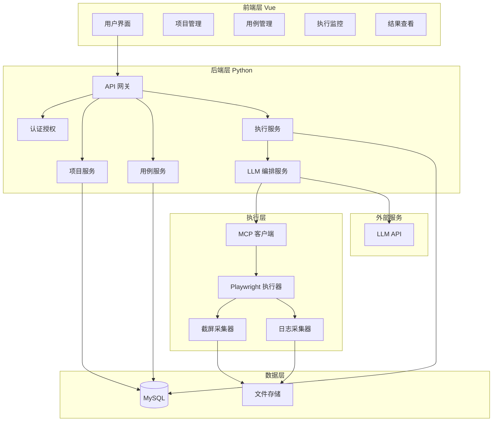

### 2.2 层次职责

| 层次 | 职责 | 技术栈 |
|------|------|--------|
| 前端层 | 用户交互、表单验证、数据展示 | Vue 3、Vue Router、Pinia |
| 后端层 | 业务逻辑、API 服务、数据持久化 | Python、FastAPI/Flask |
| 数据层 | 结构化数据存储、文件存储 | MySQL、本地文件系统 |
| 执行层 | 测试脚本执行、工件采集 | MCP、Playwright |
| 外部服务 | 自然语言处理、智能判定 | LLM API（OpenAI/Claude 等） |

## 3. 角色与权限

### 3.1 角色定义

| 角色 | 权限范围 |
|------|----------|
| Admin | 用户管理、项目管理、LLM 配置、系统参数配置、审计日志查看 |
| Member | 创建/编辑测试用例、执行测试、查看测试结果、查看所属项目配置 |

### 3.2 权限矩阵

| 功能模块 | Admin | Member |
|----------|-------|--------|
| 用户管理 | ✓ | ✗ |
| 项目创建/删除 | ✓ | ✗ |
| 项目编辑 | ✓ | ✗ |
| LLM 配置 | ✓ | 只读 |
| 用例创建/编辑 | ✓ | ✓ |
| 用例删除 | ✓ | ✓（仅自己创建的） |
| 执行测试 | ✓ | ✓ |
| 查看结果 | ✓ | ✓ |
| 系统审计 | ✓ | ✗ |

## 4. 核心业务流程

### 4.1 端到端测试流程

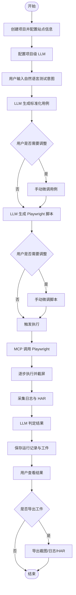

### 4.2 自然语言转用例流程

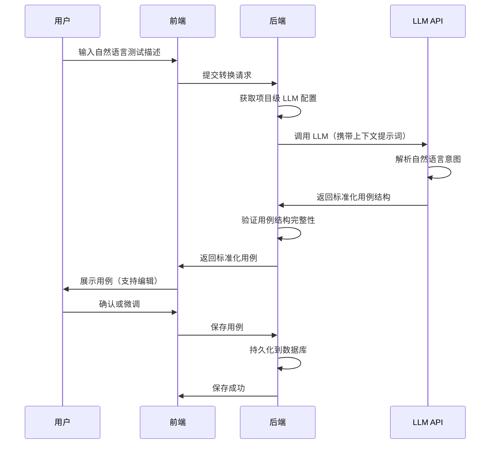

### 4.3 脚本生成流程

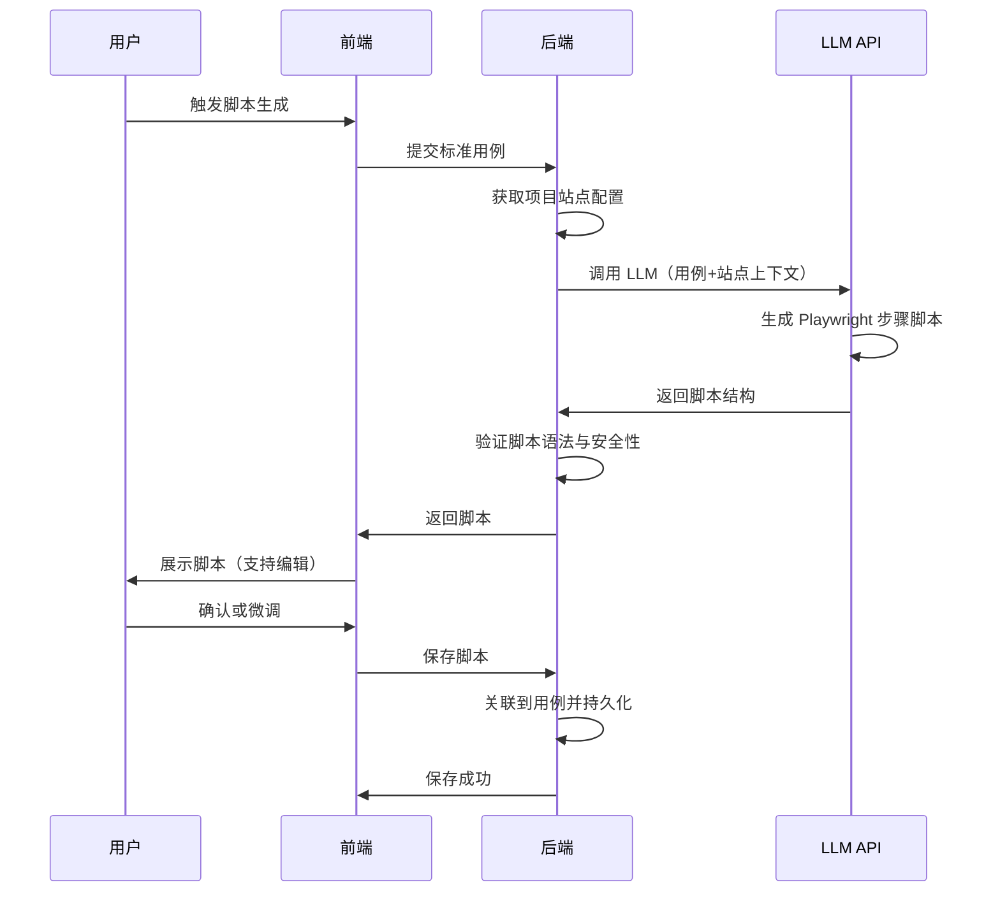

### 4.4 测试执行流程

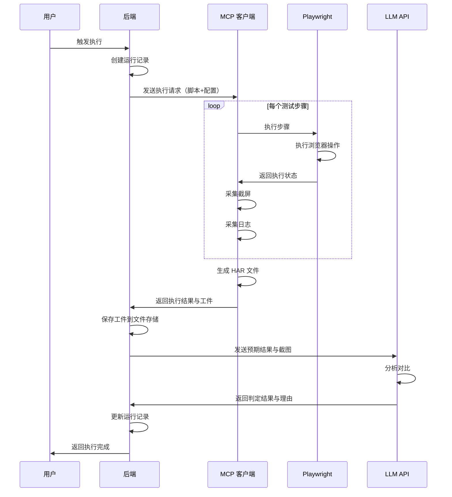

## 5. 数据模型

### 5.1 用户表（User）

| 字段名 | 类型 | 说明 | 约束 |
|--------|------|------|------|
| id | INT | 用户 ID | 主键、自增 |
| username | VARCHAR(50) | 用户名 | 唯一、非空 |
| password_hash | VARCHAR(255) | 密码哈希 | 非空 |
| role | ENUM | 角色（Admin/Member） | 非空 |
| created_at | DATETIME | 创建时间 | 非空 |
| updated_at | DATETIME | 更新时间 | 非空 |
| is_active | BOOLEAN | 是否激活 | 默认 true |

### 5.2 项目表（Project）

| 字段名 | 类型 | 说明 | 约束 |
|--------|------|------|------|
| id | INT | 项目 ID | 主键、自增 |
| name | VARCHAR(100) | 项目名称 | 唯一、非空 |
| description | TEXT | 项目描述 | 可空 |
| base_url | VARCHAR(500) | 被测站点基础 URL | 非空 |
| llm_provider | VARCHAR(50) | LLM 提供商 | 非空 |
| llm_model | VARCHAR(100) | LLM 模型名称 | 非空 |
| llm_api_key | VARCHAR(255) | LLM API 密钥（加密存储） | 非空 |
| llm_config | JSON | LLM 额外配置 | 可空 |
| created_by | INT | 创建人 ID | 外键 User.id |
| created_at | DATETIME | 创建时间 | 非空 |
| updated_at | DATETIME | 更新时间 | 非空 |

### 5.3 测试用例表（TestCase）

| 字段名 | 类型 | 说明 | 约束 |
|--------|------|------|------|
| id | INT | 用例 ID | 主键、自增 |
| project_id | INT | 所属项目 ID | 外键 Project.id |
| name | VARCHAR(200) | 用例名称 | 非空 |
| description | TEXT | 用例描述 | 可空 |
| natural_language | TEXT | 原始自然语言描述 | 非空 |
| standard_steps | JSON | 标准化步骤结构 | 非空 |
| playwright_script | JSON | Playwright 脚本结构 | 非空 |
| expected_result | TEXT | 预期结果描述 | 非空 |
| created_by | INT | 创建人 ID | 外键 User.id |
| created_at | DATETIME | 创建时间 | 非空 |
| updated_at | DATETIME | 更新时间 | 非空 |

### 5.4 运行记录表（TestRun）

| 字段名 | 类型 | 说明 | 约束 |
|--------|------|------|------|
| id | INT | 运行 ID | 主键、自增 |
| test_case_id | INT | 用例 ID | 外键 TestCase.id |
| status | ENUM | 状态（运行中/成功/失败/错误） | 非空 |
| trigger_by | INT | 触发人 ID | 外键 User.id |
| start_time | DATETIME | 开始时间 | 非空 |
| end_time | DATETIME | 结束时间 | 可空 |
| llm_verdict | ENUM | LLM 判定（通过/失败/未知） | 可空 |
| llm_reason | TEXT | LLM 判定理由 | 可空 |
| error_message | TEXT | 错误信息 | 可空 |
| artifacts_path | VARCHAR(500) | 工件存储路径 | 可空 |
| created_at | DATETIME | 创建时间 | 非空 |

### 5.5 步骤执行记录表（StepExecution）

| 字段名 | 类型 | 说明 | 约束 |
|--------|------|------|------|
| id | INT | 步骤 ID | 主键、自增 |
| test_run_id | INT | 运行 ID | 外键 TestRun.id |
| step_index | INT | 步骤序号 | 非空 |
| step_description | TEXT | 步骤描述 | 非空 |
| status | ENUM | 状态（成功/失败/跳过） | 非空 |
| screenshot_path | VARCHAR(500) | 截图路径 | 可空 |
| start_time | DATETIME | 开始时间 | 非空 |
| end_time | DATETIME | 结束时间 | 可空 |
| error_message | TEXT | 错误信息 | 可空 |

### 5.6 审计日志表（AuditLog）

| 字段名 | 类型 | 说明 | 约束 |
|--------|------|------|------|
| id | INT | 日志 ID | 主键、自增 |
| user_id | INT | 操作人 ID | 外键 User.id |
| action | VARCHAR(100) | 操作类型 | 非空 |
| resource_type | VARCHAR(50) | 资源类型 | 非空 |
| resource_id | INT | 资源 ID | 可空 |
| details | JSON | 操作详情 | 可空 |
| ip_address | VARCHAR(50) | IP 地址 | 可空 |
| created_at | DATETIME | 操作时间 | 非空 |

### 5.7 数据关系图

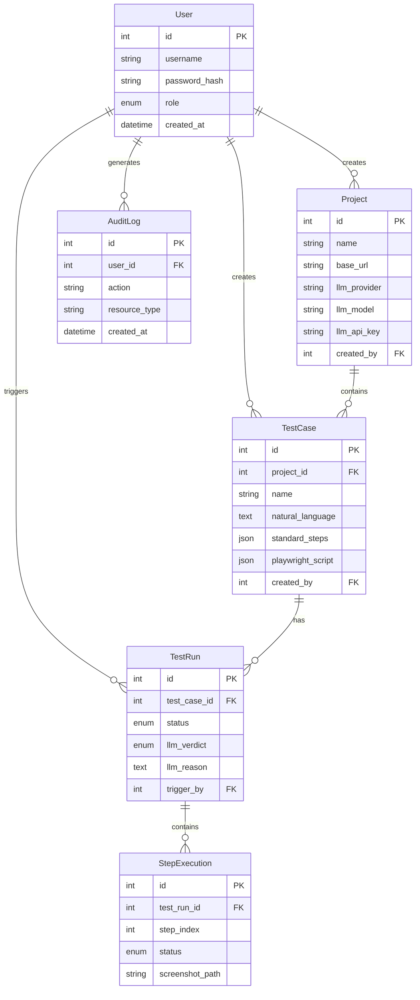

## 6. API 端点参考

### 6.1 认证模块

| 端点 | 方法 | 说明 | 认证要求 |
|------|------|------|----------|
| /api/auth/login | POST | 用户登录 | 无 |
| /api/auth/logout | POST | 用户登出 | 需登录 |
| /api/auth/current | GET | 获取当前用户信息 | 需登录 |

**登录请求**

| 字段 | 类型 | 必填 | 说明 |
|------|------|------|------|
| username | string | 是 | 用户名 |
| password | string | 是 | 密码 |

**登录响应**

| 字段 | 类型 | 说明 |
|------|------|------|
| token | string | 认证令牌 |
| user | object | 用户信息（id、username、role） |

### 6.2 用户管理模块

| 端点 | 方法 | 说明 | 权限要求 |
|------|------|------|----------|
| /api/users | GET | 用户列表 | Admin |
| /api/users | POST | 创建用户 | Admin |
| /api/users/{id} | GET | 用户详情 | Admin |
| /api/users/{id} | PUT | 更新用户 | Admin |
| /api/users/{id} | DELETE | 删除用户 | Admin |

### 6.3 项目管理模块

| 端点 | 方法 | 说明 | 权限要求 |
|------|------|------|----------|
| /api/projects | GET | 项目列表 | 已登录 |
| /api/projects | POST | 创建项目 | Admin |
| /api/projects/{id} | GET | 项目详情 | 已登录 |
| /api/projects/{id} | PUT | 更新项目 | Admin |
| /api/projects/{id} | DELETE | 删除项目 | Admin |

**创建项目请求**

| 字段 | 类型 | 必填 | 说明 |
|------|------|------|------|
| name | string | 是 | 项目名称 |
| description | string | 否 | 项目描述 |
| base_url | string | 是 | 被测站点基础 URL |
| llm_provider | string | 是 | LLM 提供商（openai/anthropic 等） |
| llm_model | string | 是 | 模型名称 |
| llm_api_key | string | 是 | API 密钥 |
| llm_config | object | 否 | 额外配置（temperature 等） |

### 6.4 测试用例模块

| 端点 | 方法 | 说明 | 权限要求 |
|------|------|------|----------|
| /api/projects/{pid}/cases | GET | 用例列表 | 已登录 |
| /api/projects/{pid}/cases | POST | 创建用例 | 已登录 |
| /api/cases/{id} | GET | 用例详情 | 已登录 |
| /api/cases/{id} | PUT | 更新用例 | 已登录 |
| /api/cases/{id} | DELETE | 删除用例 | Admin 或创建者 |
| /api/cases/generate-from-nl | POST | 自然语言生成用例 | 已登录 |
| /api/cases/generate-script | POST | 生成 Playwright 脚本 | 已登录 |

**自然语言生成用例请求**

| 字段 | 类型 | 必填 | 说明 |
|------|------|------|------|
| project_id | int | 是 | 项目 ID |
| natural_language | string | 是 | 自然语言描述 |

**自然语言生成用例响应**

| 字段 | 类型 | 说明 |
|------|------|------|
| name | string | 用例名称 |
| description | string | 用例描述 |
| standard_steps | array | 标准化步骤列表 |
| expected_result | string | 预期结果 |

**生成脚本请求**

| 字段 | 类型 | 必填 | 说明 |
|------|------|------|------|
| test_case_id | int | 是 | 用例 ID |

**生成脚本响应**

| 字段 | 类型 | 说明 |
|------|------|------|
| playwright_script | object | Playwright 脚本结构 |

### 6.5 测试执行模块

| 端点 | 方法 | 说明 | 权限要求 |
|------|------|------|----------|
| /api/cases/{id}/execute | POST | 执行测试用例 | 已登录 |
| /api/runs/{id} | GET | 运行详情 | 已登录 |
| /api/runs/{id}/steps | GET | 步骤执行记录 | 已登录 |
| /api/runs | GET | 运行记录列表 | 已登录 |
| /api/runs/{id}/artifacts | GET | 获取工件列表 | 已登录 |
| /api/runs/{id}/artifacts/download | GET | 下载工件压缩包 | 已登录 |

**执行响应**

| 字段 | 类型 | 说明 |
|------|------|------|
| run_id | int | 运行 ID |
| status | string | 初始状态（运行中） |

**运行详情响应**

| 字段 | 类型 | 说明 |
|------|------|------|
| id | int | 运行 ID |
| test_case | object | 用例信息 |
| status | string | 状态 |
| llm_verdict | string | LLM 判定结果 |
| llm_reason | string | 判定理由 |
| start_time | datetime | 开始时间 |
| end_time | datetime | 结束时间 |
| trigger_by | object | 触发人信息 |

### 6.6 审计日志模块

| 端点 | 方法 | 说明 | 权限要求 |
|------|------|------|----------|
| /api/audit-logs | GET | 审计日志列表 | Admin |
| /api/audit-logs/{id} | GET | 日志详情 | Admin |

## 7. 前端组件架构

### 7.1 页面路由结构

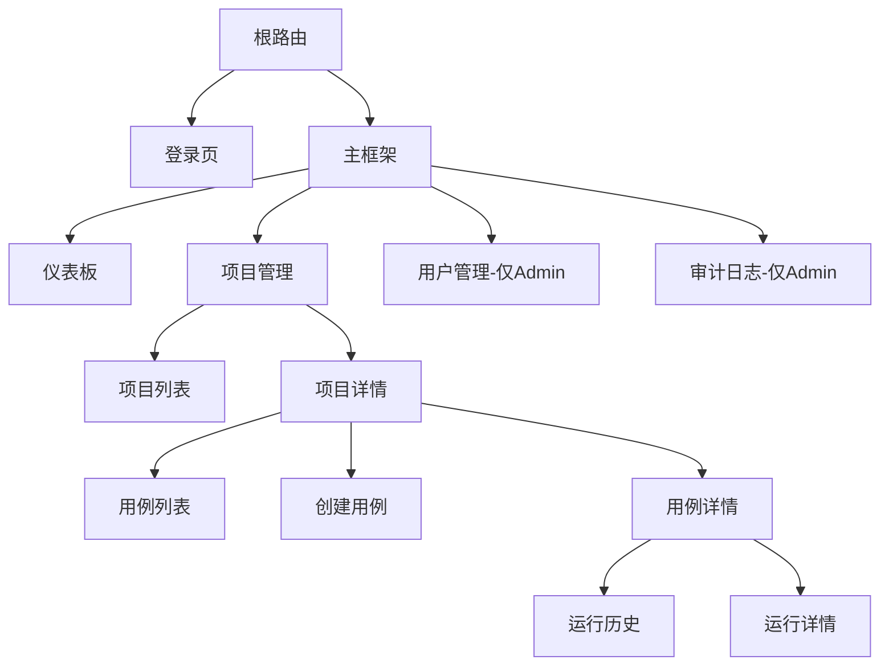

### 7.2 核心组件层次

| 组件名称 | 类型 | 职责 |
|----------|------|------|
| App | 根组件 | 应用入口、路由配置 |
| LoginView | 页面组件 | 用户登录 |
| MainLayout | 布局组件 | 主框架、导航菜单、用户信息 |
| ProjectList | 页面组件 | 项目列表展示与搜索 |
| ProjectForm | 表单组件 | 项目创建/编辑表单（含 LLM 配置） |
| TestCaseList | 页面组件 | 用例列表展示 |
| NLInputPanel | 业务组件 | 自然语言输入与转换 |
| StandardStepsEditor | 业务组件 | 标准步骤编辑器 |
| ScriptEditor | 业务组件 | Playwright 脚本编辑器 |
| TestExecutionPanel | 业务组件 | 测试执行控制面板 |
| RunDetailView | 页面组件 | 运行详情与步骤展示 |
| StepTimeline | 业务组件 | 步骤时间线与截图展示 |
| VerdictDisplay | 业务组件 | LLM 判定结果展示 |
| ArtifactViewer | 业务组件 | 工件查看与下载 |
| UserManagement | 页面组件 | 用户管理（Admin） |
| AuditLogView | 页面组件 | 审计日志（Admin） |

### 7.3 状态管理

**全局状态（Pinia Store）**

| Store 名称 | 职责 | 主要状态 |
|-----------|------|----------|
| authStore | 认证状态管理 | user、token、isAuthenticated |
| projectStore | 项目状态管理 | currentProject、projectList |
| caseStore | 用例状态管理 | currentCase、caseList |
| runStore | 运行状态管理 | currentRun、runList、liveStatus |

## 8. 业务逻辑层架构

### 8.1 LLM 编排服务

**职责**
- 管理与各 LLM 提供商的交互
- 提示词模板管理
- 响应解析与验证
- 错误处理与重试

**核心能力**

| 能力 | 说明 |
|------|------|
| 自然语言解析 | 将用户输入转换为标准化用例结构 |
| 脚本生成 | 将标准用例转换为 Playwright 脚本 |
| 结果判定 | 对比预期结果与截图，给出判定意见 |
| 提示词管理 | 维护不同场景的提示词模板 |

**提示词模板类型**

| 模板名称 | 用途 | 输入 | 输出 |
|----------|------|------|------|
| nl_to_case | 自然语言转用例 | 自然语言描述、站点信息 | 标准化用例 JSON |
| case_to_script | 用例转脚本 | 标准化用例、站点配置 | Playwright 脚本 JSON |
| verdict_analysis | 结果判定 | 预期结果、截图列表、日志 | 判定结果与理由 |

### 8.2 MCP 客户端服务

**职责**
- 实现 MCP 协议通信
- 向 Playwright 发送执行指令
- 接收执行状态与工件
- 异常处理与超时控制

**MCP 协议交互流程**

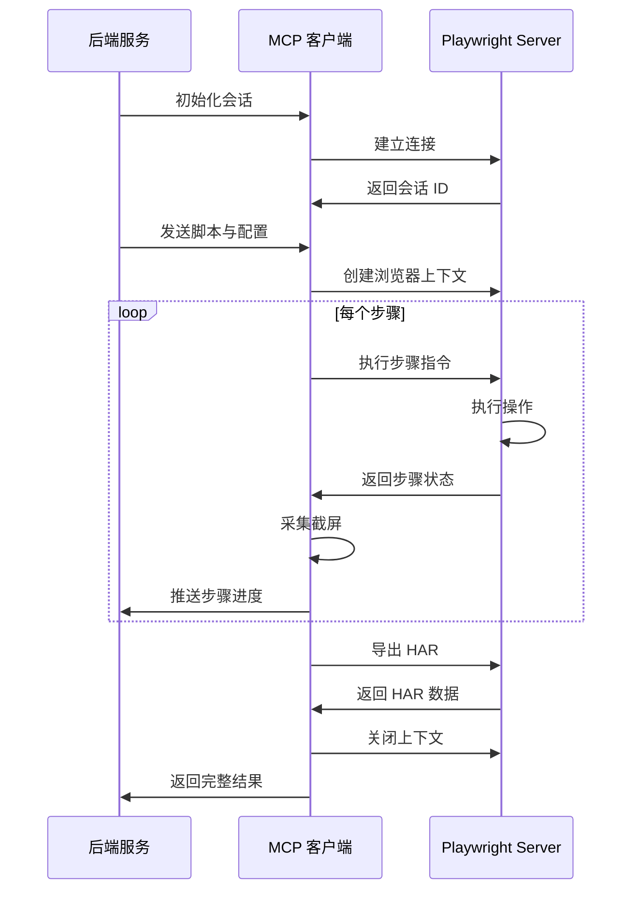

### 8.3 工件管理服务

**职责**
- 截图文件存储与管理
- 日志文件存储
- HAR 文件存储
- 工件检索与打包下载

**工件存储结构**

```
artifacts/
├── runs/
│   ├── {run_id}/
│   │   ├── screenshots/
│   │   │   ├── step_1.png
│   │   │   ├── step_2.png
│   │   │   └── step_n.png
│   │   ├── logs/
│   │   │   ├── console.log
│   │   │   └── execution.log
│   │   └── network/
│   │       └── traffic.har
```

## 9. 执行引擎设计

### 9.1 Playwright 脚本结构

**标准脚本格式（JSON）**

| 字段 | 类型 | 说明 |
|------|------|------|
| browser | string | 浏览器类型（chromium/firefox/webkit） |
| viewport | object | 视口尺寸（width、height） |
| steps | array | 步骤列表 |

**步骤结构**

| 字段 | 类型 | 说明 |
|------|------|------|
| index | int | 步骤序号 |
| action | string | 操作类型（goto/click/fill/wait 等） |
| selector | string | 选择器（可选） |
| value | string | 输入值（可选） |
| description | string | 步骤描述 |
| screenshot | boolean | 是否截屏 |

**操作类型清单**

| 操作类型 | 说明 | 必需参数 |
|----------|------|----------|
| goto | 导航到 URL | url |
| click | 点击元素 | selector |
| fill | 填充输入框 | selector、value |
| select | 选择下拉选项 | selector、value |
| wait | 等待元素出现 | selector |
| waitTime | 等待固定时间 | duration（毫秒） |
| screenshot | 截屏 | name（可选） |
| assertText | 断言文本内容 | selector、expected |
| assertVisible | 断言元素可见 | selector |

### 9.2 截屏采集策略

| 截屏时机 | 说明 |
|----------|------|
| 步骤前 | 执行操作前的页面状态 |
| 步骤后 | 执行操作后的页面状态 |
| 错误时 | 发生异常时立即截屏 |
| 用户指定 | 脚本中显式指定 screenshot 步骤 |

**截屏配置**

| 参数 | 默认值 | 说明 |
|------|--------|------|
| fullPage | true | 是否全页截屏 |
| quality | 90 | 截图质量（1-100） |
| format | png | 图片格式 |

### 9.3 日志采集规范

**Console 日志采集**
- 捕获浏览器控制台所有级别日志（log/warn/error）
- 记录时间戳与来源
- 过滤敏感信息

**执行日志采集**
- 记录每个步骤的开始/结束时间
- 记录操作成功/失败状态
- 记录异常堆栈

### 9.4 HAR 文件采集

**采集内容**
- 所有 HTTP/HTTPS 请求与响应
- 请求头与响应头
- 请求体与响应体（可配置大小限制）
- 时间性能指标

**隐私处理**
- 过滤敏感请求头（Authorization、Cookie）
- 可配置排除特定域名
- 支持响应体脱敏

## 10. LLM 判定机制

### 10.1 判定流程

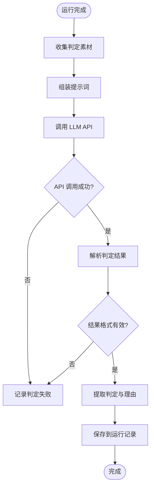

### 10.2 判定素材组成

| 素材类型 | 说明 |
|----------|------|
| 预期结果 | 用例中定义的预期行为描述 |
| 步骤截图 | 每个步骤的截图列表 |
| Console 日志 | 浏览器控制台错误与警告 |
| 执行状态 | 每个步骤的成功/失败状态 |
| 错误信息 | 异常堆栈与失败原因 |

### 10.3 判定结果结构

| 字段 | 类型 | 说明 |
|------|------|------|
| verdict | enum | 通过/失败/未知 |
| confidence | float | 判定置信度（0-1） |
| reason | string | 判定理由 |
| observations | array | 关键观察点列表 |

**观察点结构**

| 字段 | 类型 | 说明 |
|------|------|------|
| step_index | int | 相关步骤序号 |
| type | string | 类型（视觉/日志/性能） |
| description | string | 观察描述 |
| severity | string | 严重程度（info/warning/error） |

## 11. 安全设计

### 11.1 认证与授权

**认证机制**
- 基于 JWT Token 的无状态认证
- Token 有效期：24 小时
- 刷新机制：滑动窗口自动续期

**密码安全**
- 使用 bcrypt 哈希存储
- 最小密码长度：8 位
- 初始密码：admin/admin（首次登录强制修改）

**授权控制**
- 基于角色的访问控制（RBAC）
- API 级别权限检查
- 资源级别所有权验证

### 11.2 数据安全

| 数据类型 | 保护措施 |
|----------|----------|
| LLM API 密钥 | AES-256 加密存储 |
| 用户密码 | bcrypt 哈希 |
| 敏感日志 | 自动脱敏 |
| HAR 文件 | 敏感头过滤 |

### 11.3 脚本安全

**脚本验证**
- 禁止执行任意系统命令
- 限制文件系统访问
- 仅允许预定义操作类型
- URL 白名单验证（基于项目配置）

**沙箱隔离**
- Playwright 运行在独立进程
- 资源配额限制（CPU、内存、执行时间）
- 网络访问限制

### 11.4 审计追踪

**审计事件**
- 用户登录/登出
- 用户创建/删除/角色变更
- 项目创建/修改/删除
- 用例执行
- LLM 配置修改

**审计字段**
- 操作人
- 操作时间
- IP 地址
- 操作类型
- 资源标识
- 变更详情

## 12. 测试策略

### 12.1 单元测试

**后端测试覆盖**

| 模块 | 测试重点 |
|------|----------|
| 认证服务 | 登录逻辑、Token 生成与验证 |
| LLM 编排 | 提示词构建、响应解析、错误处理 |
| MCP 客户端 | 协议通信、状态管理 |
| 数据模型 | 数据验证、关联关系 |

**前端测试覆盖**

| 组件类型 | 测试重点 |
|----------|----------|
| 表单组件 | 输入验证、提交流程 |
| 业务组件 | 状态变更、事件处理 |
| Store | 状态管理逻辑 |
| API 客户端 | 请求构建、响应处理 |

### 12.2 集成测试

**测试场景**

| 场景 | 验证点 |
|------|--------|
| 端到端用例创建 | 自然语言输入 → 用例生成 → 脚本生成 → 持久化 |
| 执行流程 | 触发执行 → MCP 调用 → 工件采集 → 判定 → 记录保存 |
| 权限控制 | 不同角色访问不同资源的权限验证 |

### 12.3 测试数据策略

**初始化数据**
- 默认管理员账号：admin/admin
- 示例项目配置
- 示例测试用例

**测试隔离**
- 每个测试用例独立数据库事务
- 测试完成后自动清理工件文件
- Mock LLM API 响应

## 13. 部署架构

### 13.1 部署拓扑

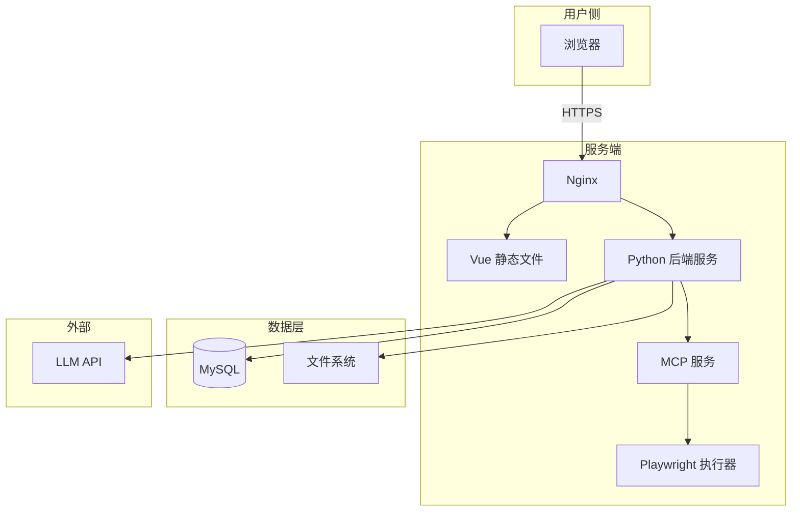

### 13.2 部署组件

| 组件 | 技术 | 说明 |
|------|------|------|
| Web 服务器 | Nginx | 静态文件服务、反向代理 |
| 前端 | Vue SPA | 编译后的静态资源 |
| 后端 | Python + Gunicorn/Uvicorn | API 服务 |
| 数据库 | MySQL 8.0+ | 持久化存储 |
| MCP 服务 | Python 进程 | 独立进程或集成在后端 |
| Playwright | Chromium | 浏览器自动化 |

### 13.3 系统参数配置

**后端配置**

| 参数 | 说明 | 默认值 |
|------|------|--------|
| JWT_SECRET | Token 签名密钥 | 随机生成 |
| DB_HOST | 数据库主机 | localhost |
| DB_PORT | 数据库端口 | 3306 |
| DB_NAME | 数据库名称 | ui_test_platform |
| ARTIFACTS_PATH | 工件存储路径 | ./artifacts |
| MAX_EXECUTION_TIME | 最大执行时长（秒） | 300 |

**前端配置**

| 参数 | 说明 |
|------|------|
| VUE_APP_API_BASE_URL | 后端 API 基础 URL |
| VUE_APP_TITLE | 应用标题 |

### 13.4 初始化流程

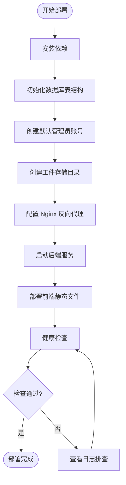

**初始化 SQL**
- 创建数据库与表结构
- 插入默认管理员记录（username: admin, password: bcrypt(admin)）
- 创建必要索引

**环境检查清单**
- Python 3.9+ 已安装
- MySQL 8.0+ 已启动
- Playwright 浏览器已下载
- 文件系统写权限
- 网络访问 LLM API

