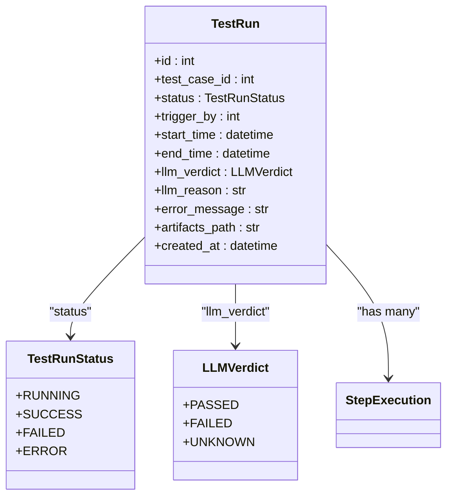
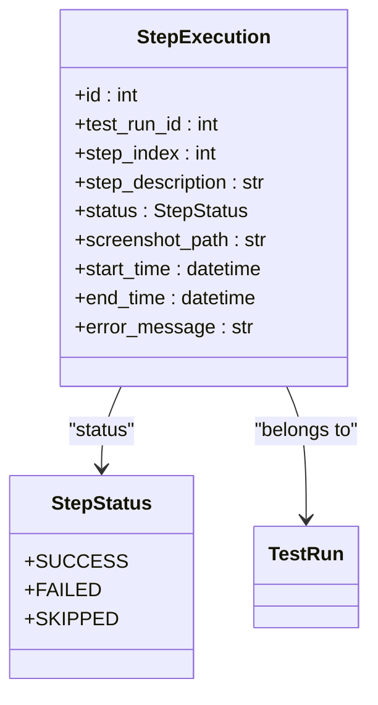
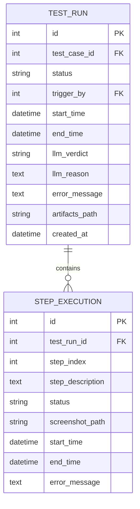
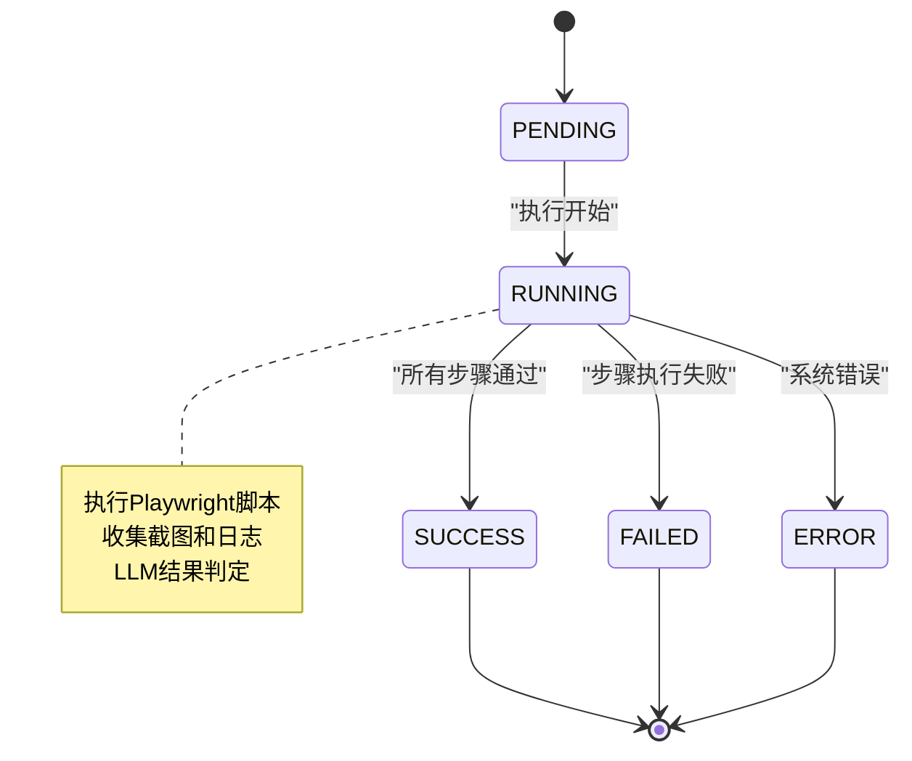
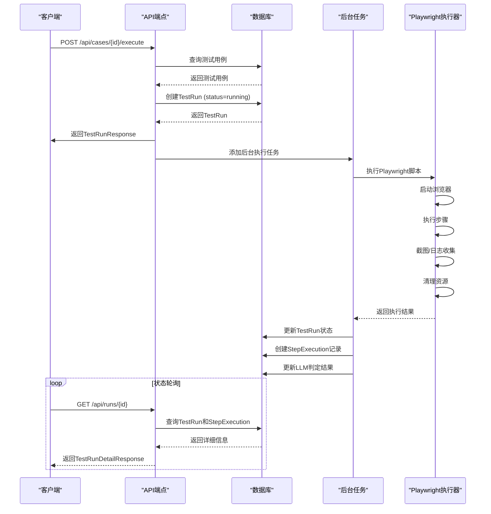
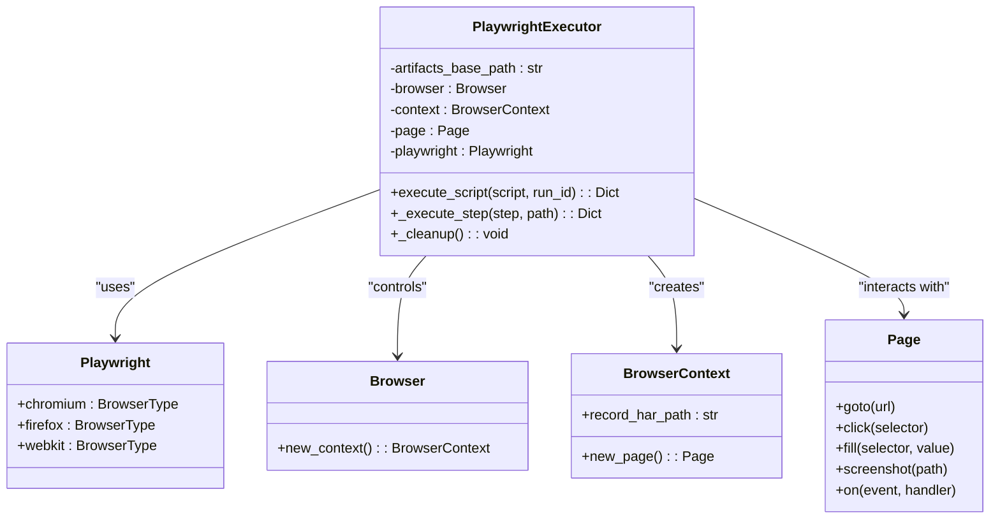
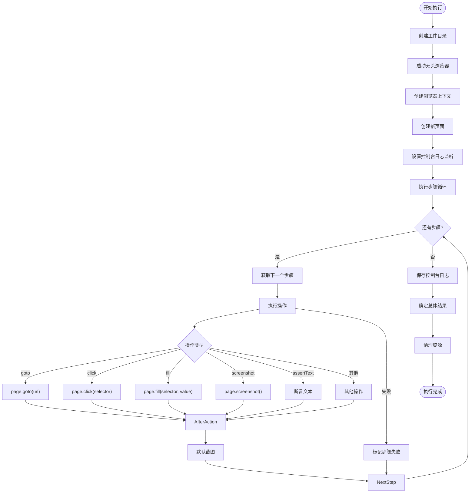
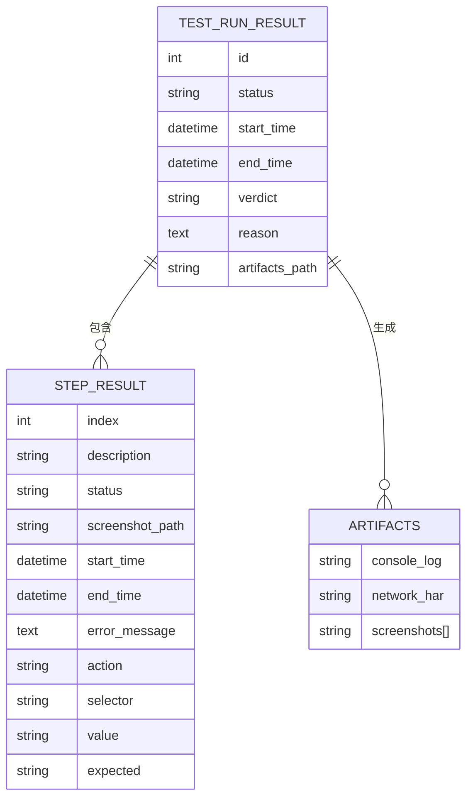
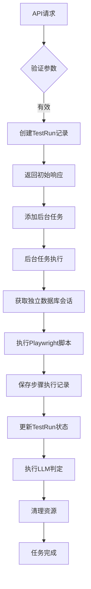

# 测试执行API

<cite>
**Referenced Files in This Document**   
- [test_runs.py](file://backend/app/api/endpoints/test_runs.py)
- [test_run.py](file://backend/app/models/test_run.py)
- [step_execution.py](file://backend/app/models/step_execution.py)
- [playwright_executor.py](file://backend/app/services/playwright_executor.py)
- [test_case.py](file://backend/app/models/test_case.py)
- [main.py](file://backend/main.py)
</cite>

## 目录
1. [简介](#简介)
2. [核心端点](#核心端点)
3. [数据模型](#数据模型)
4. [执行流程](#执行流程)
5. [Playwright执行器](#playwright执行器)
6. [执行结果结构](#执行结果结构)
7. [状态轮询与超时处理](#状态轮询与超时处理)
8. [后台执行与回调机制](#后台执行与回调机制)

## 简介

本文档全面介绍了测试执行API，涵盖测试执行触发和执行状态查询两个关键端点。文档详细说明了执行请求的参数、异步执行模式、核心数据模型的关系、Playwright执行器的工作原理以及执行结果的结构。通过结合代码库中的实际逻辑，本文档为开发者和用户提供了一个完整的测试执行系统视图。

## 核心端点

测试执行API提供了两个核心端点，用于触发和查询测试运行。

### 测试执行触发

`POST /api/cases/{case_id}/execute` 端点用于触发指定测试用例的执行。

- **路径参数**: `case_id` - 要执行的测试用例ID
- **请求方式**: POST
- **响应模型**: `TestRunResponse`
- **功能**: 创建一个新的测试运行记录，并在后台异步执行测试

此端点首先验证测试用例的存在性，然后创建一个状态为"running"的`TestRun`记录，并立即返回该记录。实际的浏览器执行任务被放入后台任务队列中处理，确保API响应快速。

**Section sources**
- [test_runs.py](file://backend/app/api/endpoints/test_runs.py#L144-L181)

### 执行状态查询

`GET /api/runs/{run_id}` 端点用于查询指定测试运行的详细信息。

- **路径参数**: `run_id` - 测试运行ID
- **请求方式**: GET
- **响应模型**: `TestRunDetailResponse`
- **功能**: 获取测试运行的完整详情，包括步骤执行记录

该端点返回测试运行的总体状态、时间戳、错误信息以及所有步骤的详细执行结果。如果测试已完成，还会包含LLM的判定结果。

**Section sources**
- [test_runs.py](file://backend/app/api/endpoints/test_runs.py#L185-L216)

## 数据模型

测试执行系统的核心由`TestRun`和`StepExecution`两个模型构成，它们之间存在一对多的关系。

### TestRun模型

`TestRun`模型代表一次完整的测试运行，存储了运行的总体状态和元数据。



**Diagram sources**
- [test_run.py](file://backend/app/models/test_run.py#L25-L44)

**Section sources**
- [test_run.py](file://backend/app/models/test_run.py#L25-L44)

### StepExecution模型

`StepExecution`模型代表测试运行中的单个步骤执行，与`TestRun`形成聚合关系。



**Diagram sources**
- [step_execution.py](file://backend/app/models/step_execution.py#L17-L32)

**Section sources**
- [step_execution.py](file://backend/app/models/step_execution.py#L17-L32)

### 模型关系

`TestRun`和`StepExecution`模型之间存在明确的父子关系，一个`TestRun`可以包含多个`StepExecution`记录。



**Diagram sources**
- [test_run.py](file://backend/app/models/test_run.py#L44)
- [step_execution.py](file://backend/app/models/step_execution.py#L32)

## 执行流程

测试执行采用异步模式，确保API响应的及时性，同时允许长时间的浏览器操作完成。

### 状态转换

测试运行在其生命周期中会经历一系列状态转换。



**Diagram sources**
- [test_run.py](file://backend/app/models/test_run.py#L10-L15)
- [step_execution.py](file://backend/app/models/step_execution.py#L10-L14)

**Section sources**
- [test_run.py](file://backend/app/models/test_run.py#L10-L15)
- [step_execution.py](file://backend/app/models/step_execution.py#L10-L14)

### 执行序列

从API调用到最终结果的完整执行流程如下：



**Diagram sources**
- [test_runs.py](file://backend/app/api/endpoints/test_runs.py#L144-L181)
- [playwright_executor.py](file://backend/app/services/playwright_executor.py#L27-L120)

## Playwright执行器

`PlaywrightExecutor`是驱动浏览器执行的核心服务，负责执行由自然语言生成的Playwright脚本。

### 执行器架构



**Diagram sources**
- [playwright_executor.py](file://backend/app/services/playwright_executor.py#L11-L213)

**Section sources**
- [playwright_executor.py](file://backend/app/services/playwright_executor.py#L11-L213)

### 执行流程

Playwright执行器按照预定义的步骤列表逐一执行操作。



**Diagram sources**
- [playwright_executor.py](file://backend/app/services/playwright_executor.py#L27-L120)
- [playwright_executor.py](file://backend/app/services/playwright_executor.py#L122-L199)

## 执行结果结构

执行完成后，系统会生成详细的执行结果，包括每个步骤的操作、预期、实际结果和判定。

### 结果数据结构



**Diagram sources**
- [test_run.py](file://backend/app/models/test_run.py#L25-L44)
- [step_execution.py](file://backend/app/models/step_execution.py#L17-L32)
- [playwright_executor.py](file://backend/app/services/playwright_executor.py#L27-L120)

### 步骤判定逻辑

每个步骤的执行结果都会被详细记录和判定。

| 步骤属性 | 描述 | 示例值 |
|--------|------|-------|
| **操作 (action)** | 执行的具体操作类型 | "click", "fill", "goto" |
| **选择器 (selector)** | 定位页面元素的CSS选择器 | "#login-btn", "input[name='email']" |
| **值 (value)** | 操作的输入值 | "user@example.com", "password123" |
| **预期结果 (expected)** | 步骤期望达到的状态 | "登录成功", "页面跳转到仪表板" |
| **实际结果** | 通过截图和日志验证的实际状态 | HAR文件中的网络请求 |
| **判定** | LLM基于证据的通过/失败判定 | "passed", "failed" |

**Section sources**
- [playwright_executor.py](file://backend/app/services/playwright_executor.py#L122-L199)
- [test_runs.py](file://backend/app/api/endpoints/test_runs.py#L144-L181)

## 状态轮询与超时处理

客户端需要通过轮询机制来获取异步执行的最终结果。

### 轮询示例

```python
import requests
import time

def poll_test_run_status(run_id, max_wait=300, interval=5):
    """
    轮询测试运行状态
    
    Args:
        run_id: 测试运行ID
        max_wait: 最大等待时间(秒)
        interval: 轮询间隔(秒)
    
    Returns:
        执行结果或超时错误
    """
    url = f"http://localhost:8000/api/runs/{run_id}"
    start_time = time.time()
    
    while time.time() - start_time < max_wait:
        response = requests.get(url)
        
        if response.status_code == 200:
            data = response.json()
            status = data["status"]
            
            if status in ["success", "failed", "error"]:
                return data
            
            # 继续轮询
            time.sleep(interval)
        else:
            raise Exception(f"查询失败: {response.status_code}")
    
    raise Exception(f"轮询超时: {max_wait}秒内未完成")

# 使用示例
try:
    result = poll_test_run_status(run_id=123)
    print(f"测试完成，结果: {result['llm_verdict']}")
except Exception as e:
    print(f"错误: {e}")
```

### 超时处理建议

1. **设置合理的超时时间**: 根据测试用例的复杂度设置适当的`max_wait`值
2. **指数退避**: 在生产环境中，可以采用指数退避策略减少服务器压力
3. **错误处理**: 妥善处理网络错误和API错误
4. **前端优化**: 在UI中显示进度指示器，提升用户体验

## 后台执行与回调机制

系统采用后台任务机制处理长时间运行的测试，确保API的响应性能。

### 后台执行流程



**Diagram sources**
- [test_runs.py](file://backend/app/api/endpoints/test_runs.py#L144-L181)
- [test_runs.py](file://backend/app/api/endpoints/test_runs.py#L45-L142)

**Section sources**
- [test_runs.py](file://backend/app/api/endpoints/test_runs.py#L45-L181)

### 回调机制实现

后台任务通过独立的数据库会话与主API进程通信，确保数据一致性。

```python
def execute_test_background(test_run_id: int, test_case_id: int, db_url: str):
    """后台执行测试任务"""
    # 创建新的数据库会话
    engine = create_engine(db_url)
    SessionLocal = sessionmaker(bind=engine)
    db = SessionLocal()
    
    try:
        # 获取测试运行记录
        test_run = db.query(TestRun).filter(TestRun.id == test_run_id).first()
        
        # 执行Playwright脚本
        executor = PlaywrightExecutor(settings.ARTIFACTS_PATH)
        exec_result = executor.execute_script(
            script=test_case.playwright_script,
            run_id=test_run_id
        )
        
        # 保存步骤执行记录
        for step_data in exec_result.get("steps", []):
            step = StepExecution(
                test_run_id=test_run_id,
                step_index=step_data["index"],
                step_description=step_data["description"],
                status=StepStatus.SUCCESS if step_data["status"] == "success" else StepStatus.FAILED,
                screenshot_path=step_data.get("screenshot_path"),
                start_time=datetime.fromisoformat(step_data["start_time"]),
                end_time=datetime.fromisoformat(step_data["end_time"]) if step_data.get("end_time") else None,
                error_message=step_data.get("error_message")
            )
            db.add(step)
        
        db.commit()
        
        # 更新运行记录
        test_run.artifacts_path = exec_result.get("artifacts_path")
        
        if exec_result.get("success"):
            test_run.status = TestRunStatus.SUCCESS
            # ... LLM判定逻辑
        else:
            test_run.status = TestRunStatus.FAILED
            test_run.error_message = exec_result.get("error_message")
        
        test_run.end_time = datetime.utcnow()
        db.commit()
        
    except Exception as e:
        # 更新为错误状态
        test_run = db.query(TestRun).filter(TestRun.id == test_run_id).first()
        if test_run:
            test_run.status = TestRunStatus.ERROR
            test_run.error_message = str(e)
            test_run.end_time = datetime.utcnow()
            db.commit()
    
    finally:
        db.close()
```

此机制确保了即使主API请求已经返回，后台任务仍能独立完成执行并将结果持久化到数据库中，供后续查询使用。

**Section sources**
- [test_runs.py](file://backend/app/api/endpoints/test_runs.py#L45-L142)