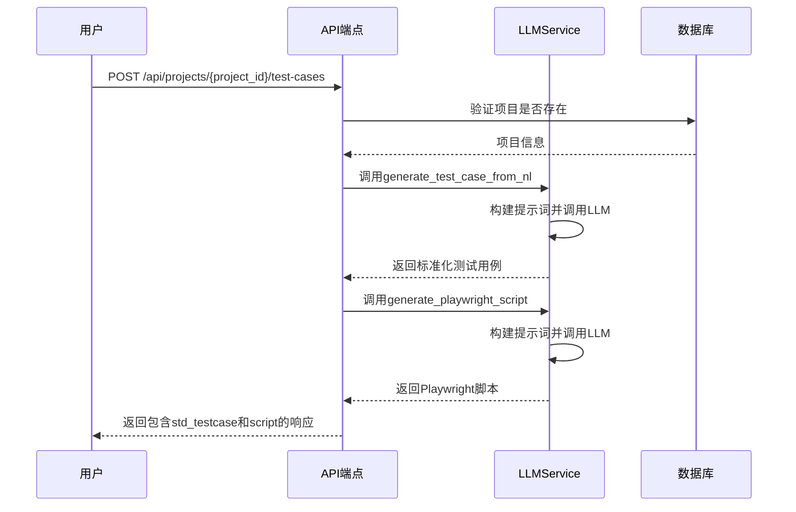
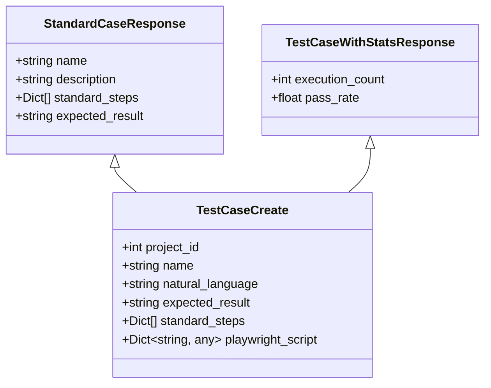
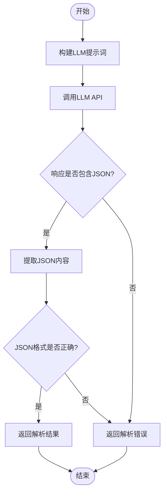
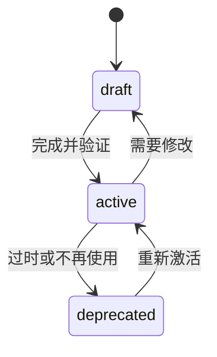
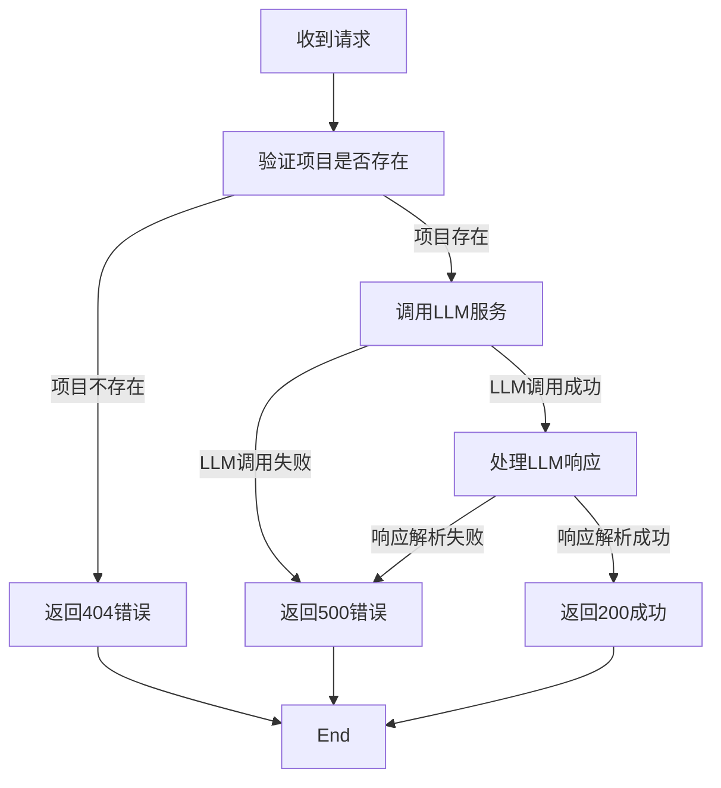

# 测试用例API

<cite>
**本文档引用的文件**   
- [test_cases.py](file://backend/app/api/endpoints/test_cases.py) - *更新了获取测试用例的端点，加入了执行统计数据*
- [llm_service.py](file://backend/app/services/llm_service.py)
- [test_case.py](file://backend/app/models/test_case.py)
- [test_case.py](file://backend/app/schemas/test_case.py) - *新增了带统计数据的响应Schema*
- [init_db.sql](file://backend/init_db.sql)
- [DESIGN_DOCUMENT.md](file://DESIGN_DOCUMENT.md)
- [API_EXAMPLES.md](file://API_EXAMPLES.md)
</cite>

## 更新摘要
**变更内容**   
- 更新了[核心端点](#核心端点)部分，将端点路径从`/api/cases/generate-from-nl`更新为`/api/projects/{project_id}/test-cases`
- 新增了[请求与响应结构](#请求与响应结构)部分，详细说明了`execution_count`和`pass_rate`两个新字段
- 更新了[使用示例](#使用示例)部分，提供了完整的curl示例，展示了如何通过项目ID创建测试用例
- 更新了[错误处理](#错误处理)部分，修正了端点路径和错误码描述

## 目录
1. [简介](#简介)
2. [核心端点](#核心端点)
3. [请求与响应结构](#请求与响应结构)
4. [LLM服务集成](#llm服务集成)
5. [测试用例状态机](#测试用例状态机)
6. [使用示例](#使用示例)
7. [错误处理](#错误处理)

## 简介
本API文档详细描述了基于自然语言生成测试用例的核心功能。系统允许用户通过自然语言输入（nl_input）创建标准化的测试用例，并自动生成对应的Playwright自动化脚本。该功能通过集成大型语言模型（LLM）实现，将非结构化的自然语言指令转换为结构化的测试步骤和可执行的自动化代码。

**Section sources**
- [DESIGN_DOCUMENT.md](file://DESIGN_DOCUMENT.md#L1-L498)

## 核心端点
系统提供了核心端点来支持自然语言到测试用例的转换流程：

1. **`POST /api/projects/{project_id}/test-cases`**：从自然语言输入创建测试用例

该端点整合了原有的用例生成和创建功能，直接接收自然语言输入并返回生成的标准化测试用例和Playwright脚本。



**Diagram sources**
- [test_cases.py](file://backend/app/api/endpoints/test_cases.py#L41-L77)
- [llm_service.py](file://backend/app/services/llm_service.py#L9-L325)

**Section sources**
- [test_cases.py](file://backend/app/api/endpoints/test_cases.py#L41-L77)

## 请求与响应结构
### 请求体结构
当创建测试用例时，请求体包含以下关键字段：

- `name`: 用例名称（字符串，必填）
- `nl_input`: 自然语言输入（字符串，必填）
- `expected_result`: 预期结果描述（字符串，必填）
- `priority`: 优先级（可选，low/medium/high/critical）
- `project_id`: 所属项目ID（整数，必填）

### 响应体结构
响应体包含生成的标准化测试用例、Playwright脚本以及执行统计数据：

- `std_testcase`: 标准化测试用例，包含名称、描述、标准步骤和预期结果
- `script`: 生成的Playwright脚本配置，包含浏览器类型、视口尺寸和执行步骤
- `execution_count`: 执行次数统计（新增字段）
- `pass_rate`: 成功率（通过率）统计，以百分比表示（新增字段）



**Diagram sources**
- [test_case.py](file://backend/app/schemas/test_case.py#L28-L88)
- [test_case.py](file://backend/app/models/test_case.py#L9-L28)

**Section sources**
- [test_case.py](file://backend/app/schemas/test_case.py#L28-L88)

## LLM服务集成
### LLMService类
`LLMService`类是整个系统的核心组件，负责与大型语言模型进行交互。它提供了三个主要方法：

1. `generate_test_case_from_nl`: 将自然语言转换为标准化测试用例
2. `generate_playwright_script`: 将标准化用例转换为Playwright脚本
3. `analyze_test_result`: 分析测试执行结果并给出判定

### 提示词工程
系统使用精心设计的提示词（prompt）来引导LLM生成符合要求的输出：

- **自然语言转用例提示词**：要求LLM生成包含名称、描述、标准步骤和预期结果的JSON格式测试用例
- **用例转脚本提示词**：要求LLM将标准化步骤转换为Playwright脚本配置，包含浏览器类型、视口尺寸和执行步骤



**Diagram sources**
- [llm_service.py](file://backend/app/services/llm_service.py#L121-L189)
- [llm_service.py](file://backend/app/services/llm_service.py#L191-L252)

**Section sources**
- [llm_service.py](file://backend/app/services/llm_service.py#L9-L325)

## 测试用例状态机
测试用例在其生命周期中会经历不同的状态。根据数据库设计文档，测试用例的状态包括：

- **draft（草稿）**: 用例刚创建时的初始状态，表示尚未完成或验证
- **active（激活）**: 用例已完成并可用于执行的状态
- **deprecated（废弃）**: 用例已过时或不再使用，但仍保留在系统中以供参考

这些状态通过`status`字段在`test_cases`表中进行管理，确保了测试用例生命周期的完整跟踪。



**Diagram sources**
- [init_db.sql](file://backend/init_db.sql#L57-L76)
- [DESIGN_DOCUMENT.md](file://DESIGN_DOCUMENT.md#L143-L165)

**Section sources**
- [init_db.sql](file://backend/init_db.sql#L57-L76)

## 使用示例
### 完整工作流程
以下是一个完整的curl示例，展示如何从自然语言输入创建测试用例：

```bash
# 创建测试用例
curl -X POST http://localhost:8000/api/projects/1/test-cases \
  -H "Authorization: Bearer <token>" \
  -H "Content-Type: application/json" \
  -d '{
    "project_id": 1,
    "name": "用户登录测试",
    "nl_input": "访问登录页面，输入用户名admin和密码admin，点击登录按钮，验证成功跳转到主页",
    "expected_result": "用户成功登录并跳转到主页"
  }'
```

**Section sources**
- [API_EXAMPLES.md](file://API_EXAMPLES.md#L0-L483)

## 错误处理
系统实现了全面的错误处理机制，以确保API的健壮性和用户体验：

### 常见错误场景
- **项目不存在 (404)**: 当请求中指定的`project_id`在数据库中找不到时，返回404 Not Found错误
- **LLM服务调用失败 (500)**: 当与LLM服务通信失败时，返回500 Internal Server Error错误
- **请求参数错误 (400)**: 当请求体缺少必要字段或字段格式不正确时，返回400 Bad Request错误
- **权限不足 (403)**: 当用户尝试访问无权访问的资源时，返回403 Forbidden错误

### 错误响应格式
所有错误响应都遵循统一的格式，包含详细的错误信息，便于客户端进行错误处理和用户提示。



**Diagram sources**
- [test_cases.py](file://backend/app/api/endpoints/test_cases.py#L41-L77)
- [llm_service.py](file://backend/app/services/llm_service.py#L94-L119)

**Section sources**
- [test_cases.py](file://backend/app/api/endpoints/test_cases.py#L41-L77)