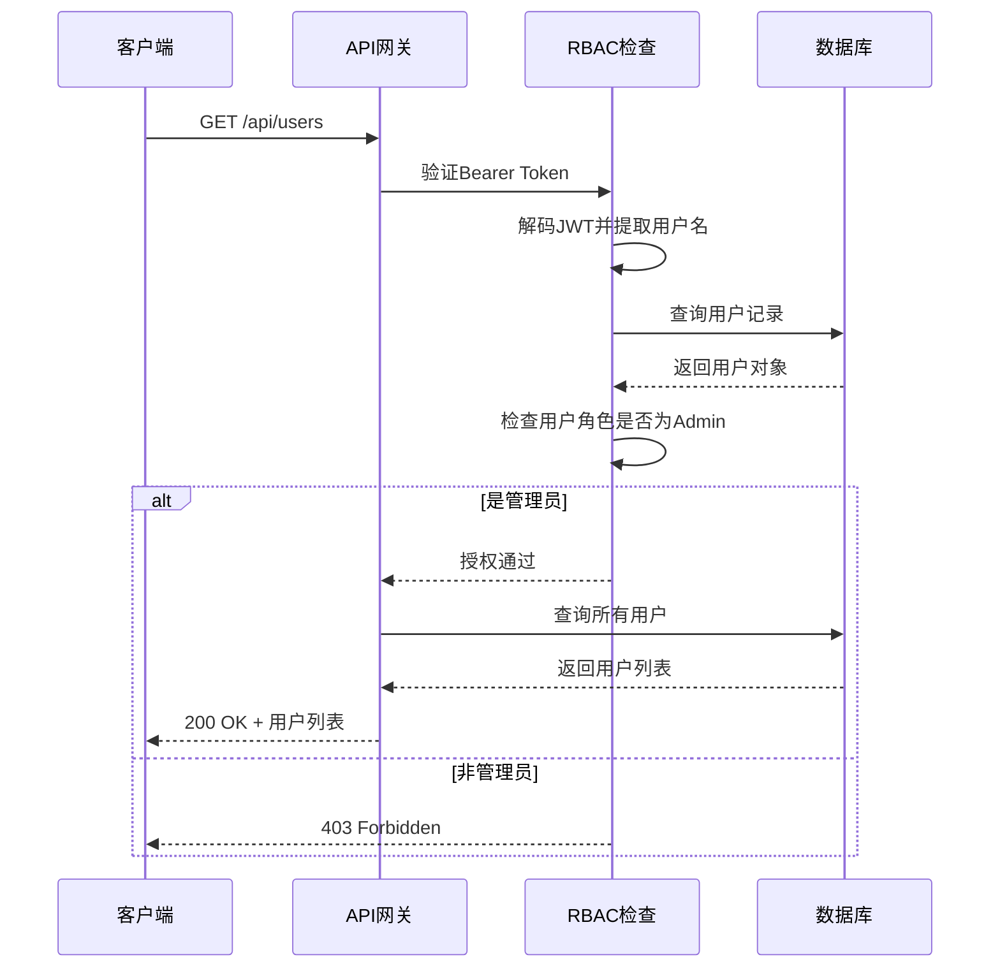
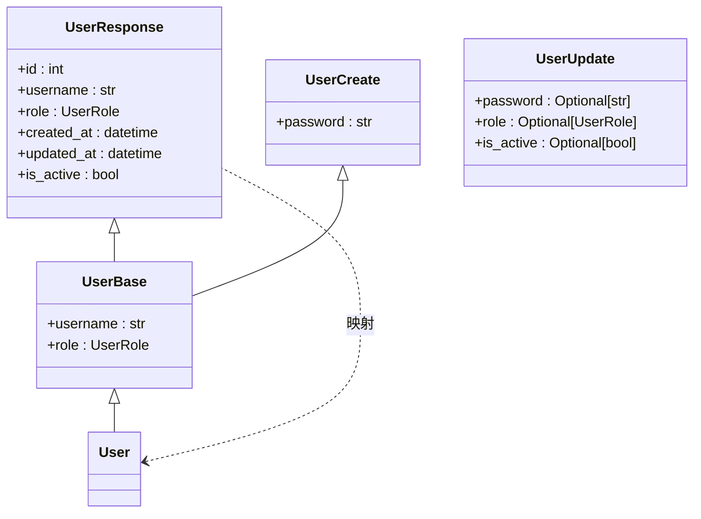
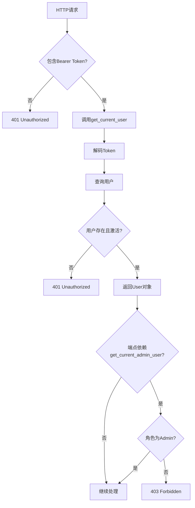

# 用户管理API

<cite>
**本文档引用文件**  
- [users.py](file://backend/app/api/endpoints/users.py)
- [user.py](file://backend/app/models/user.py)
- [user.py](file://backend/app/schemas/user.py)
- [dependencies.py](file://backend/app/api/dependencies.py)
</cite>

## 目录
1. [简介](#简介)
2. [核心端点说明](#核心端点说明)
3. [基于角色的访问控制（RBAC）](#基于角色的访问控制rbac)
4. [用户模型与Schema映射](#用户模型与schema映射)
5. [用户上下文传递机制](#用户上下文传递机制)
6. [响应示例与错误处理](#响应示例与错误处理)

## 简介
本API文档详细描述了用户管理模块中的两个核心端点：获取当前用户信息（`/api/users/me`）和查询用户列表（`/api/users`）。系统采用基于角色的访问控制（RBAC），确保管理员与普通用户之间的权限隔离。所有敏感接口均需通过Bearer Token认证，并通过依赖注入机制传递当前用户上下文。

## 核心端点说明

### 获取当前用户信息 `/api/users/me`
- **方法**: `GET`
- **认证要求**: 必须携带有效的Bearer Token
- **权限要求**: 所有已认证用户均可访问
- **响应结构**:
  - `id`: 用户唯一标识（整数）
  - `username`: 用户名（字符串）
  - `role`: 角色（Admin/Member）
  - `created_at`: 创建时间（ISO8601格式）
  - `updated_at`: 最后更新时间
  - `is_active`: 账户是否激活

### 查询用户列表 `/api/users`
- **方法**: `GET`
- **认证要求**: 必须携带有效的Bearer Token
- **权限要求**: 仅管理员可访问
- **功能说明**: 返回系统中所有用户的简要信息列表
- **分页支持**: 当前版本不支持分页，返回全部用户

**本节内容基于以下源文件实现：**
**Section sources**
- [users.py](file://backend/app/api/endpoints/users.py#L1-L123)

## 基于角色的访问控制（RBAC）

系统定义了两种用户角色：
- **Admin（管理员）**: 拥有用户管理的完全权限
- **Member（成员）**: 仅能查看自身信息

### 权限差异对比表

| 操作 | 管理员 | 成员 |
|------|--------|------|
| 查看用户列表 | ✅ 允许 | ❌ 禁止 (403) |
| 查看任意用户详情 | ✅ 允许 | ❌ 禁止 (403) |
| 创建用户 | ✅ 允许 | ❌ 禁止 (403) |
| 更新用户 | ✅ 允许 | ❌ 禁止 (403) |
| 删除用户 | ✅ 允许 | ❌ 禁止 (403) |
| 查看自身信息 | ✅ 允许 | ✅ 允许 |

权限控制通过依赖注入函数 `get_current_admin_user` 实现，该函数在 `dependencies.py` 中定义，确保只有角色为 `ADMIN` 的用户才能通过验证。



**Diagram sources**
- [dependencies.py](file://backend/app/api/dependencies.py#L53-L60)
- [users.py](file://backend/app/api/endpoints/users.py#L14-L23)

## 用户模型与Schema映射

### 用户模型（User Model）
位于 `models/user.py`，对应数据库表 `user`。

| 字段名 | 类型 | 约束 | 说明 |
|--------|------|------|------|
| id | Integer | PK, 自增 | 主键 |
| username | String(50) | 唯一, 非空 | 用户名 |
| password_hash | String(255) | 非空 | 密码哈希值 |
| role | Enum(UserRole) | 非空 | 用户角色 |
| created_at | DateTime | 非空, 默认当前时间 | 创建时间 |
| updated_at | DateTime | 非空, 更新时自动刷新 | 更新时间 |
| is_active | Boolean | 非空, 默认True | 账户状态 |

### Schema映射关系



**Diagram sources**
- [user.py](file://backend/app/models/user.py#L1-L33)
- [user.py](file://backend/app/schemas/user.py#L1-L49)

**Section sources**
- [models/user.py](file://backend/app/models/user.py#L1-L33)
- [schemas/user.py](file://backend/app/schemas/user.py#L1-L49)

## 用户上下文传递机制

系统通过FastAPI的依赖注入机制实现用户上下文的安全传递。

### 核心依赖函数

#### `get_current_user`
- 从请求头提取Bearer Token
- 解码JWT获取`sub`（用户名）
- 查询数据库验证用户存在且账户激活
- 返回`User`对象供后续处理使用

#### `get_current_admin_user`
- 依赖`get_current_user`的结果
- 额外检查用户角色是否为`ADMIN`
- 若非管理员则抛出403异常

### 依赖注入流程图



**Diagram sources**
- [dependencies.py](file://backend/app/api/dependencies.py#L14-L89)

**Section sources**
- [dependencies.py](file://backend/app/api/dependencies.py#L14-L89)

## 响应示例与错误处理

### 成功响应示例

```json
{
  "id": 1,
  "username": "admin",
  "role": "Admin",
  "created_at": "2024-01-01T00:00:00",
  "updated_at": "2024-01-01T00:00:00",
  "is_active": true
}
```

### 常见错误码说明

| 状态码 | 错误信息 | 触发条件 |
|--------|----------|----------|
| 401 | 无效的认证令牌 | Token缺失、格式错误或已过期 |
| 401 | 用户不存在 | Token中的用户名在数据库中找不到 |
| 403 | 需要管理员权限 | 普通用户尝试访问管理员专属接口 |
| 403 | 用户已被禁用 | 账户`is_active`为False |
| 404 | 用户不存在 | 请求的用户ID不存在 |
| 400 | 不能删除自己 | 管理员尝试删除自己的账户 |

**Section sources**
- [users.py](file://backend/app/api/endpoints/users.py#L14-L123)
- [dependencies.py](file://backend/app/api/dependencies.py#L14-L89)