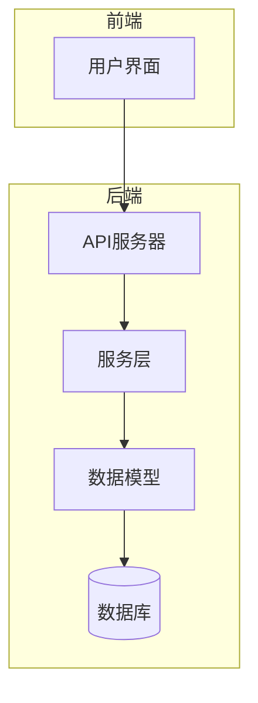
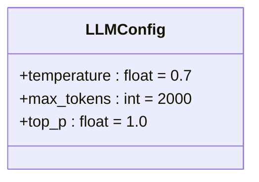
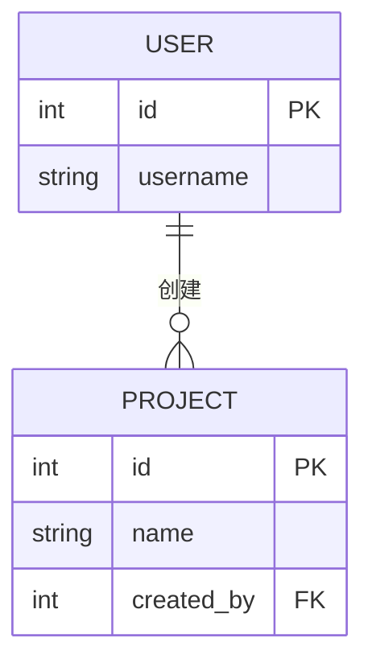
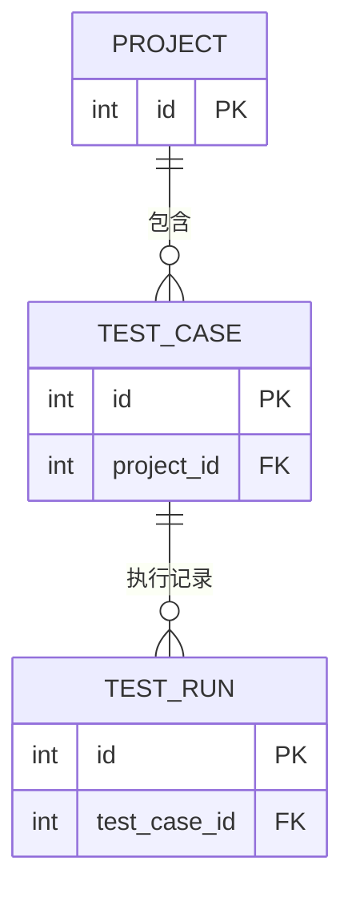
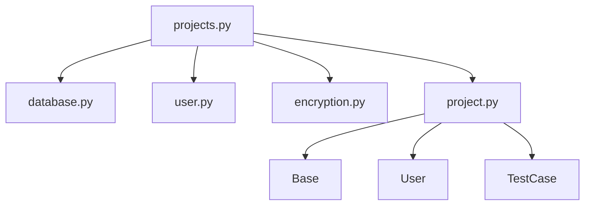

# 项目管理API

<cite>
**本文档引用的文件**  
- [projects.py](file://backend/app/api/endpoints/projects.py) - *更新了项目列表和仪表盘统计功能*
- [project.py](file://backend/app/models/project.py) - *项目数据模型*
- [project.py](file://backend/app/schemas/project.py) - *项目请求/响应模式定义*
- [database.py](file://backend/app/database.py) - *数据库会话管理*
- [test_case.py](file://backend/app/models/test_case.py) - *测试用例模型*
- [test_run.py](file://backend/app/models/test_run.py) - *测试执行记录模型*
</cite>

## 更新摘要
**变更内容**  
- 更新了项目列表接口以包含测试用例数、执行次数和通过率等统计信息
- 新增了仪表盘全局统计数据接口
- 添加了 `ProjectWithStatsResponse` 响应模式以支持统计数据返回
- 更新了相关代码示例和响应示例以反映最新变更

## 目录
1. [简介](#简介)
2. [项目结构](#项目结构)
3. [核心组件](#核心组件)
4. [架构概览](#架构概览)
5. [详细组件分析](#详细组件分析)
6. [依赖关系分析](#依赖关系分析)
7. [性能考量](#性能考量)
8. [故障排查指南](#故障排查指南)
9. [结论](#结论)

## 简介
本文档详细说明了项目管理API的功能与实现机制，涵盖项目的创建、查询、更新和删除（CRUD）操作。重点解释了项目创建请求体的结构、LLM配置对象的用途、项目与用户之间的归属关系、响应格式以及删除操作的级联影响。结合数据库模型与API端点，深入分析了事务处理与错误回滚机制。本次更新增加了项目列表的统计功能和仪表盘数据接口。

## 项目结构
项目管理功能位于后端应用的 `api/endpoints` 模块中，主要由 `projects.py` 文件实现。相关数据模型定义在 `models/project.py`，请求与响应的结构由 `schemas/project.py` 定义。数据库会话通过 `database.py` 提供，确保操作的原子性与一致性。

**Section sources**
- [projects.py](file://backend/app/api/endpoints/projects.py#L1-L10)
- [project.py](file://backend/app/models/project.py#L1-L10)
- [project.py](file://backend/app/schemas/project.py#L1-L10)

## 核心组件
核心组件包括项目API端点、项目数据模型、项目请求/响应模式以及数据库会话管理。这些组件协同工作，实现对项目资源的安全、可靠操作。

**Section sources**
- [projects.py](file://backend/app/api/endpoints/projects.py#L1-L215)
- [project.py](file://backend/app/models/project.py#L9-L27)
- [project.py](file://backend/app/schemas/project.py#L1-L61)

## 架构概览
系统采用分层架构，前端通过API与后端交互，后端使用FastAPI框架处理HTTP请求，通过SQLAlchemy与MySQL数据库交互。项目管理API位于应用层，依赖于模型层和数据库访问层。



**Diagram sources**
- [projects.py](file://backend/app/api/endpoints/projects.py#L1-L215)
- [project.py](file://backend/app/models/project.py#L9-L27)
- [database.py](file://backend/app/database.py#L1-L33)

## 详细组件分析

### 项目创建分析
项目创建API (`POST /api/projects`) 接收 `ProjectCreate` 模式定义的请求体，包含项目名称、描述、基础URL、LLM提供商、模型、API密钥及配置。系统首先检查项目名是否唯一，然后加密API密钥，最后将项目信息持久化到数据库。

#### 请求体结构
```json
{
  "name": "示例项目",
  "description": "这是一个测试项目",
  "base_url": "https://example.com",
  "llm_provider": "openai",
  "llm_model": "gpt-4",
  "llm_api_key": "sk-...",
  "llm_config": {
    "temperature": 0.7,
    "max_tokens": 2000
  }
}
```

#### 响应示例
```json
{
  "id": 1,
  "name": "示例项目",
  "description": "这是一个测试项目",
  "base_url": "https://example.com",
  "llm_provider": "openai",
  "llm_model": "gpt-4",
  "llm_api_key": "***",
  "llm_config": {
    "temperature": 0.7,
    "max_tokens": 2000
  },
  "created_by": 1,
  "created_at": "2025-10-23T08:00:00",
  "updated_at": "2025-10-23T08:00:00"
}
```

**Section sources**
- [projects.py](file://backend/app/api/endpoints/projects.py#L65-L105)
- [project.py](file://backend/app/schemas/project.py#L1-L61)

### LLM配置对象分析
`llm_config` 是一个可选的JSON对象，用于指定大语言模型的运行参数。其结构由 `LLMConfig` 类定义，包含 `temperature`、`max_tokens` 和 `top_p` 字段，均设有合理的默认值和取值范围限制。



**Diagram sources**
- [project.py](file://backend/app/schemas/project.py#L4-L10)

### 项目与用户关系分析
项目通过 `created_by` 外键字段与用户表关联，表示项目的创建者。此关系在 `Project` 模型中通过 `relationship` 定义，并在数据库层面建立索引以提高查询效率。



**Diagram sources**
- [project.py](file://backend/app/models/project.py#L9-L27)

### 项目删除级联分析
删除项目时，由于在 `test_cases` 关系中设置了 `cascade="all, delete-orphan"`，所有关联的测试用例将被自动删除。而测试用例的删除又会级联删除其关联的测试执行记录，确保数据一致性。



**Diagram sources**
- [project.py](file://backend/app/models/project.py#L27)
- [test_case.py](file://backend/app/models/test_case.py#L29)
- [test_run.py](file://backend/app/models/test_run.py#L45)

### 项目列表统计功能分析
项目列表接口 (`GET /api/projects`) 现在返回 `ProjectWithStatsResponse` 类型的响应，包含每个项目的统计信息：
- **test_case_count**: 该项目下的测试用例总数
- **execution_count**: 该项目下所有测试用例的执行总次数
- **pass_rate**: 该项目的测试通过率（百分比）

统计通过数据库聚合查询计算得出，确保数据实时准确。

**Section sources**
- [projects.py](file://backend/app/api/endpoints/projects.py#L19-L62)
- [project.py](file://backend/app/schemas/project.py#L56-L60)

### 仪表盘统计接口分析
新增了仪表盘统计接口 (`GET /api/projects/stats/dashboard`)，返回全局统计数据：
- **projects**: 项目总数
- **testCases**: 测试用例总数
- **totalRuns**: 测试执行总次数
- **passRate**: 整体通过率（百分比）

该接口为前端仪表盘提供关键指标数据。

**Section sources**
- [projects.py](file://backend/app/api/endpoints/projects.py#L186-L214)
- [DashboardView.vue](file://frontend/src/views/DashboardView.vue#L113-L184)

## 依赖关系分析
项目管理API依赖于数据库会话、用户认证、API密钥加密等核心服务。其操作严格依赖于 `Project`、`User`、`TestCase` 和 `TestRun` 等数据模型。



**Diagram sources**
- [projects.py](file://backend/app/api/endpoints/projects.py#L1-L215)
- [project.py](file://backend/app/models/project.py#L9-L27)
- [database.py](file://backend/app/database.py#L1-L33)

## 性能考量
- 项目名和创建者字段建立了数据库索引，确保查询和过滤操作的高效性。
- 数据库连接池配置了 `pool_pre_ping` 和 `pool_recycle`，保证连接的稳定性和可用性。
- API密钥在存储前进行加密，读取时解密，平衡了安全性与性能。
- 统计数据通过SQL聚合查询高效计算，避免了应用层的大量数据处理。

## 故障排查指南
- **400 Bad Request**: 检查项目名是否已存在或请求体格式是否正确。
- **401 Unauthorized**: 确保请求头中包含有效的JWT Token。
- **403 Forbidden**: 只有管理员用户才能执行创建、更新和删除操作。
- **404 Not Found**: 请求的项目ID不存在。
- **500 Internal Server Error**: 检查数据库连接状态和日志文件。

**Section sources**
- [projects.py](file://backend/app/api/endpoints/projects.py#L30-L210)

## 结论
项目管理API提供了一套完整、安全且高效的项目生命周期管理功能。通过清晰的请求/响应模式、严格的验证逻辑、自动化的级联删除和事务性数据库操作，确保了系统的健壮性和数据的一致性。新增的统计功能为项目管理和质量分析提供了重要支持。开发者可基于此文档快速集成和使用项目管理功能。