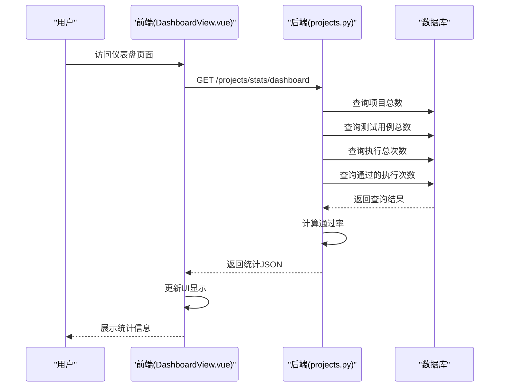
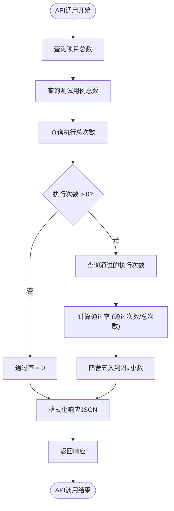
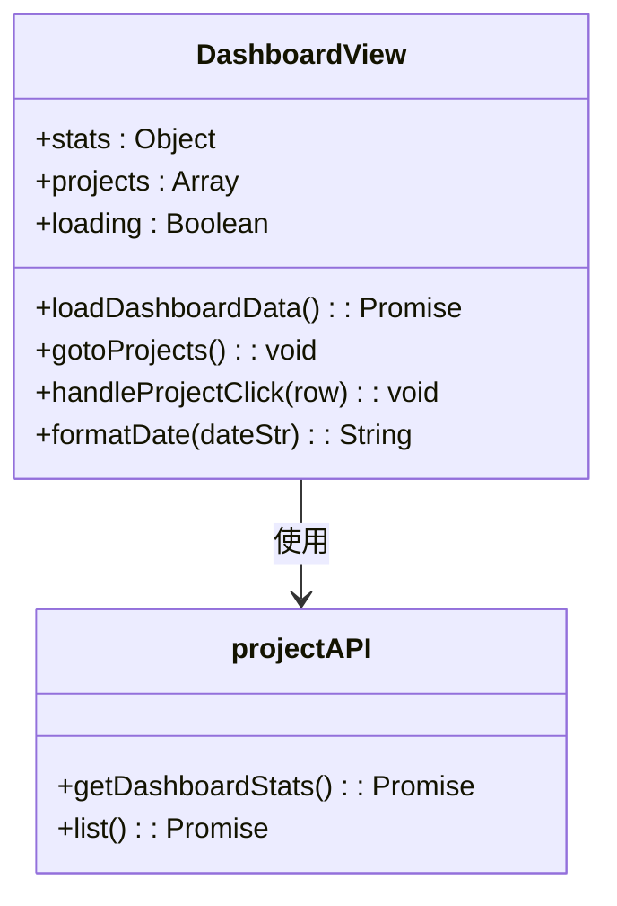

# 仪表盘统计

<cite>
**Referenced Files in This Document**   
- [projects.py](file://backend/app/api/endpoints/projects.py)
- [DashboardView.vue](file://frontend/src/views/DashboardView.vue)
- [test_dashboard_stats.py](file://backend/test_dashboard_stats.py)
</cite>

## 目录
1. [介绍](#介绍)
2. [项目结构](#项目结构)
3. [核心组件](#核心组件)
4. [架构概述](#架构概述)
5. [详细组件分析](#详细组件分析)
6. [依赖分析](#依赖分析)
7. [性能考虑](#性能考虑)
8. [故障排除指南](#故障排除指南)
9. [结论](#结论)

## 介绍

仪表盘统计功能是自然语言驱动UI测试平台的核心功能之一，为用户提供关键的测试数据概览。该功能通过聚合项目、测试用例、执行次数和通过率等关键指标，帮助用户快速了解测试活动的整体状态和趋势。仪表盘在用户登录后自动加载，为用户提供直观的数据可视化，支持决策制定和测试进度跟踪。

## 项目结构

仪表盘统计功能涉及前后端多个组件的协同工作。前端位于`frontend/src/views/DashboardView.vue`，负责数据展示和用户交互；后端API位于`backend/app/api/endpoints/projects.py`，负责数据查询和统计计算；测试文件`backend/test_dashboard_stats.py`提供了功能验证和调试支持。

```mermaid
graph TB
subgraph "前端"
DashboardView[DashboardView.vue]
end
subgraph "后端"
ProjectsAPI[projects.py]
Models[models/]
end
DashboardView --> ProjectsAPI : HTTP请求
ProjectsAPI --> Models : 数据库查询
```

**Diagram sources**
- [projects.py](file://backend/app/api/endpoints/projects.py#L186-L214)
- [DashboardView.vue](file://frontend/src/views/DashboardView.vue#L113-L184)

**Section sources**
- [projects.py](file://backend/app/api/endpoints/projects.py#L186-L214)
- [DashboardView.vue](file://frontend/src/views/DashboardView.vue#L0-L220)

## 核心组件

仪表盘统计功能的核心组件包括后端API端点`get_dashboard_stats`和前端视图组件`DashboardView.vue`。后端组件负责从数据库查询并计算统计数据，前端组件负责展示这些数据并提供用户交互。该功能通过REST API进行通信，返回JSON格式的统计结果，包括项目总数、测试用例数、执行总次数和通过率等关键指标。

**Section sources**
- [projects.py](file://backend/app/api/endpoints/projects.py#L186-L214)
- [DashboardView.vue](file://frontend/src/views/DashboardView.vue#L113-L184)

## 架构概述

仪表盘统计功能采用典型的前后端分离架构。前端通过Vue.js框架实现响应式用户界面，后端使用FastAPI提供RESTful API服务。数据存储在SQLite数据库中，通过SQLAlchemy ORM进行访问。当用户访问仪表盘页面时，前端组件自动发起API请求，后端查询数据库并计算统计结果，然后将结果返回给前端进行展示。



**Diagram sources**
- [projects.py](file://backend/app/api/endpoints/projects.py#L186-L214)
- [DashboardView.vue](file://frontend/src/views/DashboardView.vue#L113-L184)

## 详细组件分析

### 后端API分析

仪表盘统计API端点`get_dashboard_stats`实现了关键的统计功能。该函数通过SQLAlchemy查询数据库中的项目、测试用例和测试执行记录，计算出四个核心指标。通过率的计算特别考虑了零除情况，当没有执行记录时返回0%通过率，确保了API的健壮性。



**Diagram sources**
- [projects.py](file://backend/app/api/endpoints/projects.py#L186-L214)

**Section sources**
- [projects.py](file://backend/app/api/endpoints/projects.py#L186-L214)

### 前端组件分析

前端`DashboardView.vue`组件负责展示仪表盘统计数据。该组件在页面加载时自动调用API获取数据，并将结果显示在四个统计卡片中。每个卡片使用不同的图标和颜色来区分不同类型的统计信息，提高了数据的可读性。组件还包含项目列表表格，显示每个项目的详细统计信息。



**Diagram sources**
- [DashboardView.vue](file://frontend/src/views/DashboardView.vue#L113-L184)

**Section sources**
- [DashboardView.vue](file://frontend/src/views/DashboardView.vue#L0-L220)

## 依赖分析

仪表盘统计功能依赖于多个后端模型和前端API模块。后端依赖`Project`、`TestCase`和`TestRun`模型进行数据查询，前端依赖`projectAPI`模块进行API调用。这些依赖关系确保了统计功能能够访问到最新的测试数据。

```mermaid
graph TD
get_dashboard_stats --> Project : 查询项目数
get_dashboard_stats --> TestCase : 查询用例数
get_dashboard_stats --> TestRun : 查询执行记录
DashboardView --> projectAPI : 调用API
projectAPI --> get_dashboard_stats : HTTP请求
```

**Diagram sources**
- [projects.py](file://backend/app/api/endpoints/projects.py#L186-L214)
- [DashboardView.vue](file://frontend/src/views/DashboardView.vue#L113-L184)

**Section sources**
- [projects.py](file://backend/app/api/endpoints/projects.py#L186-L214)
- [DashboardView.vue](file://frontend/src/views/DashboardView.vue#L113-L184)

## 性能考虑

仪表盘统计功能在设计时考虑了性能因素。所有统计查询都使用了SQL的聚合函数（如`COUNT`），这些函数在数据库层面进行了优化，避免了在应用层面处理大量数据。通过率的计算也经过优化，只进行必要的数据库查询。对于大型数据集，可以考虑添加缓存机制来进一步提高性能。

## 故障排除指南

当仪表盘统计功能出现问题时，可以参考以下排查步骤：

1. **检查API响应**：查看浏览器开发者工具中的网络请求，确认API是否返回了正确的数据。
2. **验证数据库连接**：确保后端能够正常连接到数据库。
3. **检查数据完整性**：确认数据库中存在项目、测试用例和执行记录。
4. **查看日志信息**：检查后端日志，查找可能的错误信息。
5. **运行测试脚本**：使用`test_dashboard_stats.py`脚本直接测试统计功能。

**Section sources**
- [test_dashboard_stats.py](file://backend/test_dashboard_stats.py#L0-L42)
- [projects.py](file://backend/app/api/endpoints/projects.py#L186-L214)

## 结论

仪表盘统计功能为测试平台提供了重要的数据可视化能力。通过前后端的紧密协作，该功能能够实时展示关键测试指标，帮助用户快速了解测试活动的状态。功能设计考虑了数据准确性、性能和用户体验，为平台的持续改进提供了数据支持。