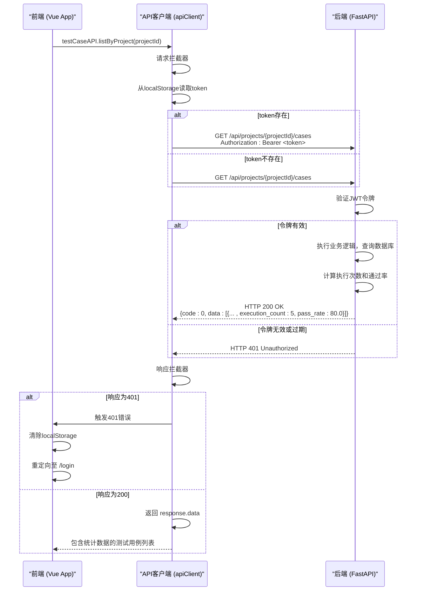

# API客户端与通信

<cite>
**本文档引用的文件**   
- [client.js](file://frontend/src/api/client.js)
- [index.js](file://frontend/src/api/index.js)
- [auth.js](file://frontend/src/stores/auth.js)
- [ProjectDetail.vue](file://frontend/src/views/ProjectDetail.vue)
- [test_cases.py](file://backend/app/api/endpoints/test_cases.py)
- [test_case.py](file://backend/app/schemas/test_case.py)
</cite>

## 更新摘要
**已做更改**   
- 更新了“API调用示例”部分，以反映测试用例API返回新增统计字段的变更
- 在“API端点组织与模块化”中补充了`testCaseAPI`返回数据结构的说明
- 更新了前后端通信序列图，以体现统计数据的返回流程
- 增加了对后端返回数据结构变更的说明

## 目录
1. [引言](#引言)
2. [API客户端配置](#api客户端配置)
3. [请求与响应拦截器](#请求与响应拦截器)
4. [API端点组织与模块化](#api端点组织与模块化)
5. [API调用示例](#api调用示例)
6. [错误处理与网络策略](#错误处理与网络策略)
7. [前后端通信序列图](#前后端通信序列图)

## 引言
本文档旨在全面阐述`testserver`前端应用的API通信机制。该机制基于`axios`库构建，通过`src/api/client.js`中的`apiClient`实例，为前端与后端服务之间的所有HTTP交互提供了统一、安全且高效的通信基础。文档将深入解析客户端的配置、拦截器的实现逻辑、API端点的组织方式，并提供调用示例和最佳实践指导。

## API客户端配置

`apiClient`是整个前端应用与后端API通信的核心实例，它在`src/api/client.js`中通过`axios.create()`方法进行配置。该实例封装了所有HTTP请求的公共设置，确保了通信的一致性和可维护性。

### 核心配置项
- **baseURL**: 设置为`/api`，这意味着所有通过此客户端发起的请求，其URL都会自动以`/api`为前缀。例如，对`/auth/login`的请求，实际访问的后端路径为`/api/auth/login`。
- **timeout**: 请求超时时间设置为30秒（30000毫秒）。若后端在30秒内未返回响应，请求将被中断并触发超时错误，防止用户界面长时间无响应。
- **headers**: 默认请求头中设置了`Content-Type`为`application/json`，表明前端发送给后端的数据格式为JSON。

**Section sources**
- [client.js](file://frontend/src/api/client.js#L5-L11)

## 请求与响应拦截器

`apiClient`通过配置请求和响应拦截器，实现了认证和错误处理的自动化，极大地简化了业务代码。

### 请求拦截器：自动附加认证令牌
在每个请求发送到后端之前，请求拦截器会自动执行。其主要功能是检查本地存储（`localStorage`）中是否存在有效的JWT令牌（`access_token`）。如果存在，拦截器会将该令牌以`Bearer`模式添加到请求头的`Authorization`字段中。

此机制确保了所有需要认证的API调用都能携带有效的身份凭证，而无需在每个具体的API调用函数中手动处理。令牌的获取和存储由`auth.js`中的`useAuthStore`负责，在用户成功登录后完成。

**Section sources**
- [client.js](file://frontend/src/api/client.js#L13-L22)

### 响应拦截器：统一错误处理与数据解包
响应拦截器在后端返回响应后、将结果传递给调用者之前执行。它承担了两个关键职责：

1.  **数据解包**：拦截器直接返回`response.data`，这意味着调用API的业务代码（如Vue组件）可以直接获取到后端返回的业务数据，而无需每次都从`response.data`中提取，简化了数据处理逻辑。
2.  **统一错误处理**：拦截器集中处理了常见的HTTP错误。特别地，当后端返回`401 Unauthorized`状态码时，拦截器会判定为用户会话已过期或无效。此时，它会自动清除本地存储中的令牌和用户信息，并将用户重定向至登录页面（`/login`），实现了无感的会话过期处理。

**Section sources**
- [client.js](file://frontend/src/api/client.js#L24-L38)

## API端点组织与模块化

为了保持代码的清晰和可维护性，所有的API端点在`src/api/index.js`中被按功能模块进行了分类和导出。

### 模块化设计
API被划分为以下几个主要模块：
- `authAPI`: 处理用户认证相关的操作，如登录、登出和获取当前用户信息。
- `projectAPI`: 管理项目相关的CRUD（创建、读取、更新、删除）操作。
- `testCaseAPI`: 负责测试用例的管理，包括创建、更新、删除以及从自然语言生成测试用例等高级功能。
- `testRunAPI`: 处理测试执行的启动、状态查询和结果获取。
- `userAPI`: 提供用户管理功能，如获取用户列表、创建和删除用户。

每个模块都是一个包含多个API方法的常量对象，这些方法内部调用`apiClient`的`get`、`post`、`put`、`delete`等方法，并传入具体的API路径和参数。

**重要更新**：根据`b97d0a5`提交，`testCaseAPI.listByProject()`方法现在返回的测试用例数据包含新增的执行统计数据，包括`execution_count`（执行次数）和`pass_rate`（通过率）。这些数据由后端在`test_cases.py`中计算并返回，前端`ProjectDetail.vue`组件已更新以显示这些统计信息。

**Section sources**
- [index.js](file://frontend/src/api/index.js#L5-L145)
- [test_cases.py](file://backend/app/api/endpoints/test_cases.py#L24-L65)
- [test_case.py](file://backend/app/schemas/test_case.py#L80-L85)

## API调用示例

以下是在Vue组件中调用API的典型示例：

```javascript
// 导入所需的API模块
import { projectAPI, testCaseAPI } from '@/api'

// 获取项目列表
async function fetchProjects() {
  try {
    const projects = await projectAPI.list()
    // 处理成功获取的项目列表
    console.log(projects)
  } catch (error) {
    // 错误处理由拦截器统一管理，此处可根据需要进行额外处理
    console.error('获取项目列表失败:', error)
  }
}

// 获取项目的测试用例列表（包含执行统计数据）
async function fetchTestCases(projectId) {
  try {
    const testCases = await testCaseAPI.listByProject(projectId)
    // 处理包含统计数据的测试用例列表
    testCases.forEach(tc => {
      console.log(`用例: ${tc.name}`)
      console.log(`  执行次数: ${tc.execution_count}`)
      console.log(`  通过率: ${tc.pass_rate}%`)
    })
  } catch (error) {
    console.error('获取测试用例列表失败:', error)
  }
}

// 创建新项目
async function createNewProject(projectData) {
  try {
    const newProject = await projectAPI.create(projectData)
    // 处理创建成功的新项目
    console.log('项目创建成功:', newProject)
  } catch (error) {
    console.error('创建项目失败:', error)
  }
}
```

**Section sources**
- [index.js](file://frontend/src/api/index.js#L25-L50)
- [ProjectDetail.vue](file://frontend/src/views/ProjectDetail.vue#L70-L75)

## 错误处理与网络策略

### 错误处理策略
如前所述，核心的错误处理（特别是401重定向）已在响应拦截器中实现。业务代码中的`try-catch`块主要用于捕获和处理特定于该操作的错误，例如表单验证失败或特定的业务逻辑错误。

### 网络超时
30秒的超时设置为网络请求提供了合理的等待时间。在高延迟或后端处理时间较长的场景下，开发者应确保后端API的响应时间在此限制内，或根据实际情况调整前端的`timeout`值。

### API版本兼容性
根据`DESIGN_DOCUMENT.md`中的设计，后端API的基础路径为`/api/v1`。当前前端配置的`baseURL`为`/api`，这表明前端可能依赖于后端的路由配置来处理版本。为确保长期的兼容性，建议将前端的`baseURL`明确设置为`/api/v1`，以便在将来API进行不兼容的版本升级（如v2）时，前端可以独立进行升级，而不会意外调用到新版本的接口。

**Section sources**
- [client.js](file://frontend/src/api/client.js#L6)
- [DESIGN_DOCUMENT.md](file://DESIGN_DOCUMENT.md#L219-L264)

## 前后端通信序列图

以下序列图展示了用户在前端页面发起一个需要认证的API请求（例如获取项目列表）时，完整的通信流程。



**Diagram sources**
- [client.js](file://frontend/src/api/client.js)
- [index.js](file://frontend/src/api/index.js)
- [auth.js](file://frontend/src/stores/auth.js)
- [test_cases.py](file://backend/app/api/endpoints/test_cases.py#L24-L65)