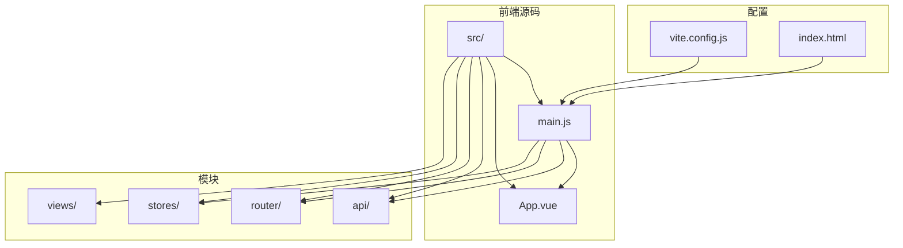
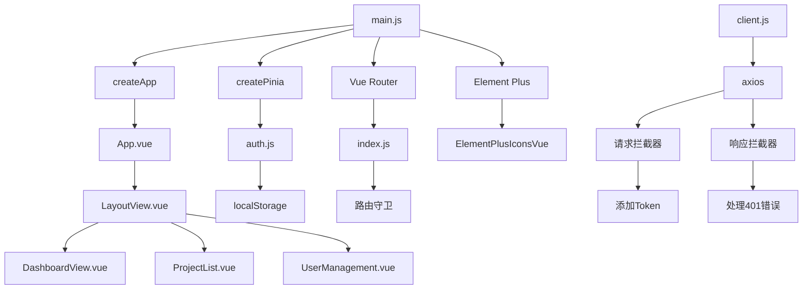
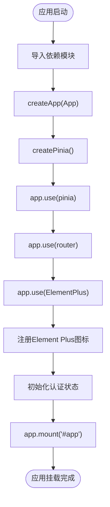
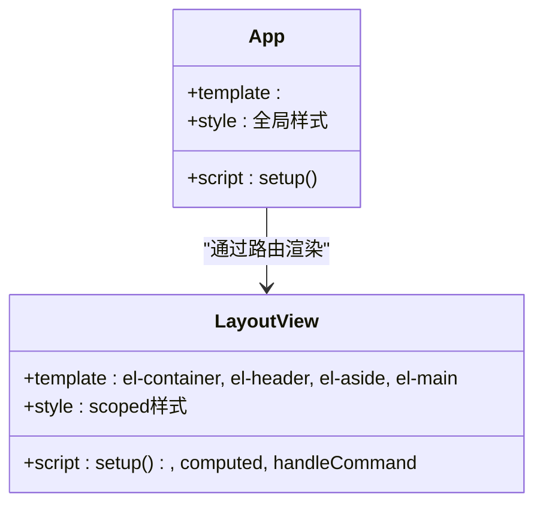
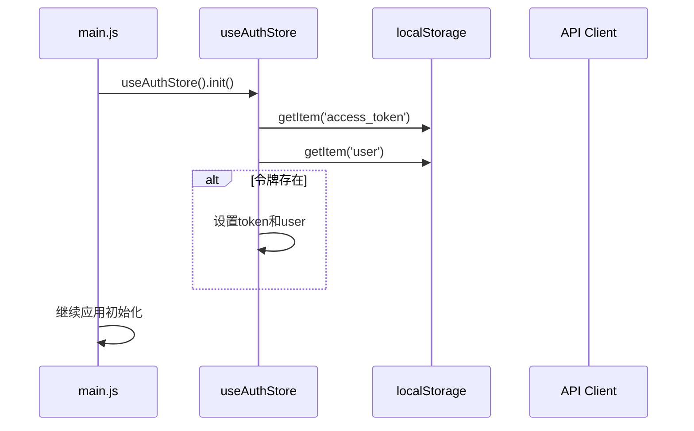

# 前端入口与初始化

<cite>
**Referenced Files in This Document**   
- [main.js](file://frontend/src/main.js)
- [App.vue](file://frontend/src/App.vue)
- [LayoutView.vue](file://frontend/src/views/LayoutView.vue)
- [vite.config.js](file://frontend/vite.config.js)
- [auth.js](file://frontend/src/stores/auth.js)
- [router/index.js](file://frontend/src/router/index.js)
- [client.js](file://frontend/src/api/client.js)
- [index.js](file://frontend/src/api/index.js)
</cite>

## 目录

1. [简介](#简介)
2. [项目结构](#项目结构)
3. [核心组件](#核心组件)
4. [架构概览](#架构概览)
5. [详细组件分析](#详细组件分析)
6. [依赖分析](#依赖分析)
7. [性能考虑](#性能考虑)
8. [故障排除指南](#故障排除指南)
9. [结论](#结论)

## 简介

本文档详细描述了`testserver`前端应用的入口机制和初始化流程。重点阐述了`main.js`如何作为应用的启动入口，通过`createApp`初始化Vue 3应用实例并挂载到DOM中。文档解释了`App.vue`作为根组件的结构设计，包括其布局容器角色、全局样式定义以及与`LayoutView.vue`的嵌套关系。同时，文档说明了应用如何集成Element Plus组件库和Pinia状态管理，并提供了应用初始化流程的代码示例。此外，还介绍了环境变量的加载机制（如`VITE_API_BASE_URL`），为初学者提供Vue 3组合式API的基础概念，并为高级开发者分析应用性能优化策略和错误边界处理。

## 项目结构

前端应用的结构遵循Vue 3和Vite的标准模式，采用模块化设计，将不同功能分离到独立的目录中。`src`目录包含应用的核心代码，包括API接口、路由配置、状态管理、视图组件等。



**Diagram sources**
- [main.js](file://frontend/src/main.js#L1-L26)
- [vite.config.js](file://frontend/vite.config.js#L1-L21)

**Section sources**
- [main.js](file://frontend/src/main.js#L1-L26)
- [vite.config.js](file://frontend/vite.config.js#L1-L21)

## 核心组件

`main.js`是前端应用的入口文件，负责初始化Vue 3应用实例，集成Pinia状态管理和Element Plus组件库，并挂载应用到DOM中。`App.vue`作为根组件，其模板仅包含`<router-view />`，作为路由视图的占位符。`LayoutView.vue`是主要的布局组件，包含页眉、侧边栏和主内容区域，实现了应用的整体UI框架。

**Section sources**
- [main.js](file://frontend/src/main.js#L1-L26)
- [App.vue](file://frontend/src/App.vue#L1-L23)
- [LayoutView.vue](file://frontend/src/views/LayoutView.vue#L1-L123)

## 架构概览

前端应用采用Vue 3的组合式API和模块化架构，通过Vite作为构建工具。应用初始化时，`main.js`创建Vue应用实例，集成Pinia（状态管理）、Vue Router（路由）和Element Plus（UI组件库）。认证状态通过Pinia的`useAuthStore`进行管理，存储在localStorage中，实现页面刷新后的状态持久化。API请求通过axios封装，包含请求和响应拦截器，自动处理认证令牌和错误响应。



**Diagram sources**
- [main.js](file://frontend/src/main.js#L1-L26)
- [App.vue](file://frontend/src/App.vue#L1-L23)
- [LayoutView.vue](file://frontend/src/views/LayoutView.vue#L1-L123)
- [auth.js](file://frontend/src/stores/auth.js#L1-L61)
- [router/index.js](file://frontend/src/router/index.js#L1-L79)
- [client.js](file://frontend/src/api/client.js#L1-L44)

## 详细组件分析

### 主入口分析

`main.js`是应用的启动点，通过`createApp`函数创建Vue应用实例，并依次注册Pinia、Vue Router和Element Plus。应用启动时，会调用`useAuthStore().init()`方法，从localStorage恢复用户认证状态，确保用户刷新页面后仍保持登录状态。

#### 初始化流程


**Diagram sources**
- [main.js](file://frontend/src/main.js#L1-L26)

**Section sources**
- [main.js](file://frontend/src/main.js#L1-L26)

### 根组件分析

`App.vue`作为应用的根组件，其设计极为简洁。其模板部分仅包含一个`<router-view />`元素，作为动态路由视图的容器。这种设计模式使得`App.vue`成为一个纯粹的壳组件，所有具体的UI逻辑和布局都由路由组件（如`LayoutView.vue`）处理。

#### 组件结构


**Diagram sources**
- [App.vue](file://frontend/src/App.vue#L1-L23)
- [LayoutView.vue](file://frontend/src/views/LayoutView.vue#L1-L123)

**Section sources**
- [App.vue](file://frontend/src/App.vue#L1-L23)
- [LayoutView.vue](file://frontend/src/views/LayoutView.vue#L1-L123)

### 状态管理分析

`auth.js`使用Pinia定义了`useAuthStore`，集中管理用户的认证状态，包括用户信息、令牌、认证状态和角色权限。`init`方法在应用启动时被调用，从localStorage恢复状态，实现了状态持久化。

#### 状态管理流程


**Diagram sources**
- [main.js](file://frontend/src/main.js#L22-L26)
- [auth.js](file://frontend/src/stores/auth.js#L1-L61)

**Section sources**
- [auth.js](file://frontend/src/stores/auth.js#L1-L61)

## 依赖分析

前端应用依赖于多个核心库和模块，形成了清晰的依赖关系。Vue 3是核心框架，Pinia用于状态管理，Vue Router处理路由，Element Plus提供UI组件。API模块依赖axios进行HTTP通信，并通过拦截器与认证状态管理模块交互。

```mermaid
dependencyDiagram
main.js --> App.vue
main.js --> pinia
main.js --> vue-router
main.js --> element-plus
main.js --> auth.js
auth.js --> localStorage
router/index.js --> vue-router
client.js --> axios
client.js --> auth.js
index.js --> client.js
```

**Diagram sources**
- [main.js](file://frontend/src/main.js#L1-L26)
- [auth.js](file://frontend/src/stores/auth.js#L1-L61)
- [router/index.js](file://frontend/src/router/index.js#L1-L79)
- [client.js](file://frontend/src/api/client.js#L1-L44)

**Section sources**
- [main.js](file://frontend/src/main.js#L1-L26)
- [auth.js](file://frontend/src/stores/auth.js#L1-L61)
- [client.js](file://frontend/src/api/client.js#L1-L44)

## 性能考虑

应用在性能方面采取了多项优化措施。首先，路由组件采用动态导入（`() => import()`），实现代码分割和懒加载，减少初始包体积。其次，Element Plus组件按需引入，避免引入整个库。API客户端配置了合理的超时时间，并通过拦截器统一处理错误，避免重复代码。状态管理使用Pinia，其轻量级和模块化设计有助于性能优化。

**Section sources**
- [router/index.js](file://frontend/src/router/index.js#L1-L79)
- [client.js](file://frontend/src/api/client.js#L1-L44)
- [main.js](file://frontend/src/main.js#L1-L26)

## 故障排除指南

当应用出现问题时，可参考以下常见问题的排查方法：

1.  **页面空白或404错误**：检查`vite.config.js`中的代理配置，确保`/api`请求正确转发到后端服务（`http://localhost:8000`）。
2.  **无法登录或自动登出**：检查`client.js`中的响应拦截器，当收到401状态码时，会清除localStorage并重定向到登录页。确认后端认证接口是否正常返回401。
3.  **状态未持久化**：检查`auth.js`中的`init`方法，确保在应用启动时正确从localStorage读取`access_token`和`user`。
4.  **图标不显示**：检查`main.js`中是否正确注册了所有Element Plus图标。

**Section sources**
- [vite.config.js](file://frontend/vite.config.js#L1-L21)
- [client.js](file://frontend/src/api/client.js#L1-L44)
- [auth.js](file://frontend/src/stores/auth.js#L1-L61)
- [main.js](file://frontend/src/main.js#L1-L26)

## 结论

`testserver`前端应用通过清晰的模块化设计和现代前端技术栈，实现了高效、可维护的代码结构。`main.js`作为单一入口点，协调了Vue应用、状态管理、路由和UI库的初始化。`App.vue`的简洁设计和`LayoutView.vue`的布局分离，体现了良好的组件化思想。Pinia状态管理确保了认证状态的一致性和持久性。整体架构为应用的扩展和维护奠定了坚实的基础。