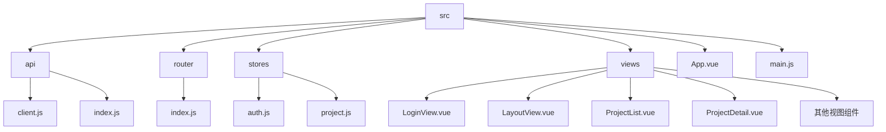
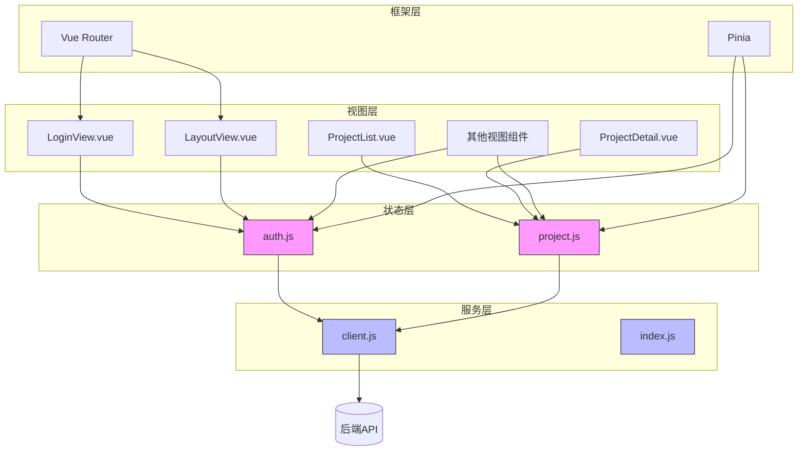
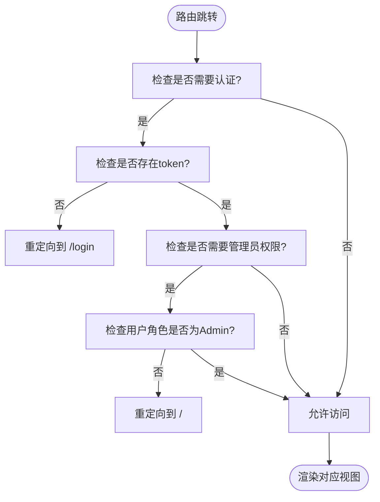
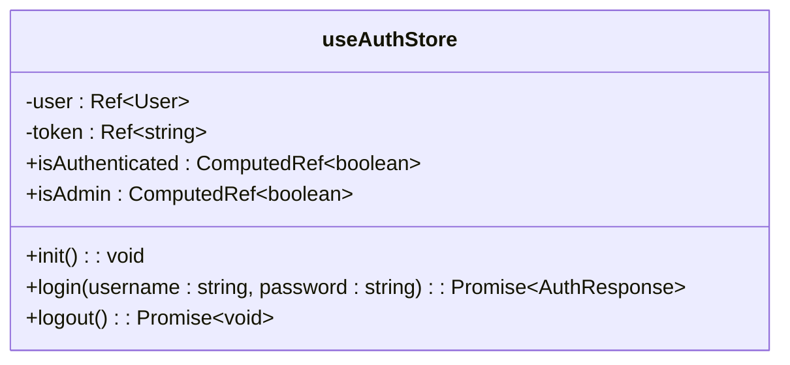
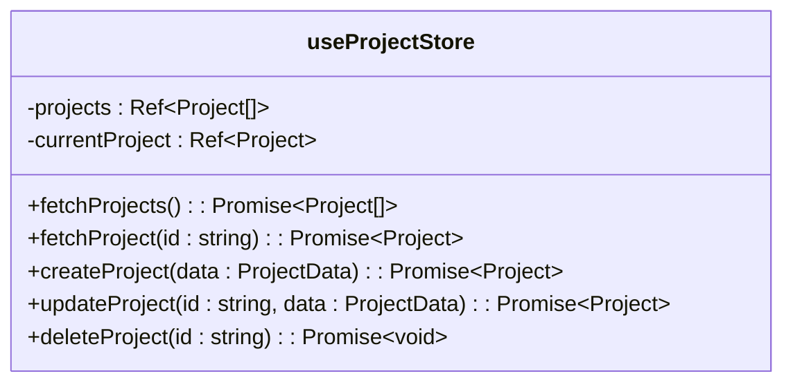
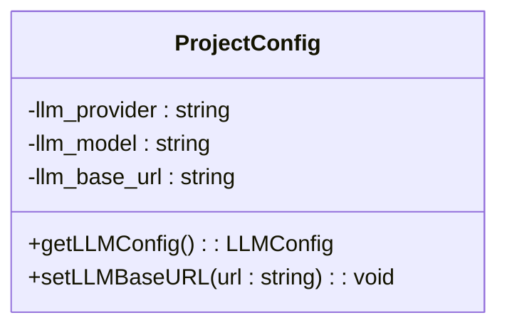
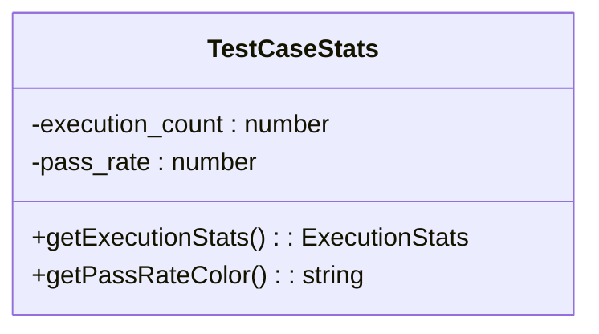
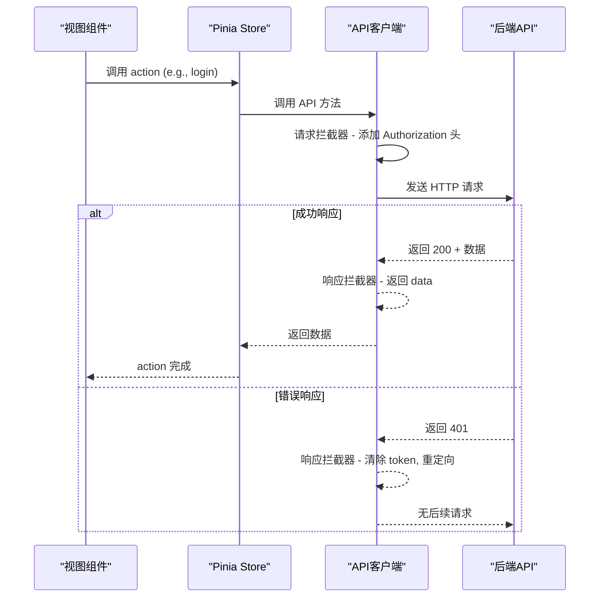
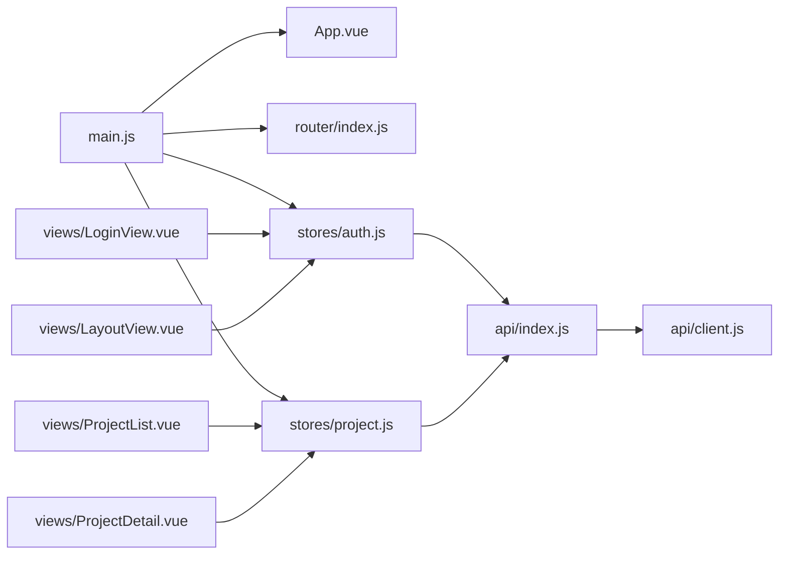

# 前端架构

<cite>
**本文档中引用的文件**   
- [main.js](file://frontend/src/main.js)
- [App.vue](file://frontend/src/App.vue)
- [router/index.js](file://frontend/src/router/index.js)
- [views/LayoutView.vue](file://frontend/src/views/LayoutView.vue)
- [stores/auth.js](file://frontend/src/stores/auth.js)
- [stores/project.js](file://frontend/src/stores/project.js)
- [api/client.js](file://frontend/src/api/client.js)
- [api/index.js](file://frontend/src/api/index.js)
- [views/LoginView.vue](file://frontend/src/views/LoginView.vue)
- [views/ProjectList.vue](file://frontend/src/views/ProjectList.vue)
- [views/ProjectDetail.vue](file://frontend/src/views/ProjectDetail.vue)
</cite>

## 更新摘要
**已做更改**   
- 更新了“详细组件分析”中的“项目状态管理”部分，以反映测试用例统计信息的新功能
- 在“详细组件分析”中新增了“项目配置管理”部分，以涵盖LLM Base URL配置功能
- 更新了“依赖分析”图表以包含新功能
- 所有引用的文件列表已更新，包含新分析的文件

## 目录
1. [简介](#简介)
2. [项目结构](#项目结构)
3. [核心组件](#核心组件)
4. [架构概览](#架构概览)
5. [详细组件分析](#详细组件分析)
6. [依赖分析](#依赖分析)
7. [性能考虑](#性能考虑)
8. [故障排除指南](#故障排除指南)
9. [结论](#结论)

## 简介
本文档详细描述了testserver前端应用的架构设计。该前端基于Vue 3框架构建，采用组件化架构模式，通过Vue Router实现路由管理，利用Pinia进行状态管理，并通过封装的API客户端与后端服务进行通信。文档将深入解析应用的初始化流程、核心状态管理机制、路由配置以及组件间的交互模式。

## 项目结构
testserver前端项目采用标准的Vue项目结构，以功能模块组织代码。核心源码位于`src`目录下，主要包含`api`（API接口封装）、`router`（路由配置）、`stores`（状态管理）、`views`（视图组件）等关键模块。这种组织方式清晰地分离了关注点，便于维护和扩展。

**Diagram sources**
- [main.js](file://frontend/src/main.js)
- [App.vue](file://frontend/src/App.vue)

**Section sources**
- [main.js](file://frontend/src/main.js)
- [App.vue](file://frontend/src/App.vue)

## 核心组件
前端应用的核心由`main.js`入口文件和`App.vue`根组件构成。`main.js`负责初始化Vue应用实例，集成Pinia状态管理、Vue Router路由系统和Element Plus UI库。`App.vue`作为应用的最外层容器，其模板仅包含一个`<router-view />`占位符，用于动态渲染当前路由匹配的视图组件，实现了路由驱动的页面切换。

**Section sources**
- [main.js](file://frontend/src/main.js)
- [App.vue](file://frontend/src/App.vue)

## 架构概览
整个前端架构围绕Vue 3的响应式系统构建，形成了一个清晰的分层结构：视图层（Views）负责用户界面展示和交互，状态层（Stores）集中管理应用数据和业务逻辑，服务层（API）处理与后端的通信。Vue Router作为导航中枢，协调视图的切换；Pinia作为状态中枢，确保数据在组件间一致共享。

**Diagram sources**
- [main.js](file://frontend/src/main.js)
- [router/index.js](file://frontend/src/router/index.js)
- [stores/auth.js](file://frontend/src/stores/auth.js)
- [stores/project.js](file://frontend/src/stores/project.js)
- [api/client.js](file://frontend/src/api/client.js)

## 详细组件分析
本节将深入分析前端架构中的关键组件，包括路由系统、状态管理模块和API通信层。

### 路由配置与应用
Vue Router的配置定义了应用的导航结构。路由分为两类：无需认证的`/login`登录页，以及需要认证的主应用路由（以`/`为根路径）。主应用路由采用嵌套路由，`LayoutView.vue`作为布局容器，其内部的`<router-view />`负责渲染具体的子视图（如仪表板、项目列表等）。路由守卫（`beforeEach`）确保了访问控制，未登录用户无法访问受保护的路由，管理员用户才能访问用户管理页面。

**Diagram sources**
- [router/index.js](file://frontend/src/router/index.js)
- [views/LayoutView.vue](file://frontend/src/views/LayoutView.vue)

**Section sources**
- [router/index.js](file://frontend/src/router/index.js)
- [views/LayoutView.vue](file://frontend/src/views/LayoutView.vue)

### 状态管理实现
Pinia状态管理通过`auth.js`和`project.js`两个store实现，分别管理用户认证状态和项目数据。

#### 认证状态管理
`auth.js`中的`useAuthStore`定义了用户（`user`）、令牌（`token`）等状态，以及`isAuthenticated`、`isAdmin`等计算属性。关键操作包括`init()`（从`localStorage`恢复状态）、`login()`（执行登录并持久化状态）和`logout()`（清除状态并登出）。该store被`LoginView.vue`等组件调用，实现登录逻辑。

**Diagram sources**
- [stores/auth.js](file://frontend/src/stores/auth.js)
- [views/LoginView.vue](file://frontend/src/views/LoginView.vue)

#### 项目状态管理
`project.js`中的`useProjectStore`管理项目列表（`projects`）和当前项目（`currentProject`）的状态。它提供了`fetchProjects()`、`createProject()`、`deleteProject()`等方法，这些方法调用API并自动更新store中的状态，确保了数据的一致性。`ProjectList.vue`等组件通过调用这些方法与store交互。

**Diagram sources**
- [stores/project.js](file://frontend/src/stores/project.js)
- [views/ProjectList.vue](file://frontend/src/views/ProjectList.vue)

### 项目配置管理
`ProjectDetail.vue`组件现在支持显示和管理项目的LLM配置，包括自定义LLM API基础URL。该功能允许用户为不同项目配置不同的LLM提供商和API端点，支持使用自托管或代理的LLM服务。在项目配置标签页中，系统会显示LLM提供商、模型名称和可选的LLM Base URL信息。

**Diagram sources**
- [views/ProjectDetail.vue](file://frontend/src/views/ProjectDetail.vue)
- [stores/project.js](file://frontend/src/stores/project.js)

### 测试用例统计管理
`ProjectDetail.vue`组件的测试用例标签页现在包含执行统计信息。系统通过`testCaseAPI.listByProject()`接口获取测试用例列表时，会同时返回每个测试用例的执行次数和成功率。这些统计数据显示在表格中，成功率使用颜色编码的标签表示（绿色≥80%，黄色≥60%，红色<60%），帮助用户快速评估测试质量。

**Diagram sources**
- [views/ProjectDetail.vue](file://frontend/src/views/ProjectDetail.vue)
- [api/index.js](file://frontend/src/api/index.js)
- [backend/app/api/endpoints/test_cases.py](file://backend\app\api\endpoints\test_cases.py)

### API客户端通信
`api/client.js`文件封装了基于Axios的API客户端。它配置了基础URL和请求头，并通过拦截器实现了关键功能：**请求拦截器**在每次请求前自动从`localStorage`读取`access_token`并将其添加到`Authorization`头中；**响应拦截器**统一处理响应数据（直接返回`response.data`）和错误，特别是当收到401未授权响应时，会自动清除本地认证信息并重定向到登录页，实现了无感的会话过期处理。

**Diagram sources**
- [api/client.js](file://frontend/src/api/client.js)
- [api/index.js](file://frontend/src/api/index.js)

**Section sources**
- [api/client.js](file://frontend/src/api/client.js)
- [api/index.js](file://frontend/src/api/index.js)

## 依赖分析
前端各模块间存在明确的依赖关系。`main.js`是最高层的依赖入口，它直接依赖`App.vue`、`router`和`stores`。`views`下的视图组件依赖`stores`来获取和修改状态，同时依赖`router`进行页面导航。`stores`依赖`api`模块来与后端通信。`api`模块中的`index.js`又依赖`client.js`提供的基础客户端实例。这种依赖结构确保了代码的模块化和可维护性。

**Diagram sources**
- [main.js](file://frontend/src/main.js)
- [api/client.js](file://frontend/src/api/client.js)

**Section sources**
- [main.js](file://frontend/src/main.js)
- [api/client.js](file://frontend/src/api/client.js)

## 性能考虑
前端架构在性能方面进行了合理的设计。路由采用懒加载（`import()`语法），确保只有在访问特定路由时才加载对应的组件代码，有效减少了初始加载包的大小。状态管理集中化避免了组件间频繁的props传递和事件通信，提升了数据更新的效率。API客户端的统一错误处理和认证机制减少了重复代码，也保证了用户体验的一致性。

## 故障排除指南
当遇到前端问题时，可按以下步骤排查：
1.  **检查网络请求**：在浏览器开发者工具的Network面板中，检查API请求是否成功，特别是`Authorization`头是否正确发送。
2.  **检查认证状态**：在Application面板的Local Storage中，确认`access_token`和`user`是否存在且有效。
3.  **检查路由配置**：确认访问的路径是否在`router/index.js`中有定义，并检查路由守卫的逻辑。
4.  **检查状态更新**：在Pinia开发者工具（如果已安装）中，观察store的状态变化，确认action是否被正确调用和执行。

**Section sources**
- [api/client.js](file://frontend/src/api/client.js)
- [router/index.js](file://frontend/src/router/index.js)
- [stores/auth.js](file://frontend/src/stores/auth.js)

## 结论
testserver前端架构采用Vue 3为核心，构建了一个现代化、组件化、易于维护的单页应用。通过Vue Router实现灵活的路由控制，通过Pinia实现高效的状态管理，并通过精心封装的API客户端确保了与后端安全、可靠的通信。整体架构清晰，职责分明，为应用的持续开发和扩展奠定了坚实的基础。