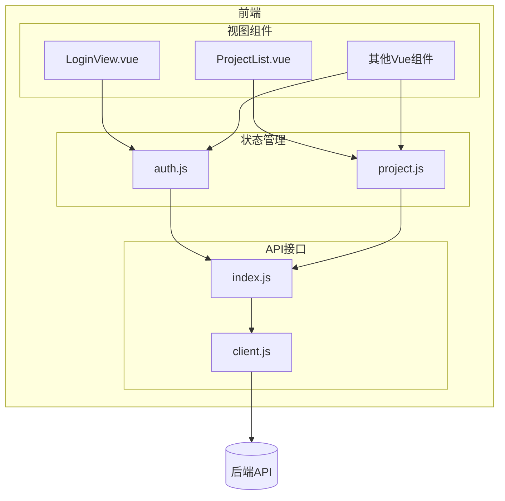
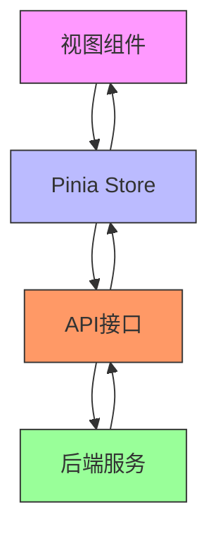
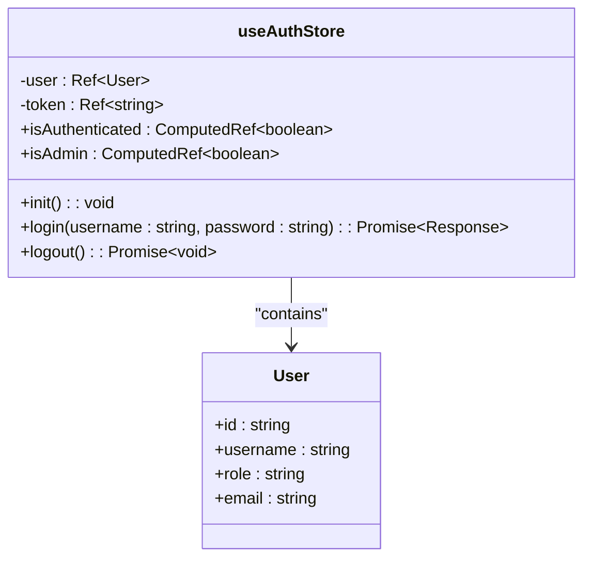
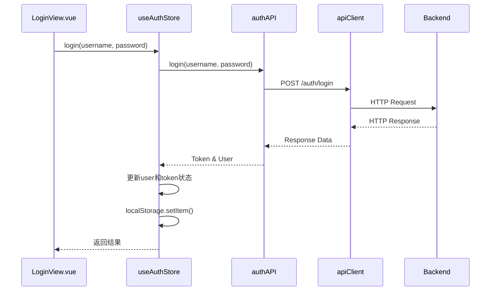
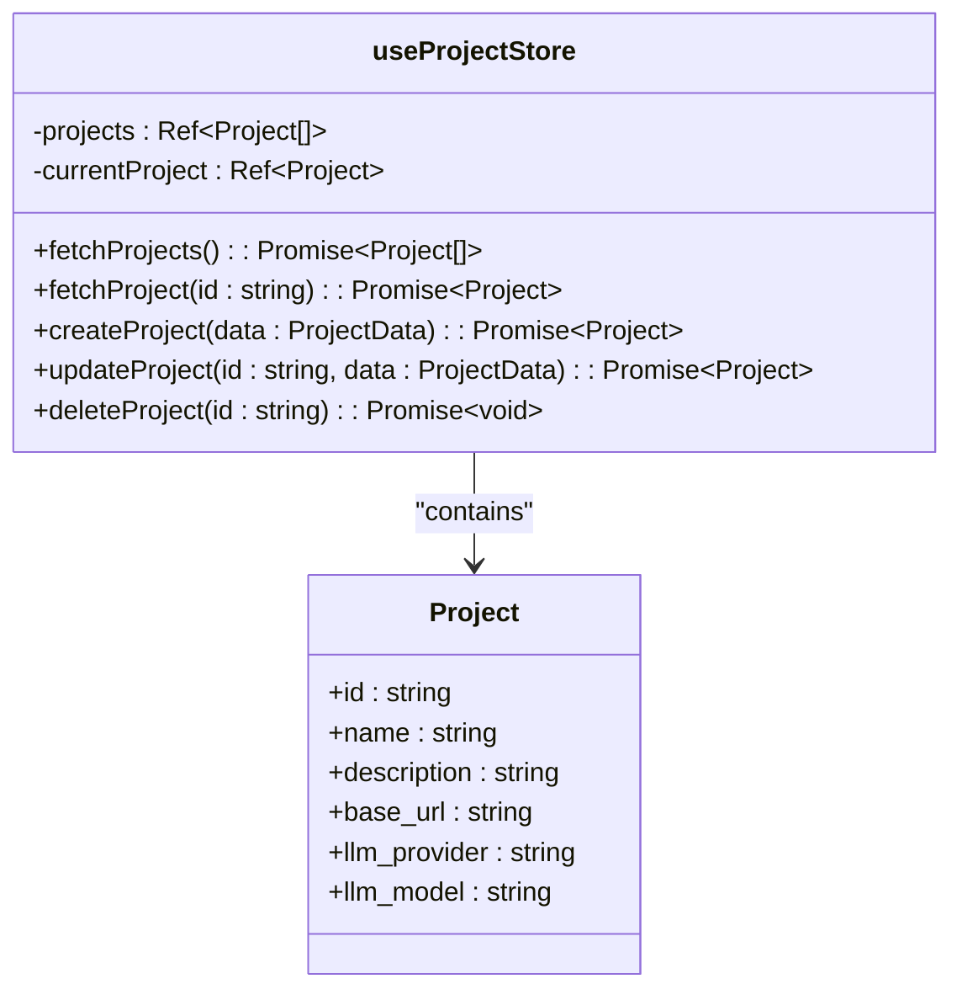
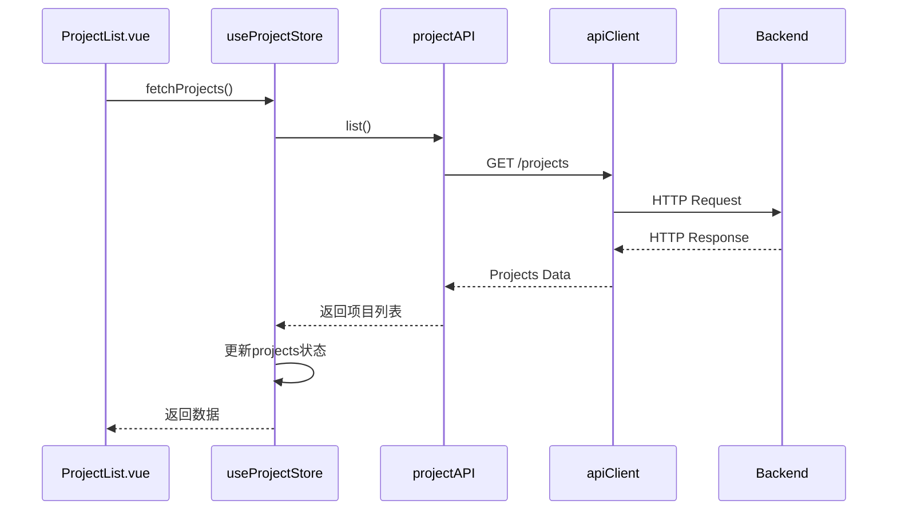
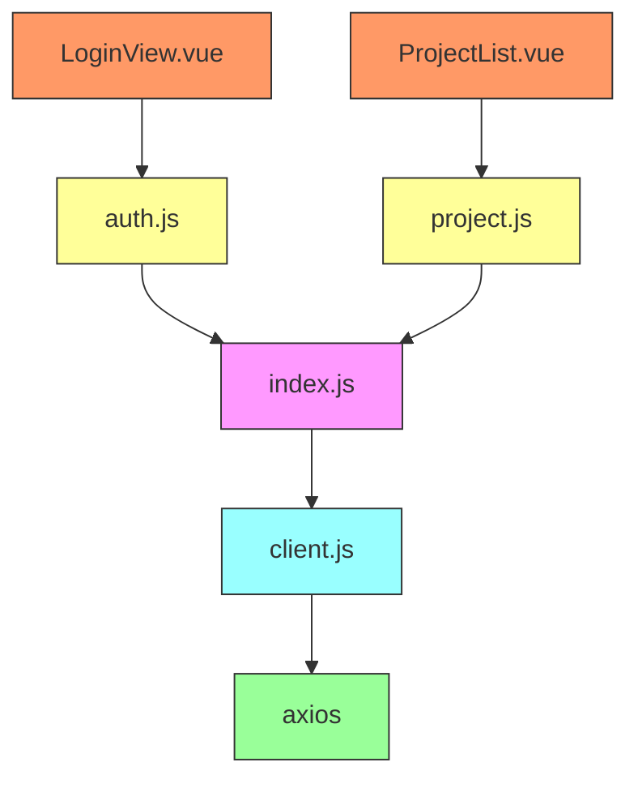

# 状态管理

<cite>
**Referenced Files in This Document**   
- [auth.js](file://frontend/src/stores/auth.js)
- [project.js](file://frontend/src/stores/project.js)
- [client.js](file://frontend/src/api/client.js)
- [index.js](file://frontend/src/api/index.js)
- [LoginView.vue](file://frontend/src/views/LoginView.vue)
- [ProjectList.vue](file://frontend/src/views/ProjectList.vue)
</cite>

## 目录
1. [简介](#简介)
2. [项目结构](#项目结构)
3. [核心组件](#核心组件)
4. [架构概述](#架构概述)
5. [详细组件分析](#详细组件分析)
6. [依赖分析](#依赖分析)
7. [性能考虑](#性能考虑)
8. [故障排除指南](#故障排除指南)
9. [结论](#结论)

## 简介
本文档深入探讨了testserver前端应用中的状态管理系统，重点分析基于Pinia的状态管理实现。文档详细阐述了`auth.js`和`project.js`两个核心store的实现机制，包括state、getters和actions的定义与使用方式。通过分析用户认证状态管理、项目状态管理以及与API的交互模式，展示了如何构建一个高效、可维护的前端状态管理体系。同时，文档还提供了状态持久化、调试技巧和最佳实践建议，帮助开发者理解和维护该系统的状态流。

## 项目结构
testserver的前端状态管理主要集中在`frontend/src/stores`目录下，采用Pinia作为状态管理库。该目录包含两个核心store文件：`auth.js`负责用户认证状态管理，`project.js`负责项目相关状态管理。这些store通过`frontend/src/api`目录下的API模块与后端进行数据交互，并在`frontend/src/views`目录下的各个Vue组件中被消费。

**Diagram sources**
- [auth.js](file://frontend/src/stores/auth.js)
- [project.js](file://frontend/src/stores/project.js)
- [index.js](file://frontend/src/api/index.js)
- [client.js](file://frontend/src/api/client.js)

**Section sources**
- [auth.js](file://frontend/src/stores/auth.js)
- [project.js](file://frontend/src/stores/project.js)

## 核心组件
本系统的核心状态管理组件包括`useAuthStore`和`useProjectStore`两个Pinia store。`useAuthStore`管理用户认证相关的状态，如token、用户信息等，并提供登录、登出和令牌刷新等操作。`useProjectStore`则负责管理项目列表、当前选中项目等状态，并通过API调用实现数据的同步。这两个store共同构成了前端应用的状态基石，为各个视图组件提供统一的状态访问接口。

**Section sources**
- [auth.js](file://frontend/src/stores/auth.js)
- [project.js](file://frontend/src/stores/project.js)

## 架构概述
testserver的状态管理架构采用分层设计模式，将状态管理、API通信和视图展示分离。Pinia store作为状态管理层，封装了所有与状态相关的逻辑和数据。API模块作为通信层，负责与后端进行HTTP交互。视图组件作为展示层，通过Composition API消费store中的状态并响应用户操作。这种分层架构确保了代码的可维护性和可测试性。

**Diagram sources**
- [auth.js](file://frontend/src/stores/auth.js)
- [project.js](file://frontend/src/stores/project.js)
- [index.js](file://frontend/src/api/index.js)

## 详细组件分析

### 认证状态管理分析
`auth.js`文件实现了用户认证状态的完整管理，包括状态定义、计算属性、初始化逻辑以及核心操作方法。

#### 状态与计算属性
`useAuthStore`定义了`user`和`token`两个响应式状态变量，分别存储用户信息和访问令牌。通过`computed`函数创建了`isAuthenticated`和`isAdmin`两个计算属性，前者用于判断用户是否已登录，后者用于判断用户是否为管理员角色。这种设计避免了在组件中重复编写相同的判断逻辑，提高了代码的复用性。

**Diagram sources**
- [auth.js](file://frontend/src/stores/auth.js#L10-L15)

#### 核心操作方法
`auth.js`实现了三个核心操作方法：`init`、`login`和`logout`。`init`方法在应用启动时从localStorage恢复认证状态，实现了状态持久化。`login`方法处理用户登录流程，包括调用API、更新状态和持久化存储。`logout`方法则负责清理认证状态并从localStorage中移除相关数据。

**Diagram sources**
- [auth.js](file://frontend/src/stores/auth.js#L25-L55)
- [index.js](file://frontend/src/api/index.js#L5-L10)
- [client.js](file://frontend/src/api/client.js)

**Section sources**
- [auth.js](file://frontend/src/stores/auth.js)
- [LoginView.vue](file://frontend/src/views/LoginView.vue)

### 项目状态管理分析
`project.js`文件实现了项目相关状态的管理，包括项目列表、当前项目等状态的获取、更新和删除操作。

#### 状态管理
`useProjectStore`定义了`projects`和`currentProject`两个响应式状态变量，分别存储项目列表和当前选中的项目。通过`fetchProjects`、`fetchProject`等异步方法，实现了与后端API的数据同步。在更新和删除操作中，store会同时更新内存中的状态和持久化存储，确保状态的一致性。

**Diagram sources**
- [project.js](file://frontend/src/stores/project.js#L10-L15)

#### 数据同步
`project.js`中的方法通过`projectAPI`模块与后端进行数据交互。在创建、更新和删除操作后，store会立即更新内存中的状态，实现乐观更新。这种设计提高了用户体验，避免了等待API响应时的界面卡顿。

**Diagram sources**
- [project.js](file://frontend/src/stores/project.js#L20-L30)
- [index.js](file://frontend/src/api/index.js#L25-L30)
- [client.js](file://frontend/src/api/client.js)

**Section sources**
- [project.js](file://frontend/src/stores/project.js)
- [ProjectList.vue](file://frontend/src/views/ProjectList.vue)

## 依赖分析
状态管理系统的各个组件之间存在明确的依赖关系。`auth.js`和`project.js`依赖于`api/index.js`中定义的API接口，而API接口又依赖于`api/client.js`中的axios实例配置。视图组件则直接依赖于相应的store，通过Composition API访问状态。

**Diagram sources**
- [auth.js](file://frontend/src/stores/auth.js)
- [project.js](file://frontend/src/stores/project.js)
- [index.js](file://frontend/src/api/index.js)
- [client.js](file://frontend/src/api/client.js)

**Section sources**
- [auth.js](file://frontend/src/stores/auth.js)
- [project.js](file://frontend/src/stores/project.js)
- [index.js](file://frontend/src/api/index.js)

## 性能考虑
状态管理系统在性能方面表现出色。通过Pinia的响应式系统，只有当状态实际发生变化时，依赖的组件才会重新渲染。API客户端配置了30秒的超时时间，避免了长时间等待导致的界面卡顿。在项目列表等大数据量场景下，建议实现分页加载以优化性能。

## 故障排除指南
当遇到状态管理相关问题时，可以按照以下步骤进行排查：
1. 检查localStorage中的token和用户信息是否正确
2. 查看浏览器开发者工具的Network面板，确认API请求是否成功
3. 检查store中的状态变量是否按预期更新
4. 验证组件是否正确使用了Composition API访问store

**Section sources**
- [auth.js](file://frontend/src/stores/auth.js)
- [client.js](file://frontend/src/api/client.js)

## 结论
testserver的状态管理系统设计合理，通过Pinia实现了清晰的状态管理分层。`auth.js`和`project.js`两个store分别负责不同的业务领域，职责分明。系统通过localStorage实现了状态持久化，通过axios拦截器统一处理认证和错误，提高了代码的可维护性。建议在未来版本中增加状态变更的日志记录功能，以便于调试和监控。