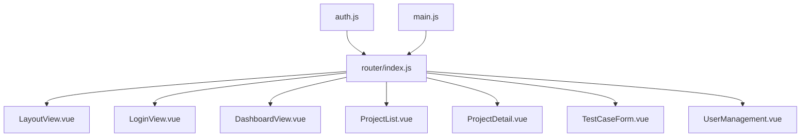
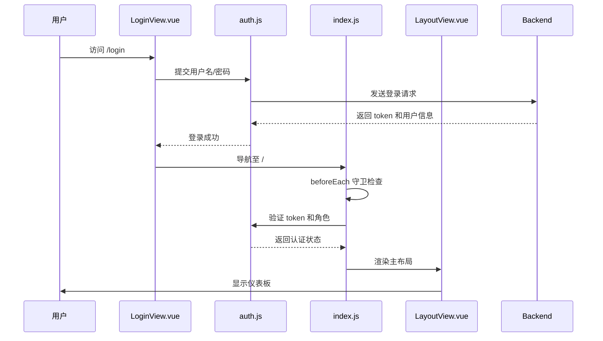
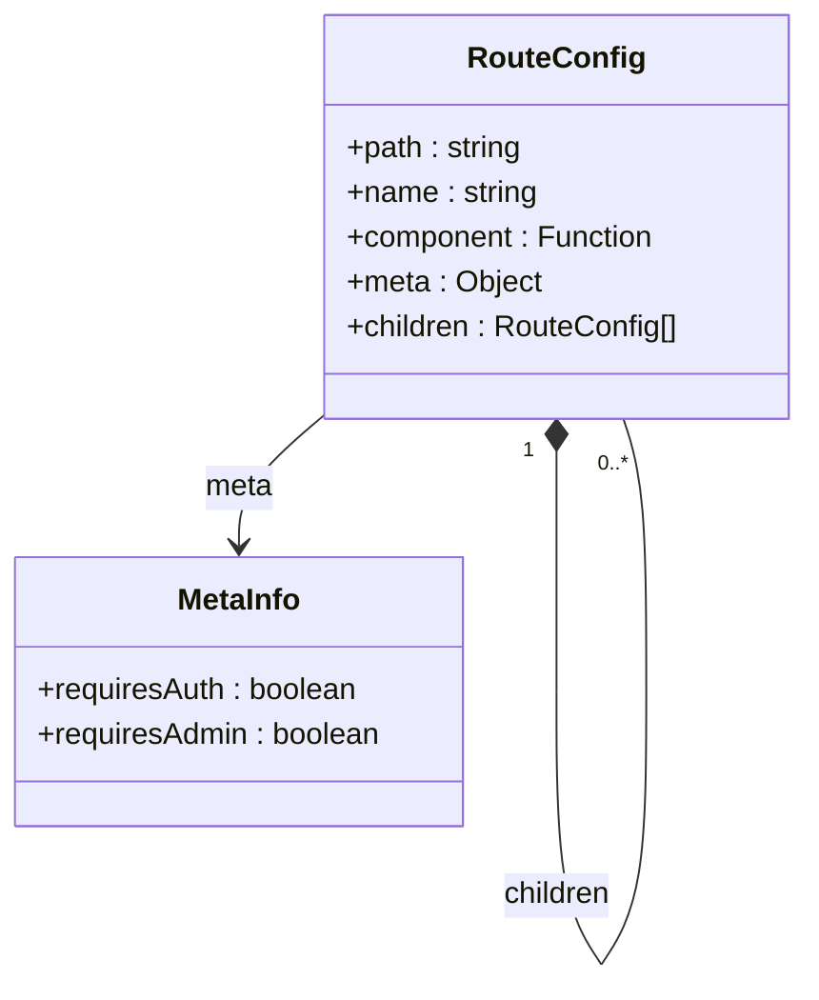
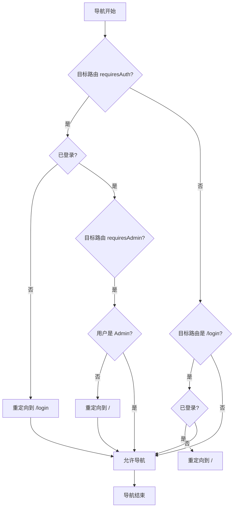
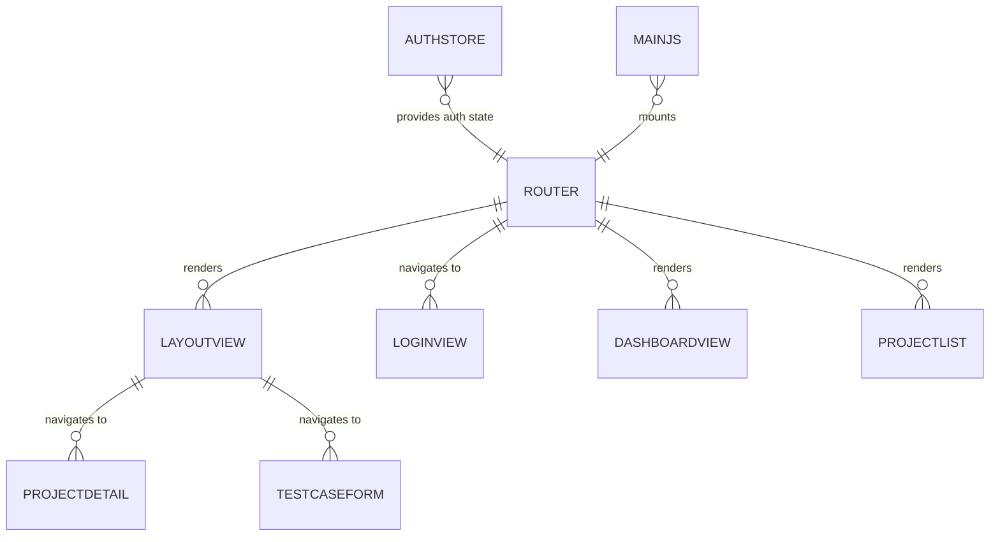

# 路由配置与导航

<cite>
**Referenced Files in This Document**   
- [index.js](file://frontend/src/router/index.js)
- [LayoutView.vue](file://frontend/src/views/LayoutView.vue)
- [LoginView.vue](file://frontend/src/views/LoginView.vue)
- [DashboardView.vue](file://frontend/src/views/DashboardView.vue)
- [ProjectList.vue](file://frontend/src/views/ProjectList.vue)
- [ProjectDetail.vue](file://frontend/src/views/ProjectDetail.vue)
- [TestCaseForm.vue](file://frontend/src/views/TestCaseForm.vue)
- [UserManagement.vue](file://frontend/src/views/UserManagement.vue)
- [auth.js](file://frontend/src/stores/auth.js)
- [main.js](file://frontend/src/main.js)
</cite>

## 目录
1. [路由配置与导航](#路由配置与导航)
2. [项目结构](#项目结构)
3. [核心组件](#核心组件)
4. [架构概述](#架构概述)
5. [详细组件分析](#详细组件分析)
6. [依赖分析](#依赖分析)
7. [性能考虑](#性能考虑)
8. [故障排除指南](#故障排除指南)
9. [结论](#结论)

## 项目结构

前端路由系统位于 `frontend/src/router/index.js` 文件中，采用 Vue Router 4 的模块化配置方式。路由配置与视图组件（位于 `frontend/src/views/` 目录）和状态管理（位于 `frontend/src/stores/` 目录）紧密协作，共同构建了应用的导航体系。

**Diagram sources**
- [index.js](file://frontend/src/router/index.js)
- [LayoutView.vue](file://frontend/src/views/LayoutView.vue)

**Section sources**
- [index.js](file://frontend/src/router/index.js)
- [main.js](file://frontend/src/main.js)

## 核心组件

前端路由系统的核心是 `Vue Router`，它通过 `createRouter` 和 `createWebHistory` 函数进行初始化。路由配置定义了应用的导航结构，而路由守卫则实现了关键的认证和权限控制逻辑。`LayoutView.vue` 组件作为应用的主布局容器，通过 `<router-view>` 动态渲染子路由组件。

**Section sources**
- [index.js](file://frontend/src/router/index.js#L1-L80)
- [LayoutView.vue](file://frontend/src/views/LayoutView.vue#L1-L124)

## 架构概述

该应用采用基于角色的访问控制（RBAC）架构。用户通过 `LoginView.vue` 登录后，其身份信息和访问令牌会被存储在 `Pinia` 状态管理库中。`LayoutView.vue` 作为主布局，包含导航菜单和内容区域。路由系统根据用户角色动态控制菜单项的显示，并通过全局前置守卫 `beforeEach` 拦截导航，确保用户只能访问其权限范围内的页面。

**Diagram sources**
- [index.js](file://frontend/src/router/index.js#L56-L78)
- [LoginView.vue](file://frontend/src/views/LoginView.vue#L1-L131)
- [auth.js](file://frontend/src/stores/auth.js#L1-L62)

## 详细组件分析

### 路由配置分析

`index.js` 文件定义了应用的路由表。它使用了**懒加载**机制，通过 `import()` 函数动态导入组件，这可以有效减少应用的初始加载时间。路由被组织为父子结构，根路径 `/` 对应 `LayoutView.vue`，其他视图组件作为其子路由。

**Diagram sources**
- [index.js](file://frontend/src/router/index.js#L1-L80)

**Section sources**
- [index.js](file://frontend/src/router/index.js#L1-L80)

#### 路由守卫与元信息

路由守卫是实现安全控制的核心。`beforeEach` 全局前置守卫在每次路由跳转前执行，检查 `meta` 字段中的元信息。`requiresAuth` 确保只有已登录用户才能访问受保护的页面，而 `requiresAdmin` 则进一步限制了管理员专属页面的访问。

**Diagram sources**
- [index.js](file://frontend/src/router/index.js#L56-L78)

**Section sources**
- [index.js](file://frontend/src/router/index.js#L56-L78)
- [auth.js](file://frontend/src/stores/auth.js#L1-L62)

### 视图组件分析

#### 布局容器 (LayoutView.vue)

`LayoutView.vue` 是应用的主布局组件，它使用 `Element Plus` 的 `el-container` 布局系统。它包含一个顶部导航栏、一个侧边栏菜单和一个主内容区。主内容区通过 `<router-view>` 插槽来渲染当前激活的子路由组件。菜单项的可见性由 `authStore.isAdmin` 计算属性动态控制。

**Section sources**
- [LayoutView.vue](file://frontend/src/views/LayoutView.vue#L1-L124)

#### 登录视图 (LoginView.vue)

`LoginView.vue` 是用户进入应用的入口。它提供了一个表单，用户输入凭据后，通过 `authStore.login()` 方法进行认证。认证成功后，`Pinia` store 会保存用户信息和令牌，并通过 `router.push('/')` 进行编程式导航到主页面。

**Section sources**
- [LoginView.vue](file://frontend/src/views/LoginView.vue#L1-L131)

#### 仪表板视图 (DashboardView.vue)

`DashboardView.vue` 是应用的默认首页，展示了关键的统计信息。它通过 `router.push('/projects')` 提供了快速导航到项目列表的功能。

**Section sources**
- [DashboardView.vue](file://frontend/src/views/DashboardView.vue#L1-L140)

#### 项目列表视图 (ProjectList.vue)

`ProjectList.vue` 展示了所有项目。它根据 `authStore.isAdmin` 的值决定是否显示“创建项目”按钮。点击项目会通过 `router.push()` 导航到 `ProjectDetail.vue`。

**Section sources**
- [ProjectList.vue](file://frontend/src/views/ProjectList.vue#L1-L190)

#### 项目详情视图 (ProjectDetail.vue)

`ProjectDetail.vue` 展示了单个项目的详细信息。它使用路由参数 `:id` 来获取项目ID，并通过 `useRoute().params.id` 在代码中访问。它包含了创建测试用例和执行测试的导航逻辑。

**Section sources**
- [ProjectDetail.vue](file://frontend/src/views/ProjectDetail.vue#L1-L117)

#### 测试用例创建视图 (TestCaseForm.vue)

`TestCaseForm.vue` 实现了一个多步骤的表单向导。它使用了编程式导航 `router.back()` 来处理“上一步”操作，并在最后一步通过 `router.push()` 导航到测试执行结果页面。

**Section sources**
- [TestCaseForm.vue](file://frontend/src/views/TestCaseForm.vue#L1-L249)

#### 用户管理视图 (UserManagement.vue)

`UserManagement.vue` 是一个管理员专属页面，其路由配置了 `meta: { requiresAdmin: true }`。只有角色为 `Admin` 的用户才能访问此页面。

**Section sources**
- [UserManagement.vue](file://frontend/src/views/UserManagement.vue#L1-L247)

## 依赖分析

路由系统与多个模块存在紧密依赖。它直接依赖于 `Pinia` 的 `authStore` 来获取用户认证状态。`main.js` 文件负责将 `router` 实例挂载到 Vue 应用上。所有视图组件都依赖于 `Vue Router` 提供的 `useRoute` 和 `useRouter` 组合式 API 来进行路由操作。

**Diagram sources**
- [index.js](file://frontend/src/router/index.js)
- [auth.js](file://frontend/src/stores/auth.js)
- [main.js](file://frontend/src/main.js)

**Section sources**
- [index.js](file://frontend/src/router/index.js)
- [auth.js](file://frontend/src/stores/auth.js)
- [main.js](file://frontend/src/main.js)

## 性能考虑

路由系统的性能主要体现在**懒加载**和**状态管理**上。组件的懒加载显著减少了初始包的大小，提升了首屏加载速度。将用户认证状态存储在 `Pinia` 中，避免了每次路由守卫都需要重新查询后端，提高了导航效率。然而，`beforeEach` 守卫中的同步逻辑（如 `localStorage` 读取）是轻量级的，不会造成性能瓶颈。

## 故障排除指南

### 路由加载失败

**现象**：页面空白，控制台报错 `Failed to fetch dynamically imported module`。
**原因**：通常是由于构建工具（Vite）的路径配置错误，导致动态导入的组件路径无法解析。
**解决方案**：
1.  检查 `vite.config.js` 中的 `resolve.alias` 配置。
2.  确保 `import('../views/XXX.vue')` 中的路径相对于 `index.js` 是正确的。

### 权限不足跳转失败

**现象**：非管理员用户访问 `/users` 页面时，未被重定向。
**原因**：`beforeEach` 守卫逻辑错误或 `user` 对象的 `role` 字段未正确设置。
**解决方案**：
1.  检查 `authStore.user` 的 `role` 字段是否在登录时被正确赋值。
2.  在 `beforeEach` 守卫中添加 `console.log` 语句，调试 `user?.role` 的值。

### 编程式导航不生效

**现象**：调用 `router.push()` 后，URL 改变但视图未更新。
**原因**：`router` 实例未正确注入，或在非 `setup` 上下文中使用了错误的 `this.$router`。
**解决方案**：
1.  确保在 `main.js` 中正确调用了 `app.use(router)`。
2.  在 `setup` 函数中，使用 `const router = useRouter()` 来获取 `router` 实例。

## 结论

本前端路由系统设计清晰，功能完整。它利用 Vue Router 的强大功能，结合 Pinia 状态管理，实现了安全、高效的导航体验。通过懒加载优化了性能，通过路由守卫和元信息实现了细粒度的权限控制。`LayoutView.vue` 作为统一的布局容器，保证了应用 UI 的一致性。整体架构遵循了现代前端应用的最佳实践，为后续功能扩展提供了坚实的基础。