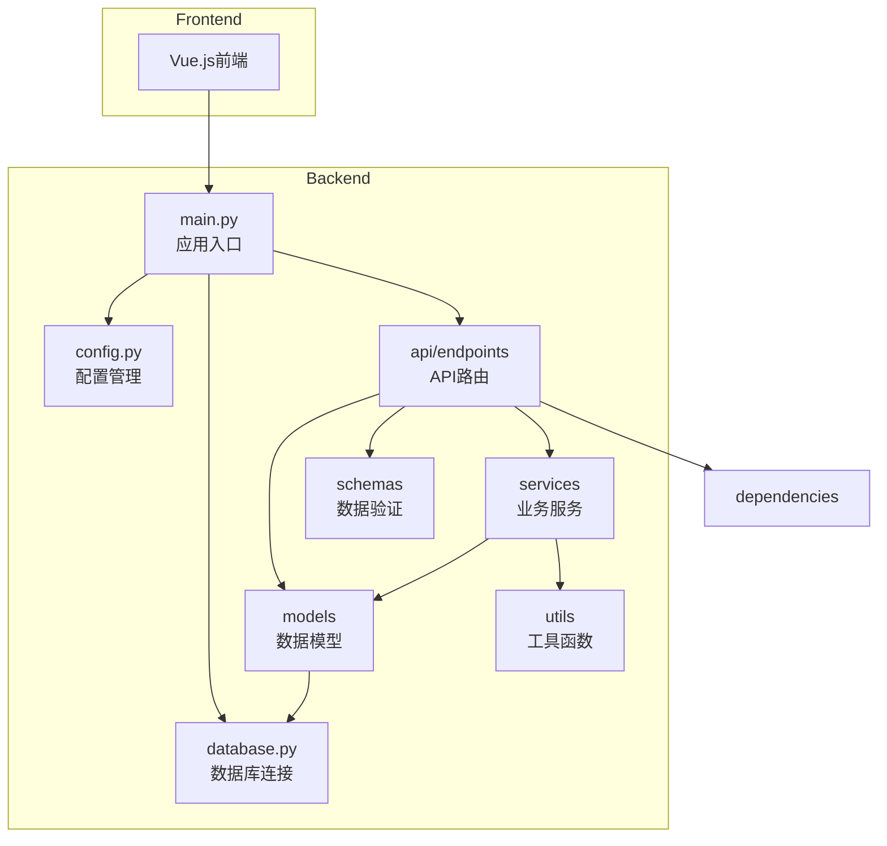
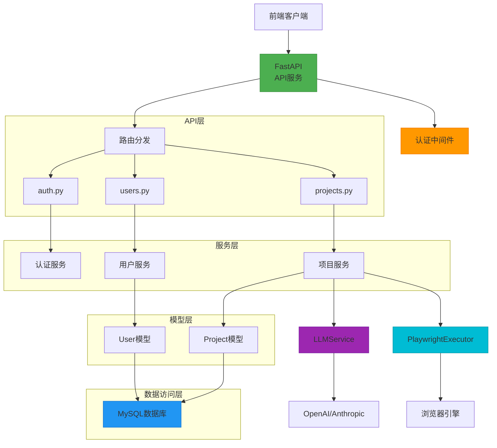
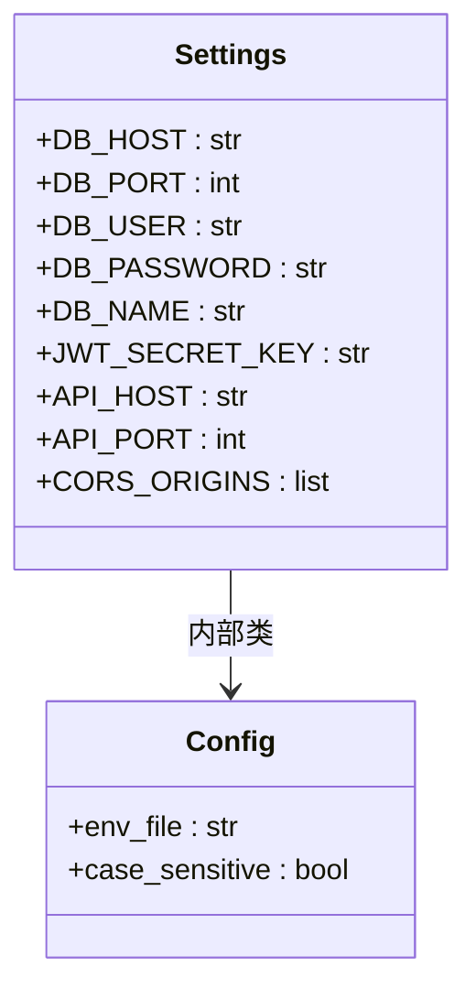
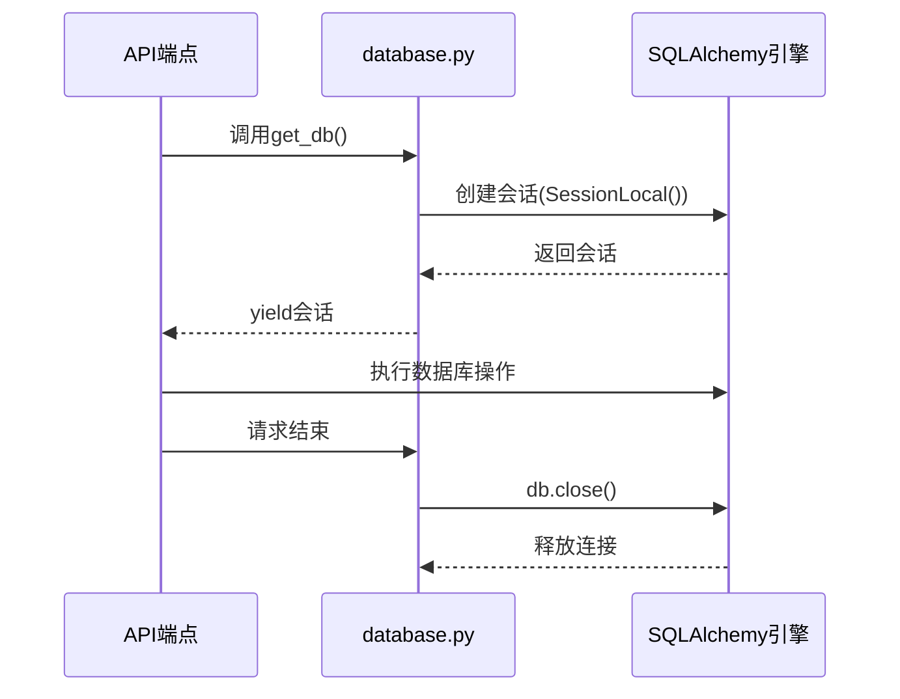
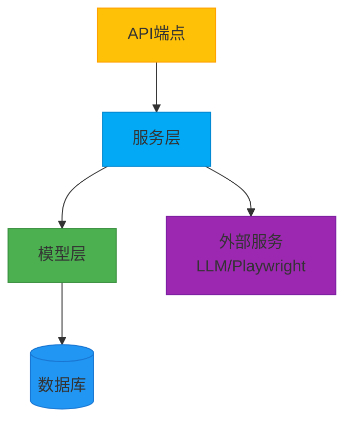
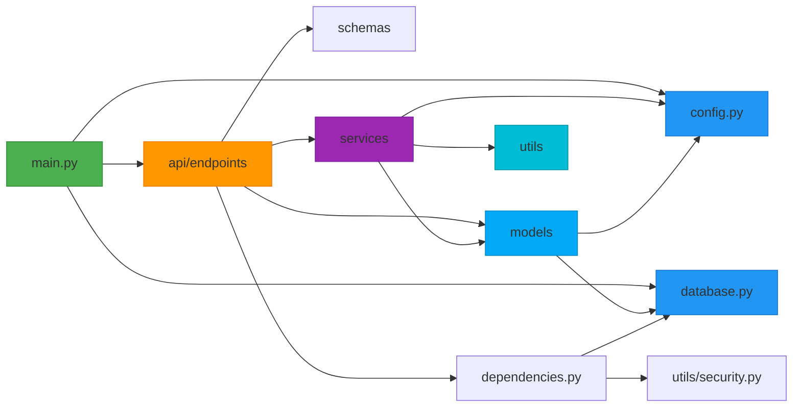

# 后端架构

<cite>
**本文档中引用的文件**  
- [main.py](file://backend/main.py)
- [config.py](file://backend/app/config.py)
- [database.py](file://backend/app/database.py)
- [auth.py](file://backend/app/api/endpoints/auth.py)
- [users.py](file://backend/app/api/endpoints/users.py)
- [projects.py](file://backend/app/api/endpoints/projects.py)
- [user.py](file://backend/app/models/user.py)
- [project.py](file://backend/app/models/project.py)
- [llm_service.py](file://backend/app/services/llm_service.py)
- [playwright_executor.py](file://backend/app/services/playwright_executor.py)
- [user.py](file://backend/app/schemas/user.py)
- [project.py](file://backend/app/schemas/project.py)
- [dependencies.py](file://backend/app/api/dependencies.py)
</cite>

## 目录
1. [简介](#简介)
2. [项目结构](#项目结构)
3. [核心组件](#核心组件)
4. [架构概览](#架构概览)
5. [详细组件分析](#详细组件分析)
6. [依赖分析](#依赖分析)
7. [性能考虑](#性能考虑)
8. [故障排除指南](#故障排除指南)
9. [结论](#结论)

## 简介
本项目为“自然语言驱动UI测试平台”的后端系统，采用FastAPI构建RESTful API服务。系统通过分层架构设计，实现了API端点、业务逻辑、数据模型与数据库访问的清晰分离。后端支持用户认证、项目管理、测试用例生成与执行等核心功能，并集成LLM服务与Playwright自动化引擎，实现从自然语言到自动化测试的完整闭环。系统具备良好的可扩展性与维护性，适合持续集成与自动化测试场景。

## 项目结构

**图示来源**  
- [main.py](file://backend/main.py#L1-L56)
- [config.py](file://backend/app/config.py#L1-L41)
- [database.py](file://backend/app/database.py#L1-L32)

**本节来源**  
- [main.py](file://backend/main.py#L1-L56)
- [app](file://backend/app)

## 核心组件

系统核心组件包括FastAPI应用入口、配置管理、数据库连接、API端点、数据模型、服务层与工具模块。`main.py`作为应用启动入口，负责初始化FastAPI实例、配置中间件并注册所有API路由。`config.py`通过Pydantic Settings实现环境变量加载与配置管理，支持`.env`文件。`database.py`基于SQLAlchemy实现数据库连接池与会话管理，确保与MySQL的高效交互。各API端点通过分层调用模型与服务，实现业务逻辑解耦。

**本节来源**  
- [main.py](file://backend/main.py#L1-L56)
- [config.py](file://backend/app/config.py#L1-L41)
- [database.py](file://backend/app/database.py#L1-L32)

## 架构概览

**图示来源**  
- [main.py](file://backend/main.py#L1-L56)
- [auth.py](file://backend/app/api/endpoints/auth.py#L1-L55)
- [users.py](file://backend/app/api/endpoints/users.py#L1-L123)
- [projects.py](file://backend/app/api/endpoints/projects.py#L1-L142)
- [llm_service.py](file://backend/app/services/llm_service.py#L1-L326)
- [playwright_executor.py](file://backend/app/services/playwright_executor.py#L1-L214)

## 详细组件分析

### 应用入口与路由集成

`main.py`作为FastAPI应用的入口文件，通过`FastAPI()`初始化应用实例，并配置了CORS中间件以支持跨域请求。所有API路由通过`include_router`方法注册到`/api`前缀下，包括认证、用户、项目、测试用例和测试执行等模块。应用还提供了根路径和健康检查接口，便于服务状态监控。

**本节来源**  
- [main.py](file://backend/main.py#L1-L56)

### 配置管理机制

`app/config.py`使用Pydantic的`BaseSettings`类实现配置管理。`Settings`类定义了数据库、JWT、服务器、CORS等配置项，并通过`Config`类指定从`.env`文件加载环境变量。敏感信息如数据库密码和JWT密钥可通过环境变量覆盖，确保生产环境安全。配置实例`settings`被其他模块全局引用，实现配置集中管理。

**图示来源**  
- [config.py](file://backend/app/config.py#L7-L37)

**本节来源**  
- [config.py](file://backend/app/config.py#L1-L41)

### 数据库连接与会话管理

`app/database.py`使用SQLAlchemy创建数据库引擎，连接字符串基于`settings`配置动态生成。引擎配置了`pool_pre_ping=True`以检测断开的连接，并设置`pool_recycle=3600`避免连接超时。`SessionLocal`会话工厂用于创建数据库会话，`get_db()`依赖函数通过生成器实现会话的自动获取与关闭，确保资源安全释放。

**图示来源**  
- [database.py](file://backend/app/database.py#L1-L32)
- [get_db](file://backend/app/database.py#L25-L31)

**本节来源**  
- [database.py](file://backend/app/database.py#L1-L32)

### 分层架构与职责划分

系统采用清晰的分层架构：
- **API端点层**：处理HTTP请求，进行参数验证与响应格式化，调用服务层。
- **服务层**：封装核心业务逻辑，如用户认证、项目管理、LLM调用等，协调模型与外部服务。
- **模型层**：定义数据库表结构与ORM映射，提供数据持久化能力。
- **Schema层**：定义Pydantic模型，用于请求/响应数据的验证与序列化。

各层通过依赖注入与函数调用协同工作，职责分明，便于单元测试与维护。

**图示来源**  
- [auth.py](file://backend/app/api/endpoints/auth.py#L1-L55)
- [llm_service.py](file://backend/app/services/llm_service.py#L1-L326)
- [user.py](file://backend/app/models/user.py#L1-L33)
- [user.py](file://backend/app/schemas/user.py#L1-L49)

**本节来源**  
- [auth.py](file://backend/app/api/endpoints/auth.py#L1-L55)
- [users.py](file://backend/app/api/endpoints/users.py#L1-L123)
- [projects.py](file://backend/app/api/endpoints/projects.py#L1-L142)
- [llm_service.py](file://backend/app/services/llm_service.py#L1-L326)
- [playwright_executor.py](file://backend/app/services/playwright_executor.py#L1-L214)
- [user.py](file://backend/app/models/user.py#L1-L33)
- [project.py](file://backend/app/models/project.py#L1-L28)
- [user.py](file://backend/app/schemas/user.py#L1-L49)
- [project.py](file://backend/app/schemas/project.py#L1-L52)

## 依赖分析

**图示来源**  
- [main.py](file://backend/main.py#L1-L56)
- [config.py](file://backend/app/config.py#L1-L41)
- [database.py](file://backend/app/database.py#L1-L32)
- [dependencies.py](file://backend/app/api/dependencies.py#L1-L89)

**本节来源**  
- [main.py](file://backend/main.py#L1-L56)
- [config.py](file://backend/app/config.py#L1-L41)
- [database.py](file://backend/app/database.py#L1-L32)
- [dependencies.py](file://backend/app/api/dependencies.py#L1-L89)

## 性能考虑
系统在数据库连接层面通过SQLAlchemy的连接池机制优化性能，避免频繁创建和销毁数据库连接。`pool_pre_ping`和`pool_recycle`配置确保连接的健壮性。API层通过FastAPI的异步支持处理并发请求。服务层的LLM和Playwright调用为同步阻塞操作，建议在生产环境中通过消息队列或异步任务（如Celery）进行解耦，以提高API响应速度和系统吞吐量。

## 故障排除指南
- **数据库连接失败**：检查`config.py`中的数据库配置及`.env`文件，确认MySQL服务是否运行。
- **API 500错误**：查看日志中的堆栈跟踪，检查数据库会话是否正确关闭，或模型字段是否匹配。
- **认证失败**：确认JWT密钥配置正确，且客户端发送的token格式无误。
- **LLM调用超时**：检查网络连接及API密钥有效性，调整`LLMService`中的超时设置。
- **Playwright执行失败**：确认Playwright依赖已安装，且执行环境支持无头浏览器运行。

**本节来源**  
- [database.py](file://backend/app/database.py#L1-L32)
- [auth.py](file://backend/app/api/endpoints/auth.py#L1-L55)
- [llm_service.py](file://backend/app/services/llm_service.py#L1-L326)
- [playwright_executor.py](file://backend/app/services/playwright_executor.py#L1-L214)

## 结论
testserver后端采用FastAPI为核心的分层架构，结构清晰，职责分明。通过`main.py`统一管理应用入口与路由，`config.py`实现安全的配置管理，`database.py`提供高效的数据库访问。API、服务、模型三层解耦良好，便于维护与扩展。系统集成了LLM与自动化测试引擎，具备智能化测试能力。整体设计注重可维护性与可扩展性，为后续功能迭代奠定了坚实基础。