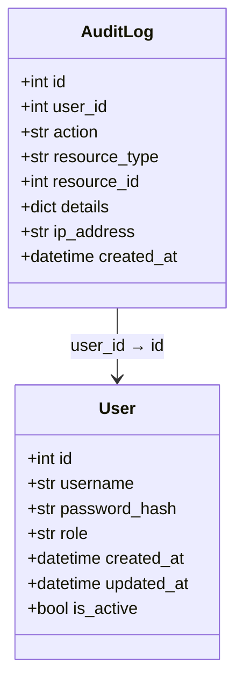

# 审计日志模型

<cite>
**本文档引用的文件**  
- [audit_log.py](file://backend/app/models/audit_log.py)
- [user.py](file://backend/app/models/user.py)
- [audit_log.py](file://backend/app/schemas/audit_log.py)
- [init_db.sql](file://backend/init_db.sql)
</cite>

## 目录
1. [引言](#引言)
2. [模型结构与字段解析](#模型结构与字段解析)
3. [核心关系与数据关联](#核心关系与数据关联)
4. [索引设计与查询性能优化](#索引设计与查询性能优化)
5. [审计日志的典型查询场景](#审计日志的典型查询场景)
6. [details字段的JSON模式设计原则](#details字段的json模式设计原则)
7. [日志归档与数据管理策略](#日志归档与数据管理策略)
8. [结论](#结论)

## 引言
审计日志模型（AuditLog）是系统安全合规体系中的关键组成部分，用于记录所有用户的敏感操作，实现操作行为的可追溯性与责任认定。该模型通过结构化方式存储操作者、操作类型、资源对象、操作详情及上下文信息，为系统提供完整的审计能力。本文档全面解析审计日志模型的设计与实现，阐述其在安全审计中的核心作用，并提供实际应用建议。

## 模型结构与字段解析
审计日志模型定义了多个关键字段，用于完整记录每一次操作的上下文信息：

- **id**：主键，自增整数，唯一标识每条审计日志。
- **user_id**：外键，关联`user`表的`id`字段，标识执行操作的用户。
- **action**：操作动作，字符串类型，表示具体执行的操作，如`create_project`、`run_test`等。
- **resource_type**：资源类型，字符串类型，表示被操作的资源类别，如`project`、`test_case`等。
- **resource_id**：资源ID，整数类型，表示被操作的具体资源实例的ID。
- **details**：操作详情，JSON格式，用于存储操作的详细信息，如旧值与新值对比、参数变更等。
- **ip_address**：客户端IP地址，字符串类型，记录发起请求的客户端IP。
- **created_at**：操作时间，日期时间类型，记录操作发生的时间戳。

这些字段共同构成了完整的操作审计记录，确保每一条日志都具备足够的上下文信息用于追溯与分析。

**Section sources**
- [audit_log.py](file://backend/app/models/audit_log.py#L9-L23)

## 核心关系与数据关联
审计日志模型通过外键与用户模型建立明确的关系，形成操作者与操作行为的关联链。

- **user_id 外键约束**：`user_id`字段引用`user`表的`id`字段，确保每条日志都对应一个有效的用户。数据库层面通过`ON DELETE RESTRICT`约束防止在仍有审计日志关联的情况下删除用户。
- **user 关系映射**：在ORM层面，`AuditLog`类通过`relationship("User", back_populates="audit_logs")`定义与`User`模型的双向关系。相应地，`User`模型中定义了`audit_logs = relationship("AuditLog", back_populates="user")`，使得可以通过用户实例访问其所有审计日志。

这种双向关系设计便于在应用层进行数据查询与关联分析，例如快速获取某用户的所有操作历史。



**Diagram sources**
- [audit_log.py](file://backend/app/models/audit_log.py#L23)
- [user.py](file://backend/app/models/user.py#L32)

## 索引设计与查询性能优化
为确保审计日志在高并发场景下的查询效率，模型在关键字段上建立了数据库索引。

- **created_at 索引**：`created_at`字段上的索引极大提升了基于时间范围的查询性能，例如“查找过去24小时的所有操作”这类常见审计需求。
- **action 索引**：`action`字段上的索引支持对特定操作类型的快速统计与过滤，如“统计所有项目创建事件”。
- **resource_type 索引**：`resource_type`索引优化了对特定资源类型操作的查询效率。
- **user_id 索引**：`user_id`索引加速了按操作者进行日志检索的性能。

这些索引的设计确保了即使在日志数据量庞大的情况下，关键审计查询仍能保持高效响应。

**Section sources**
- [audit_log.py](file://backend/app/models/audit_log.py#L14-L20)
- [init_db.sql](file://backend/init_db.sql#L85-L88)

## 审计日志的典型查询场景
审计日志模型支持多种关键的审计查询场景，满足安全合规与运维分析需求。

### 查找某用户在过去24小时的所有操作
```sql
SELECT * FROM audit_log 
WHERE user_id = ? 
AND created_at >= DATE_SUB(NOW(), INTERVAL 24 HOUR)
ORDER BY created_at DESC;
```

### 统计所有项目创建事件
```sql
SELECT COUNT(*) as total_creations, 
       DATE(created_at) as date 
FROM audit_log 
WHERE action = 'create_project' 
GROUP BY DATE(created_at) 
ORDER BY date DESC;
```

### 查询特定资源的所有操作历史
```sql
SELECT al.*, u.username 
FROM audit_log al 
JOIN user u ON al.user_id = u.id 
WHERE resource_type = 'test_case' AND resource_id = ?
ORDER BY created_at DESC;
```

这些查询示例展示了审计日志模型在实际应用中的灵活性与实用性。

**Section sources**
- [init_db.sql](file://backend/init_db.py#L78-L115)

## details字段的JSON模式设计原则
`details`字段采用JSON格式，为操作详情提供了高度的灵活性。为确保日志的可读性与可分析性，应遵循以下设计原则：

- **结构化设计**：避免存储纯文本，应使用结构化的键值对，如`{"old_value": "value1", "new_value": "value2"}`。
- **一致性命名**：字段名应统一命名规范，如使用蛇形命名法（snake_case）。
- **最小化冗余**：只记录变更相关的数据，避免重复存储数据库中已有的完整对象。
- **可追溯性**：包含足够的上下文信息，如变更前后的值、操作参数等，以便于问题排查。
- **版本兼容性**：设计时应考虑未来可能的扩展，避免破坏性变更。

良好的JSON模式设计使得日志不仅可用于人工审计，也可被自动化分析工具有效处理。

**Section sources**
- [audit_log.py](file://backend/app/models/audit_log.py#L18)

## 日志归档与数据管理策略
随着系统运行时间的增长，审计日志数据量会持续累积，因此需要制定合理的数据管理策略。

- **定期归档**：建议按月或按季度将历史日志归档至低成本存储（如对象存储或数据仓库），以减轻主数据库压力。
- **数据保留策略**：根据合规要求（如GDPR、等保）设定日志保留期限，到期后自动清理。
- **分区表**：对于超大规模系统，可考虑对`audit_log`表按时间进行分区，进一步提升查询性能。
- **监控与告警**：监控日志表的增长速度，设置存储空间告警，防止数据库空间耗尽。

合理的归档策略既能满足合规要求，又能保障系统长期稳定运行。

**Section sources**
- [init_db.sql](file://backend/init_db.sql#L78-L115)

## 结论
审计日志模型（AuditLog）是系统安全审计与操作追溯的核心组件。通过精心设计的字段结构、外键关系、数据库索引和JSON详情字段，该模型能够完整、高效地记录和查询所有关键操作。结合合理的日志归档策略，可构建一个既满足合规要求又具备良好性能的审计体系，为系统的安全稳定运行提供坚实保障。