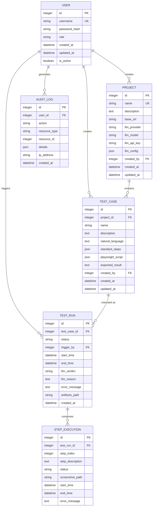
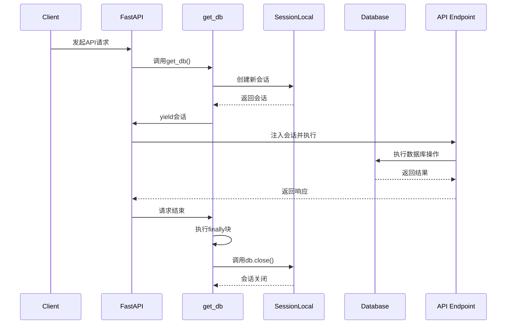

# 数据模型

<cite>
**Referenced Files in This Document**   
- [database.py](file://backend/app/database.py)
- [user.py](file://backend/app/models/user.py)
- [project.py](file://backend/app/models/project.py)
- [test_case.py](file://backend/app/models/test_case.py)
- [test_run.py](file://backend/app/models/test_run.py)
- [step_execution.py](file://backend/app/models/step_execution.py)
- [audit_log.py](file://backend/app/models/audit_log.py)
</cite>

## 目录
1. [引言](#引言)
2. [核心ORM模型定义](#核心orm模型定义)
3. [模型关系与ER图](#模型关系与er图)
4. [Base基类与元数据管理](#base基类与元数据管理)
5. [数据库会话与依赖注入](#数据库会话与依赖注入)
6. [数据库引擎与连接池配置](#数据库引擎与连接池配置)
7. [查询性能优化建议](#查询性能优化建议)
8. [结论](#结论)

## 引言

本文档详细阐述testserver系统的数据模型设计，涵盖SQLAlchemy定义的全部ORM模型（User、Project、TestCase、TestRun、StepExecution、AuditLog）的字段、数据类型、主键/外键关系、索引和约束。同时，深入解析Base基类的继承机制、declarative_base()在数据库元数据管理中的作用、SessionLocal会话工厂的线程安全设计以及get_db()依赖注入在FastAPI框架中的应用。结合database.py中的引擎配置，分析连接池参数对生产环境稳定性的影响，并提供ER图建议和查询性能优化策略。

## 核心ORM模型定义

### 用户模型 (User)

User模型定义了系统用户的核心信息，包含身份认证、权限控制和审计追踪所需字段。

**字段说明：**
- `id`: 整数类型主键，自增，带索引
- `username`: 唯一字符串（50字符），非空，带索引
- `password_hash`: 字符串（255字符），非空，存储加密后的密码
- `role`: 枚举类型（UserRole），非空，带索引，区分Admin和Member角色
- `created_at`: 创建时间，UTC时间，默认值为当前时间
- `updated_at`: 更新时间，UTC时间，默认值为当前时间，更新时自动刷新
- `is_active`: 布尔类型，非空，默认为True，用于软删除

**约束与索引：**
- `username`字段具有唯一性约束和索引
- `id`为主键，自动创建索引
- `role`和`created_at`字段创建了索引以优化查询性能

**Section sources**
- [user.py](file://backend/app/models/user.py#L1-L34)

### 项目模型 (Project)

Project模型表示测试项目，包含LLM配置和与创建者的关联。

**字段说明：**
- `id`: 整数类型主键，自增，带索引
- `name`: 唯一字符串（100字符），非空，带索引
- `description`: 文本类型，可为空
- `base_url`: 字符串（500字符），非空，存储项目基础URL
- `llm_provider`: 字符串（50字符），非空，指定LLM提供商
- `llm_model`: 字符串（100字符），非空，指定LLM模型
- `llm_api_key`: 字符串（255字符），非空，存储API密钥
- `llm_config`: JSON类型，存储LLM的额外配置
- `created_by`: 外键关联User.id，非空，带索引
- `created_at`: 创建时间，UTC时间，默认值为当前时间
- `updated_at`: 更新时间，UTC时间，默认值为当前时间，更新时自动刷新

**约束与索引：**
- `name`字段具有唯一性约束和索引
- `id`为主键，自动创建索引
- `created_by`字段创建了索引以优化关联查询

**Section sources**
- [project.py](file://backend/app/models/project.py#L1-L29)

### 测试用例模型 (TestCase)

TestCase模型存储自然语言描述的测试用例及其对应的Playwright脚本。

**字段说明：**
- `id`: 整数类型主键，自增，带索引
- `project_id`: 外键关联Project.id，启用级联删除，非空，带索引
- `name`: 字符串（200字符），非空，带索引
- `description`: 文本类型，可为空
- `natural_language`: 文本类型，非空，存储自然语言描述
- `standard_steps`: JSON类型，非空，存储标准化步骤
- `playwright_script`: JSON类型，非空，存储Playwright自动化脚本
- `expected_result`: 文本类型，非空，存储预期结果
- `created_by`: 外键关联User.id，非空，带索引
- `created_at`: 创建时间，UTC时间，默认值为当前时间
- `updated_at`: 更新时间，UTC时间，默认值为当前时间，更新时自动刷新

**约束与索引：**
- `id`为主键，自动创建索引
- `project_id`和`created_by`字段创建了索引
- `project_id`外键启用`ON DELETE CASCADE`，确保项目删除时其测试用例被级联删除

**Section sources**
- [test_case.py](file://backend/app/models/test_case.py#L1-L30)

### 测试运行模型 (TestRun)

TestRun模型记录每次测试执行的详细信息和结果。

**字段说明：**
- `id`: 整数类型主键，自增，带索引
- `test_case_id`: 外键关联TestCase.id，启用级联删除，非空，带索引
- `status`: 枚举类型（TestRunStatus），非空，带索引，表示运行状态
- `trigger_by`: 外键关联User.id，非空，带索引，记录触发用户
- `start_time`: 开始时间，UTC时间，默认值为当前时间，带索引
- `end_time`: 结束时间，可为空
- `llm_verdict`: 枚举类型（LLMVerdict），LLM对测试结果的判定
- `llm_reason`: 文本类型，存储LLM判定的理由
- `error_message`: 文本类型，存储错误信息
- `artifacts_path`: 字符串（500字符），存储测试产物（如视频、日志）路径
- `created_at`: 创建时间，UTC时间，默认值为当前时间

**约束与索引：**
- `id`为主键，自动创建索引
- `test_case_id`、`status`和`start_time`字段创建了索引，优化按测试用例、状态和时间范围的查询
- `test_case_id`外键启用`ON DELETE CASCADE`

**Section sources**
- [test_run.py](file://backend/app/models/test_run.py#L1-L46)

### 步骤执行模型 (StepExecution)

StepExecution模型记录测试运行中每个步骤的执行详情。

**字段说明：**
- `id`: 整数类型主键，自增，带索引
- `test_run_id`: 外键关联TestRun.id，启用级联删除，非空，带索引
- `step_index`: 整数类型，非空，带索引，表示步骤在测试用例中的顺序
- `step_description`: 文本类型，非空，存储步骤描述
- `status`: 枚举类型（StepStatus），非空，表示步骤执行状态
- `screenshot_path`: 字符串（500字符），存储截图路径
- `start_time`: 开始时间，UTC时间，默认值为当前时间
- `end_time`: 结束时间，可为空
- `error_message`: 文本类型，存储步骤执行错误

**约束与索引：**
- `id`为主键，自动创建索引
- `test_run_id`和`step_index`字段创建了索引，便于按测试运行和步骤顺序查询
- `test_run_id`外键启用`ON DELETE CASCADE`

**Section sources**
- [step_execution.py](file://backend/app/models/step_execution.py#L1-L34)

### 审计日志模型 (AuditLog)

AuditLog模型记录系统关键操作的审计信息。

**字段说明：**
- `id`: 整数类型主键，自增，带索引
- `user_id`: 外键关联User.id，非空，带索引
- `action`: 字符串（100字符），非空，带索引，表示操作类型（如create, update, delete）
- `resource_type`: 字符串（50字符），非空，带索引，表示资源类型（如Project, TestCase）
- `resource_id`: 整数类型，可为空，表示被操作资源的ID
- `details`: JSON类型，存储操作的详细信息
- `ip_address`: 字符串（50字符），存储操作者的IP地址
- `created_at`: 创建时间，UTC时间，默认值为当前时间，带索引

**约束与索引：**
- `id`为主键，自动创建索引
- `user_id`、`action`、`resource_type`和`created_at`字段均创建了索引，以支持高效的审计查询和分析

**Section sources**
- [audit_log.py](file://backend/app/models/audit_log.py#L1-L25)

## 模型关系与ER图

各ORM模型之间通过外键和关系属性建立了清晰的关联，形成了一个完整的数据模型体系。

**Diagram sources**
- [user.py](file://backend/app/models/user.py#L1-L34)
- [project.py](file://backend/app/models/project.py#L1-L29)
- [test_case.py](file://backend/app/models/test_case.py#L1-L30)
- [test_run.py](file://backend/app/models/test_run.py#L1-L46)
- [step_execution.py](file://backend/app/models/step_execution.py#L1-L34)
- [audit_log.py](file://backend/app/models/audit_log.py#L1-L25)

## Base基类与元数据管理

Base基类是所有ORM模型的共同父类，由SQLAlchemy的`declarative_base()`函数创建。该机制实现了声明式映射，允许开发者通过定义Python类来描述数据库表结构。

`declarative_base()`函数返回一个配置好的基类，该基类包含了`__tablename__`、`metadata`等属性和`query`属性（在较新版本中已弃用）。当一个模型类继承自Base时，SQLAlchemy会自动：
1. 根据类名和`__tablename__`属性确定对应的数据库表名
2. 将类中定义的`Column`属性映射为表的列
3. 管理所有模型的元数据（metadata），这些元数据包含了完整的数据库模式信息

这种设计极大地简化了数据库模式的定义和管理，使得代码更加清晰和易于维护。所有模型共享同一个元数据对象，确保了数据库模式的一致性。

**Section sources**
- [database.py](file://backend/app/database.py#L22-L22)
- [user.py](file://backend/app/models/user.py#L18-L19)

## 数据库会话与依赖注入

### SessionLocal会话工厂

`SessionLocal`是一个通过`sessionmaker()`创建的会话工厂。它被配置为：
- `autocommit=False`：禁用自动提交，需要显式调用`commit()`来持久化更改
- `autoflush=False`：禁用自动刷新，需要显式调用`flush()`来同步会话状态
- `bind=engine`：绑定到之前创建的数据库引擎

这种配置提供了对数据库事务的精细控制，是生产环境中的推荐做法。每次调用`SessionLocal()`都会创建一个新的数据库会话实例，这些实例是线程安全的，可以安全地在多线程或异步环境中使用。

### get_db()依赖注入

`get_db()`是一个生成器函数，作为FastAPI的依赖项使用。其工作流程如下：
1. 当API端点需要数据库会话时，FastAPI调用`get_db()`
2. `get_db()`创建一个新的`SessionLocal`实例
3. 该会话实例被注入到API端点函数中
4. 无论端点执行成功或失败，`finally`块都会确保会话被正确关闭

这种设计模式实现了资源的自动管理和异常安全的清理，是FastAPI推荐的数据库会话管理方式。

**Diagram sources**
- [database.py](file://backend/app/database.py#L19-L19)
- [database.py](file://backend/app/database.py#L25-L31)

**Section sources**
- [database.py](file://backend/app/database.py#L19-L31)

## 数据库引擎与连接池配置

`create_engine()`函数创建了数据库引擎，其连接池配置对生产环境的稳定性至关重要。

### 连接池参数分析

- **pool_pre_ping=True**: 在每次从连接池获取连接时，先执行一个轻量级的`SELECT 1`查询来检查连接的活性。如果连接已失效（如因数据库重启或网络中断），则自动废弃该连接并创建新连接。这有效防止了"connection lost"错误，提高了应用的健壮性。

- **pool_recycle=3600**: 将连接池中的连接生命周期限制为3600秒（1小时）。超过此时间的连接将被主动回收并创建新连接。这个参数主要解决MySQL的`wait_timeout`问题，避免因数据库服务器主动关闭长时间空闲的连接而导致的应用错误。

- **echo=False**: 禁用SQL日志输出，避免在生产环境中产生过多的日志，影响性能。

这些配置共同作用，确保了在长时间运行和高并发场景下数据库连接的稳定性和可靠性，是生产环境部署的关键配置。

**Section sources**
- [database.py](file://backend/app/database.py#L11-L16)

## 查询性能优化建议

### 懒加载与关系加载策略

默认情况下，SQLAlchemy使用懒加载（lazy loading），即在访问关系属性时才执行查询。对于需要关联数据的场景，建议使用以下策略优化：

- **joinedload**: 对于一对少或多对一关系（如User->Project），使用`joinedload`进行预加载，通过JOIN查询一次性获取数据，减少N+1查询问题。
- **selectinload**: 对于一对多关系（如Project->TestCase），使用`selectinload`，通过IN查询批量加载关联对象，比懒加载更高效。

### 批量操作处理

- **批量插入**: 使用`session.bulk_insert_mappings()`或`session.execute()`配合`insert().values()`进行批量插入，避免逐条插入的开销。
- **批量更新/删除**: 使用`session.query().filter().update()`或`delete()`方法配合条件，直接在数据库层面执行操作，避免先查询再修改的低效模式。

### 索引优化

根据查询模式，确保关键字段有适当的索引：
- `created_at`、`start_time`等时间字段的索引对时间范围查询至关重要
- 外键字段（如`project_id`, `test_case_id`）的索引对JOIN操作性能有显著影响
- 高频查询的过滤字段（如`status`, `action`）应创建索引

### 会话管理

- 确保每个请求使用独立的会话，并在结束后正确关闭
- 避免在长生命周期的对象中持有会话引用
- 对于长时间运行的任务，考虑使用短生命周期的会话或定期刷新会话

## 结论

testserver的数据模型设计合理，通过SQLAlchemy ORM实现了清晰的实体关系映射。Base基类的使用确保了元数据的一致性管理，而SessionLocal和get_db()的组合提供了线程安全且易于管理的数据库会话机制。生产环境的连接池配置（pool_pre_ping和pool_recycle）有效保障了数据库连接的稳定性。通过实施建议的查询优化策略，可以进一步提升系统的性能和可扩展性。整体数据模型为系统的功能实现和未来发展奠定了坚实的基础。