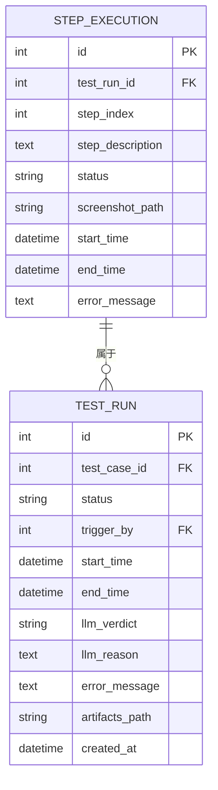
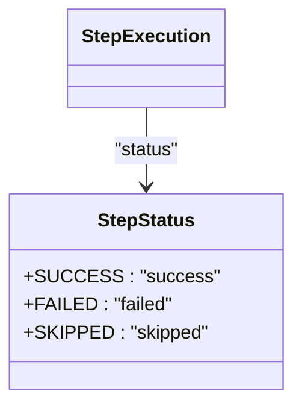
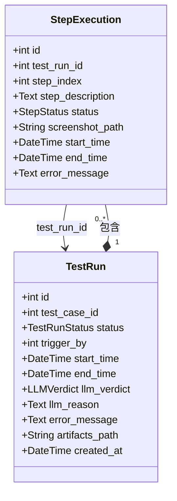

# 步骤执行记录模型

<cite>
**本文档引用文件**   
- [step_execution.py](file://backend/app/models/step_execution.py)
- [test_run.py](file://backend/app/models/test_run.py)
- [playwright_executor.py](file://backend/app/services/playwright_executor.py)
- [test_runs.py](file://backend/app/api/endpoints/test_runs.py)
- [init_db.sql](file://backend/init_db.sql)
- [TestRunDetail.vue](file://frontend/src/views/TestRunDetail.vue)
</cite>

## 目录
1. [引言](#引言)
2. [模型结构与字段定义](#模型结构与字段定义)
3. [StepStatus枚举设计](#stepstatus枚举设计)
4. [与TestRun模型的双向关系](#与testrun模型的双向关系)
5. [step_index字段的重要性](#step_index字段的重要性)
6. [screenshot_path生成规则与工件集成](#screenshot_path生成规则与工件集成)
7. [执行报告生成示例](#执行报告生成示例)
8. [数据库性能考量](#数据库性能考量)
9. [结论](#结论)

## 引言
步骤执行记录模型（StepExecution）是测试自动化平台中的核心数据实体，作为测试运行过程的原子级追踪单元，它实现了对每个测试步骤的精细化监控与记录。该模型不仅捕获了步骤的执行状态、时间戳和错误信息，还通过截图路径与工件管理系统集成，为测试结果的可视化分析提供了坚实基础。其设计充分考虑了高并发场景下的数据一致性与查询效率，是构建可靠、可追溯测试体系的关键组件。

## 模型结构与字段定义

步骤执行记录模型（StepExecution）定义了测试执行过程中每个步骤的详细信息。其核心字段包括：

- **id**: 主键，唯一标识每个步骤执行记录。
- **test_run_id**: 外键，关联所属的测试运行（TestRun），配置为级联删除，确保测试运行被删除时其所有步骤记录也随之清除。
- **step_index**: 步骤序号，用于标识步骤在测试流程中的顺序，建立索引以支持高效排序查询。
- **step_description**: 步骤的文本描述，详细说明该步骤的操作内容。
- **status**: 步骤执行状态，使用StepStatus枚举类型，确保状态值的合法性。
- **screenshot_path**: 截图文件的存储路径，指向该步骤执行后生成的屏幕快照。
- **start_time**: 步骤开始执行的时间戳，用于计算执行耗时。
- **end_time**: 步骤结束执行的时间戳，若步骤未完成则为空。
- **error_message**: 当步骤执行失败时，记录具体的错误信息。



**图源**
- [step_execution.py](file://backend/app/models/step_execution.py#L17-L32)
- [test_run.py](file://backend/app/models/test_run.py#L25-L45)

**节源**
- [step_execution.py](file://backend/app/models/step_execution.py#L17-L32)

## StepStatus枚举设计

`StepStatus` 枚举是步骤执行记录模型的核心组成部分，它通过定义一组预设的、离散的状态值，为测试执行分析提供了结构化的数据基础。该枚举包含三个状态：`SUCCESS`（成功）、`FAILED`（失败）和`SKIPPED`（跳过）。

这种设计支持更精细的执行分析，主要体现在：
1.  **精确的状态区分**：将“失败”与“跳过”明确区分开来。`FAILED`表示步骤执行过程中发生了预期外的错误，而`SKIPPED`则表示步骤因前置条件不满足或被显式跳过而未执行。这种区分对于分析测试失败的根本原因至关重要。
2.  **聚合分析能力**：在生成测试报告时，可以分别统计成功、失败和跳过的步骤数量，从而计算出更准确的通过率、失败率和覆盖率。例如，一个测试运行可能有10个步骤，其中8个成功，1个失败，1个跳过，这比简单地报告“9/10”提供了更丰富的信息。
3.  **流程控制依据**：在测试执行引擎中，`StepStatus`是决定后续步骤是否继续执行的关键。通常，一个步骤的`FAILED`状态会触发测试流程的中断，而`SKIPPED`状态则可能允许流程继续。



**图源**
- [step_execution.py](file://backend/app/models/step_execution.py#L10-L14)

**节源**
- [step_execution.py](file://backend/app/models/step_execution.py#L10-L14)

## 与TestRun模型的双向关系

`StepExecution` 模型与 `TestRun` 模型之间建立了清晰的双向关系，这构成了测试执行数据模型的骨架。

- **从StepExecution到TestRun**：通过 `test_run_id` 外键实现。每个 `StepExecution` 记录都必须属于一个 `TestRun`，这保证了数据的归属关系。在数据库层面，`ON DELETE CASCADE` 约束确保了当一个 `TestRun` 被删除时，其关联的所有 `StepExecution` 记录也会被自动清除，维护了数据的完整性。
- **从TestRun到StepExecution**：通过 SQLAlchemy 的 `relationship` 实现。在 `TestRun` 模型中，`step_executions` 字段定义了一个一对多的关系，允许通过 `test_run.step_executions` 直接访问该测试运行下的所有步骤记录。`cascade="all, delete-orphan"` 配置确保了在 ORM 层面也能正确处理级联删除和孤儿记录。

这种双向关系使得数据查询变得非常高效。例如，要获取一个测试运行的完整执行流程，只需加载 `TestRun` 实体并访问其 `step_executions` 属性，即可获得所有步骤的详细信息。



**图源**
- [step_execution.py](file://backend/app/models/step_execution.py#L32)
- [test_run.py](file://backend/app/models/test_run.py#L45)

**节源**
- [step_execution.py](file://backend/app/models/step_execution.py#L32)
- [test_run.py](file://backend/app/models/test_run.py#L45)

## step_index字段的重要性

`step_index` 字段在重构执行流程中扮演着至关重要的角色。它不仅仅是一个简单的序号，更是重建测试执行时序和逻辑的关键。

1.  **执行顺序的保证**：在测试执行过程中，步骤是按顺序执行的。`step_index` 记录了每个步骤的原始顺序。当需要从数据库中查询所有步骤时，通过 `ORDER BY step_index` 可以精确地还原出测试执行的完整流程，确保步骤的展示顺序与实际执行顺序完全一致。
2.  **流程分析的基础**：在分析测试失败时，`step_index` 帮助我们快速定位到失败发生的具体位置。例如，可以查询 `status = 'failed'` 且 `step_index = 5` 的记录，立即知道是第5个步骤导致了测试中断。这对于调试和问题排查至关重要。
3.  **支持非连续执行**：在某些复杂的测试场景中，可能会根据条件跳过某些步骤。`step_index` 的存在使得即使步骤不是连续执行的，也能正确地将它们按逻辑顺序排列，而不会因为执行时间的微小差异而错乱。

## screenshot_path生成规则与工件集成

`screenshot_path` 字段的生成遵循一套明确的规则，并与工件管理系统深度集成。

1.  **生成规则**：根据 `playwright_executor.py` 中的代码，截图的生成规则如下：
    -   截图文件存储在以测试运行ID命名的目录下，路径为 `runs/{run_id}/screenshots/`。
    -   截图文件名采用 `step_{index}.png` 的格式，其中 `{index}` 是步骤的序号。
    -   该规则确保了每个步骤的截图路径是唯一且可预测的。

2.  **工件管理系统集成**：
    -   **集中存储**：所有与测试运行相关的工件（包括截图、HAR文件、日志）都存储在 `artifacts_path` 指定的根目录下，形成了一个以测试运行ID为单位的完整工件包。
    -   **路径关联**：`StepExecution` 模型中的 `screenshot_path` 存储的是相对于工件根目录的完整路径。前端应用（如 `TestRunDetail.vue`）可以通过拼接基础URL和此路径来展示截图。
    -   **生命周期管理**：工件的生命周期与 `TestRun` 绑定。当 `TestRun` 被删除时，其对应的工件目录也会被清理，保证了存储空间的有效利用。

## 执行报告生成示例

利用 `StepExecution` 模型的数据，可以生成详尽的执行报告。

1.  **计算步骤耗时**：
    ```sql
    SELECT 
        step_index,
        step_description,
        status,
        TIMESTAMPDIFF(SECOND, start_time, end_time) AS duration_seconds
    FROM step_execution 
    WHERE test_run_id = ? 
    ORDER BY step_index;
    ```
    此查询返回每个步骤的耗时，可用于分析性能瓶颈。

2.  **聚合失败步骤统计**：
    ```sql
    SELECT 
        status,
        COUNT(*) as count,
        AVG(TIMESTAMPDIFF(SECOND, start_time, end_time)) as avg_duration
    FROM step_execution 
    WHERE test_run_id = ?
    GROUP BY status;
    ```
    此查询提供了一个高层次的视图，显示了不同状态步骤的分布和平均耗时。

3.  **生成详细报告**：前端应用（如 `TestRunDetail.vue`）通过调用 `/runs/{run_id}/steps` API 获取所有步骤数据，并结合 `screenshot_path` 和 `error_message`，以时间线的形式动态渲染出包含步骤描述、状态、截图和错误详情的交互式报告。

**节源**
- [test_runs.py](file://backend/app/api/endpoints/test_runs.py#L219-L258)
- [TestRunDetail.vue](file://frontend/src/views/TestRunDetail.vue#L50-L143)

## 数据库性能考量

在大规模并发测试下，`StepExecution` 模型面临高频写入的挑战，其数据库性能需重点考量：

1.  **索引优化**：已为 `test_run_id` 和 `step_index` 建立了索引，这极大地优化了按测试运行ID查询和按序号排序的性能。这是应对高频写入后高频读取的关键。
2.  **写入吞吐量**：每个测试运行可能包含数十甚至上百个步骤，导致短时间内产生大量写入操作。应考虑使用数据库连接池、批量插入（batch insert）等技术来提升写入效率。
3.  **表分区**：对于长期运行的系统，`step_execution` 表的数据量会非常庞大。可以考虑按时间（如按月）或按 `test_run_id` 范围进行表分区，以提高查询和维护效率。
4.  **归档策略**：对于历史数据，可以制定归档策略，将不常访问的旧数据迁移到成本更低的存储中，以保持主表的高性能。

## 结论

步骤执行记录模型（StepExecution）是整个测试自动化平台数据追踪体系的基石。它通过精细化的字段设计、严谨的枚举类型、清晰的模型关系和与工件系统的无缝集成，实现了对测试执行过程的原子级、可追溯的记录。其 `step_index` 字段确保了执行流程的可重构性，而 `screenshot_path` 则为结果分析提供了直观的视觉证据。尽管在高并发场景下面临性能挑战，但通过合理的索引和数据库优化策略，该模型能够支撑起大规模、高频率的测试需求，为生成高质量的执行报告和进行深入的测试分析提供了坚实的数据基础。