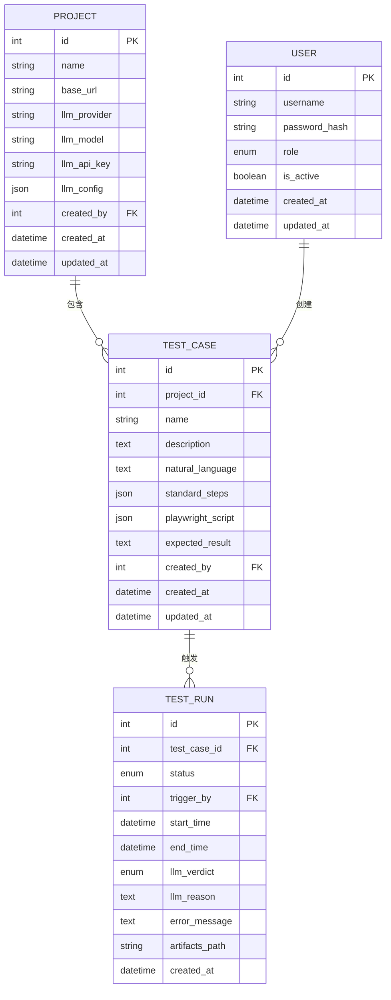
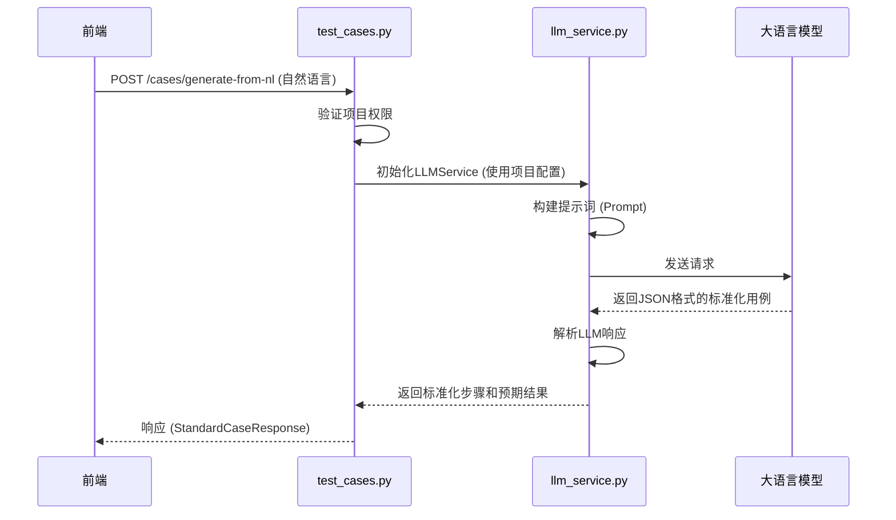

# 测试用例模型

<cite>
**Referenced Files in This Document**   
- [test_case.py](file://backend/app/models/test_case.py)
- [test_cases.py](file://backend/app/api/endpoints/test_cases.py)
- [llm_service.py](file://backend/app/services/llm_service.py)
- [test_case.py](file://backend/app/schemas/test_case.py)
</cite>

## 目录
1. [引言](#引言)
2. [字段设计详解](#字段设计详解)
3. [核心关系模型](#核心关系模型)
4. [服务层逻辑与LLM集成](#服务层逻辑与llm集成)
5. [JSON字段结构与查询优化](#json字段结构与查询优化)
6. [结论](#结论)

## 引言
`TestCase` 模型是本系统的核心数据实体，它作为连接自然语言描述与自动化测试脚本的持久化桥梁。该模型不仅存储了测试用例的元数据，更关键的是，它承载了由大语言模型（LLM）生成的、可直接用于自动化执行的结构化数据。本文档将深入剖析其设计，涵盖字段、关系、服务逻辑及最佳实践。

**Section sources**
- [test_case.py](file://backend/app/models/test_case.py#L9-L28)

## 字段设计详解
`TestCase` 模型的字段设计旨在实现从模糊的自然语言到精确的自动化脚本的完整转换链。

- **`id`**: 主键，唯一标识每个测试用例。
- **`project_id`**: 外键，关联 `Project` 模型。通过 `ForeignKey("project.id", ondelete="CASCADE")` 定义，确保当所属项目被删除时，其下的所有测试用例也会被级联删除，维护数据完整性。
- **`name`**: 用例名称，`String(200)` 类型并建立索引，便于快速检索。
- **`description`**: 用例描述，`Text` 类型，用于存储较长的说明性文本。
- **`natural_language`**: `Text` 类型，存储用户输入的原始自然语言描述，是整个自动化生成流程的起点。
- **`standard_steps`**: `JSON` 类型，存储由LLM生成的标准化步骤。这些步骤是中间产物，定义了操作的逻辑，如“点击登录按钮”、“输入用户名”等，为生成最终脚本提供依据。
- **`playwright_script`**: `JSON` 类型，存储最终生成的、可在Playwright框架下执行的脚本配置。这是自动化执行的直接输入。
- **`expected_result`**: `Text` 类型，存储对测试成功后系统状态的预期描述，用于后续的测试结果判定。
- **`created_by`**: 外键，关联 `User` 模型，记录创建该用例的用户ID。

**Section sources**
- [test_case.py](file://backend/app/models/test_case.py#L13-L20)

## 核心关系模型
`TestCase` 模型通过外键和关系映射，构建了清晰的数据关联网络。



**Diagram sources**
- [test_case.py](file://backend/app/models/test_case.py#L26-L28)
- [project.py](file://backend/app/models/project.py#L27)
- [user.py](file://backend/app/models/user.py#L32)
- [test_run.py](file://backend/app/models/test_run.py#L44)

### 与Project和User的外键关联
- **`project_id`** 字段与 `Project` 模型的 `id` 字段关联，形成“项目-用例”的一对多关系。这确保了用例的组织性和权限控制。
- **`created_by`** 字段与 `User` 模型的 `id` 字段关联，记录了用例的创建者，用于审计和权限管理。

### 与TestRun的一对多关系
`TestCase` 模型通过 `test_runs` 关系字段与 `TestRun` 模型建立了一对多关系。`relationship("TestRun", back_populates="test_case", cascade="all, delete-orphan")` 的配置意味着：
1.  一个测试用例可以触发多次测试运行（`TestRun`）。
2.  当测试用例被删除时，其所有关联的测试运行记录也会被级联删除。
3.  `delete-orphan` 确保了如果一个 `TestRun` 实例与其父 `TestCase` 的关联被移除，该 `TestRun` 也会被自动删除，防止产生孤立数据。

**Section sources**
- [test_case.py](file://backend/app/models/test_case.py#L26-L28)
- [project.py](file://backend/app/models/project.py#L27)
- [user.py](file://backend/app/models/user.py#L32)
- [test_run.py](file://backend/app/models/test_run.py#L44)

## 服务层逻辑与LLM集成
`TestCase` 模型的动态性体现在其与LLM服务的深度集成上。当 `natural_language` 字段更新时，系统会触发一系列逻辑来重新生成后续字段。



**Diagram sources**
- [test_cases.py](file://backend/app/api/endpoints/test_cases.py#L159-L196)
- [llm_service.py](file://backend/app/services/llm_service.py#L25-L50)

### 生成关系与测试回放
`standard_steps` 与 `playwright_script` 之间存在明确的生成关系：
1.  **第一阶段 (Natural Language -> Standard Steps)**: 用户输入自然语言，通过 `/cases/generate-from-nl` API 调用 `LLMService.generate_test_case_from_nl` 方法，生成结构化的 `standard_steps` 和 `expected_result`。
2.  **第二阶段 (Standard Steps -> Playwright Script)**: 系统或用户可以调用 `/cases/generate-script` API，将已有的 `standard_steps` 传递给 `LLMService.generate_playwright_script` 方法，生成最终的 `playwright_script`。

这种分阶段的生成方式至关重要：
- **解耦**: 将“理解需求”和“生成代码”两个复杂任务分离，提高了LLM调用的准确性和可控性。
- **可调试性**: `standard_steps` 作为中间产物，是可读的，便于人工审查和修改。如果最终脚本有问题，可以先检查标准化步骤是否正确。
- **测试回放**: 在测试回放时，系统直接使用 `playwright_script` 字段中的JSON配置来驱动Playwright执行器，实现了从数据到动作的直接转换。

**Section sources**
- [test_cases.py](file://backend/app/api/endpoints/test_cases.py#L159-L196)
- [llm_service.py](file://backend/app/services/llm_service.py#L25-L50)

## JSON字段结构与查询优化
`standard_steps` 和 `playwright_script` 字段的设计遵循了清晰的JSON结构。

### JSON结构设计
根据 `StandardCaseResponse` 和 `ScriptGenerationResponse` Schema，其结构如下：

```json
// standard_steps 示例
{
  "standard_steps": [
    {
      "index": 1,
      "action": "goto",
      "description": "打开登录页面",
      "selector": null,
      "value": "/login",
      "expected": null
    },
    {
      "index": 2,
      "action": "fill",
      "description": "输入用户名",
      "selector": "#username",
      "value": "testuser",
      "expected": null
    }
  ]
}

// playwright_script 示例
{
  "playwright_script": {
    "browser": "chromium",
    "viewport": { "width": 1280, "height": 720 },
    "steps": [
      {
        "index": 1,
        "action": "goto",
        "selector": null,
        "value": "https://example.com/login",
        "description": "打开登录页面",
        "screenshot": true
      }
    ]
  }
}
```

**最佳实践建议**:
1.  **明确定义**: 在文档中明确定义每个JSON字段的含义和可选值（如 `action` 的枚举类型）。
2.  **版本控制**: 考虑为JSON结构引入版本号（如 `schema_version` 字段），以便在未来进行非兼容性升级时，系统能正确处理旧数据。
3.  **Schema验证**: 在服务层对传入的JSON数据进行严格验证，确保其符合预定义的结构。

### 查询性能优化
对于 `Text` 和 `JSON` 这类大文本字段，直接的全文搜索或JSON路径查询可能性能低下。

**优化方案**:
1.  **避免在WHERE子句中使用**: 尽量避免在 `WHERE` 子句中对 `natural_language` 或 `JSON` 字段进行复杂的模式匹配（如 `LIKE '%keyword%'` 或 `JSON_EXTRACT`），这会导致全表扫描。
2.  **使用专用搜索服务**: 对于需要全文搜索 `natural_language` 字段的场景，应引入Elasticsearch等专用搜索引擎，建立倒排索引。
3.  **提取关键信息到独立字段**: 如果需要根据 `standard_steps` 中的某些信息（如是否包含 `click` 操作）进行查询，可以考虑在 `TestCase` 模型中增加一个 `has_click_action` 的布尔型字段，并在创建或更新时由服务层计算并填充，然后对此字段建立索引。
4.  **数据库JSON索引**: 利用数据库（如MySQL 5.7+）对JSON字段的路径索引功能，例如为 `standard_steps[0].action` 创建索引，以加速特定路径的查询。

**Section sources**
- [test_case.py](file://backend/app/models/test_case.py#L18-L19)
- [test_case.py](file://backend/app/schemas/test_case.py#L73-L78)
- [test_case.py](file://backend/app/schemas/test_case.py#L86-L89)

## 结论
`TestCase` 模型是本自动化测试平台的核心枢纽。它通过精心设计的字段和关系，实现了从自然语言到可执行脚本的完整转换流程。其与 `LLMService` 的紧密结合，使得测试用例的创建和维护变得智能化。理解 `standard_steps` 与 `playwright_script` 之间的生成关系，以及如何优化对大文本字段的查询，对于系统的高效运行和可扩展性至关重要。