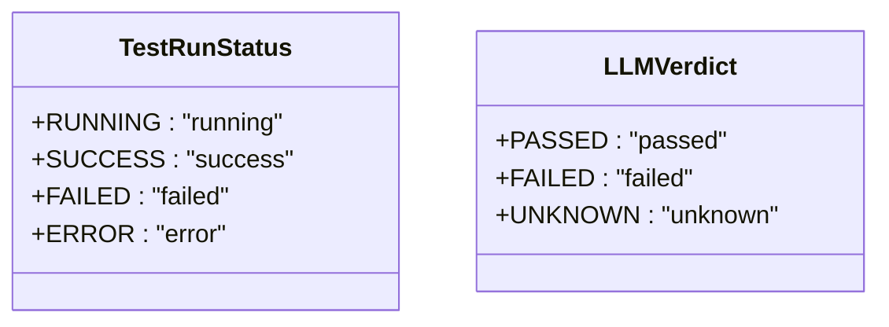
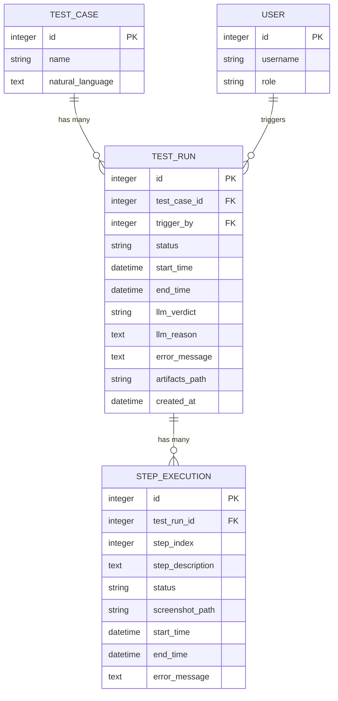
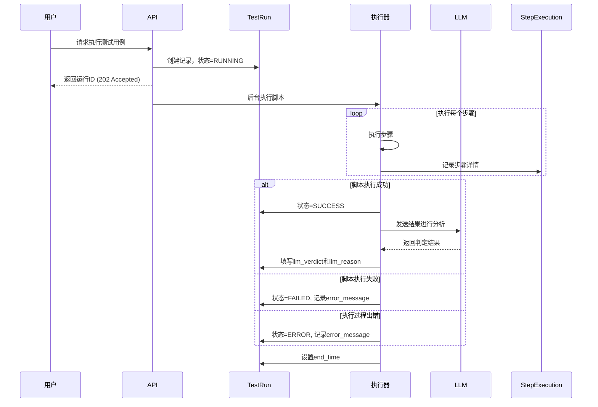

# 测试运行记录模型

<cite>
**Referenced Files in This Document**   
- [test_run.py](file://backend/app/models/test_run.py)
- [test_case.py](file://backend/app/models/test_case.py)
- [user.py](file://backend/app/models/user.py)
- [step_execution.py](file://backend/app/models/step_execution.py)
- [test_runs.py](file://backend/app/api/endpoints/test_runs.py)
</cite>

## 目录
1. [简介](#简介)
2. [核心字段详解](#核心字段详解)
3. [枚举类型设计](#枚举类型设计)
4. [模型关系](#模型关系)
5. [索引与性能](#索引与性能)
6. [状态流转与执行流程](#状态流转与执行流程)
7. [LLM判定机制](#llm判定机制)
8. [高效查询示例](#高效查询示例)

## 简介
`TestRun` 模型是测试自动化系统的核心，作为测试执行过程与结果的中央记录器。它捕获了每次测试运行的完整生命周期，从触发、执行到最终结果判定。该模型不仅记录了基本的执行元数据，还通过与大型语言模型（LLM）的集成，实现了智能化的结果分析，为测试结果的判定提供了更深层次的洞察。

## 核心字段详解

`TestRun` 模型包含以下关键字段，共同构成了测试执行的完整记录：

- **id**: 主键，唯一标识每次测试运行。
- **test_case_id**: 外键，关联到源测试用例（`TestCase`），并配置了级联删除（`ondelete="CASCADE"`），确保当测试用例被删除时，其所有历史运行记录也随之清除。
- **status**: 当前测试运行的状态，其值来自 `TestRunStatus` 枚举，是理解运行状态的核心字段。
- **trigger_by**: 外键，记录触发本次测试执行的用户（`User`）。
- **start_time**: 测试运行的开始时间，标记执行的起点。
- **end_time**: 测试运行的结束时间，与 `start_time` 共同定义了执行的时间范围。
- **llm_verdict**: 由大型语言模型（LLM）对本次测试运行整体结果的判定，其值来自 `LLMVerdict` 枚举。
- **llm_reason**: LLM 给出判定结果的理由或分析说明，提供判定的可解释性。
- **error_message**: 如果运行过程中发生错误，此字段将记录详细的错误信息。
- **artifacts_path**: 指向本次运行产生的工件（如截图、日志、视频）的存储路径。
- **created_at**: 记录创建时间，用于审计和追溯。

**Section sources**
- [test_run.py](file://backend/app/models/test_run.py#L25-L44)

## 枚举类型设计

### TestRunStatus 枚举
`TestRunStatus` 枚举定义了测试运行的四种核心状态，清晰地描述了运行的生命周期：
- **RUNNING**: 运行中。测试脚本正在被执行。
- **SUCCESS**: 成功。测试脚本执行完毕，且所有步骤均通过。
- **FAILED**: 失败。测试脚本执行完毕，但某些步骤未通过。
- **ERROR**: 错误。测试执行过程因系统或环境问题而中断，未能正常完成。

该枚举的设计意图是提供一个明确、无歧义的状态机，便于系统和用户理解测试的当前状况。

### LLMVerdict 枚举
`LLMVerdict` 枚举定义了LLM对测试结果的三种判定：
- **PASSED**: 通过。LLM分析后认为测试结果符合预期。
- **FAILED**: 失败。LLM分析后认为测试结果不符合预期。
- **UNKNOWN**: 未知。LLM无法做出明确判定，可能由于信息不足或分析失败。

该枚举的设计意图是将LLM的智能分析能力与传统的自动化测试结果解耦。即使自动化脚本执行成功（`SUCCESS`），LLM也可能根据视觉或语义分析判定为失败（`FAILED`），反之亦然。这为测试结果提供了更全面的视角。



**Diagram sources**
- [test_run.py](file://backend/app/models/test_run.py#L10-L15)
- [test_run.py](file://backend/app/models/test_run.py#L18-L22)

## 模型关系

`TestRun` 模型通过外键和关系映射，与其他核心模型紧密集成。

### 与 TestCase 的关系
`TestRun` 与 `TestCase` 之间是一对多的关系。一个 `TestCase` 可以有多个 `TestRun` 记录（即多次执行），而每个 `TestRun` 只属于一个 `TestCase`。这种关系通过 `test_case_id` 外键和 `test_case` 关系属性实现，并配置了级联删除。

### 与 User 的关系
`TestRun` 与 `User` 之间存在两种关系：
1.  **触发关系**：通过 `trigger_by` 外键和 `trigger_user` 关系属性，记录是哪个用户触发了本次测试。
2.  **创建关系**：虽然 `TestRun` 本身不直接记录创建者，但它是通过 `TestCase` 间接关联的，因为 `TestCase` 记录了 `created_by` 用户。

### 与 StepExecution 的关系
`TestRun` 与 `StepExecution` 之间是一对多的关系。一个 `TestRun` 包含多个 `StepExecution` 记录，每个记录代表测试脚本中的一个步骤的执行详情。这种关系通过 `test_run_id` 外键和 `step_executions` 关系属性实现，并配置了级联删除，确保测试运行记录被删除时，其所有步骤记录也随之清除。



**Diagram sources**
- [test_run.py](file://backend/app/models/test_run.py#L25-L44)
- [test_case.py](file://backend/app/models/test_case.py#L9-L28)
- [user.py](file://backend/app/models/user.py#L16-L32)
- [step_execution.py](file://backend/app/models/step_execution.py#L17-L32)

## 索引与性能
`start_time` 字段被创建了数据库索引（`index=True`）。这一设计的主要原因是支持基于时间范围的高效查询。例如，用户经常需要查询“过去24小时内所有失败的测试”或“本周的所有测试运行”。如果没有索引，数据库将不得不扫描整个 `test_run` 表，这在数据量大时会非常缓慢。有了索引，数据库可以快速定位到指定时间范围内的记录，极大地提升了查询性能。`status` 和 `test_case_id` 字段也拥有索引，以支持按状态和按测试用例的快速过滤。

**Section sources**
- [test_run.py](file://backend/app/models/test_run.py#L33)
- [init_db.sql](file://backend/init_db.sql#L68)

## 状态流转与执行流程
`TestRun` 的状态流转是理解测试执行流程的关键。其生命周期如下：

1.  **创建 (RUNNING)**: 当用户请求执行一个测试用例时，系统首先创建一个 `TestRun` 记录，并立即将其 `status` 设置为 `RUNNING`。此时 `start_time` 被自动记录。
2.  **执行**: 系统在后台执行测试脚本，并将每个步骤的执行情况记录到 `StepExecution` 表中。
3.  **完成与判定**:
    -   **成功路径**: 如果脚本执行成功，`status` 被更新为 `SUCCESS`。随后，系统会调用LLM服务，根据预期结果、执行截图等信息进行分析，并将 `llm_verdict` 和 `llm_reason` 填入。
    -   **失败路径**: 如果脚本执行失败（例如，某个步骤断言失败），`status` 被更新为 `FAILED`，并记录 `error_message`。
    -   **错误路径**: 如果执行过程因系统错误（如网络中断、服务不可用）而中断，`status` 被更新为 `ERROR`，并记录具体的错误信息。
4.  **结束**: 无论哪种结果，`end_time` 都会被设置为当前时间，标志着本次运行的结束。



**Diagram sources**
- [test_runs.py](file://backend/app/api/endpoints/test_runs.py#L63-L140)

## LLM判定机制
`llm_verdict` 字段在自动化判定中扮演着至关重要的角色。它代表了超越传统“通过/失败”二元判定的智能化分析。

传统的自动化测试通常只检查预设的断言点。而LLM判定机制则能进行更全面的分析：
- **视觉验证**: LLM可以分析执行过程中生成的截图，检查页面布局、元素可见性、文本内容等是否符合预期，即使这些检查未在脚本中明确定义。
- **语义理解**: LLM能够理解预期结果的自然语言描述，并将其与实际的执行结果（如控制台日志、网络请求）进行语义上的比对。
- **上下文关联**: LLM可以将多个步骤的结果关联起来，判断整体流程是否符合业务逻辑。

因此，`llm_verdict` 提供了一个更接近人工测试员判断的“智能层”。即使自动化脚本报告 `SUCCESS`，LLM 也可能因为发现了视觉或语义上的问题而判定为 `FAILED`，从而显著提高了测试的准确性和可靠性。

**Section sources**
- [test_runs.py](file://backend/app/api/endpoints/test_runs.py#L95-L124)

## 高效查询示例
得益于合理的索引设计，可以编写高效的查询来获取所需数据：

1.  **查询指定时间范围内的所有运行**:
    ```sql
    SELECT * FROM test_run 
    WHERE start_time BETWEEN '2023-10-01 00:00:00' AND '2023-10-02 00:00:00'
    ORDER BY start_time DESC;
    ```
    此查询利用 `idx_start_time` 索引，速度极快。

2.  **查询某个测试用例的所有失败运行**:
    ```sql
    SELECT * FROM test_run 
    WHERE test_case_id = 123 AND status = 'failed';
    ```
    此查询可以利用 `test_case_id` 和 `status` 的复合索引（或分别使用各自的索引）。

3.  **查询最近100次运行的概览**:
    ```sql
    SELECT id, test_case_id, status, start_time, llm_verdict 
    FROM test_run 
    ORDER BY start_time DESC 
    LIMIT 100;
    ```
    此查询利用 `start_time` 索引进行高效排序。

**Section sources**
- [init_db.sql](file://backend/init_db.sql#L70-L76)