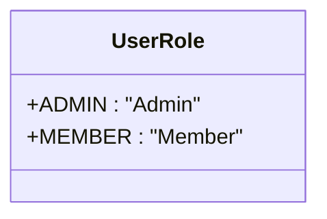
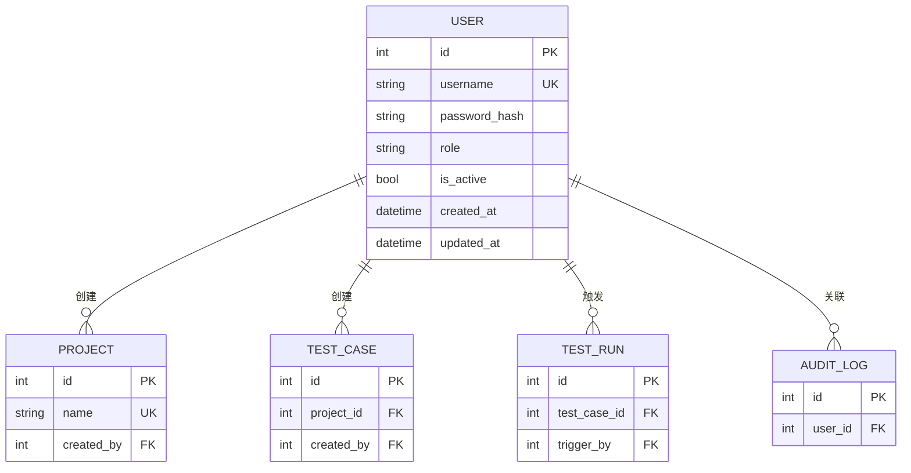
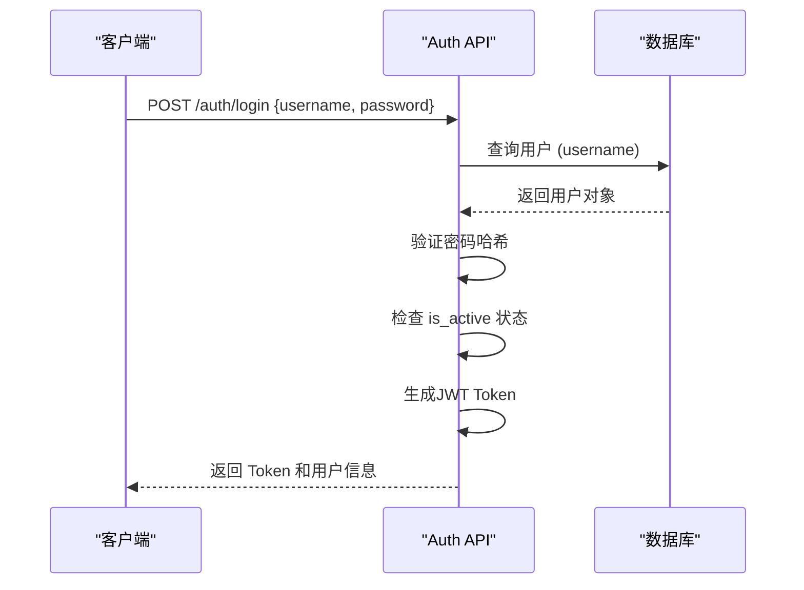

# 用户模型

<cite>
**Referenced Files in This Document**   
- [user.py](file://backend/app/models/user.py)
- [auth.py](file://backend/app/api/endpoints/auth.py)
- [project.py](file://backend/app/models/project.py)
- [test_case.py](file://backend/app/models/test_case.py)
- [test_run.py](file://backend/app/models/test_run.py)
- [audit_log.py](file://backend/app/models/audit_log.py)
</cite>

## 目录
1. [简介](#简介)
2. [核心字段定义](#核心字段定义)
3. [UserRole 枚举类型](#userrole-枚举类型)
4. [模型关系映射](#模型关系映射)
5. [数据操作与权限验证](#数据操作与权限验证)
6. [性能优化建议](#性能优化建议)

## 简介
用户模型（User）是本系统身份认证与权限控制的核心实体，定义于 `backend/app/models/user.py` 文件中。该模型不仅存储用户的基本身份信息，还通过角色枚举和状态字段实现细粒度的权限管理，并与项目、测试用例、测试运行及审计日志等核心功能模块建立了紧密的关系映射。作为系统中所有操作的发起者，用户模型是保障数据安全和操作可追溯性的基石。

**Section sources**
- [user.py](file://backend/app/models/user.py#L16-L32)

## 核心字段定义
用户模型包含以下核心字段，每个字段的设计都服务于特定的业务和安全需求。

### id (主键自增)
`id` 字段是用户的唯一标识符，作为数据库表的主键。它采用自增整数类型（Integer），并建立了数据库索引以确保查询效率。此字段由数据库自动生成，应用程序无需手动指定。

### username (唯一用户名)
`username` 字段存储用户的登录名，其设计遵循了严格的安全和性能规范：
- **类型与长度**：`String(50)`，限制用户名长度不超过50个字符。
- **唯一性**：通过 `unique=True` 约束，确保系统中不存在重复的用户名。
- **索引**：通过 `index=True` 建立数据库索引，极大优化了基于用户名的查询速度，这对于登录认证等高频操作至关重要。

### password_hash (密码哈希存储)
`password_hash` 字段用于安全地存储用户密码的哈希值，而非明文密码。
- **安全实践**：系统在用户注册或修改密码时，会使用加密算法（如bcrypt）对原始密码进行哈希处理，然后将哈希值存入此字段。
- **长度**：`String(255)` 提供了足够的空间来存储复杂的哈希字符串。
- **非空**：`nullable=False` 强制要求每个用户都必须设置密码。

### role (角色枚举)
`role` 字段定义了用户在系统中的权限级别，其值来源于 `UserRole` 枚举类型。该字段在数据库中被定义为枚举类型（Enum），并通过 `index=True` 建立索引，以便快速进行基于角色的权限查询。

### is_active (账户激活状态)
`is_active` 字段是一个布尔值，用于标识用户账户的激活状态。
- **默认值**：`default=True` 表示新创建的用户默认是激活的。
- **权限控制**：该字段是权限验证的关键。在用户登录时，系统会检查此字段，若为 `False`，则拒绝登录，实现对用户账户的禁用功能。

### created_at 和 updated_at (时间戳)
这两个字段记录了用户记录的生命周期时间点。
- **created_at**：记录用户创建的时间，使用 `datetime.utcnow` 作为默认值。
- **updated_at**：记录用户信息最后一次更新的时间。其特殊之处在于 `onupdate=datetime.utcnow`，这意味着每当该用户的任何信息被修改时，数据库会自动更新此字段的时间戳。

**Section sources**
- [user.py](file://backend/app/models/user.py#L20-L25)
- [user.py](file://backend/app/models/user.py#L26-L27)
- [user.py](file://backend/app/models/user.py#L24-L25)

## UserRole 枚举类型
`UserRole` 是一个继承自 `str` 和 `enum.Enum` 的Python枚举类，定义了系统中用户可拥有的两种角色。



**Diagram sources**
- [user.py](file://backend/app/models/user.py#L10-L13)

### 枚举定义
```python
class UserRole(str, enum.Enum):
    ADMIN = "Admin"
    MEMBER = "Member"
```
- **字符串枚举**：继承 `str` 使得枚举值可以直接作为字符串使用，方便与数据库和API交互。
- **枚举值**：`ADMIN` 和 `MEMBER` 的值分别为 `"Admin"` 和 `"Member"`，这些字符串将被存储在数据库中。

### 在权限控制中的应用
`UserRole` 枚举是实现基于角色的访问控制（RBAC）的基础。
- **权限区分**：`ADMIN` 角色的用户通常拥有系统的所有权限，如创建/删除项目、管理其他用户等；而 `MEMBER` 角色的用户则拥有有限的权限，如创建和运行测试用例。
- **代码中的使用**：在业务逻辑中，可以通过比较 `user.role == UserRole.ADMIN` 来判断用户是否具有管理员权限，从而决定是否允许执行敏感操作。

**Section sources**
- [user.py](file://backend/app/models/user.py#L10-L13)
- [auth.py](file://backend/app/api/endpoints/auth.py#L15-L27)

## 模型关系映射
用户模型通过SQLAlchemy的 `relationship` 功能，与其他核心模型建立了清晰的一对多关系，体现了用户作为系统操作主体的核心地位。



**Diagram sources**
- [user.py](file://backend/app/models/user.py#L29-L32)
- [project.py](file://backend/app/models/project.py#L24)
- [test_case.py](file://backend/app/models/test_case.py#L25)
- [test_run.py](file://backend/app/models/test_run.py#L41)
- [audit_log.py](file://backend/app/models/audit_log.py#L20)

### created_projects (一对多，指向 Project.created_by)
此关系表示一个用户可以创建多个项目。
- **反向引用**：`back_populates="creator"` 指向 `Project` 模型中的 `creator` 关系。
- **外键**：`foreign_keys="Project.created_by"` 明确指定了关联的外键字段，避免了在存在多个用户外键时的歧义。

### created_test_cases (一对多，指向 TestCase.created_by)
此关系表示一个用户可以创建多个测试用例。
- **逻辑**：与 `created_projects` 类似，它将用户与由其创建的测试用例关联起来。

### triggered_test_runs (一对多，指向 TestRun.trigger_by)
此关系表示一个用户可以触发（启动）多次测试运行。
- **语义**：`triggered_test_runs` 比 `created_test_runs` 更能准确描述用户与测试运行的关系，因为测试运行是由用户主动触发的。

### audit_logs (审计日志关联)
此关系将用户与系统生成的审计日志条目关联起来。
- **重要性**：这是实现操作可追溯性的关键。系统中的每一次重要操作（如创建项目、修改配置）都会生成一条审计日志，记录操作者（`user_id`）、操作类型、目标资源等信息。

**Section sources**
- [user.py](file://backend/app/models/user.py#L29-L32)
- [project.py](file://backend/app/models/project.py#L24)
- [test_case.py](file://backend/app/models/test_case.py#L25)
- [test_run.py](file://backend/app/models/test_run.py#L41)
- [audit_log.py](file://backend/app/models/audit_log.py#L20)

## 数据操作与权限验证
本节说明如何通过SQLAlchemy ORM进行用户数据的常见操作，并结合代码示例解释权限验证流程。

### 用户创建
创建新用户通常在注册流程中完成。首先，使用 `UserCreate` Schema 接收用户输入，然后对密码进行哈希处理，最后将 `User` 模型实例添加到数据库会话中。

### 用户查询
最常见的查询是根据用户名查找用户，这在登录认证中被频繁使用。例如，在 `auth.py` 的 `login` 函数中，使用 `db.query(User).filter(User.username == user_login.username).first()` 来获取用户对象。



**Diagram sources**
- [auth.py](file://backend/app/api/endpoints/auth.py#L15-L55)

### 权限验证
完整的权限验证流程包含多个步骤：
1.  **存在性验证**：检查用户名是否存在。
2.  **密码验证**：使用 `verify_password` 工具函数比对输入密码的哈希值与数据库存储的 `password_hash`。
3.  **状态验证**：检查 `is_active` 字段是否为 `True`。
4.  **角色验证**：对于特定API，检查 `role` 字段是否具有执行该操作的权限。

**Section sources**
- [auth.py](file://backend/app/api/endpoints/auth.py#L15-L55)

## 性能优化建议
在使用用户模型时，应注意以下性能问题以确保系统高效运行。

### 索引利用
- **已优化**：`username`、`role` 和 `is_active` 字段均已建立数据库索引，确保了 `WHERE` 子句查询的高效性。
- **建议**：在进行复杂的组合查询时（例如 `WHERE role='Admin' AND is_active=True`），应考虑创建复合索引以进一步提升性能。

### 关系加载策略
当查询用户并需要同时获取其关联数据（如创建的项目列表）时，应谨慎选择加载策略以避免N+1查询问题。
- **`selectinload`**：推荐用于获取用户及其所有创建的项目。它会生成一个额外的 `IN` 查询来批量加载所有相关项目，适合关联数据量中等的情况。
- **`joinedload`**：适合在需要将用户与少量关联数据（如审计日志的最新几条）进行连接查询时使用。但对于一对多关系，如果关联数据量大，可能会导致结果集膨胀，应避免使用。

**Section sources**
- [user.py](file://backend/app/models/user.py#L21-L23)
- [user.py](file://backend/app/models/user.py#L29-L32)