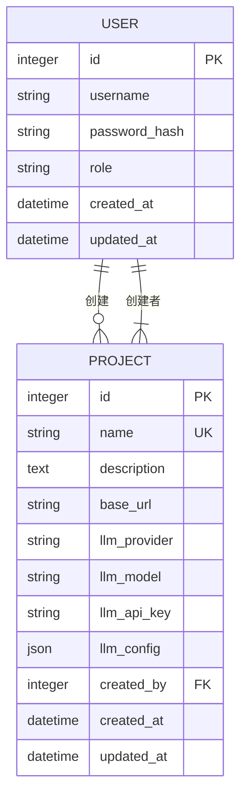
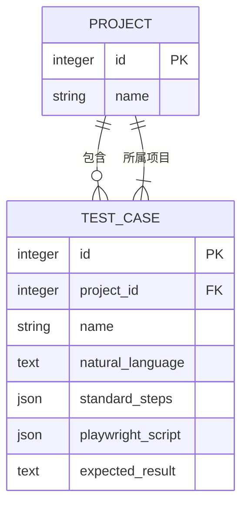

# 项目模型

<cite>
**Referenced Files in This Document**   
- [project.py](file://backend/app/models/project.py)
- [llm_service.py](file://backend/app/services/llm_service.py)
- [encryption.py](file://backend/app/utils/encryption.py)
- [projects.py](file://backend/app/api/endpoints/projects.py)
</cite>

## 目录
1. [引言](#引言)
2. [核心字段解析](#核心字段解析)
3. [时间戳自动管理](#时间戳自动管理)
4. [模型关系](#模型关系)
5. [LLM配置与多提供商支持](#llm配置与多提供商支持)
6. [base_url在测试执行中的作用](#base_url在测试执行中的作用)
7. [数据操作与安全](#数据操作与安全)
8. [高并发环境下的唯一性约束](#高并发环境下的唯一性约束)
9. [结论](#结论)

## 引言
`Project` 模型是本测试平台的核心组织单元，它不仅定义了被测应用的基本信息，还集成了用于生成和分析测试的大型语言模型（LLM）配置。每个项目都包含一组相关的测试用例（`TestCase`），并由特定的用户（`User`）创建。本文档将深入解析该模型的各个组成部分，阐明其在系统架构中的关键作用。

## 核心字段解析

`Project` 模型包含以下关键字段，每个字段都承载着特定的业务含义：

- **id**: 主键，作为项目的唯一标识符，由数据库自增生成。
- **name**: 项目名称，被定义为唯一（`unique=True`）且带索引（`index=True`），确保了项目名称的全局唯一性，便于通过名称快速检索。
- **description**: 项目的描述性文本，用于记录项目的详细信息或备注。
- **base_url**: 被测应用的基础URL。所有属于该项目的测试用例都将基于此URL进行导航和执行，是测试自动化执行的起点。
- **llm_provider**: 指定所使用的LLM提供商，如 `openai` 或 `anthropic`，实现了对不同AI服务的灵活切换。
- **llm_model**: 指定具体的LLM模型名称，例如 `gpt-4` 或 `claude-3-opus`。
- **llm_api_key**: 存储访问LLM提供商API所需的密钥。出于安全考虑，该字段在存储前会进行加密。
- **llm_config**: 一个JSON格式的字段，用于存储额外的LLM配置参数，如 `temperature` 和 `max_tokens`，提供了对模型行为的细粒度控制。
- **created_by**: 外键，关联到 `User` 模型的 `id` 字段，标识了该项目的创建者。

**Section sources**
- [project.py](file://backend/app/models/project.py#L13-L21)

## 时间戳自动管理

`Project` 模型通过 `created_at` 和 `updated_at` 两个字段来自动追踪项目的生命周期。

- **created_at**: 记录项目创建的时间。其值由数据库在记录插入时自动设置为 `datetime.utcnow()`，确保了创建时间的准确性和一致性。
- **updated_at**: 记录项目最后一次更新的时间。该字段不仅在创建时设置为当前时间，更重要的是，通过 `onupdate=datetime.utcnow` 参数，每当项目记录被更新时，数据库会自动将其值刷新为当前时间，无需在应用代码中手动维护。

这种自动管理机制减轻了开发者的负担，并保证了时间戳数据的可靠性。

**Section sources**
- [project.py](file://backend/app/models/project.py#L22-L23)

## 模型关系

`Project` 模型与其他核心模型建立了明确的关系，构成了系统的数据骨架。

### 与User模型的双向关系

`Project` 与 `User` 模型之间存在双向关系：
- **多对一 (creator)**: 通过 `created_by` 外键，多个项目可以归属于同一个用户。在 `Project` 模型中，`creator` 关系字段定义了这种联系，允许通过项目实例访问其创建者用户。
- **一对多 (created_projects)**: 在 `User` 模型中，`created_projects` 关系字段维护了该用户创建的所有项目的列表。这实现了从用户到其所有项目的反向导航。

**Diagram sources**
- [project.py](file://backend/app/models/project.py#L26)
- [user.py](file://backend/app/models/user.py#L32)

### 与TestCase模型的一对多关系

`Project` 与 `TestCase` 模型之间是一对多关系：
- **一对多 (test_cases)**: 一个项目可以包含多个测试用例。`Project` 模型中的 `test_cases` 关系字段定义了这种联系。
- **级联删除**: 该关系配置了 `cascade="all, delete-orphan"`，这意味着当一个项目被删除时，其下的所有测试用例将被数据库自动级联删除，确保了数据的完整性。

**Diagram sources**
- [project.py](file://backend/app/models/project.py#L27)
- [test_case.py](file://backend/app/models/test_case.py#L9)

## LLM配置与多提供商支持

`Project` 模型的LLM配置字段是实现AI驱动测试的核心。`llm_provider` 和 `llm_model` 字段允许为每个项目独立配置不同的AI服务。

在 `LLMService` 类中，根据 `Project` 实例提供的 `provider` 和 `model` 信息，会初始化相应的客户端（如OpenAI或Anthropic）。这使得系统能够灵活地支持多种LLM提供商，用户可以根据成本、性能或功能需求为不同项目选择最合适的AI模型。

**Section sources**
- [llm_service.py](file://backend/app/services/llm_service.py#L10-L20)

## base_url在测试执行中的作用

`base_url` 字段在测试执行流程中扮演着至关重要的角色。当系统需要从自然语言描述生成测试用例时，`base_url` 会被作为上下文信息传递给LLM。

例如，在 `generate_case_from_nl` API端点中，`base_url` 被明确地包含在发送给LLM的提示词（prompt）中，指导LLM生成与特定应用环境相匹配的、包含正确URL的测试步骤。这确保了生成的测试用例具有实际可执行性。

**Section sources**
- [llm_service.py](file://backend/app/services/llm_service.py#L141-L150)

## 数据操作与安全

在创建或更新项目时，涉及敏感数据的操作需要特别注意。

- **LLM密钥加密**: 当通过API更新 `llm_api_key` 时，后端服务会调用 `encrypt_api_key` 函数对明文密钥进行加密，然后再存入数据库。同样，在使用密钥调用LLM API前，会通过 `decrypt_api_key` 函数进行解密。这一过程保证了API密钥在存储和传输过程中的安全性。
- **数据操作示例**: 创建一个新项目时，前端会收集项目名称、描述、`base_url` 以及LLM配置信息，并通过 `POST /api/projects` 接口提交。后端验证数据并创建 `Project` 实例，自动设置 `created_at` 和 `updated_at`，并将加密后的API密钥保存到数据库。

**Section sources**
- [projects.py](file://backend/app/api/endpoints/projects.py#L108-L110)
- [encryption.py](file://backend/app/utils/encryption.py#L15-L29)

## 高并发环境下的唯一性约束

项目名称的唯一性（`unique=True`）是通过数据库层面的唯一索引来强制执行的。在高并发场景下，多个请求可能同时尝试创建同名项目。

虽然应用层在更新项目时会进行名称冲突检查，但最可靠的保障来自于数据库的唯一约束。当两个并发请求试图插入相同名称的项目时，数据库会拒绝第二个插入操作并抛出唯一性约束违反的异常。应用层需要捕获此异常并返回适当的错误信息（如HTTP 400），从而确保了在任何情况下项目名称的全局唯一性。

**Section sources**
- [project.py](file://backend/app/models/project.py#L14)
- [init_db.sql](file://backend/init_db.sql#L15)

## 结论
`Project` 模型作为测试用例的组织核心，其设计充分考虑了功能性、安全性和可扩展性。它不仅管理着被测应用的元数据，还通过集成LLM配置，为AI驱动的测试自动化提供了坚实的基础。其与 `User` 和 `TestCase` 模型的清晰关系，以及对时间戳和敏感数据的妥善处理，共同构建了一个健壮、可靠且易于维护的测试平台数据层。