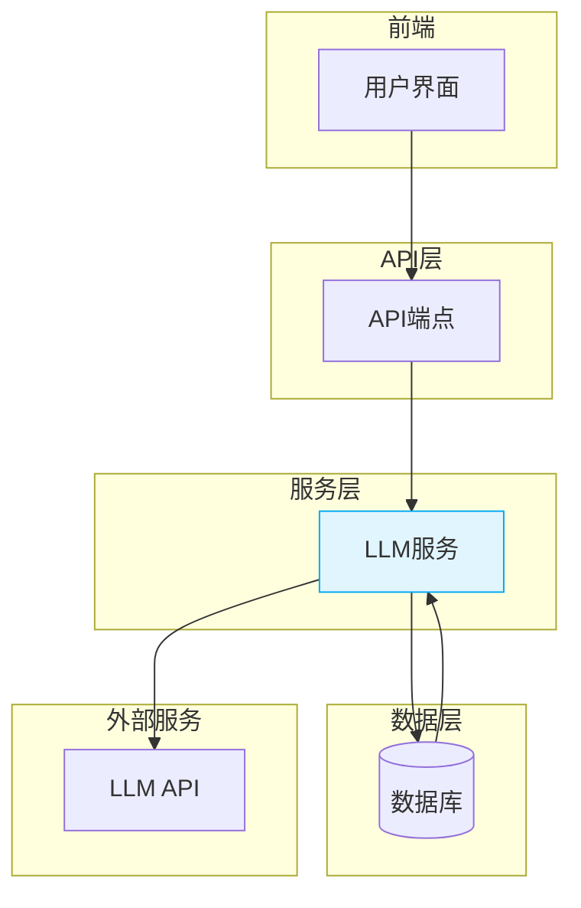
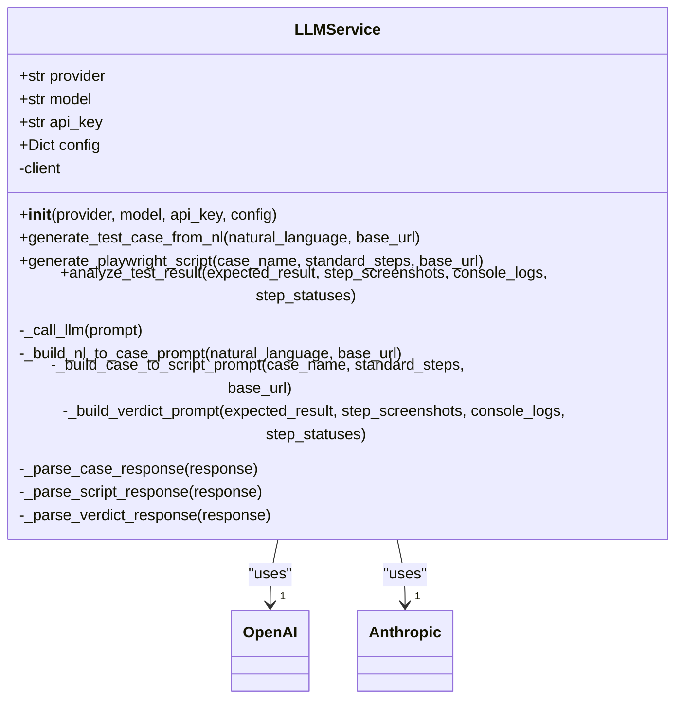
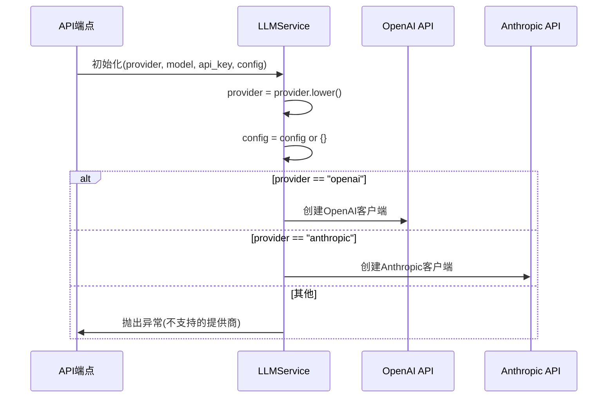
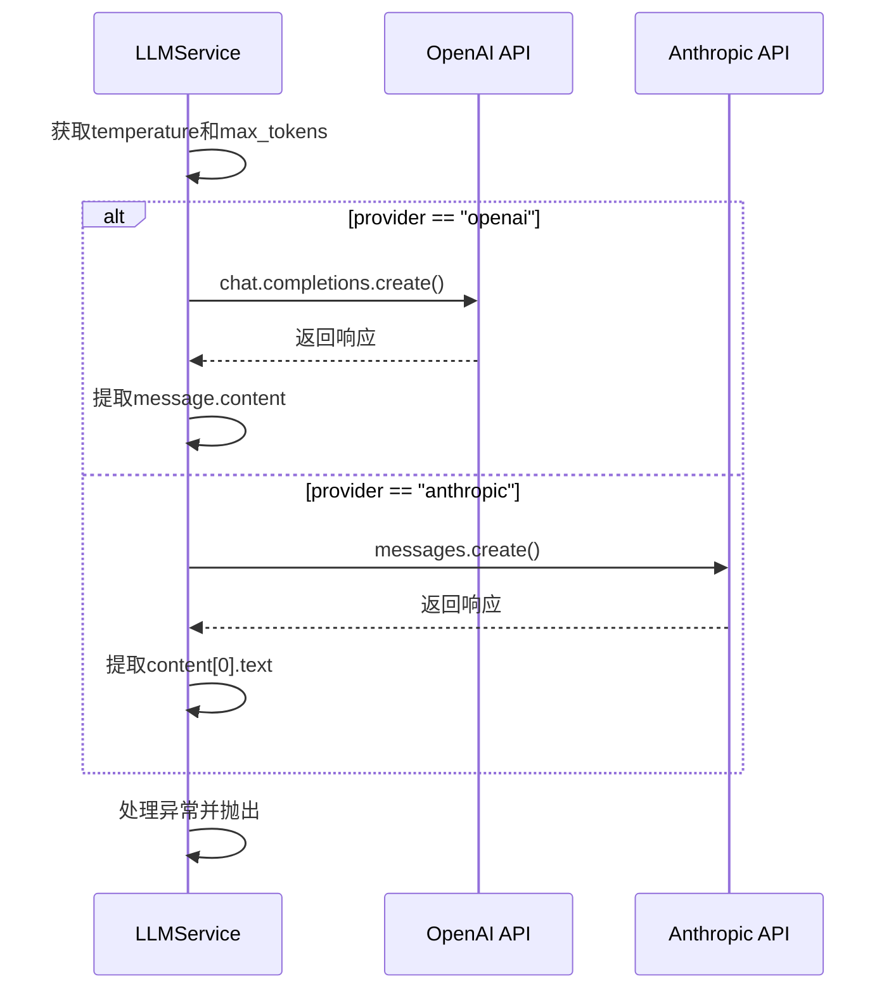
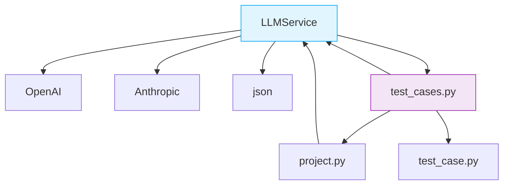

# LLM服务

<cite>
**Referenced Files in This Document**   
- [llm_service.py](file://backend/app/services/llm_service.py)
- [test_cases.py](file://backend/app/api/endpoints/test_cases.py)
- [project.py](file://backend/app/models/project.py)
- [test_case.py](file://backend/app/schemas/test_case.py)
- [config.py](file://backend/app/config.py)
</cite>

## 目录
1. [简介](#简介)
2. [核心组件](#核心组件)
3. [架构概述](#架构概述)
4. [详细组件分析](#详细组件分析)
5. [依赖分析](#依赖分析)
6. [性能考虑](#性能考虑)
7. [故障排除指南](#故障排除指南)
8. [结论](#结论)

## 简介
LLM服务是自动化测试平台的核心组件，负责将自然语言描述转换为可执行的测试用例和Playwright脚本。该服务通过大语言模型（LLM）实现智能化的测试生成与结果分析，支持OpenAI和Anthropic等主流LLM提供商。服务采用模块化设计，通过清晰的接口与API端点、数据库模型和配置系统集成，为测试自动化提供强大的AI支持。

## 核心组件
LLM服务的核心功能包括：根据LLM提供商初始化客户端、将自然语言转换为标准化测试用例、将标准化步骤生成Playwright可执行脚本、分析测试执行结果并给出智能判定。服务通过依赖注入获取项目特定的LLM配置，并实现了完善的异常处理与响应解析机制，确保在各种场景下的稳定运行。

**Section sources**
- [llm_service.py](file://backend/app/services/llm_service.py#L9-L325)

## 架构概述
LLM服务作为业务逻辑层，连接API端点与外部LLM API，形成清晰的三层架构。服务通过配置化的提示词工程实现不同任务的转换，并采用统一的响应解析策略处理LLM输出。



**Diagram sources **
- [llm_service.py](file://backend/app/services/llm_service.py#L9-L325)
- [test_cases.py](file://backend/app/api/endpoints/test_cases.py#L1-L246)

**Section sources**
- [llm_service.py](file://backend/app/services/llm_service.py#L9-L325)
- [test_cases.py](file://backend/app/api/endpoints/test_cases.py#L1-L246)

## 详细组件分析
LLM服务的实现围绕核心类LLMService展开，该类封装了与LLM交互的所有逻辑，包括客户端初始化、提示词构建、API调用和响应解析。

### LLMService类分析
LLMService类是服务的核心实现，采用面向对象设计，通过私有方法封装不同功能模块，提供清晰的公共接口。

#### 类结构与关系


**Diagram sources **
- [llm_service.py](file://backend/app/services/llm_service.py#L9-L325)

**Section sources**
- [llm_service.py](file://backend/app/services/llm_service.py#L9-L325)

### 初始化与配置管理
LLMService的初始化过程根据指定的提供商动态创建相应的客户端实例，并管理配置参数的传递。



**Diagram sources **
- [llm_service.py](file://backend/app/services/llm_service.py#L12-L33)

**Section sources**
- [llm_service.py](file://backend/app/services/llm_service.py#L12-L33)

### 自然语言到测试用例转换
该功能通过构建结构化提示词，引导LLM将自然语言描述转换为标准化的测试用例JSON格式。

```mermaid
flowchart TD
Start([generate_test_case_from_nl]) --> BuildPrompt["构建_nl_to_case_prompt"]
BuildPrompt --> CallLLM["调用_call_llm"]
CallLLM --> ParseResponse["解析_parse_case_response"]
ParseResponse --> End([返回标准化测试用例])
Note over BuildPrompt,ParseResponse: 提示词包含被测站点、<br/>自然语言描述和JSON格式要求
```

**Diagram sources **
- [llm_service.py](file://backend/app/services/llm_service.py#L35-L48)
- [llm_service.py](file://backend/app/services/llm_service.py#L121-L189)

**Section sources**
- [llm_service.py](file://backend/app/services/llm_service.py#L35-L48)
- [llm_service.py](file://backend/app/services/llm_service.py#L121-L189)

### 测试用例到Playwright脚本转换
该功能将标准化的测试步骤转换为Playwright可执行的脚本配置，包括浏览器类型、视口尺寸和具体操作。

```mermaid
flowchart TD
Start([generate_playwright_script]) --> BuildPrompt["构建_case_to_script_prompt"]
BuildPrompt --> CallLLM["调用_call_llm"]
CallLLM --> ParseResponse["解析_parse_script_response"]
ParseResponse --> End([返回Playwright脚本])
Note over BuildPrompt: 提示词包含用例名称、<br/>标准化步骤和Playwright操作映射
```

**Diagram sources **
- [llm_service.py](file://backend/app/services/llm_service.py#L50-L69)
- [llm_service.py](file://backend/app/services/llm_service.py#L191-L252)

**Section sources**
- [llm_service.py](file://backend/app/services/llm_service.py#L50-L69)
- [llm_service.py](file://backend/app/services/llm_service.py#L191-L252)

### 测试结果分析
该功能结合预期结果、执行状态、日志和截图，利用LLM进行智能判定，返回置信度和详细理由。

```mermaid
flowchart TD
Start([analyze_test_result]) --> BuildPrompt["构建_verdict_prompt"]
BuildPrompt --> CallLLM["调用_call_llm"]
CallLLM --> ParseResponse["解析_parse_verdict_response"]
ParseResponse --> End([返回判定结果])
Note over BuildPrompt: 提示词包含预期结果、<br/>执行状态、日志和判定规则
```

**Diagram sources **
- [llm_service.py](file://backend/app/services/llm_service.py#L71-L92)
- [llm_service.py](file://backend/app/services/llm_service.py#L254-L299)

**Section sources**
- [llm_service.py](file://backend/app/services/llm_service.py#L71-L92)
- [llm_service.py](file://backend/app/services/llm_service.py#L254-L299)

### LLM调用与响应解析
服务实现了统一的LLM调用和响应解析机制，支持多种LLM提供商和容错处理。



**Diagram sources **
- [llm_service.py](file://backend/app/services/llm_service.py#L94-L119)

**Section sources**
- [llm_service.py](file://backend/app/services/llm_service.py#L94-L119)

## 依赖分析
LLM服务与项目配置、测试用例模型和API端点紧密耦合，通过依赖注入获取运行时配置。



**Diagram sources **
- [llm_service.py](file://backend/app/services/llm_service.py#L1-L326)
- [test_cases.py](file://backend/app/api/endpoints/test_cases.py#L1-L246)
- [project.py](file://backend/app/models/project.py#L1-L28)
- [test_case.py](file://backend/app/schemas/test_case.py#L1-L89)

**Section sources**
- [llm_service.py](file://backend/app/services/llm_service.py#L1-L326)
- [test_cases.py](file://backend/app/api/endpoints/test_cases.py#L1-L246)
- [project.py](file://backend/app/models/project.py#L1-L28)
- [test_case.py](file://backend/app/schemas/test_case.py#L1-L89)

## 性能考虑
LLM服务的性能主要受LLM API调用延迟影响。建议通过合理设置max_tokens和temperature参数来平衡响应质量和性能。对于高并发场景，应考虑实现缓存机制以减少重复的LLM调用。

## 故障排除指南
常见问题包括LLM API调用失败、响应解析错误和提供商不支持。应检查API密钥有效性、网络连接和提示词格式。对于JSON解析错误，可检查LLM响应是否包含有效的```json```代码块。

**Section sources**
- [llm_service.py](file://backend/app/services/llm_service.py#L94-L119)
- [llm_service.py](file://backend/app/services/llm_service.py#L301-L317)

## 结论
LLM服务成功实现了自然语言到自动化测试的智能转换，通过模块化设计和清晰的接口定义，为测试自动化提供了强大的AI支持。服务的可扩展架构支持多种LLM提供商，并通过完善的错误处理和响应解析机制确保了可靠性。