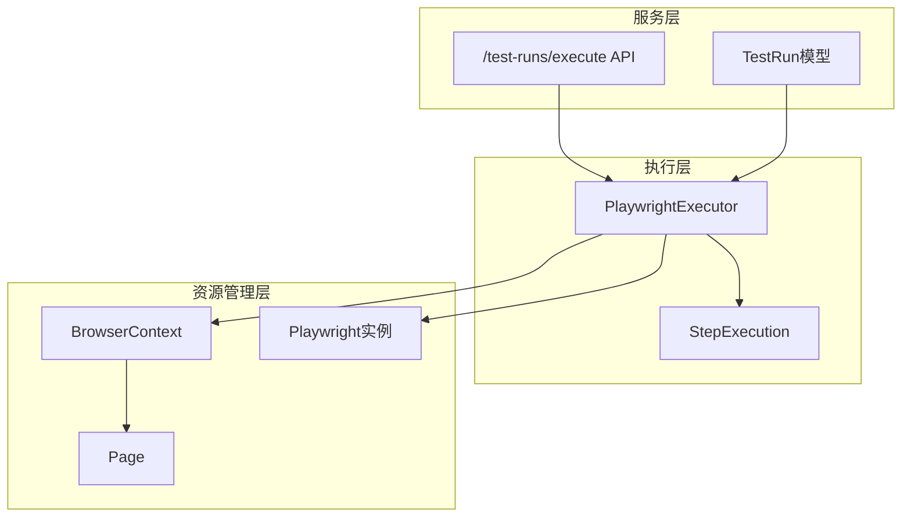
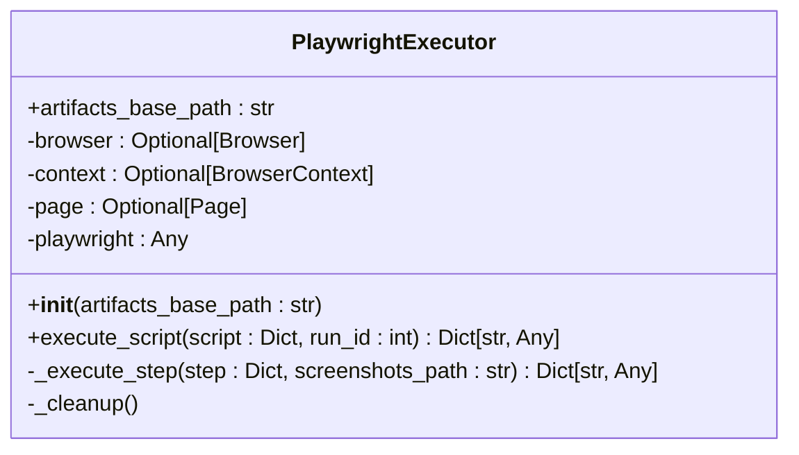
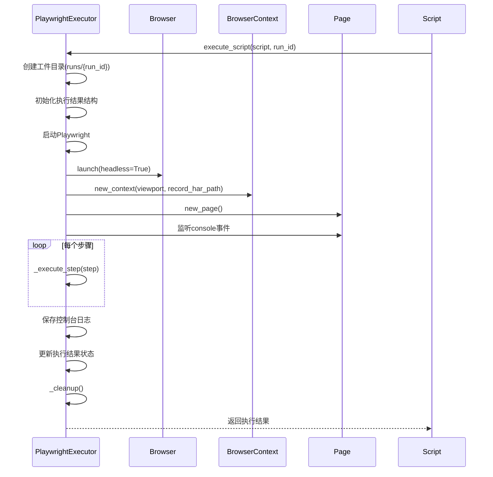
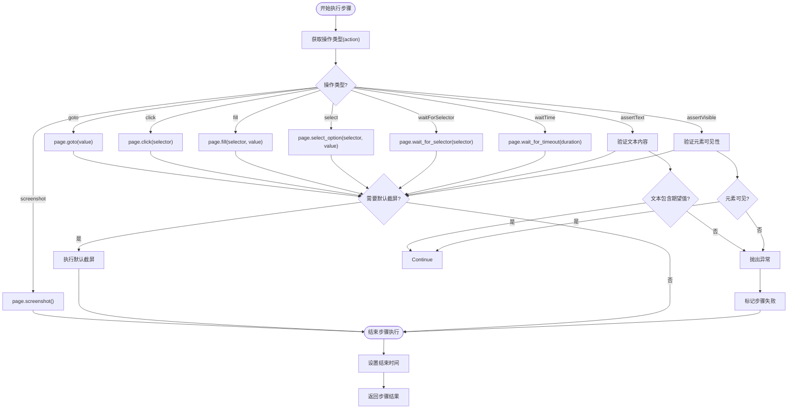
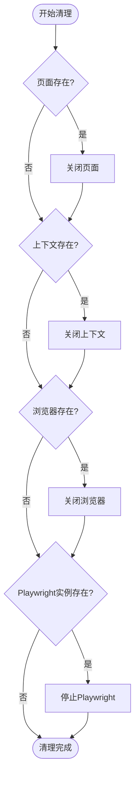
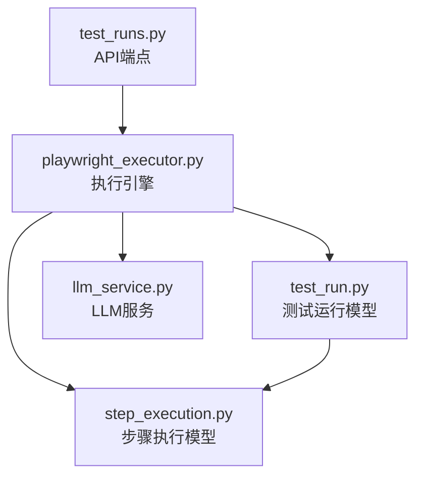

# Playwright执行引擎

<cite>
**Referenced Files in This Document**   
- [playwright_executor.py](file://backend/app/services/playwright_executor.py)
- [test_runs.py](file://backend/app/api/endpoints/test_runs.py)
- [test_run.py](file://backend/app/models/test_run.py)
- [step_execution.py](file://backend/app/models/step_execution.py)
</cite>

## 目录
1. [简介](#简介)
2. [核心组件](#核心组件)
3. [架构概览](#架构概览)
4. [详细组件分析](#详细组件分析)
5. [依赖分析](#依赖分析)
6. [性能考量](#性能考量)
7. [故障排查指南](#故障排查指南)
8. [结论](#结论)

## 简介
Playwright执行引擎是自动化测试系统的核心组件，负责执行基于Playwright的浏览器自动化脚本。该引擎通过`PlaywrightExecutor`类实现，提供了完整的浏览器自动化执行能力，包括环境初始化、脚本执行、资源管理和结果收集等功能。引擎设计注重稳定性、可追溯性和资源效率，确保自动化测试的可靠执行。

## 核心组件
`PlaywrightExecutor`类是Playwright执行引擎的核心，封装了浏览器自动化执行的完整生命周期。该类通过`__init__`方法接收工件存储基础路径并初始化执行环境，通过`execute_script`方法执行完整的测试脚本，通过`_execute_step`方法处理单个操作步骤，并通过`_cleanup`方法确保资源的正确释放。

**Section sources**
- [playwright_executor.py](file://backend/app/services/playwright_executor.py#L11-L213)

## 架构概览
Playwright执行引擎采用分层架构设计，从上到下分为服务层、执行层和资源管理层。服务层负责与外部系统交互，执行层负责具体的浏览器操作，资源管理层负责Playwright实例和浏览器资源的生命周期管理。

**Diagram sources **
- [playwright_executor.py](file://backend/app/services/playwright_executor.py#L11-L213)
- [test_runs.py](file://backend/app/api/endpoints/test_runs.py#L20-L120)

**Section sources**
- [playwright_executor.py](file://backend/app/services/playwright_executor.py#L11-L213)
- [test_runs.py](file://backend/app/api/endpoints/test_runs.py#L20-L120)

## 详细组件分析
### PlaywrightExecutor类分析
`PlaywrightExecutor`类实现了完整的浏览器自动化执行机制，通过一系列方法协同工作，确保测试脚本的可靠执行。

#### 初始化机制
`__init__`方法接收`artifacts_base_path`参数，用于指定工件存储的基础路径。该方法初始化了执行器的状态，包括浏览器、上下文、页面和Playwright实例的引用，为后续的脚本执行做好准备。

**Diagram sources **
- [playwright_executor.py](file://backend/app/services/playwright_executor.py#L14-L25)

**Section sources**
- [playwright_executor.py](file://backend/app/services/playwright_executor.py#L14-L25)

#### 脚本执行流程
`execute_script`方法实现了完整的执行流程，包括工件目录创建、Playwright环境初始化、浏览器上下文创建、控制台日志监听、步骤执行和资源清理等关键环节。

**Diagram sources **
- [playwright_executor.py](file://backend/app/services/playwright_executor.py#L27-L120)

**Section sources**
- [playwright_executor.py](file://backend/app/services/playwright_executor.py#L27-L120)

#### 步骤执行细节
`_execute_step`方法处理单个操作步骤的执行，支持多种Playwright操作，包括导航、点击、填充、选择、等待、截图和断言等。该方法实现了统一的错误处理机制，确保任何操作失败都能被正确捕获和记录。

**Diagram sources **
- [playwright_executor.py](file://backend/app/services/playwright_executor.py#L122-L199)

**Section sources**
- [playwright_executor.py](file://backend/app/services/playwright_executor.py#L122-L199)

#### 资源清理机制
`_cleanup`方法负责释放所有占用的资源，包括关闭页面、上下文、浏览器和Playwright实例。该方法在`finally`块中调用，确保即使执行过程中发生异常，资源也能被正确释放。

**Diagram sources **
- [playwright_executor.py](file://backend/app/services/playwright_executor.py#L201-L213)

**Section sources**
- [playwright_executor.py](file://backend/app/services/playwright_executor.py#L201-L213)

## 依赖分析
Playwright执行引擎与系统的其他组件紧密集成，形成了完整的自动化测试执行链路。执行引擎依赖于API端点接收执行请求，将执行结果持久化到数据库模型中，并与LLM服务集成进行结果判定。

**Diagram sources **
- [playwright_executor.py](file://backend/app/services/playwright_executor.py#L11-L213)
- [test_runs.py](file://backend/app/api/endpoints/test_runs.py#L20-L120)
- [test_run.py](file://backend/app/models/test_run.py#L25-L44)
- [step_execution.py](file://backend/app/models/step_execution.py#L17-L32)

**Section sources**
- [playwright_executor.py](file://backend/app/services/playwright_executor.py#L11-L213)
- [test_runs.py](file://backend/app/api/endpoints/test_runs.py#L20-L120)
- [test_run.py](file://backend/app/models/test_run.py#L25-L44)
- [step_execution.py](file://backend/app/models/step_execution.py#L17-L32)

## 性能考量
Playwright执行引擎在设计时充分考虑了性能和资源效率。通过headless模式运行浏览器、合理设置超时时间、及时清理资源等措施，确保了执行效率和系统稳定性。同时，工件目录的分层组织和HAR文件的记录功能，为性能分析和问题排查提供了有力支持。

## 故障排查指南
当Playwright执行出现问题时，可以从以下几个方面进行排查：
1. 检查工件目录中的截图和日志文件
2. 查看HAR网络记录文件分析网络请求
3. 检查控制台日志中的错误信息
4. 验证Playwright脚本的步骤配置
5. 确认浏览器环境的可用性

**Section sources**
- [playwright_executor.py](file://backend/app/services/playwright_executor.py#L27-L120)
- [playwright_executor.py](file://backend/app/services/playwright_executor.py#L122-L199)

## 结论
Playwright执行引擎通过精心设计的类结构和方法分工，实现了稳定可靠的浏览器自动化执行能力。引擎的模块化设计使其易于维护和扩展，而完善的错误处理和资源管理机制则确保了系统的健壮性。通过与API端点和数据库模型的紧密集成，该引擎构成了自动化测试系统的核心执行单元。