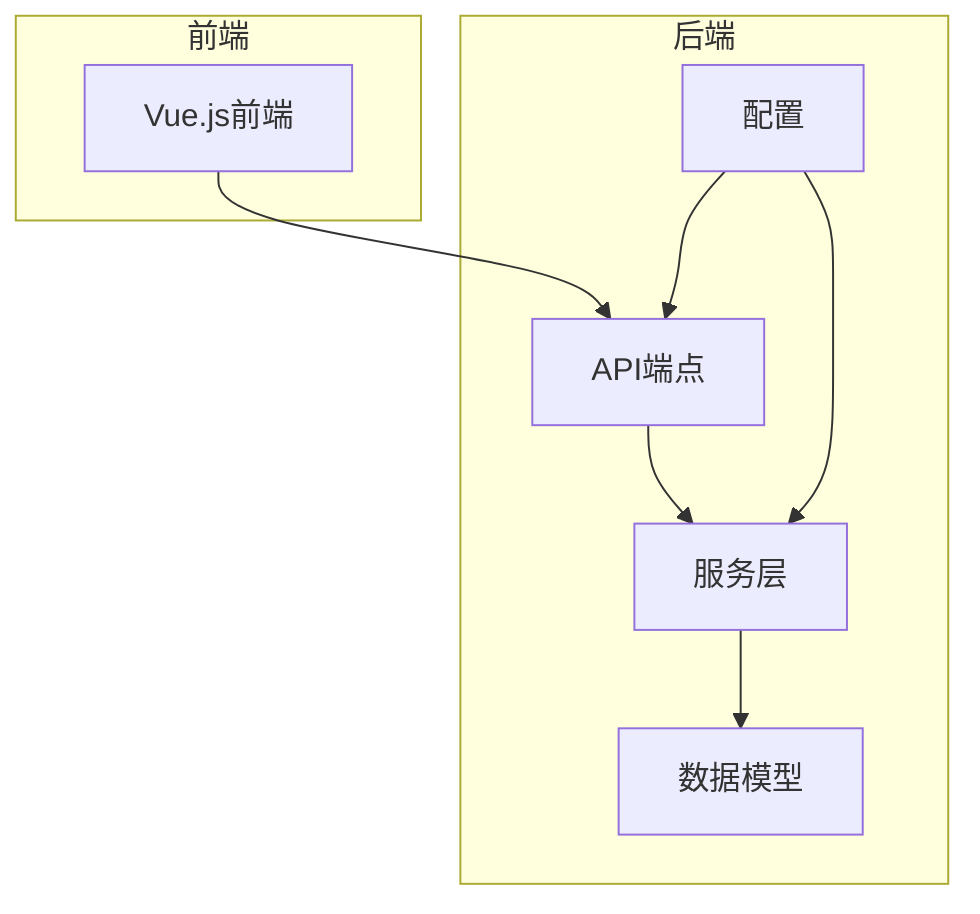
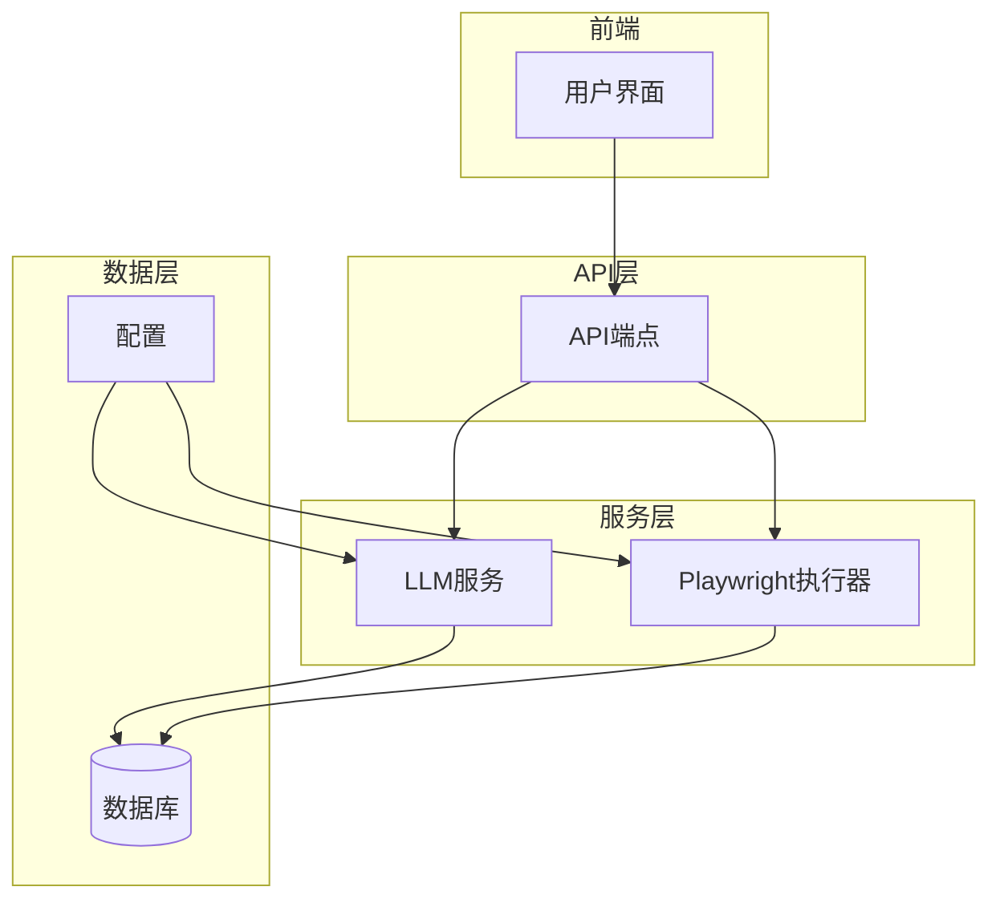
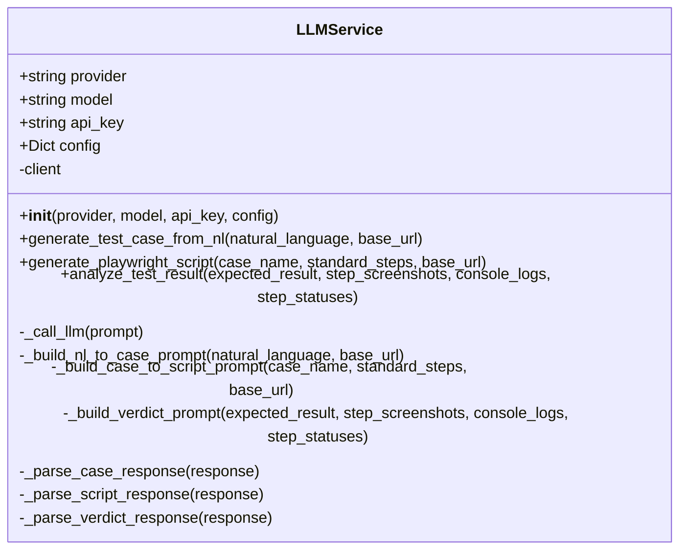
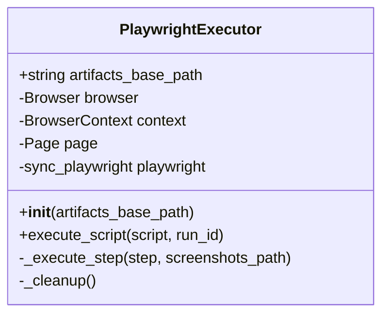
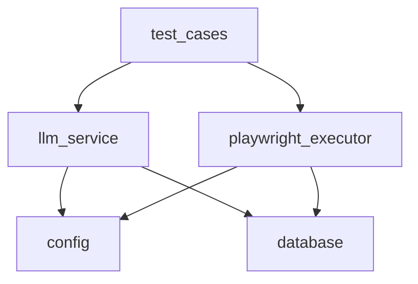

# 服务层架构

<cite>
**本文档中引用的文件**  
- [llm_service.py](file://backend/app/services/llm_service.py)
- [playwright_executor.py](file://backend/app/services/playwright_executor.py)
- [test_cases.py](file://backend/app/api/endpoints/test_cases.py)
- [config.py](file://backend/app/config.py)
- [test_case.py](file://backend/app/models/test_case.py)
- [project.py](file://backend/app/models/project.py)
</cite>

## 目录
1. [简介](#简介)
2. [项目结构](#项目结构)
3. [核心组件](#核心组件)
4. [架构概述](#架构概述)
5. [详细组件分析](#详细组件分析)
6. [依赖分析](#依赖分析)
7. [性能考虑](#性能考虑)
8. [故障排除指南](#故障排除指南)
9. [结论](#结论)

## 简介
本项目是一个基于自然语言的UI自动化测试平台，其服务层设计围绕两个核心服务展开：LLM服务和Playwright执行器。LLM服务负责将自然语言描述转换为标准化测试用例和Playwright脚本，而Playwright执行器则负责驱动浏览器执行自动化任务。服务层通过API端点与前端交互，并利用依赖注入获取数据库会话，实现完整的测试用例生成、执行和结果分析流程。

## 项目结构
项目采用分层架构，主要分为后端和前端两大部分。后端采用FastAPI框架，包含API端点、模型、服务、工具和配置等模块。服务层位于`backend/app/services`目录下，包含`llm_service.py`和`playwright_executor.py`两个核心文件，分别实现LLM集成和浏览器自动化功能。



**图示来源**  
- [llm_service.py](file://backend/app/services/llm_service.py)
- [playwright_executor.py](file://backend/app/services/playwright_executor.py)
- [test_cases.py](file://backend/app/api/endpoints/test_cases.py)

**本节来源**  
- [project_structure](file://project_structure)

## 核心组件
服务层包含两个核心组件：LLM服务和Playwright执行器。LLM服务负责与OpenAI/Anthropic等LLM提供商交互，实现自然语言到测试用例的转换。Playwright执行器负责执行生成的Playwright脚本，驱动浏览器完成自动化测试任务。这两个组件通过API端点与系统其他部分交互，形成完整的测试自动化流程。

**本节来源**  
- [llm_service.py](file://backend/app/services/llm_service.py#L9-L325)
- [playwright_executor.py](file://backend/app/services/playwright_executor.py#L11-L213)

## 架构概述
系统架构采用分层设计，前端通过API与后端交互，后端服务层处理核心业务逻辑。LLM服务和Playwright执行器协同工作，实现从自然语言描述到测试结果分析的完整流程。配置管理模块提供系统级配置，数据库模块处理数据持久化。



**图示来源**  
- [llm_service.py](file://backend/app/services/llm_service.py)
- [playwright_executor.py](file://backend/app/services/playwright_executor.py)
- [test_cases.py](file://backend/app/api/endpoints/test_cases.py)

## 详细组件分析

### LLM服务分析
LLM服务是系统的核心组件之一，负责与大型语言模型交互，实现自然语言到测试用例的转换。该服务支持OpenAI和Anthropic等提供商，通过精心设计的提示词工程，将用户输入的自然语言描述转换为结构化的测试用例。

#### 类图


**图示来源**  
- [llm_service.py](file://backend/app/services/llm_service.py#L9-L325)

#### 提示词工程与上下文管理
LLM服务通过三个主要方法实现不同的转换任务：`_build_nl_to_case_prompt`用于将自然语言转换为标准化测试用例，`_build_case_to_script_prompt`用于将标准化用例转换为Playwright脚本，`_build_verdict_prompt`用于分析测试结果。这些方法构建了详细的提示词，包含示例输出和格式要求，确保LLM返回符合预期的JSON格式。

**本节来源**  
- [llm_service.py](file://backend/app/services/llm_service.py#L121-L299)

#### 响应解析与错误重试机制
服务通过`_parse_case_response`方法解析LLM返回的响应，支持从```json代码块中提取JSON内容。错误处理机制在`_call_llm`方法中实现，捕获所有异常并重新抛出带有上下文信息的异常。虽然当前实现没有显式的重试逻辑，但提供了配置参数如temperature和max_tokens，允许调整请求行为。

**本节来源**  
- [llm_service.py](file://backend/app/services/llm_service.py#L301-L325)
- [llm_service.py](file://backend/app/services/llm_service.py#L94-L119)

### Playwright执行器分析
Playwright执行器负责执行由LLM服务生成的Playwright脚本，驱动浏览器完成自动化测试任务。该组件处理浏览器启动、步骤执行、资源管理和结果收集等核心功能。

#### 类图


**图示来源**  
- [playwright_executor.py](file://backend/app/services/playwright_executor.py#L11-L213)

#### 浏览器自动化执行流程
执行器通过`execute_script`方法启动完整的执行流程。首先创建工件目录，然后启动Playwright并根据配置启动指定类型的浏览器（默认为chromium）。创建具有指定视口尺寸的浏览器上下文，并启用HAR记录功能。页面创建后，设置控制台日志监听器，然后逐个执行脚本中的步骤。

**本节来源**  
- [playwright_executor.py](file://backend/app/services/playwright_executor.py#L27-L120)

#### 截图采集与HAR记录
执行器在`execute_script`方法中自动创建`screenshots`、`logs`和`network`目录。每个步骤执行后，如果配置了截屏（默认为true），则会自动截取全页截图并保存。HAR记录通过`record_har_path`参数在上下文创建时启用，自动记录所有网络请求。控制台日志通过页面事件监听器收集，并在执行结束后保存到文件。

**本节来源**  
- [playwright_executor.py](file://backend/app/services/playwright_executor.py#L27-L120)

#### 结果上报与资源清理
执行结果通过`execute_script`方法的返回值上报，包含成功状态、步骤执行详情、错误信息和工件路径。资源清理在`_cleanup`方法中实现，确保在finally块中调用，无论执行成功或失败都会正确关闭页面、上下文、浏览器和Playwright实例，防止资源泄漏。

**本节来源**  
- [playwright_executor.py](file://backend/app/services/playwright_executor.py#L27-L120)
- [playwright_executor.py](file://backend/app/services/playwright_executor.py#L201-L213)

## 依赖分析
服务层组件之间存在明确的依赖关系。LLM服务独立于Playwright执行器，两者通过API端点与系统其他部分交互。API端点依赖服务层，服务层依赖配置和数据库模块。这种分层依赖结构确保了组件间的低耦合和高内聚。



**图示来源**  
- [test_cases.py](file://backend/app/api/endpoints/test_cases.py)
- [llm_service.py](file://backend/app/services/llm_service.py)
- [playwright_executor.py](file://backend/app/services/playwright_executor.py)

**本节来源**  
- [test_cases.py](file://backend/app/api/endpoints/test_cases.py)
- [llm_service.py](file://backend/app/services/llm_service.py)
- [playwright_executor.py](file://backend/app/services/playwright_executor.py)

## 性能考虑
系统通过异步执行模型和超时控制确保性能和稳定性。`MAX_EXECUTION_TIME`配置项设置为300秒（5分钟），限制测试执行的最大时长。Playwright步骤执行时设置了30000毫秒的超时，防止个别步骤无限等待。资源清理机制确保即使在异常情况下也能释放浏览器资源，避免资源耗尽。

**本节来源**  
- [config.py](file://backend/app/config.py#L35-L35)
- [playwright_executor.py](file://backend/app/services/playwright_executor.py#L122-L199)

## 故障排除指南
常见问题包括LLM调用失败、浏览器启动失败和步骤执行超时。对于LLM调用失败，应检查API密钥是否正确解密和提供商配置。浏览器启动失败通常与环境配置或资源不足有关。步骤执行超时可能是由于网络延迟或元素定位问题，可通过调整超时设置或优化选择器来解决。所有执行相关的日志和工件都保存在指定目录，便于问题排查。

**本节来源**  
- [llm_service.py](file://backend/app/services/llm_service.py#L94-L119)
- [playwright_executor.py](file://backend/app/services/playwright_executor.py#L122-L199)
- [playwright_executor.py](file://backend/app/services/playwright_executor.py#L201-L213)

## 结论
服务层设计充分考虑了可扩展性、可靠性和易维护性。LLM服务通过模块化的提示词工程和响应解析机制，支持多种LLM提供商和复杂的转换任务。Playwright执行器实现了完整的浏览器自动化流程，包括执行、监控和资源管理。两个服务通过清晰的API与系统其他部分交互，形成了高效、稳定的测试自动化平台核心。