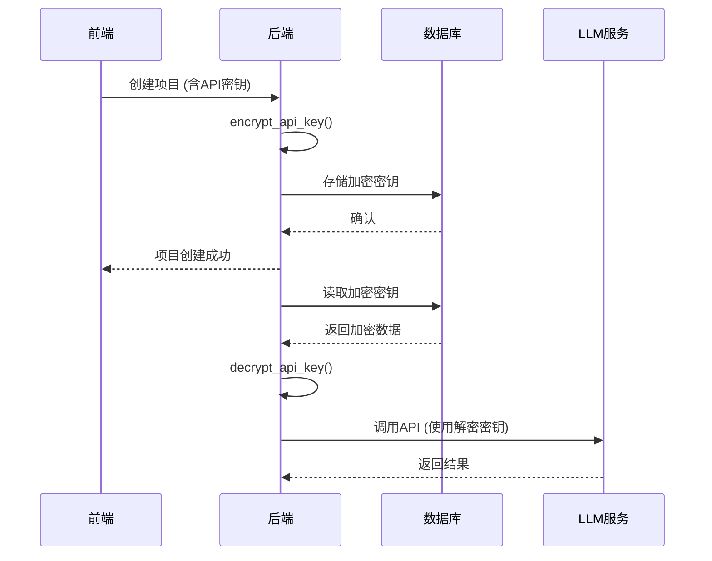
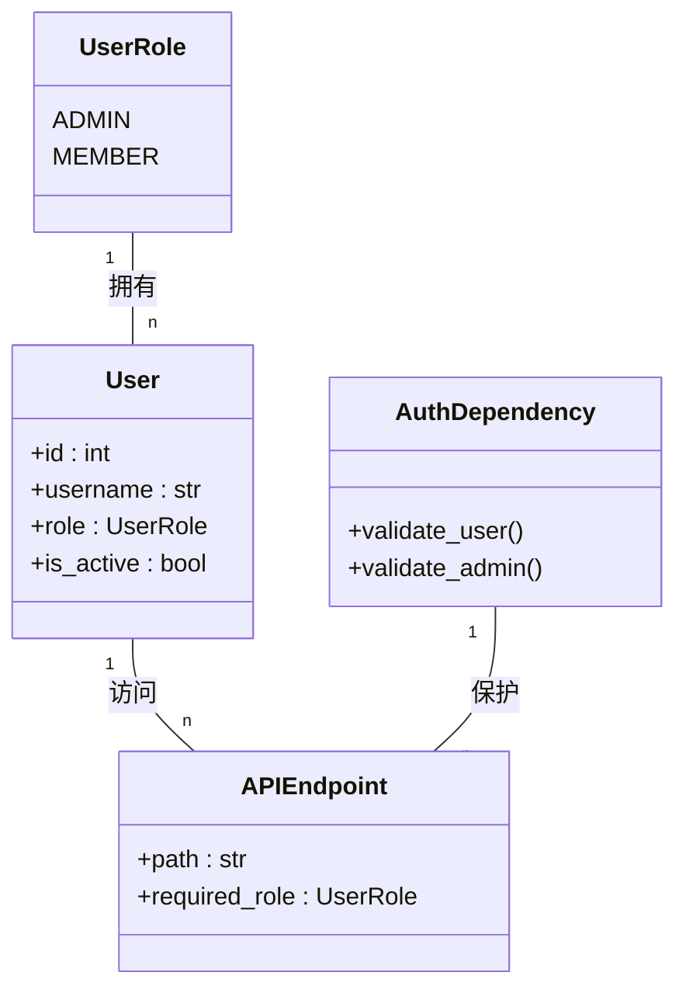
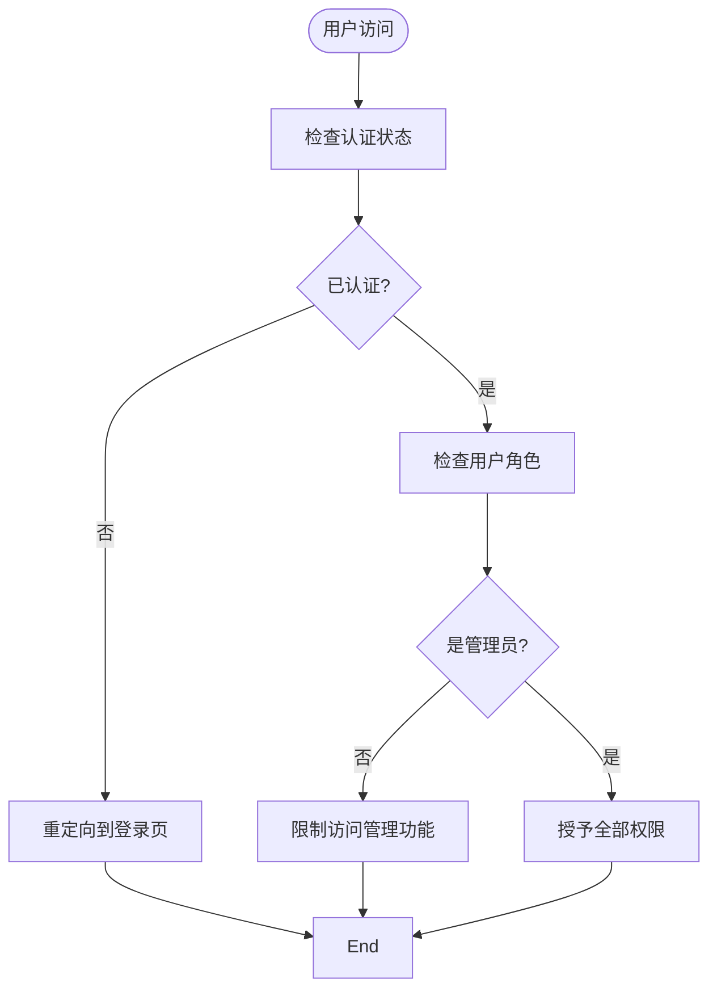

# 安全考虑

<cite>
**本文档引用的文件**   
- [security.py](file://backend/app/utils/security.py)
- [encryption.py](file://backend/app/utils/encryption.py)
- [auth.py](file://backend/app/api/endpoints/auth.py)
- [users.py](file://backend/app/api/endpoints/users.py)
- [projects.py](file://backend/app/api/endpoints/projects.py)
- [config.py](file://backend/app/config.py)
- [audit_log.py](file://backend/app/models/audit_log.py)
- [user.py](file://backend/app/models/user.py)
- [llm_service.py](file://backend/app/services/llm_service.py)
- [auth.js](file://frontend/src/stores/auth.js)
- [index.js](file://frontend/src/router/index.js)
</cite>

## 目录
1. [密码存储机制](#密码存储机制)
2. [JWT令牌安全](#jwt令牌安全)
3. [LLM API密钥加密存储](#llm-api密钥加密存储)
4. [基于角色的访问控制（RBAC）](#基于角色的访问控制rbac)
5. [前端安全措施](#前端安全措施)
6. [审计日志设计](#审计日志设计)
7. [安全最佳实践](#安全最佳实践)
8. [当前MVP版本的安全局限性](#当前mvp版本的安全局限性)

## 密码存储机制

系统采用bcrypt哈希算法对用户密码进行安全存储。bcrypt是一种专为密码哈希设计的自适应哈希函数，具有内置的盐值（salt）机制，能有效抵御彩虹表攻击和暴力破解。当用户注册或修改密码时，系统调用`get_password_hash()`函数生成哈希值并存储于数据库中。在用户登录验证时，使用`verify_password()`函数对比输入密码与存储哈希值的一致性。

该机制通过`passlib`库实现，配置为使用bcrypt方案，并自动处理盐值生成和哈希计算。bcrypt的自适应特性允许通过调整工作因子（work factor）来应对计算能力的提升，确保长期安全性。

**Section sources**
- [security.py](file://backend/app/utils/security.py#L13-L15)
- [user.py](file://backend/app/models/user.py#L15-L16)

## JWT令牌安全

系统采用JSON Web Token（JWT）实现无状态认证机制。JWT令牌在用户成功登录后由服务器生成，并通过`create_access_token()`函数返回给客户端。令牌包含用户标识（sub）和过期时间（exp）等声明信息，使用HS256算法和服务器密钥进行签名，确保令牌的完整性和防篡改性。

令牌通过HTTPS安全传输，前端在每次请求时将其放入Authorization头中。服务器通过`decode_access_token()`函数验证令牌的有效性。令牌默认有效期为24小时（可配置），过期后需重新登录获取新令牌。由于JWT是无状态的，登出操作由客户端清除本地存储的令牌实现。

**Section sources**
- [security.py](file://backend/app/utils/security.py#L23-L33)
- [auth.py](file://backend/app/api/endpoints/auth.py#L30-L38)
- [config.py](file://backend/app/config.py#L18-L20)

## LLM API密钥加密存储

LLM API密钥采用AES-256加密算法进行安全存储。系统通过`encrypt_api_key()`和`decrypt_api_key()`函数实现密钥的加解密。加密过程使用Fernet对称加密方案，密钥由主JWT密钥通过SHA-256哈希派生而来，确保加密密钥与认证密钥的关联性和安全性。

当管理员创建或更新项目时，输入的LLM API密钥会立即被加密后存储在`project`表的`llm_api_key`字段中。在调用LLM服务时，系统通过`decrypt_api_key()`函数临时解密密钥，使用完毕后立即从内存中清除，避免敏感信息长期驻留。

**Diagram sources**
- [encryption.py](file://backend/app/utils/encryption.py#L17-L21)
- [projects.py](file://backend/app/api/endpoints/projects.py#L45-L48)
- [llm_service.py](file://backend/app/services/llm_service.py#L15-L25)

## 基于角色的访问控制（RBAC）

系统在API层面实施基于角色的访问控制（RBAC），区分管理员（Admin）和成员（Member）两种角色。访问控制通过FastAPI的依赖注入系统实现，核心是`get_current_user()`和`get_current_admin_user()`两个依赖函数。

普通用户端点使用`get_current_user`依赖，验证用户身份和活跃状态。管理员专用端点则使用`get_current_admin_user`依赖，在验证身份的基础上检查角色权限。例如，用户管理和项目管理等敏感操作仅允许管理员访问。路由层面的权限控制确保了最小权限原则的实施，防止越权访问。

**Diagram sources**
- [user.py](file://backend/app/models/user.py#L7-L10)
- [dependencies.py](file://backend/app/api/dependencies.py#L14-L51)
- [users.py](file://backend/app/api/endpoints/users.py#L15-L20)

## 前端安全措施

前端实施了多项安全措施以防范常见Web攻击。通过Vue Router的路由守卫机制实现客户端访问控制，未认证用户无法访问受保护路由，非管理员用户无法访问管理界面。认证状态和用户信息存储于localStorage，配合Pinia状态管理确保一致性。

系统防范跨站脚本（XSS）攻击，所有用户输入在显示前都经过Vue的自动转义处理。防范跨站请求伪造（CSRF）方面，由于采用JWT认证而非会话cookie，天然免疫CSRF攻击。所有API请求通过HTTPS加密传输，敏感操作均有二次确认机制。

**Diagram sources**
- [auth.js](file://frontend/src/stores/auth.js#L25-L35)
- [index.js](file://frontend/src/router/index.js#L55-L75)

## 审计日志设计

系统设计了`audit_log`表用于记录关键操作的审计日志，支持安全事件追溯和合规性检查。审计日志记录包括操作用户、操作类型、资源类型、资源ID、详细信息、IP地址和时间戳等字段。当前MVP版本已实现基础框架，但尚未在所有关键操作点插入日志记录代码。

未来完善计划包括：在用户管理、项目管理、测试用例执行等关键API端点添加日志记录；实现日志查询API供管理员审计；增加日志分析功能识别异常行为模式；设置日志保留策略和归档机制。审计日志将作为安全事件调查和系统合规的重要依据。

**Section sources**
- [audit_log.py](file://backend/app/models/audit_log.py#L9-L23)

## 安全最佳实践

系统遵循多项安全最佳实践：
- **密钥轮换**：建议定期更换JWT密钥和LLM API密钥，降低密钥泄露风险
- **最小权限原则**：RBAC系统确保用户仅拥有完成工作所需的最小权限
- **输入验证**：使用Pydantic模型对所有API输入进行严格验证，防止注入攻击
- **安全头配置**：通过CORS中间件配置安全的跨域策略，限制可访问源
- **HTTPS强制**：生产环境应强制使用HTTPS加密所有通信
- **错误处理**：返回通用错误信息，避免泄露系统内部细节

**Section sources**
- [config.py](file://backend/app/config.py#L39-L41)
- [main.py](file://backend/main.py#L15-L20)

## 当前MVP版本的安全局限性

当前MVP版本存在以下安全局限性：
1. JWT密钥硬编码在配置文件中，未实现密钥轮换机制
2. 审计日志功能尚未完全启用，关键操作缺乏记录
3. 无失败登录尝试限制，存在暴力破解风险
4. 密码策略较弱，未强制复杂度要求
5. 无多因素认证（MFA）支持
6. 敏感数据加密密钥与认证密钥耦合，应分离管理
7. 前端未实施内容安全策略（CSP）头部
8. 缺少定期安全扫描和渗透测试流程

这些局限性将在后续版本中逐步改进，以提升系统的整体安全水平。

**Section sources**
- [config.py](file://backend/app/config.py#L18)
- [security.py](file://backend/app/utils/security.py#L10)
- [audit_log.py](file://backend/app/models/audit_log.py#L1-L25)