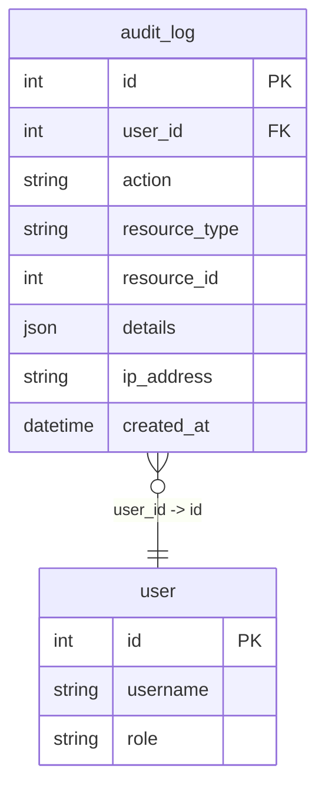
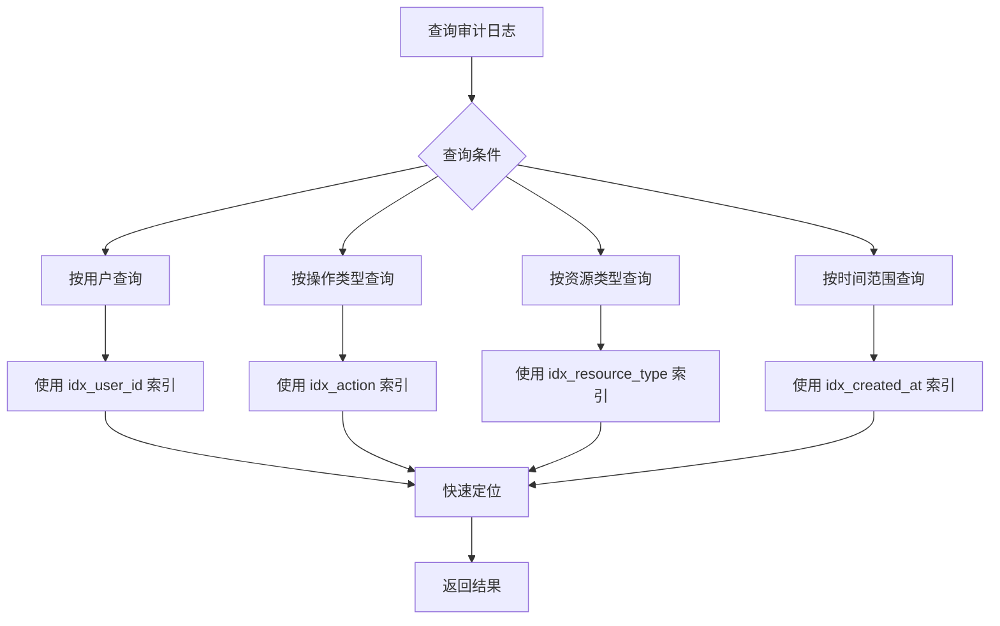
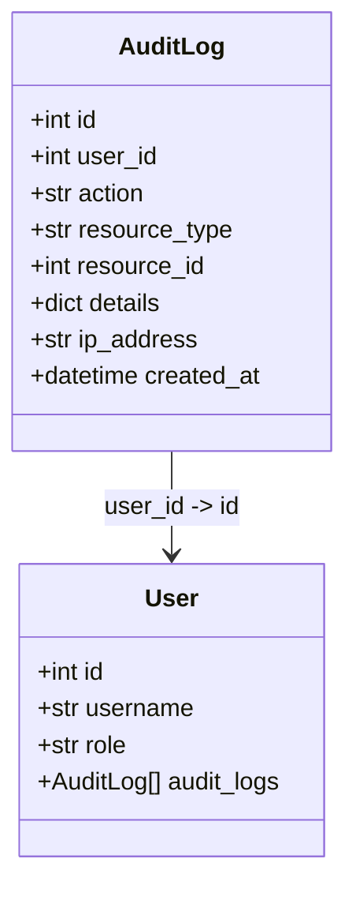

# 审计日志模型 (AuditLog)

<cite>
**Referenced Files in This Document**   
- [audit_log.py](file://backend/app/models/audit_log.py)
- [audit_log.py](file://backend/app/schemas/audit_log.py)
- [init_db.sql](file://backend/init_db.sql)
- [user.py](file://backend/app/models/user.py)
</cite>

## 目录
1. [简介](#简介)
2. [数据模型定义](#数据模型定义)
3. [核心字段详解](#核心字段详解)
4. [索引与性能](#索引与性能)
5. [关系映射](#关系映射)
6. [审计日志示例](#审计日志示例)
7. [安全与合规价值](#安全与合规价值)

## 简介
审计日志模型（AuditLog）是本系统安全架构的核心组件，用于记录所有关键的用户操作。该模型通过结构化的方式追踪系统内的变更行为，为安全审计、问题追溯和合规性检查提供了坚实的数据基础。

**Section sources**
- [audit_log.py](file://backend/app/models/audit_log.py#L9-L23)
- [init_db.sql](file://backend/init_db.sql#L108-L115)

## 数据模型定义
审计日志模型在数据库和应用层均被明确定义，确保了数据结构的一致性和完整性。



**Diagram sources**
- [init_db.sql](file://backend/init_db.sql#L108-L115)

**Section sources**
- [audit_log.py](file://backend/app/models/audit_log.py#L9-L23)
- [init_db.sql](file://backend/init_db.sql#L108-L115)

## 核心字段详解
审计日志表的每个字段都承载着特定的审计信息，共同构成完整的操作记录。

### 操作行为与资源标识
`action`、`resource_type` 和 `resource_id` 字段共同精确描述了用户执行了何种操作、作用于何种类型的资源以及具体是哪个资源实例。

- **action (操作类型)**: 记录操作的语义，如 `create_project`, `update_test_case`, `delete_run` 等。
- **resource_type (资源类型)**: 标识被操作的实体类型，例如 `project`, `test_case`, `user`。
- **resource_id (资源ID)**: 存储被操作资源的唯一数据库ID，用于直接关联到具体记录。

**Section sources**
- [audit_log.py](file://backend/app/models/audit_log.py#L15-L17)

### 操作者与上下文
`user_id` 和 `ip_address` 字段提供了操作的上下文，明确了“谁”在“哪里”执行了操作。

- **user_id (用户ID)**: 外键，关联到 `user` 表，明确操作的发起者。
- **ip_address (IP地址)**: 记录发起请求的客户端IP，有助于安全事件的追踪和分析。

**Section sources**
- [audit_log.py](file://backend/app/models/audit_log.py#L14)
- [audit_log.py](file://backend/app/models/audit_log.py#L19)

### 操作详情与时间
`details` 和 `created_at` 字段提供了操作的详细内容和精确时间戳。

- **details (详情)**: JSON字段，用于存储操作的详细信息，如配置变更前后的值、错误信息等，具有高度的灵活性。
- **created_at (创建时间)**: 记录日志条目生成的精确时间，是所有时间序列分析的基础。

**Section sources**
- [audit_log.py](file://backend/app/models/audit_log.py#L18)
- [audit_log.py](file://backend/app/models/audit_log.py#L20)

## 索引与性能
为确保审计日志查询的高效性，模型在关键字段上建立了数据库索引。



**Diagram sources**
- [init_db.sql](file://backend/init_db.sql#L114)

**Section sources**
- [init_db.sql](file://backend/init_db.sql#L114)

## 关系映射
审计日志模型通过ORM关系与用户模型建立关联，便于在应用层进行数据查询。



**Diagram sources**
- [audit_log.py](file://backend/app/models/audit_log.py#L23)
- [user.py](file://backend/app/models/user.py#L32)

**Section sources**
- [audit_log.py](file://backend/app/models/audit_log.py#L23)
- [user.py](file://backend/app/models/user.py#L32)

## 审计日志示例
以下是一个用户修改项目配置时生成的审计日志实例：

```json
{
  "id": 1001,
  "user_id": 5,
  "action": "update_project",
  "resource_type": "project",
  "resource_id": 12,
  "details": {
    "changed_fields": {
      "llm_model": {
        "old": "gpt-3.5-turbo",
        "new": "gpt-4"
      },
      "base_url": {
        "old": "https://old-api.example.com",
        "new": "https://new-api.example.com"
      }
    }
  },
  "ip_address": "192.168.1.100",
  "created_at": "2023-10-27T10:30:00Z"
}
```

此示例清晰地展示了操作的全貌：用户ID为5的用户在特定时间从IP地址`192.168.1.100`修改了ID为12的项目，将LLM模型从`gpt-3.5-turbo`升级为`gpt-4`，并更新了API基础地址。

**Section sources**
- [audit_log.py](file://backend/app/models/audit_log.py#L18)

## 安全与合规价值
审计日志模型在系统中扮演着至关重要的角色：

1.  **安全审计**: 通过`user_id`和`ip_address`可以追溯任何可疑操作的源头。
2.  **问题追溯**: 当系统出现异常时，`details`字段中记录的变更详情是定位问题原因的关键线索。
3.  **合规性**: 完整的操作记录满足了数据安全和系统操作透明度的合规要求。
4.  **责任界定**: 明确了每一次变更的责任人，增强了团队的责任意识。

**Section sources**
- [audit_log.py](file://backend/app/models/audit_log.py#L9-L23)