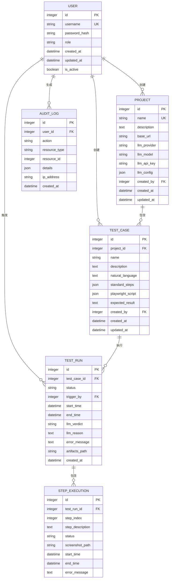

# 数据模型

<cite>
**本文档引用的文件**  
- [user.py](file://backend/app/models/user.py)
- [project.py](file://backend/app/models/project.py)
- [test_case.py](file://backend/app/models/test_case.py)
- [test_run.py](file://backend/app/models/test_run.py)
- [step_execution.py](file://backend/app/models/step_execution.py)
- [audit_log.py](file://backend/app/models/audit_log.py)
- [init_sqlite_db.py](file://backend/init_sqlite_db.py)
</cite>

## 目录
1. [简介](#简介)
2. [核心实体模型](#核心实体模型)
3. [实体关系图（ER图）](#实体关系图er图)
4. [数据生命周期与业务含义](#数据生命周期与业务含义)
5. [数据访问模式](#数据访问模式)
6. [数据完整性与索引策略](#数据完整性与索引策略)
7. [性能优化考虑](#性能优化考虑)
8. [示例数据记录](#示例数据记录)

## 简介
本文件全面描述了 `testserver` 系统的数据模型，涵盖核心实体（User、Project、TestCase、TestRun、StepExecution、AuditLog）的字段定义、数据类型、主键/外键关系、约束条件及业务语义。文档基于 Python 模型文件和数据库初始化脚本，提供 ER 图、数据生命周期说明、访问模式、完整性规则和性能优化建议。

## 核心实体模型

### 用户（User）
表示系统用户，支持角色权限管理。

**字段定义：**
- `id`: 整数，主键，自增，索引
- `username`: 字符串(50)，唯一，非空，索引
- `password_hash`: 字符串(255)，非空
- `role`: 枚举（Admin, Member），非空，索引
- `created_at`: 日期时间，非空，默认为 UTC 时间
- `updated_at`: 日期时间，非空，默认为 UTC 时间，更新时自动刷新
- `is_active`: 布尔值，非空，默认为 `True`

**业务含义：** 用户是系统操作主体，可创建项目、测试用例，触发测试运行，并生成审计日志。

**Section sources**
- [user.py](file://backend/app/models/user.py#L1-L33)

### 项目（Project）
表示一个测试项目，包含多个测试用例。

**字段定义：**
- `id`: 整数，主键，自增，索引
- `name`: 字符串(100)，唯一，非空，索引
- `description`: 文本
- `base_url`: 字符串(500)，非空
- `llm_provider`: 字符串(50)，非空
- `llm_model`: 字符串(100)，非空
- `llm_api_key`: 字符串(255)，非空
- `llm_config`: JSON，可选
- `created_by`: 整数，外键 → user.id，非空，索引
- `created_at`: 日期时间，非空，默认为 UTC 时间
- `updated_at`: 日期时间，非空，默认为 UTC 时间，更新时自动刷新

**业务含义：** 项目是测试用例的容器，包含 LLM 配置信息，用于自动化测试生成与执行。

**Section sources**
- [project.py](file://backend/app/models/project.py#L1-L28)

### 测试用例（TestCase）
表示一个具体的测试场景，由自然语言描述生成。

**字段定义：**
- `id`: 整数，主键，自增，索引
- `project_id`: 整数，外键 → project.id，级联删除，非空，索引
- `name`: 字符串(200)，非空，索引
- `description`: 文本
- `natural_language`: 文本，非空
- `standard_steps`: JSON，非空
- `playwright_script`: JSON，非空
- `expected_result`: 文本，非空
- `created_by`: 整数，外键 → user.id，非空，索引
- `created_at`: 日期时间，非空，默认为 UTC 时间
- `updated_at`: 日期时间，非空，默认为 UTC 时间，更新时自动刷新

**业务含义：** 测试用例是自动化测试的基本单元，包含可执行的 Playwright 脚本和预期结果。

**Section sources**
- [test_case.py](file://backend/app/models/test_case.py#L1-L29)

### 测试运行（TestRun）
表示一次测试用例的执行记录。

**字段定义：**
- `id`: 整数，主键，自增，索引
- `test_case_id`: 整数，外键 → test_case.id，级联删除，非空，索引
- `status`: 枚举（running, success, failed, error），非空，索引
- `trigger_by`: 整数，外键 → user.id，非空，索引
- `start_time`: 日期时间，非空，默认为 UTC 时间，索引
- `end_time`: 日期时间，可选
- `llm_verdict`: 枚举（passed, failed, unknown）
- `llm_reason`: 文本
- `error_message`: 文本
- `artifacts_path`: 字符串(500)
- `created_at`: 日期时间，非空，默认为 UTC 时间

**业务含义：** 测试运行记录一次测试执行的全过程，包括状态、时间、结果和错误信息。

**Section sources**
- [test_run.py](file://backend/app/models/test_run.py#L1-L45)

### 步骤执行（StepExecution）
表示测试运行中每一步的执行详情。

**字段定义：**
- `id`: 整数，主键，自增，索引
- `test_run_id`: 整数，外键 → test_run.id，级联删除，非空，索引
- `step_index`: 整数，非空，索引
- `step_description`: 文本，非空
- `status`: 枚举（success, failed, skipped），非空
- `screenshot_path`: 字符串(500)
- `start_time`: 日期时间，非空，默认为 UTC 时间
- `end_time`: 日期时间，可选
- `error_message`: 文本

**业务含义：** 步骤执行提供测试运行的细粒度追踪，支持失败步骤的定位与分析。

**Section sources**
- [step_execution.py](file://backend/app/models/step_execution.py#L1-L33)

### 审计日志（AuditLog）
记录用户操作行为，用于安全审计。

**字段定义：**
- `id`: 整数，主键，自增，索引
- `user_id`: 整数，外键 → user.id，非空，索引
- `action`: 字符串(100)，非空，索引
- `resource_type`: 字符串(50)，非空，索引
- `resource_id`: 整数，可选
- `details`: JSON
- `ip_address`: 字符串(50)
- `created_at`: 日期时间，非空，默认为 UTC 时间，索引

**业务含义：** 审计日志用于追踪用户操作历史，支持安全审查与问题追溯。

**Section sources**
- [audit_log.py](file://backend/app/models/audit_log.py#L1-L24)

## 实体关系图（ER图）



**Diagram sources**
- [user.py](file://backend/app/models/user.py#L1-L33)
- [project.py](file://backend/app/models/project.py#L1-L28)
- [test_case.py](file://backend/app/models/test_case.py#L1-L29)
- [test_run.py](file://backend/app/models/test_run.py#L1-L45)
- [step_execution.py](file://backend/app/models/step_execution.py#L1-L33)
- [audit_log.py](file://backend/app/models/audit_log.py#L1-L24)

## 数据生命周期与业务含义

- **User**：用户注册或管理员创建后进入系统，可长期存在，`is_active` 控制其登录状态。
- **Project**：由用户创建，生命周期与测试项目一致，删除项目时级联删除所有测试用例。
- **TestCase**：在项目内创建，可被多次执行，修改后更新 `updated_at`。
- **TestRun**：每次执行测试用例时创建，状态从 `running` 变为 `success`/`failed`/`error`，完成后不可更改。
- **StepExecution**：随 `TestRun` 创建，每一步执行生成一条记录，支持失败步骤分析。
- **AuditLog**：用户执行关键操作（如创建、删除）时生成，永久保留用于审计。

**一对多关系说明：**
- 一个 `TestRun` 包含多个 `StepExecution`，通过 `test_run_id` 外键关联，实现测试步骤的细粒度追踪。
- 一个 `Project` 包含多个 `TestCase`，通过 `project_id` 外键关联，形成测试用例的组织结构。

## 数据访问模式

- **通过项目ID查询所有测试用例**：
  ```sql
  SELECT * FROM test_case WHERE project_id = ?;
  ```
  利用 `project_id` 上的索引实现高效查询。

- **查询某用户触发的所有测试运行**：
  ```sql
  SELECT * FROM test_run WHERE trigger_by = ? ORDER BY start_time DESC;
  ```
  利用 `trigger_by` 和 `start_time` 索引优化排序。

- **查询某测试运行的所有步骤执行**：
  ```sql
  SELECT * FROM step_execution WHERE test_run_id = ? ORDER BY step_index;
  ```
  利用 `test_run_id` 和 `step_index` 索引保证顺序。

- **按状态统计测试运行**：
  ```sql
  SELECT status, COUNT(*) FROM test_run GROUP BY status;
  ```
  利用 `status` 索引加速聚合。

## 数据完整性与索引策略

**数据完整性规则：**
- 外键约束确保引用完整性（如 `test_case.project_id` 必须指向存在的 `project.id`）。
- `ON DELETE CASCADE` 确保父记录删除时自动清理子记录（如删除项目时删除其所有测试用例）。
- 唯一约束防止重复（如 `user.username`、`project.name`）。
- 非空约束确保关键字段存在值。

**索引策略：**
- 主键自动索引。
- 外键字段（如 `project_id`, `test_case_id`）建立索引以加速连接查询。
- 高频查询字段（如 `username`, `status`, `start_time`, `created_at`）建立索引。
- 唯一字段（如 `username`, `name`）自动获得唯一索引。

## 性能优化考虑

- **索引优化**：对 `WHERE`、`JOIN`、`ORDER BY` 中常用字段建立索引，避免全表扫描。
- **级联删除**：使用数据库级联删除减少应用层批量操作，提升删除效率。
- **JSON 字段**：`standard_steps`、`playwright_script`、`llm_config` 使用 JSON 类型，支持灵活结构，但需注意查询性能限制。
- **时间索引**：`start_time` 和 `created_at` 建立索引，支持按时间范围查询测试记录。
- **避免大字段查询**：`natural_language`、`expected_result` 等文本字段避免在 `WHERE` 中使用，防止性能下降。

## 示例数据记录

### 用户示例
```json
{
  "id": 1,
  "username": "admin",
  "role": "Admin",
  "created_at": "2025-04-05T10:00:00Z",
  "is_active": true
}
```

### 测试运行示例
```json
{
  "id": 101,
  "test_case_id": 2001,
  "status": "success",
  "trigger_by": 1,
  "start_time": "2025-04-05T10:30:00Z",
  "end_time": "2025-04-05T10:32:15Z",
  "llm_verdict": "passed",
  "artifacts_path": "/artifacts/run_101.zip"
}
```

### 步骤执行示例
```json
{
  "id": 5001,
  "test_run_id": 101,
  "step_index": 0,
  "step_description": "打开登录页面",
  "status": "success",
  "screenshot_path": "/screenshots/run_101_step_0.png",
  "start_time": "2025-04-05T10:30:00Z",
  "end_time": "2025-04-05T10:30:05Z"
}
```