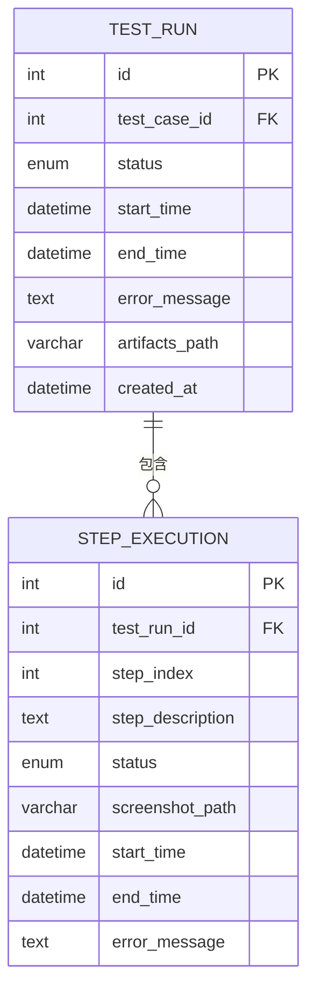
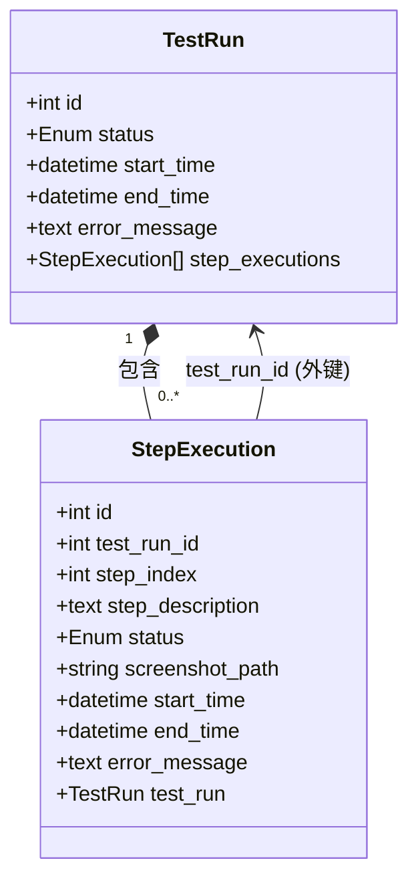

# 步骤执行模型 (StepExecution)

<cite>
**Referenced Files in This Document**   
- [step_execution.py](file://backend/app/models/step_execution.py)
- [test_run.py](file://backend/app/models/test_run.py)
- [init_db.sql](file://backend/init_db.sql)
</cite>

## 目录
1. [简介](#简介)
2. [数据模型](#数据模型)
3. [核心字段详解](#核心字段详解)
4. [与TestRun的关联关系](#与testrun的关联关系)
5. [执行时间与性能分析](#执行时间与性能分析)
6. [错误处理与调试](#错误处理与调试)
7. [示例分析：登录步骤执行](#示例分析登录步骤执行)
8. [结论](#结论)

## 简介
`StepExecution` 模型是测试自动化平台的核心组成部分，用于记录每次测试运行中每一个原子操作的详细执行情况。它将一个完整的测试用例分解为多个可追踪、可审计的步骤，为测试结果的追溯、失败原因的分析以及性能监控提供了精确的数据基础。本文档将深入解析其数据结构、关键字段、与父级`TestRun`模型的关系及其在系统中的关键作用。

## 数据模型
`StepExecution` 模型定义了步骤执行记录表（`step_execution`）的结构，该表在数据库中存储了每个测试步骤的执行元数据。其核心设计原则是**原子性、可追溯性和完整性**，确保每一个用户操作或系统动作都能被精确记录。

**Diagram sources**
- [init_db.sql](file://backend/init_db.sql#L95-L116)
- [step_execution.py](file://backend/app/models/step_execution.py#L17-L32)
- [test_run.py](file://backend/app/models/test_run.py#L25-L44)

**Section sources**
- [step_execution.py](file://backend/app/models/step_execution.py#L17-L32)
- [init_db.sql](file://backend/init_db.sql#L95-L116)

## 核心字段详解
`StepExecution` 表的每个字段都承载着特定的语义信息，共同构建了完整的执行上下文。

### step_index（步骤序号）
`step_index` 字段是一个整数，用于标识该步骤在其所属测试用例中的顺序位置。它从0开始递增，确保了步骤执行的时序性。通过此字段，可以准确地将执行记录与原始测试用例的步骤列表进行对齐，即使在并行执行或步骤跳过的情况下也能保持顺序的清晰。

**Section sources**
- [step_execution.py](file://backend/app/models/step_execution.py#L23)

### step_description（步骤描述）
`step_description` 字段以文本形式存储了该步骤的自然语言描述。这通常直接来源于测试用例的`standard_steps`字段，为执行记录提供了人类可读的上下文。例如，一个步骤的描述可能是“在用户名输入框中输入 'testuser'”。这使得非技术人员也能理解执行过程。

**Section sources**
- [step_execution.py](file://backend/app/models/step_execution.py#L24)

### status（步骤状态）
`status` 字段是一个枚举类型（`StepStatus`），定义了步骤执行的最终状态，包含 `success`（成功）、`failed`（失败）和 `skipped`（跳过）三种可能。该状态是判断整个测试用例是否通过的关键依据之一，也是生成最终报告和LLM判定的基础。

**Section sources**
- [step_execution.py](file://backend/app/models/step_execution.py#L25)
- [step_execution.py](file://backend/app/models/step_execution.py#L5-L9)

### screenshot_path（截图路径）
`screenshot_path` 字段是一个可选的字符串，用于存储该步骤执行后生成的屏幕截图的文件系统路径。当步骤执行失败或被配置为在特定条件下截图时，系统会自动捕获屏幕并保存，然后将路径记录在此字段中。这对于视觉化地调试UI问题至关重要。

**Section sources**
- [step_execution.py](file://backend/app/models/step_execution.py#L26)

## 与TestRun的关联关系
`StepExecution` 模型与 `TestRun` 模型之间存在着紧密的父子关系，这是整个测试执行历史数据完整性的基石。

### 外键约束 (test_run_id)
`test_run_id` 是一个指向 `test_run` 表主键 `id` 的外键。它明确地将每一个步骤执行记录绑定到一个特定的测试运行实例上。这种设计实现了数据的层级化组织，使得查询某个测试运行的所有步骤变得高效且直接。

### 级联删除 (CASCADE)
在数据库层面，`test_run_id` 外键定义了 `ON DELETE CASCADE` 约束。这意味着当一个 `TestRun` 记录被删除时，所有关联的 `StepExecution` 记录也会被数据库自动、同步地删除。这一机制确保了数据的一致性，防止了“孤儿”步骤记录的存在，从而维护了执行历史的完整性。

**Diagram sources**
- [step_execution.py](file://backend/app/models/step_execution.py#L22)
- [test_run.py](file://backend/app/models/test_run.py#L44)
- [step_execution.py](file://backend/app/models/step_execution.py#L32)

**Section sources**
- [step_execution.py](file://backend/app/models/step_execution.py#L22)
- [test_run.py](file://backend/app/models/test_run.py#L44)

## 执行时间与性能分析
`StepExecution` 模型通过记录精确的时间戳，为性能分析提供了数据支持。

### start_time 和 end_time
`start_time` 字段记录了步骤执行开始的UTC时间，而 `end_time` 字段则记录了步骤执行结束的时间。`end_time` 在步骤开始时为 `NULL`，并在执行完成后由系统填充。

### 单步执行耗时计算
通过计算 `end_time` 与 `start_time` 的差值，可以得出该步骤的实际执行耗时。这个指标对于识别性能瓶颈、优化测试脚本以及评估系统响应时间至关重要。例如，一个耗时过长的“点击登录按钮”步骤可能暗示着前端性能问题或网络延迟。

**Section sources**
- [step_execution.py](file://backend/app/models/step_execution.py#L27)
- [step_execution.py](file://backend/app/models/step_execution.py#L28)

## 错误处理与调试
当步骤执行失败时，`StepExecution` 模型提供了详细的错误信息，极大地简化了调试过程。

### error_message（错误消息）
`error_message` 字段是一个文本字段，用于存储步骤执行失败时的具体错误信息。这通常来源于底层自动化框架（如Playwright）抛出的异常堆栈或自定义的错误描述。例如，错误消息可能是“TimeoutError: Waiting for selector '#login-button' failed: timeout 30000ms exceeded”。这为开发人员和测试人员提供了精准的故障定位线索。

**Section sources**
- [step_execution.py](file://backend/app/models/step_execution.py#L29)

## 示例分析：登录步骤执行
以下是一个典型的登录步骤执行实例，用以阐明 `StepExecution` 模型的实际应用。

假设有一个ID为`123`的 `TestRun` 实例，其执行一个包含“输入用户名”步骤的测试用例。该步骤的执行记录如下：
- **test_run_id**: `123` (关联到父级测试运行)
- **step_index**: `0` (第一个步骤)
- **step_description**: "在用户名输入框中输入 'admin'"
- **status**: `success` (执行成功)
- **screenshot_path**: `null` (未配置或无需截图)
- **start_time**: `2023-10-27T08:00:00Z`
- **end_time**: `2023-10-27T08:00:02Z`
- **error_message**: `null` (无错误)

**状态流转与调试作用**:
1.  **关联性**: 通过 `test_run_id`，可以轻松地在 `TestRun` 详情页中查看此步骤。
2.  **追溯性**: `step_description` 清晰地说明了执行了什么操作。
3.  **性能**: 计算 `end_time - start_time` 得出执行耗时为2秒，属于正常范围。
4.  **调试**: 如果 `status` 为 `failed`，`error_message` 将直接指出是“元素未找到”还是“输入超时”，结合 `screenshot_path` 的截图，问题根源一目了然。

此模型在调试和结果追溯中扮演着关键角色，将模糊的“测试失败”转化为精确的“第3步，点击提交按钮时超时”，从而显著提升了问题解决的效率。

**Section sources**
- [step_execution.py](file://backend/app/models/step_execution.py#L17-L32)
- [test_run.py](file://backend/app/models/test_run.py#L25-L44)

## 结论
`StepExecution` 模型是测试自动化平台中不可或缺的数据实体。它通过精细化的字段设计，完整地记录了测试执行的每一个原子步骤，包括其状态、时间、结果和错误信息。其与 `TestRun` 模型的级联删除关系确保了数据历史的完整性。该模型为测试结果的精确分析、失败原因的快速定位、执行性能的持续监控以及整体测试质量的提升提供了坚实的数据基础，是实现高效、可靠自动化测试的核心保障。