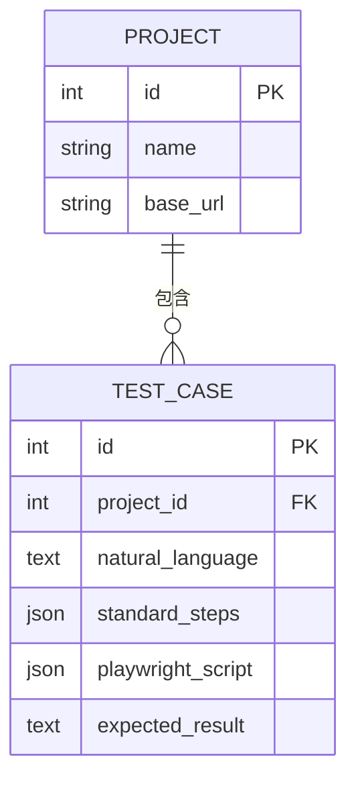
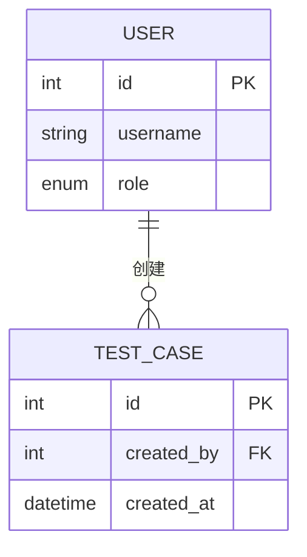
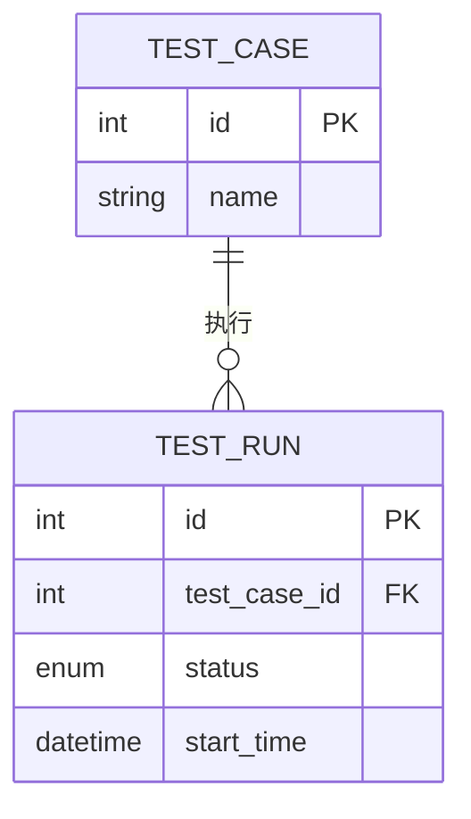
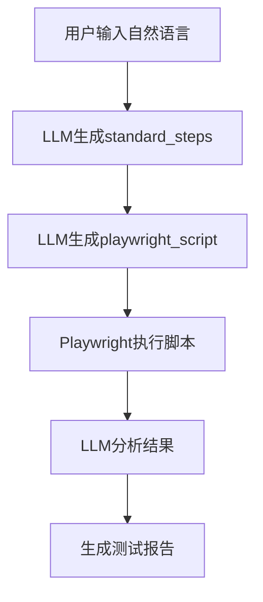
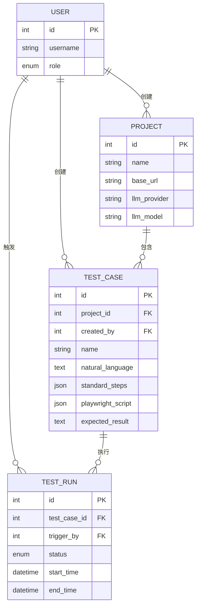

# 测试用例模型 (TestCase)

<cite>
**本文档引用的文件**   
- [test_case.py](file://backend/app/models/test_case.py)
- [project.py](file://backend/app/models/project.py)
- [user.py](file://backend/app/models/user.py)
- [test_run.py](file://backend/app/models/test_run.py)
- [llm_service.py](file://backend/app/services/llm_service.py)
- [playwright_executor.py](file://backend/app/services/playwright_executor.py)
- [test_cases.py](file://backend/app/api/endpoints/test_cases.py)
</cite>

## 目录
1. [简介](#简介)
2. [核心字段解析](#核心字段解析)
3. [关联关系分析](#关联关系分析)
4. [数据流转流程](#数据流转流程)
5. [示例用例解析](#示例用例解析)
6. [数据模型图](#数据模型图)

## 简介
`TestCase` 模型是自动化测试平台的核心实体，负责存储从自然语言描述到可执行Playwright脚本的完整测试用例信息。该模型设计支持“自然语言 → 标准化步骤 → 自动化脚本”的转换流程，实现了测试用例的智能化生成与执行。

**Section sources**
- [test_case.py](file://backend/app/models/test_case.py#L9-L28)

## 核心字段解析

### natural_language（自然语言描述）
该字段存储用户输入的原始自然语言描述，如“登录系统并检查首页是否正常加载”。这是整个自动化流程的起点，由用户通过前端界面输入。

### standard_steps（标准化步骤）
此字段以JSON格式存储由LLM（大语言模型）生成的结构化测试步骤。每个步骤包含操作类型（action）、选择器（selector）、输入值（value）等元数据，实现了对自然语言的语义解析和标准化。

### playwright_script（生成的Playwright脚本）
该字段以JSON格式存储最终可由Playwright引擎执行的脚本配置。它由`standard_steps`进一步转换而来，包含了浏览器类型、视口尺寸、具体操作指令等执行参数。

### expected_result（预期结果）
存储对测试用例执行后应达到状态的文本描述。该描述用于后续测试结果的自动判定，由LLM在生成`standard_steps`时一并生成。

**Section sources**
- [test_case.py](file://backend/app/models/test_case.py#L17-L20)
- [llm_service.py](file://backend/app/services/llm_service.py#L50-L150)

## 关联关系分析

### 与Project的关联（project_id）
`project_id` 是指向 `Project` 表的外键，建立了测试用例与所属项目的关联。当项目被删除时，其所有测试用例将通过 `ondelete="CASCADE"` 级联删除，确保数据一致性。



**Diagram sources**
- [test_case.py](file://backend/app/models/test_case.py#L14)
- [project.py](file://backend/app/models/project.py#L9-L27)

### 与User的关联（created_by）
`created_by` 是指向 `User` 表的外键，记录了创建该测试用例的用户。通过 `creator` 关系，可以追溯测试用例的创建者，并支持基于用户权限的访问控制。



**Diagram sources**
- [test_case.py](file://backend/app/models/test_case.py#L21)
- [user.py](file://backend/app/models/user.py#L16-L32)

### 与TestRun的一对多关系（test_runs）
`test_runs` 是一个一对多的关系，表示一个测试用例可以被多次执行，每次执行生成一条 `TestRun` 记录。通过 `cascade="all, delete-orphan"` 配置，当测试用例被删除时，其所有执行记录也将被自动清除。



**Diagram sources**
- [test_case.py](file://backend/app/models/test_case.py#L28)
- [test_run.py](file://backend/app/models/test_run.py#L25-L44)

## 数据流转流程
测试用例的数据流转遵循以下流程：
1. **输入**：用户在前端输入自然语言描述。
2. **标准化**：API调用`LLMService`，将自然语言转换为`standard_steps`。
3. **脚本生成**：再次调用`LLMService`，将`standard_steps`转换为`playwright_script`。
4. **执行**：`PlaywrightExecutor` 读取 `playwright_script` 并执行自动化测试。
5. **验证**：执行结果与 `expected_result` 比较，由LLM进行判定。



**Diagram sources**
- [llm_service.py](file://backend/app/services/llm_service.py#L50-L150)
- [playwright_executor.py](file://backend/app/services/playwright_executor.py#L50-L100)

## 示例用例解析
以“登录并检查首页”为例，各字段的数据形态如下：

- **natural_language**: `"用户使用正确的用户名和密码登录系统，验证首页是否正常显示。"`
- **standard_steps**: 
  ```json
  [
    {
      "index": 1,
      "action": "goto",
      "description": "打开登录页面",
      "value": "/login"
    },
    {
      "index": 2,
      "action": "fill",
      "description": "输入用户名",
      "selector": "#username",
      "value": "testuser"
    },
    {
      "index": 3,
      "action": "fill",
      "description": "输入密码",
      "selector": "#password",
      "value": "password123"
    },
    {
      "index": 4,
      "action": "click",
      "description": "点击登录按钮",
      "selector": "#login-button"
    },
    {
      "index": 5,
      "action": "assertVisible",
      "description": "验证首页加载",
      "selector": ".dashboard"
    }
  ]
  ```
- **playwright_script**: 
  ```json
  {
    "browser": "chromium",
    "viewport": {"width": 1280, "height": 720},
    "steps": [
      {"index": 1, "action": "goto", "value": "https://example.com/login", "screenshot": true},
      {"index": 2, "action": "fill", "selector": "#username", "value": "testuser", "screenshot": true}
    ]
  }
  ```
- **expected_result**: `"用户成功登录并跳转到首页，仪表板组件正常显示。"`

**Section sources**
- [test_cases.py](file://backend/app/api/endpoints/test_cases.py#L150-L200)
- [llm_service.py](file://backend/app/services/llm_service.py#L200-L250)

## 数据模型图


**Diagram sources**
- [test_case.py](file://backend/app/models/test_case.py#L9-L28)
- [project.py](file://backend/app/models/project.py#L9-L27)
- [user.py](file://backend/app/models/user.py#L16-L32)
- [test_run.py](file://backend/app/models/test_run.py#L25-L44)