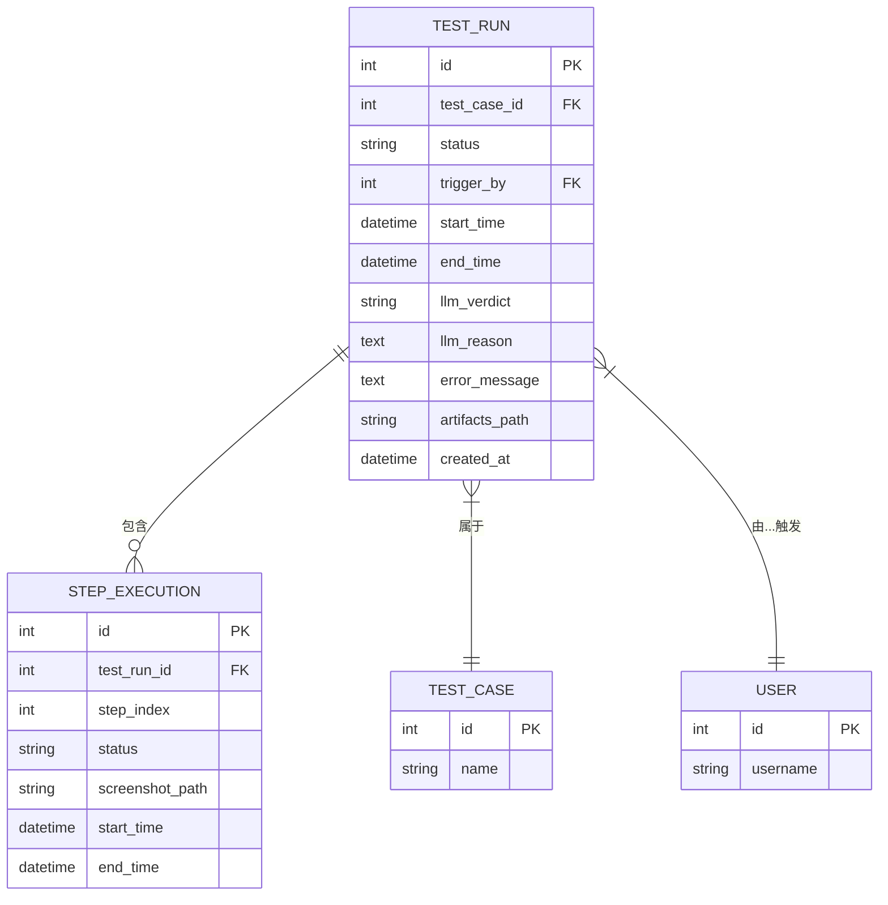
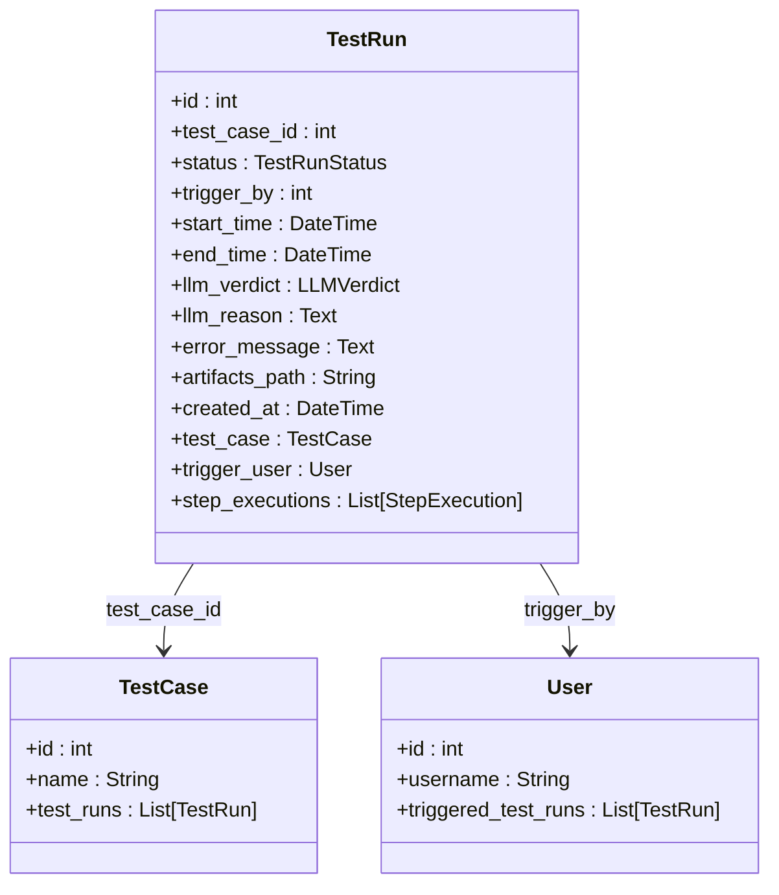
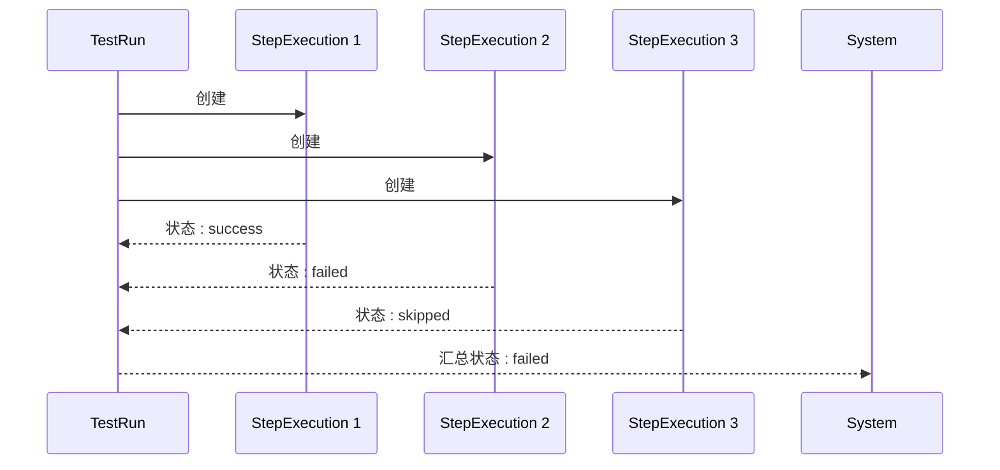

# 测试运行模型 (TestRun)

<cite>
**Referenced Files in This Document**   
- [test_run.py](file://backend/app/models/test_run.py)
- [step_execution.py](file://backend/app/models/step_execution.py)
- [test_run.py](file://backend/app/schemas/test_run.py)
- [test_case.py](file://backend/app/models/test_case.py)
- [user.py](file://backend/app/models/user.py)
</cite>

## 目录
1. [简介](#简介)
2. [核心数据结构](#核心数据结构)
3. [状态管理](#状态管理)
4. [时间与性能分析](#时间与性能分析)
5. [结果判定与工件](#结果判定与工件)
6. [关联关系](#关联关系)
7. [详细步骤追踪](#详细步骤追踪)
8. [示例分析](#示例分析)
9. [结论](#结论)

## 简介
`TestRun` 模型是自动化测试系统中的核心实体，用于记录每一次测试用例的执行实例。它不仅捕获了测试的最终结果，还通过与 `StepExecution` 模型的关联，提供了对执行过程的详细追踪能力。该模型的设计旨在支持全面的测试结果分析、性能监控和故障排查。

**Section sources**
- [test_run.py](file://backend/app/models/test_run.py#L25-L44)

## 核心数据结构
`TestRun` 模型定义了测试运行实例的所有关键属性。其核心字段包括唯一标识符、状态、触发信息、时间戳以及与测试用例和用户的关系。该模型通过外键和关系映射，构建了系统内各实体间的完整数据链路。

**Diagram sources**
- [test_run.py](file://backend/app/models/test_run.py#L25-L44)
- [step_execution.py](file://backend/app/models/step_execution.py#L17-L32)
- [test_case.py](file://backend/app/models/test_case.py#L9-L28)
- [user.py](file://backend/app/models/user.py#L16-L32)

**Section sources**
- [test_run.py](file://backend/app/models/test_run.py#L1-L45)

## 状态管理
`TestRun` 模型通过 `status` 字段精确地管理测试运行的生命周期。该字段使用 `TestRunStatus` 枚举类型，确保了状态值的规范性和一致性。

- **`status` (运行状态)**: 表示测试运行的当前状态。其可能的值包括：
  - `running`: 测试正在执行中。
  - `success`: 测试已成功完成。
  - `failed`: 测试因断言失败而未通过。
  - `error`: 测试因系统错误（如网络问题、脚本崩溃）而中断。

`llm_verdict` 和 `llm_reason` 字段则提供了由大型语言模型（LLM）进行的智能判定结果和推理过程。`llm_verdict` 使用 `LLMVerdict` 枚举（`passed`, `failed`, `unknown`），而 `llm_reason` 存储了详细的文本解释，这对于理解复杂或模糊的测试结果至关重要。

**Section sources**
- [test_run.py](file://backend/app/models/test_run.py#L27-L31)
- [test_run.py](file://backend/app/models/test_run.py#L35-L36)

## 时间与性能分析
`TestRun` 模型内置了强大的时间追踪功能，为性能分析提供了基础数据。

- **`start_time`**: 记录测试运行开始的精确时间戳。
- **`end_time`**: 记录测试运行结束的时间戳。该字段为可选，仅在测试启动后才被填充。

通过计算 `end_time` 与 `start_time` 的差值，可以得出测试运行的总耗时。这一指标对于监控测试套件的性能、识别缓慢的测试用例以及进行历史性能趋势分析至关重要。

**Section sources**
- [test_run.py](file://backend/app/models/test_run.py#L33-L34)

## 结果判定与工件
除了状态和时间信息，`TestRun` 模型还存储了详细的执行结果和相关工件。

- **`error_message`**: 当测试状态为 `failed` 或 `error` 时，此字段会存储具体的错误信息或异常堆栈，是故障排查的第一手资料。
- **`artifacts_path`**: 一个字符串字段，存储指向本次测试运行所产生的所有工件（Artifacts）的根路径。这些工件通常包括截图、日志文件、网络请求记录等，对于深入分析测试失败原因不可或缺。

**Section sources**
- [test_run.py](file://backend/app/models/test_run.py#L37-L38)

## 关联关系
`TestRun` 模型通过外键和关系映射，与其他核心模型紧密集成。

- **`test_case_id`**: 作为外键，关联到 `TestCase` 模型，明确指出本次运行是基于哪个测试用例。这种一对多的关系（一个测试用例可有多个运行记录）是数据分析的基础。
- **`trigger_by`**: 作为外键，关联到 `User` 模型，记录了触发本次测试运行的用户，用于审计和责任追踪。

**Diagram sources**
- [test_run.py](file://backend/app/models/test_run.py#L30-L32)
- [test_run.py](file://backend/app/models/test_run.py#L42-L43)
- [test_case.py](file://backend/app/models/test_case.py#L9-L28)
- [user.py](file://backend/app/models/user.py#L16-L32)

**Section sources**
- [test_run.py](file://backend/app/models/test_run.py#L30-L32)
- [test_run.py](file://backend/app/models/test_run.py#L42-L43)

## 详细步骤追踪
`TestRun` 模型的核心优势之一是其与 `StepExecution` 模型的一对多关系。

- **`step_executions`**: 该关系字段表示一个 `TestRun` 实例可以包含多个 `StepExecution` 记录。每个 `StepExecution` 记录了测试用例中一个具体步骤的执行详情，包括步骤描述、状态、截图路径和执行时间。这种结构化的设计使得系统能够提供粒度极细的执行报告，用户可以逐行查看测试的执行过程，极大地提升了调试效率。

**Diagram sources**
- [test_run.py](file://backend/app/models/test_run.py#L44)
- [step_execution.py](file://backend/app/models/step_execution.py#L17-L32)

**Section sources**
- [test_run.py](file://backend/app/models/test_run.py#L44)
- [step_execution.py](file://backend/app/models/step_execution.py#L17-L32)

## 示例分析
以下通过两个示例，对比成功与失败的测试运行。

### 成功的测试运行
- **`status`**: `success`
- **`llm_verdict`**: `passed`
- **`llm_reason`**: "所有步骤均按预期执行，最终页面状态与预期结果匹配。"
- **`error_message`**: `null`
- **`artifacts_path`**: `/artifacts/run_123/` (包含所有步骤的截图和日志)

### 失败的测试运行
- **`status`**: `failed`
- **`llm_verdict`**: `failed`
- **`llm_reason`**: "在步骤3中，'提交订单'按钮未按预期出现，导致后续步骤无法执行。"
- **`error_message`**: "ElementNotVisibleException: Unable to locate visible element 'submit-button'"
- **`artifacts_path`**: `/artifacts/run_124/` (包含失败步骤的截图，清晰显示按钮缺失)

通过对比，可以清晰地看到，失败的运行不仅有明确的错误信息，其 `llm_reason` 提供了更高级别的语义解释，而工件路径则指向了可视化的证据。

**Section sources**
- [test_run.py](file://backend/app/models/test_run.py#L31-L38)
- [test_run.py](file://backend/app/models/test_run.py#L35-L36)
- [test_run.py](file://backend/app/models/test_run.py#L37-L38)

## 结论
`TestRun` 模型是一个功能完备、设计精良的数据实体。它通过整合状态管理、时间追踪、智能判定、工件存储和详细的步骤关系，为自动化测试系统提供了坚实的数据基础。其结构化的数据不仅支持高效的执行监控，更为深入的结果分析和故障排查提供了强大的支持。