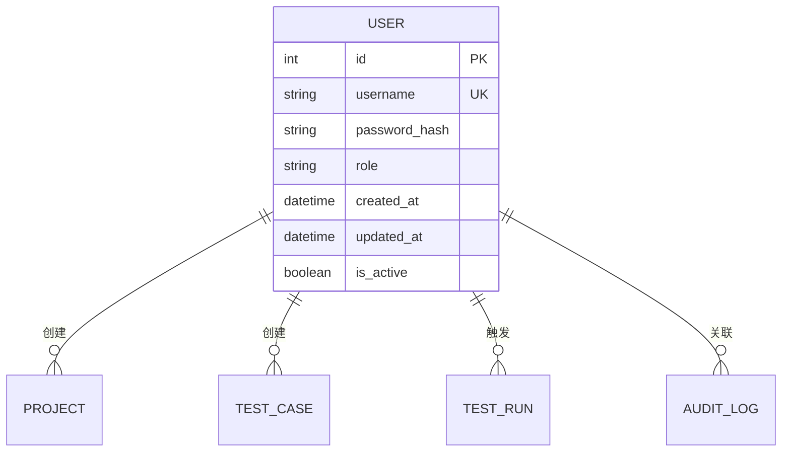
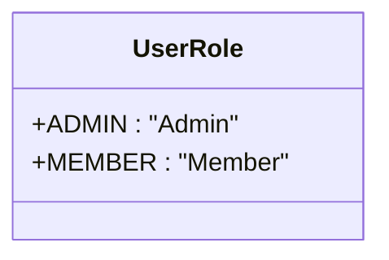
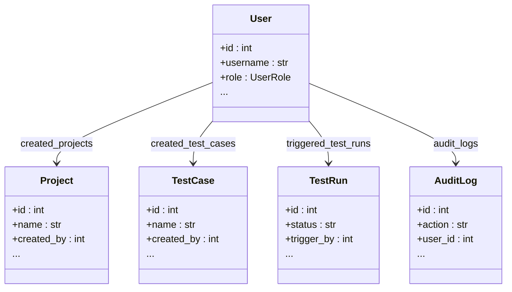

# 用户模型 (User)

<cite>
**Referenced Files in This Document**   
- [user.py](file://backend/app/models/user.py)
- [init_db.sql](file://backend/init_db.sql)
- [user.py](file://backend/app/schemas/user.py)
</cite>

## 目录
1. [简介](#简介)
2. [核心数据结构](#核心数据结构)
3. [字段定义与约束](#字段定义与约束)
4. [枚举类型](#枚举类型)
5. [模型关系](#模型关系)
6. [示例数据与业务生命周期](#示例数据与业务生命周期)
7. [数据访问模式与安全考虑](#数据访问模式与安全考虑)

## 简介
本文档详细描述了系统中的用户模型（User），该模型是整个平台身份认证和权限管理的核心。用户模型不仅定义了用户的基本信息，还通过关系映射连接了项目创建、测试用例管理、测试执行和审计日志等关键业务功能。本文档将深入解析其数据结构、字段约束、与其他模型的关系以及相关的安全实践。

## 核心数据结构

用户模型在数据库中对应 `user` 表，其核心结构由主键、唯一性约束、索引和关系字段组成。该模型的设计旨在支持高效的用户查询、安全的身份验证和清晰的权限控制。



**Diagram sources**
- [user.py](file://backend/app/models/user.py#L16-L32)
- [init_db.sql](file://backend/init_db.sql#L7-L18)

**Section sources**
- [user.py](file://backend/app/models/user.py#L16-L32)
- [init_db.sql](file://backend/init_db.sql#L7-L18)

## 字段定义与约束

用户模型包含以下核心字段，每个字段都设计有特定的含义和数据库约束。

| 字段名 | 数据类型 | 是否可为空 | 约束 | 说明 |
| :--- | :--- | :--- | :--- | :--- |
| `id` | INT | 否 | 主键, 自增, 索引 | 用户的唯一标识符，数据库自动生成。 |
| `username` | VARCHAR(50) | 否 | 唯一, 索引 | 用户的登录名，必须在系统中唯一，用于身份识别。 |
| `password_hash` | VARCHAR(255) | 否 | 无 | 存储用户密码的哈希值，明文密码绝不存储。 |
| `role` | ENUM('Admin', 'Member') | 否 | 索引 | 用户的角色，决定其在系统中的权限级别。 |
| `created_at` | DATETIME | 否 | 无 | 记录用户账户创建的时间戳。 |
| `updated_at` | DATETIME | 否 | 无 | 记录用户信息最后一次更新的时间戳，数据库自动更新。 |
| `is_active` | BOOLEAN | 否 | 无 | 标识用户账户是否处于激活状态，可用于禁用账户。 |

**Section sources**
- [user.py](file://backend/app/models/user.py#L20-L26)
- [init_db.sql](file://backend/init_db.sql#L7-L18)

### 设计目的
- **主键 (`id`)**: 确保每条用户记录的唯一性，是所有关系引用的基础。
- **唯一性约束 (`username`)**: 防止用户名冲突，保证每个用户都有唯一的登录凭证。
- **索引 (`username`, `role`, `id`)**: 极大提升基于用户名的登录查询、基于角色的权限检查以及基于ID的用户信息检索的性能。

## 枚举类型

系统定义了 `UserRole` 枚举类型来规范用户角色。



**Diagram sources**
- [user.py](file://backend/app/models/user.py#L10-L13)

**Section sources**
- [user.py](file://backend/app/models/user.py#L10-L13)

### 可能值及其权限含义
- **`Admin` (管理员)**: 拥有系统的最高权限。可以创建、修改和删除任何项目、测试用例；可以管理所有用户（包括创建、更新角色、禁用）；可以查看所有审计日志。
- **`Member` (成员)**: 拥有基本的使用权限。可以创建和管理自己所属的项目及测试用例；可以触发测试运行；但不能管理其他用户或修改系统级配置。

## 模型关系

用户模型通过一对多关系与其他核心业务模型相连，清晰地表达了用户的业务活动。



**Diagram sources**
- [user.py](file://backend/app/models/user.py#L29-L32)
- [project.py](file://backend/app/models/project.py#L9-L27)
- [test_case.py](file://backend/app/models/test_case.py#L9-L28)
- [test_run.py](file://backend/app/models/test_run.py#L25-L44)
- [audit_log.py](file://backend/app/models/audit_log.py#L9-L23)

**Section sources**
- [user.py](file://backend/app/models/user.py#L29-L32)

### 关系说明
- **`created_projects`**: 一个用户可以创建多个项目。此关系通过 `Project` 表的 `created_by` 外键指向 `User` 表的 `id` 来实现。
- **`created_test_cases`**: 一个用户可以创建多个测试用例。此关系通过 `TestCase` 表的 `created_by` 外键指向 `User` 表的 `id` 来实现。
- **`triggered_test_runs`**: 一个用户可以触发多次测试运行。此关系通过 `TestRun` 表的 `trigger_by` 外键指向 `User` 表的 `id` 来实现。
- **`audit_logs`**: 一个用户可以产生多条审计日志。此关系通过 `AuditLog` 表的 `user_id` 外键指向 `User` 表的 `id` 来实现。

## 示例数据与业务生命周期

以下是一个示例用户记录：

```json
{
  "id": 1,
  "username": "alice_dev",
  "role": "Member",
  "created_at": "2023-10-27T10:00:00Z",
  "updated_at": "2023-10-27T10:00:00Z",
  "is_active": true
}
```

### 业务生命周期示例
1.  **用户创建项目**: 当用户 `alice_dev` (id=1) 在前端创建一个新项目时，后端服务会创建一条 `Project` 记录，并将 `created_by` 字段设置为 `1`。这就在 `created_projects` 关系中建立了一条链接。
2.  **用户触发测试运行**: 当 `alice_dev` 手动触发一个测试用例的执行时，系统会创建一条 `TestRun` 记录，并将 `trigger_by` 字段设置为 `1`。这就在 `triggered_test_runs` 关系中建立了一条链接。
3.  **生成审计日志**: 上述的“创建项目”和“触发测试运行”操作都会被记录为审计日志。系统会创建 `AuditLog` 记录，并将 `user_id` 设置为 `1`，`action` 分别设置为 `create_project` 和 `trigger_test_run`。

**Section sources**
- [user.py](file://backend/app/models/user.py#L16-L32)
- [project.py](file://backend/app/models/project.py#L9-L27)
- [test_run.py](file://backend/app/models/test_run.py#L25-L44)
- [audit_log.py](file://backend/app/models/audit_log.py#L9-L23)

## 数据访问模式与安全考虑

### 数据访问模式
- **通过用户名查询**: 最常见的访问模式是根据 `username` 查询用户信息，用于登录验证。由于 `username` 字段上有索引，此查询非常高效。
- **通过ID查询**: 在内部服务调用或加载用户上下文时，通常通过 `id` 进行查询，同样受益于主键索引。

### 安全考虑
- **密码哈希存储**: 系统绝不存储明文密码。用户提交的密码会使用 `bcrypt` 等强哈希算法进行处理，生成的哈希值（`password_hash`）才被存储到数据库中。即使数据库泄露，攻击者也难以反推出原始密码。
- **输入验证**: 在创建或更新用户时，系统会通过 `UserCreate` 和 `UserUpdate` Schema 对输入进行严格验证，例如密码最小长度为8位，确保了数据的完整性和安全性。

**Section sources**
- [user.py](file://backend/app/models/user.py#L22)
- [user.py](file://backend/app/models/user.py#L15-L17)
- [user.py](file://backend/app/models/user.py#L38-L41)
- [init_db.sql](file://backend/init_db.sql#L13)