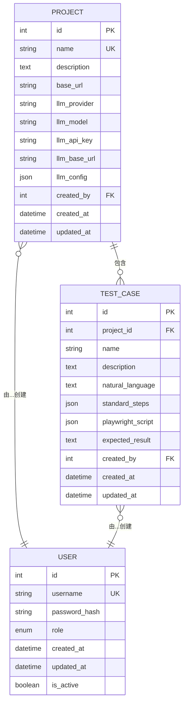

# 项目模型

<cite>
**本文档中引用的文件**   
- [project.py](file://backend\app\models\project.py) - *在提交b40b234中更新*
- [user.py](file://backend\app\models\user.py)
- [test_case.py](file://backend\app\models\test_case.py)
- [projects.py](file://backend\app\api\endpoints\projects.py)
- [project.py](file://backend\app\schemas\project.py) - *在提交b40b234中更新*
- [add_llm_base_url.py](file://backend\add_llm_base_url.py) - *在提交b40b234中新增*
</cite>

## 更新摘要
**已做更改**   
- 在“字段定义”部分添加了新的 `llm_base_url` 字段说明
- 在“LLM配置详解”部分更新了支持的LLM提供商列表，增加了 `dashscope` 和 `openai-completion`
- 在“项目示例”部分更新了JSON示例，包含 `llm_base_url` 字段
- 新增了关于 `llm_base_url` 字段用途和配置的详细说明
- 更新了所有受影响的文件来源注释，标记了最近的提交变更

## 目录
1. [项目模型概述](#项目模型概述)
2. [字段定义](#字段定义)
3. [数据完整性与约束](#数据完整性与约束)
4. [LLM配置详解](#llm配置详解)
5. [关联关系](#关联关系)
6. [项目示例](#项目示例)
7. [核心作用](#核心作用)

## 项目模型概述

项目模型（Project）是系统中的核心实体，用于组织和管理自动化测试相关的所有配置与资源。每个项目都包含特定的测试环境配置、大语言模型（LLM）集成参数以及其下关联的测试用例。项目为用户提供了一个隔离的工作空间，确保不同应用或模块的测试活动互不干扰。

**Section sources**
- [project.py](file://backend\app\models\project.py#L9-L29) - *更新了模型定义*

## 字段定义

项目模型包含以下字段，用于存储项目的关键信息：

| 字段名 | 数据类型 | 是否可为空 | 描述 |
| :--- | :--- | :--- | :--- |
| `id` | Integer | 否 | 项目的唯一标识符，主键，自增。 |
| `name` | String(100) | 否 | 项目名称，具有唯一性约束，用于标识项目。 |
| `description` | Text | 是 | 项目的详细描述，可为空。 |
| `base_url` | String(500) | 否 | 测试目标应用的基础URL，用于构建完整的测试请求地址。 |
| `llm_provider` | String(50) | 否 | 使用的LLM服务提供商，如 "openai"、"anthropic"、"dashscope" 或 "openai-completion"。 |
| `llm_model` | String(100) | 否 | 使用的LLM模型名称，如 "gpt-4"、"claude-3-opus" 或 "qwen-plus"。 |
| `llm_api_key` | String(255) | 否 | LLM服务的API密钥，已加密存储以确保安全。 |
| `llm_base_url` | String(500) | 是 | LLM API的自定义基础URL，用于支持代理、自部署模型或第三方服务。留空则使用默认URL。 |
| `llm_config` | JSON | 是 | LLM的详细配置选项，以JSON格式存储。 |
| `created_by` | Integer | 否 | 创建该项目的用户的ID，外键关联到用户表。 |
| `created_at` | DateTime | 否 | 项目创建的时间戳，自动填充。 |
| `updated_at` | DateTime | 否 | 项目最后更新的时间戳，更新时自动刷新。 |

**Section sources**
- [project.py](file://backend\app\models\project.py#L9-L29) - *新增了llm_base_url字段*
- [project.py](file://backend\app\schemas\project.py#L18-L32) - *更新了Schema定义*

## 数据完整性与约束

为确保数据的准确性和一致性，项目模型实施了以下约束：

1.  **唯一性约束 (Uniqueness Constraint)**：`name` 字段被设置为唯一 (`unique=True`)。这意味着数据库中不能存在两个同名的项目。此约束在创建和更新项目时通过API端点进行验证，如果尝试创建或重命名为一个已存在的项目名，系统将返回 "项目名已存在" 的错误。

2.  **非空约束 (Not Null Constraint)**：`name`、`base_url`、`llm_provider`、`llm_model` 和 `llm_api_key` 等关键字段均被设置为不可为空 (`nullable=False`)，确保了项目配置的完整性。

3.  **索引 (Index)**：`name`、`created_by` 和 `id` 字段均建立了索引，以加速基于这些字段的查询操作。

**Section sources**
- [project.py](file://backend\app\models\project.py#L11-L12)
- [projects.py](file://backend\app\api\endpoints\projects.py#L34-L39)

## LLM配置详解

`llm_config` 字段是一个JSON类型的字段，允许用户为每个项目灵活地配置LLM的行为参数。其结构在 `schemas/project.py` 中定义为 `LLMConfig` 模型。

### 支持的LLM提供商和模型

系统通过 `llm_provider` 和 `llm_model` 字段支持多种LLM服务。常见的组合包括：
-   **OpenAI**: `llm_provider` 为 "openai"，`llm_model` 可为 "gpt-4", "gpt-4-turbo", "gpt-3.5-turbo" 等。
-   **Anthropic**: `llm_provider` 为 "anthropic"，`llm_model` 可为 "claude-3-opus", "claude-3-sonnet", "claude-3-haiku" 等。
-   **阿里云百炼 (DashScope)**: `llm_provider` 为 "dashscope"，`llm_model` 可为 "qwen-plus", "qwen-turbo", "qwen-max" 等。
-   **OpenAI Completion API**: `llm_provider` 为 "openai-completion"，`llm_model` 可为 "gpt-3.5-turbo-instruct" 等。

### LLMConfig 结构

`llm_config` JSON对象支持以下可选配置项：

| 配置项 | 数据类型 | 默认值 | 描述 |
| :--- | :--- | :--- | :--- |
| `temperature` | float | 0.7 | 控制输出的随机性。值越低，输出越确定；值越高，输出越随机。范围：0.0 - 2.0。 |
| `max_tokens` | int | 2000 | 生成响应时允许的最大token数量。 |
| `top_p` | float | 1.0 | 核采样（Nucleus Sampling）的参数。模型考虑概率质量达到top_p的最小token集合。范围：0.0 - 1.0。 |

### 自定义LLM API基础URL

新增的 `llm_base_url` 字段允许用户为LLM API配置自定义的基础URL。这在以下场景中非常有用：
- 使用代理服务访问LLM API
- 连接到自部署的、兼容OpenAI API格式的模型服务
- 使用第三方中转服务
- 访问内网部署的模型服务

如果 `llm_base_url` 为空，则系统将使用各提供商的默认URL：
- **OpenAI**: `https://api.openai.com/v1`
- **Anthropic**: `https://api.anthropic.com`
- **阿里云百炼**: `https://dashscope.aliyuncs.com/compatible-mode/v1`



**Diagram sources**
- [project.py](file://backend\app\models\project.py#L9-L29) - *更新了模型定义*
- [user.py](file://backend\app\models\user.py#L16-L32)
- [test_case.py](file://backend\app\models\test_case.py#L9-L28)

## 关联关系

项目模型通过外键和关系映射与其他模型紧密关联。

### 与用户模型 (User) 的关联

`created_by` 字段是一个外键，引用 `user` 表的 `id` 字段。这建立了项目与创建它的用户之间的关联。
-   **数据库关系**：`created_by = Column(Integer, ForeignKey("user.id"))`
-   **ORM关系**：`creator = relationship("User", back_populates="created_projects", foreign_keys=[created_by])`
-   **反向关系**：在 `User` 模型中，`created_projects` 关系允许通过一个用户获取其创建的所有项目。

### 与测试用例模型 (TestCase) 的关联

项目与测试用例之间存在一对多的关系。
-   **数据库关系**：在 `TestCase` 模型中，`project_id` 字段是外键，引用 `project` 表的 `id` 字段，并设置了 `ondelete="CASCADE"`。
-   **ORM关系**：在 `Project` 模型中，`test_cases = relationship("TestCase", back_populates="project", cascade="all, delete-orphan")` 定义了该关系。
-   **级联删除行为**：`cascade="all, delete-orphan"` 和 `ondelete="CASCADE"` 共同确保了**级联删除**行为。当一个项目被删除时，其下所有的测试用例将被自动且彻底地删除，从而维护了数据的完整性。

**Section sources**
- [project.py](file://backend\app\models\project.py#L25-L29) - *更新了关系定义*
- [test_case.py](file://backend\app\models\test_case.py#L11-L12)
- [user.py](file://backend\app\models\user.py#L30-L31)

## 项目示例

以下是一个配置使用OpenAI GPT-4模型的项目示例：

```json
{
  "id": 1,
  "name": "电商网站测试项目",
  "description": "用于测试XYZ电商平台的自动化测试项目。",
  "base_url": "https://www.xyz-ecommerce.com",
  "llm_provider": "openai",
  "llm_model": "gpt-4",
  "llm_api_key": "***",
  "llm_base_url": "https://proxy.com/v1",
  "llm_config": {
    "temperature": 0.5,
    "max_tokens": 1500,
    "top_p": 0.9
  },
  "created_by": 101,
  "created_at": "2023-10-27T08:00:00Z",
  "updated_at": "2023-10-27T08:00:00Z"
}
```

此配置将使用OpenAI的GPT-4模型，通过代理服务（`llm_base_url`）进行访问，并以较低的随机性（temperature=0.5）和较高的top_p值来生成更可靠、更聚焦的测试用例。

**Section sources**
- [project.py](file://backend\app\models\project.py#L9-L29) - *更新了模型定义*
- [project.py](file://backend\app\schemas\project.py#L34-L52) - *更新了Schema定义*

## 核心作用

项目在测试用例生成流程中扮演着**核心配置中心**的角色。当用户请求为某个项目生成测试用例时，系统会：
1.  根据项目ID从数据库中加载该项目的完整配置。
2.  提取 `llm_provider`、`llm_model`、`llm_api_key`、`llm_base_url` 和 `llm_config` 等信息。
3.  使用这些配置初始化LLM服务客户端。
4.  将用户提供的应用信息（结合 `base_url`）和生成指令发送给LLM。
5.  LLM根据其模型能力和配置参数，生成符合要求的自然语言测试用例和Playwright脚本。

因此，项目模型是连接用户需求、测试目标和LLM能力的桥梁，其配置直接决定了测试用例生成的质量和效率。

**Section sources**
- [project.py](file://backend\app\models\project.py#L9-L29) - *更新了模型定义*
- [projects.py](file://backend\app\api\endpoints\projects.py#L45-L67)
- [test_case.py](file://backend\app\models\test_case.py#L9-L28)