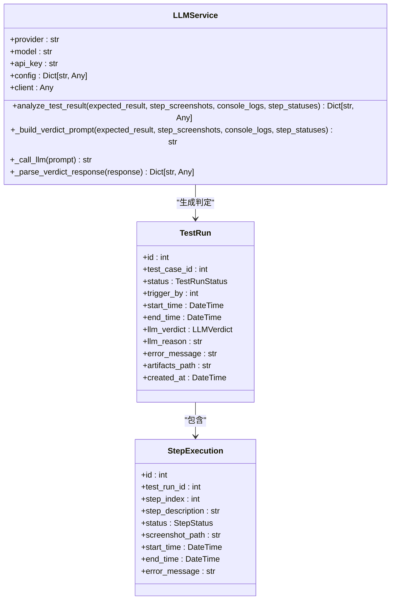
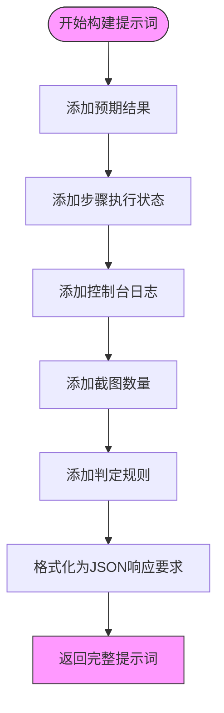
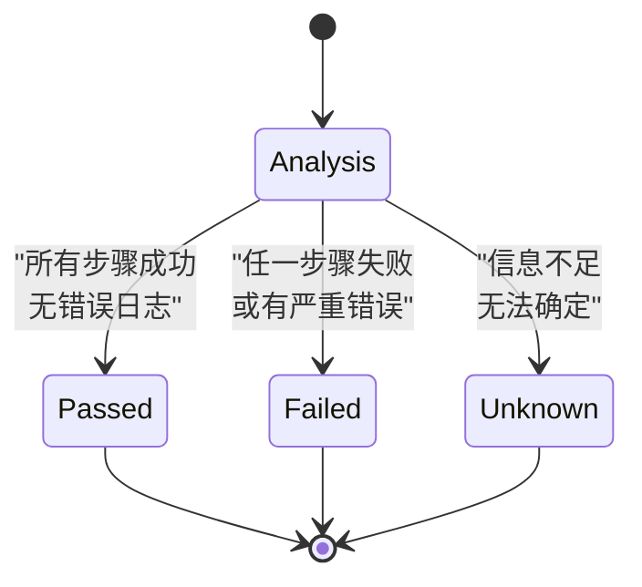
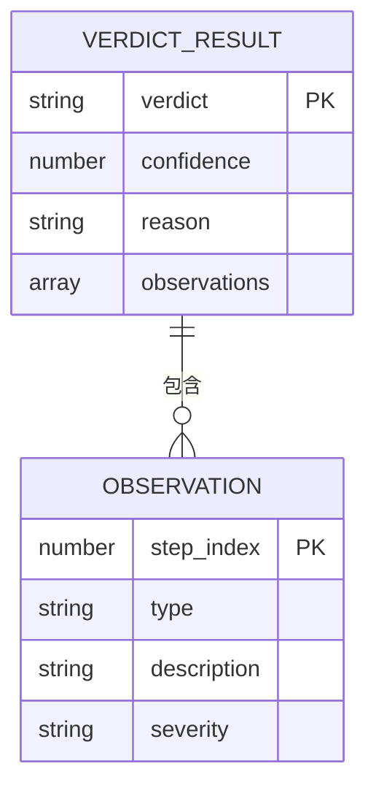

# LLM结果判定机制

<cite>
**Referenced Files in This Document**   
- [llm_service.py](file://backend/app/services/llm_service.py)
- [test_runs.py](file://backend/app/api/endpoints/test_runs.py)
- [test_run.py](file://backend/app/models/test_run.py)
- [step_execution.py](file://backend/app/models/step_execution.py)
- [test_case.py](file://backend/app/models/test_case.py)
- [test_run.py](file://backend/app/schemas/test_run.py)
</cite>

## 目录
1. [引言](#引言)
2. [核心组件分析](#核心组件分析)
3. [输入参数解析](#输入参数解析)
4. [判定提示词构造](#判定提示词构造)
5. [判定规则体系](#判定规则体系)
6. [判定结果结构](#判定结果结构)
7. [智能分析机制](#智能分析机制)
8. [置信度评估](#置信度评估)
9. [优化方向](#优化方向)
10. [结论](#结论)

## 引言
LLM结果判定机制是自动化测试系统中的核心智能组件，通过大语言模型对测试执行结果进行智能分析和判定。该机制接收多源数据作为输入，包括预期结果、步骤截图、控制台日志和执行状态等，通过精心设计的提示词工程引导LLM进行综合分析，最终输出结构化的判定结果。这种机制显著减少了人工验证成本，提高了测试结果分析的准确性和效率。

## 核心组件分析
LLM结果判定机制的核心实现位于`LLMService`类中，特别是`analyze_test_result`方法。该机制与测试执行流程紧密集成，当测试运行完成后，系统会自动调用此方法进行结果判定。

**Diagram sources**
- [llm_service.py](file://backend/app/services/llm_service.py#L71-L92)
- [test_run.py](file://backend/app/models/test_run.py#L1-L45)
- [step_execution.py](file://backend/app/models/step_execution.py#L1-L33)

**Section sources**
- [llm_service.py](file://backend/app/services/llm_service.py#L71-L92)
- [test_run.py](file://backend/app/models/test_run.py#L1-L45)

## 输入参数解析
`analyze_test_result`方法接收四个关键输入参数，这些参数共同构成了LLM分析的完整上下文。

### 预期结果
预期结果参数提供了测试的基准标准，描述了测试成功时应该达到的状态。该参数直接来源于测试用例定义中的`expected_result`字段。

**Section sources**
- [test_case.py](file://backend/app/models/test_case.py#L20-L20)

### 步骤截图路径
步骤截图路径列表包含了测试执行过程中关键步骤的视觉证据。这些截图作为多模态输入，为LLM提供视觉分析依据。

**Section sources**
- [step_execution.py](file://backend/app/models/step_execution.py#L1-L33)

### 控制台日志
控制台日志参数包含了测试执行过程中的文本输出信息，包括调试信息、警告和错误消息等。系统仅传递最后20条日志以控制上下文长度。

**Section sources**
- [test_runs.py](file://backend/app/api/endpoints/test_runs.py#L95-L124)

### 执行状态
执行状态参数是一个包含每个测试步骤详细信息的字典列表，包括步骤索引、描述、状态、开始和结束时间以及错误消息等。

**Section sources**
- [step_execution.py](file://backend/app/models/step_execution.py#L1-L33)

## 判定提示词构造
`_build_verdict_prompt`方法负责构造传递给LLM的提示词，这是整个判定机制的关键环节。

**Diagram sources**
- [llm_service.py](file://backend/app/services/llm_service.py#L254-L299)

**Section sources**
- [llm_service.py](file://backend/app/services/llm_service.py#L254-L299)

## 判定规则体系
系统采用明确的判定规则来指导LLM进行结果分析，确保判定的一致性和可预测性。

### 通过规则
当所有测试步骤均成功执行且控制台日志中无明显错误时，判定结果为"通过"。这表示测试完全符合预期。

### 失败规则
如果任一测试步骤执行失败或控制台日志中存在严重错误，判定结果为"失败"。这表示测试未达到预期目标。

### 未知规则
当输入信息不足以做出明确判断时，判定结果为"未知"。这种情况可能发生在日志信息不完整或截图质量不佳时。

**Diagram sources**
- [llm_service.py](file://backend/app/services/llm_service.py#L271-L299)

**Section sources**
- [llm_service.py](file://backend/app/services/llm_service.py#L271-L299)

## 判定结果结构
LLM返回的判定结果遵循预定义的JSON结构，包含四个核心字段。

### 判定结果
`verdict`字段表示最终的判定结果，取值为"passed"、"failed"或"unknown"，直接对应判定规则体系。

### 置信度
`confidence`字段表示LLM对判定结果的信心程度，数值范围为0-1，反映了分析的确定性。

### 判定理由
`reason`字段包含详细的文本说明，解释做出该判定的具体原因和分析过程。

### 观察记录
`observations`字段是一个数组，记录了在分析过程中发现的具体问题或成功点，包括步骤索引、观察类型、描述和严重程度。

**Diagram sources**
- [llm_service.py](file://backend/app/services/llm_service.py#L271-L299)
- [test_run.py](file://backend/app/schemas/test_run.py#L1-L53)

**Section sources**
- [llm_service.py](file://backend/app/services/llm_service.py#L271-L299)
- [test_run.py](file://backend/app/schemas/test_run.py#L1-L53)

## 智能分析机制
LLM结果判定机制通过整合多源数据实现了智能测试结果分析，显著减少了人工验证成本。

### 数据整合
系统将结构化数据（执行状态）、非结构化数据（日志）和视觉数据（截图）整合为统一的分析上下文，使LLM能够进行全面的综合分析。

### 自动化集成
判定过程完全自动化，与测试执行流程无缝集成。测试运行完成后，系统自动触发判定流程，无需人工干预。

### 错误处理
机制包含完善的错误处理能力，当LLM调用失败时，系统会记录错误信息并将判定结果标记为"未知"。

**Section sources**
- [test_runs.py](file://backend/app/api/endpoints/test_runs.py#L95-L124)

## 置信度评估
置信度评估是判定结果的重要组成部分，反映了LLM对分析结论的确定程度。

### 影响因素
置信度受多种因素影响，包括输入数据的完整性、日志的清晰度、截图的质量以及步骤状态的一致性等。

### 动态调整
理想情况下，置信度应根据分析过程中的确定性动态调整。例如，当发现明确的错误证据时，失败判定的置信度应接近1。

**Section sources**
- [llm_service.py](file://backend/app/services/llm_service.py#L271-L299)

## 优化方向
为进一步提升LLM结果判定机制的准确率，可以考虑以下优化方向。

### 多模态增强
当前实现仅传递截图路径，未来可考虑将截图以base64编码直接嵌入提示词，使LLM能够直接分析视觉内容。

### 上下文优化
优化日志截取策略，确保传递最具诊断价值的日志信息，而非简单的最后N条。

### 规则细化
进一步细化判定规则，增加更多中间状态和条件判断，提高判定的粒度和准确性。

### 反馈学习
建立反馈机制，将人工验证结果作为训练数据，持续优化提示词和判定逻辑。

## 结论
LLM结果判定机制通过智能化的方式解决了传统测试结果分析的痛点，实现了高效、准确的自动化判定。该机制通过精心设计的提示词工程和明确的判定规则，引导LLM对多源测试数据进行综合分析，输出结构化的判定结果。这不仅显著减少了人工验证成本，还提高了测试分析的一致性和可追溯性。未来通过多模态增强和持续优化，该机制有望达到更高的准确率和可靠性，成为自动化测试体系中的核心智能组件。