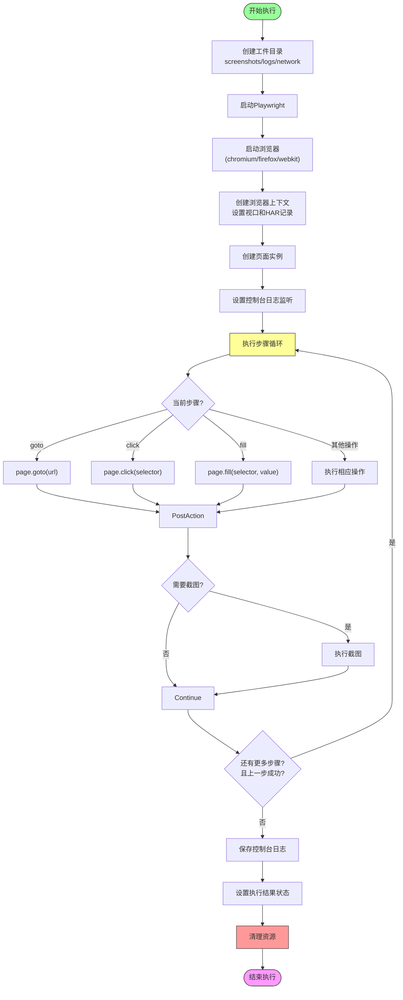
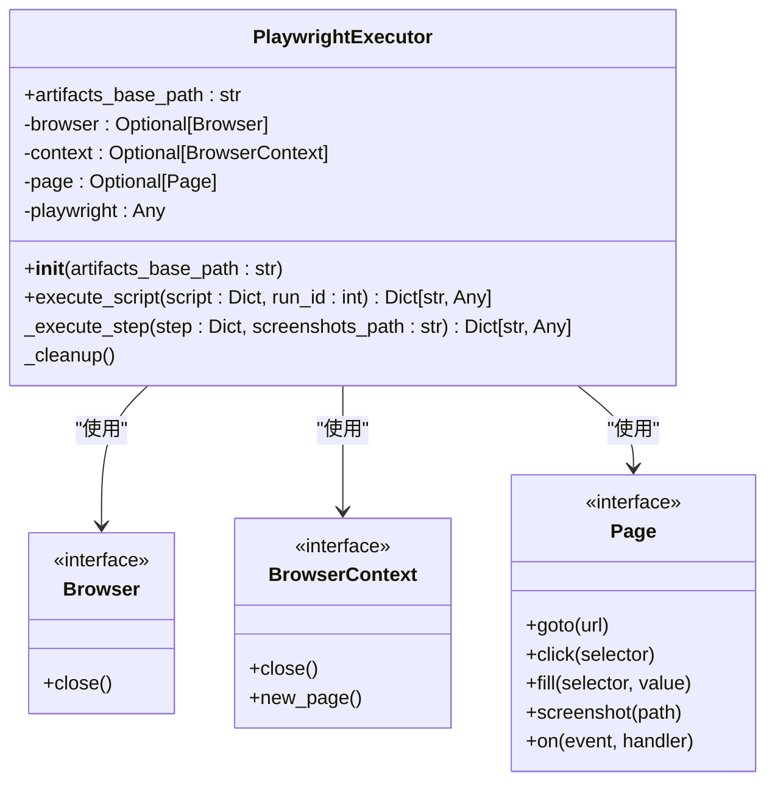
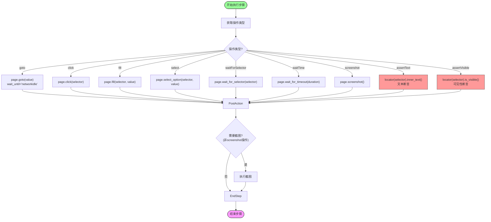
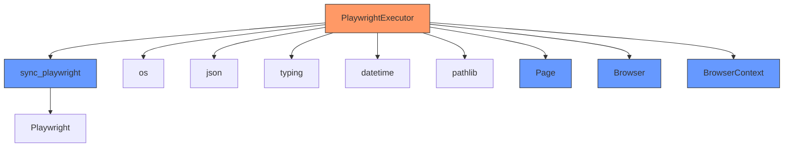
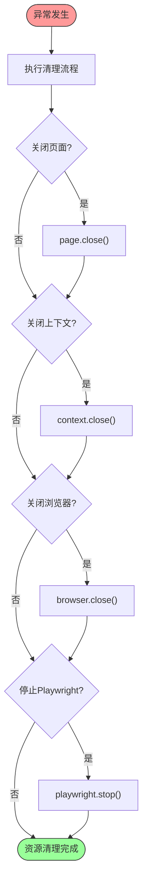

# Playwright执行引擎

<cite>
**Referenced Files in This Document**   
- [playwright_executor.py](file://backend/app/services/playwright_executor.py)
- [test_runs.py](file://backend/app/api/endpoints/test_runs.py)
</cite>

## 目录
1. [简介](#简介)
2. [核心组件](#核心组件)
3. [执行流程架构](#执行流程架构)
4. [详细组件分析](#详细组件分析)
5. [依赖分析](#依赖分析)
6. [性能优化建议](#性能优化建议)
7. [故障排查指南](#故障排查指南)
8. [结论](#结论)

## 简介
Playwright执行引擎是自动化测试系统的核心组件，负责执行基于Playwright框架的浏览器自动化脚本。该引擎通过PlaywrightExecutor类实现，能够加载脚本配置、驱动浏览器执行各种自动化操作，并管理执行过程中的工件和资源。引擎支持多种浏览器类型和headless模式运行，提供完整的错误处理和资源清理机制。

## 核心组件
Playwright执行引擎的核心是PlaywrightExecutor类，该类负责整个脚本的执行流程。引擎通过execute_script方法接收脚本配置和运行ID，然后初始化执行环境，创建必要的工件目录，并按顺序执行脚本中的各个步骤。执行过程中，引擎会监控每个步骤的状态，一旦发现失败步骤立即中断执行流程。执行完成后，无论成功或失败，都会通过_cleanup方法清理所有浏览器资源，确保系统稳定性。

**Section sources**
- [playwright_executor.py](file://backend/app/services/playwright_executor.py#L11-L213)

## 执行流程架构



**Diagram sources**
- [playwright_executor.py](file://backend/app/services/playwright_executor.py#L27-L120)

**Section sources**
- [playwright_executor.py](file://backend/app/services/playwright_executor.py#L27-L120)

## 详细组件分析

### PlaywrightExecutor类分析

#### 类结构图


**Diagram sources**
- [playwright_executor.py](file://backend/app/services/playwright_executor.py#L11-L213)

#### execute_script方法执行流程

```mermaid
sequenceDiagram
participant Executor as PlaywrightExecutor
participant Playwright as sync_playwright
participant Browser as Browser
participant Context as BrowserContext
participant Page as Page
participant FS as 文件系统
Executor->>FS : 创建工件目录<br/>(screenshots/logs/network)
Executor->>Playwright : start()
Executor->>Executor : 获取浏览器类型
alt chromium
Executor->>Browser : chromium.launch(headless=True)
else firefox
Executor->>Browser : firefox.launch(headless=True)
else webkit
Executor->>Browser : webkit.launch(headless=True)
else 默认
Executor->>Browser : chromium.launch(headless=True)
end
Executor->>Context : new_context(viewport, record_har_path)
Executor->>Page : new_page()
Executor->>Page : on("console", handle_console)
loop 每个步骤
Executor->>Executor : _execute_step(step)
alt 步骤失败
break
end
end
Executor->>FS : 保存控制台日志
Executor->>Executor : 设置执行结果状态
finally
Executor->>Executor : _cleanup()
end
Executor-->>Executor : 返回执行结果
Note over Executor,FS : 所有操作在try-catch-finally块中执行
```

**Diagram sources**
- [playwright_executor.py](file://backend/app/services/playwright_executor.py#L27-L120)

**Section sources**
- [playwright_executor.py](file://backend/app/services/playwright_executor.py#L27-L120)

### _execute_step方法分析

#### 支持的操作类型流程图


**Diagram sources**
- [playwright_executor.py](file://backend/app/services/playwright_executor.py#L122-L199)

**Section sources**
- [playwright_executor.py](file://backend/app/services/playwright_executor.py#L122-L199)

## 依赖分析



**Diagram sources**
- [playwright_executor.py](file://backend/app/services/playwright_executor.py#L1-L10)

**Section sources**
- [playwright_executor.py](file://backend/app/services/playwright_executor.py#L1-L10)

## 性能优化建议

1. **超时设置**: 为每个操作设置合理的超时时间，避免因等待过长导致执行时间过久。默认超时为30秒，可根据实际网络状况调整。

2. **视口配置**: 根据测试需求配置合适的视口大小，避免使用过大的分辨率增加渲染负担。默认配置为1280x720。

3. **资源释放**: 确保在执行完成后及时释放浏览器资源，防止内存泄漏。引擎已通过finally块确保_cleanup方法总是被调用。

4. **HAR记录**: 仅在需要网络分析时启用HAR记录，因为记录网络流量会增加磁盘I/O和内存使用。

5. **并发控制**: 避免同时启动过多浏览器实例，应根据服务器资源合理控制并发执行的测试数量。

6. **截图策略**: 合理配置截图策略，避免每个步骤都截图导致磁盘空间快速耗尽。

**Section sources**
- [playwright_executor.py](file://backend/app/services/playwright_executor.py#L27-L120)

## 故障排查指南

### 常见执行错误及解决方案

| 错误类型 | 可能原因 | 解决方案 |
|--------|--------|--------|
| 浏览器启动失败 | Playwright未正确安装或缺少依赖 | 运行`playwright install`安装浏览器和依赖 |
| 元素定位失败 | 选择器不正确或页面未完全加载 | 检查选择器语法，增加等待时间或使用waitForSelector |
| 超时错误 | 网络延迟或页面加载缓慢 | 增加操作超时时间，检查网络连接 |
| 内存不足 | 同时运行过多测试实例 | 减少并发数量，优化测试脚本 |
| 文件权限错误 | 工件目录无写入权限 | 检查目录权限，确保执行用户有写入权限 |
| HAR记录失败 | 磁盘空间不足 | 清理旧的工件文件，增加磁盘空间 |

### 资源清理流程
当执行过程中发生异常时，引擎会通过finally块确保_cleanup方法被调用，按顺序关闭页面、上下文、浏览器实例，并停止Playwright，防止资源泄漏。



**Diagram sources**
- [playwright_executor.py](file://backend/app/services/playwright_executor.py#L201-L213)

**Section sources**
- [playwright_executor.py](file://backend/app/services/playwright_executor.py#L201-L213)

## 结论
Playwright执行引擎通过PlaywrightExecutor类提供了完整的浏览器自动化执行能力。引擎设计考虑了稳定性、可维护性和资源管理，通过合理的异常处理和资源清理机制确保了长时间运行的可靠性。支持多种浏览器类型和丰富的操作指令，能够满足大多数Web自动化测试需求。通过合理的性能优化和错误处理策略，可以有效提升测试执行的效率和稳定性。