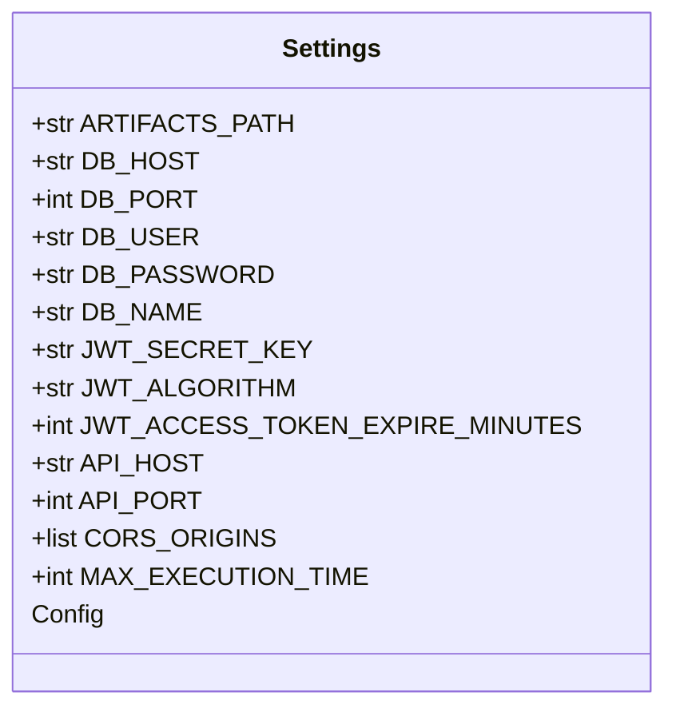
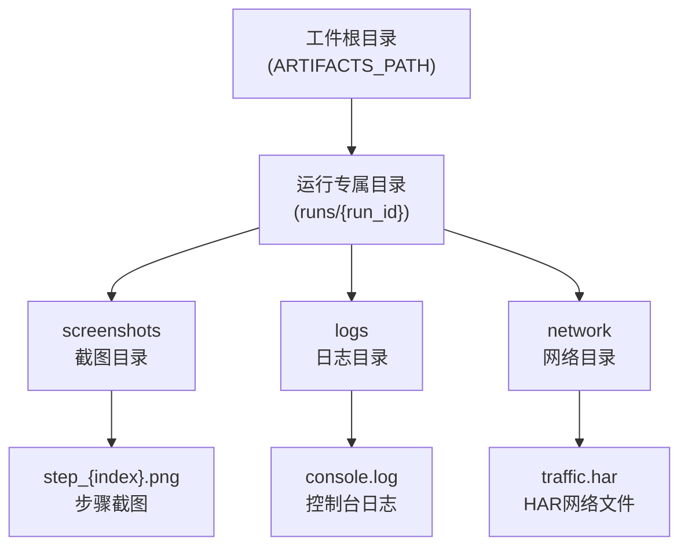
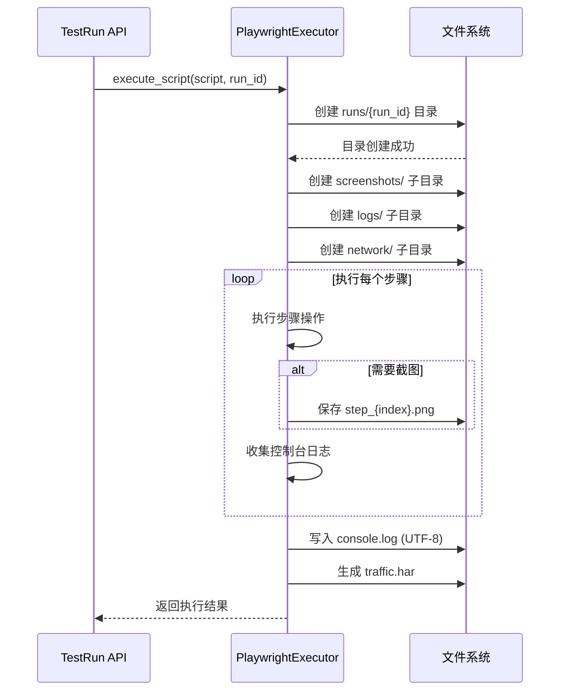
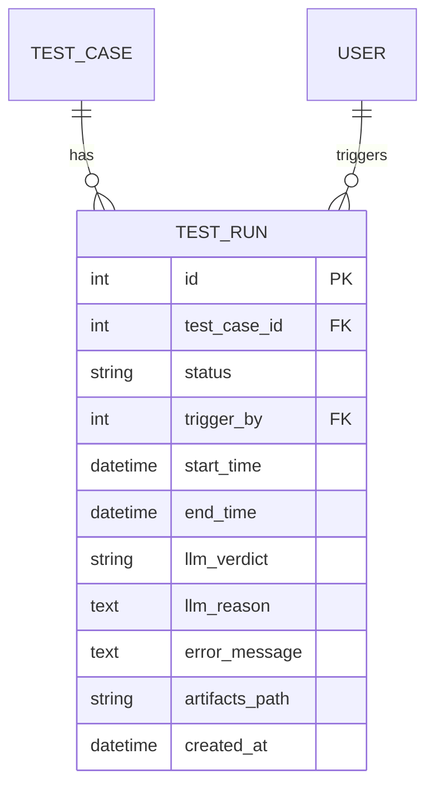

# 工件管理系统

<cite>
**Referenced Files in This Document**   
- [config.py](file://backend/app/config.py)
- [playwright_executor.py](file://backend/app/services/playwright_executor.py)
- [test_run.py](file://backend/app/models/test_run.py)
- [test_runs.py](file://backend/app/api/endpoints/test_runs.py)
- [TestRunDetail.vue](file://frontend/src/views/TestRunDetail.vue)
</cite>

## 目录
1. [简介](#简介)
2. [配置与路径管理](#配置与路径管理)
3. [工件目录结构](#工件目录结构)
4. [工件生成机制](#工件生成机制)
5. [工件路径引用](#工件路径引用)
6. [存储管理建议](#存储管理建议)
7. [结论](#结论)

## 简介
工件管理系统是自动化测试平台的核心组件，负责在测试执行过程中生成、组织和管理各类测试证据文件。系统通过配置驱动的方式，定义工件存储的基础路径，并在每次测试运行时动态创建专属目录结构，确保测试数据的隔离性和可追溯性。本系统主要管理三类关键工件：步骤截图、控制台日志和网络流量记录（HAR文件），这些工件共同构成了完整的测试证据链，为测试结果分析和问题排查提供有力支持。

## 配置与路径管理
工件存储的基础路径通过配置文件进行定义，系统在启动时加载该配置，并在测试执行过程中使用该路径作为所有工件的根目录。



**Diagram sources**
- [config.py](file://backend/app/config.py#L25-L41)

**Section sources**
- [config.py](file://backend/app/config.py#L25-L41)

## 工件目录结构
系统采用层次化的目录结构来组织工件文件，确保每个测试运行的工件都独立存储，避免数据混淆。



**Diagram sources**
- [playwright_executor.py](file://backend/app/services/playwright_executor.py#L30-L34)

**Section sources**
- [playwright_executor.py](file://backend/app/services/playwright_executor.py#L30-L34)

## 工件生成机制
工件的生成由PlaywrightExecutor在执行测试脚本时动态完成，系统在运行开始时创建完整的目录结构，并在执行过程中按规则写入各类工件。

### 工件创建流程


**Diagram sources**
- [playwright_executor.py](file://backend/app/services/playwright_executor.py#L30-L34)
- [playwright_executor.py](file://backend/app/services/playwright_executor.py#L100-L105)
- [playwright_executor.py](file://backend/app/services/playwright_executor.py#L60-L62)

**Section sources**
- [playwright_executor.py](file://backend/app/services/playwright_executor.py#L27-L120)

### 截图命名规范
系统采用统一的命名规则来管理步骤截图，确保文件名的可预测性和有序性。

**截图命名规则**
- **格式**: `step_{index}.png`
- **示例**: `step_1.png`, `step_2.png`, `step_3.png`
- **特点**: 
  - 基于步骤索引，保证顺序性
  - 统一PNG格式，兼容性好
  - 简洁明了，易于识别

**Section sources**
- [playwright_executor.py](file://backend/app/services/playwright_executor.py#L168-L171)
- [playwright_executor.py](file://backend/app/services/playwright_executor.py#L192-L195)

### 日志文件编码
控制台日志文件采用UTF-8编码写入，确保能够正确处理各种语言的字符，包括中文等多字节字符。

**日志写入机制**
```python
with open(os.path.join(logs_path, "console.log"), "w", encoding="utf-8") as f:
    f.write("\n".join(console_logs))
```

**Section sources**
- [playwright_executor.py](file://backend/app/services/playwright_executor.py#L100-L105)

### HAR文件用途
HAR（HTTP Archive）文件记录了测试执行过程中的所有网络请求和响应，为性能分析和问题排查提供重要依据。

**HAR文件主要用途**
- **性能分析**: 分析页面加载时间、资源大小、请求顺序等性能指标
- **问题排查**: 定位API调用失败、网络超时、响应错误等网络相关问题
- **行为验证**: 验证前端是否按预期发起正确的网络请求
- **安全审计**: 检查敏感信息是否通过网络泄露

**Section sources**
- [playwright_executor.py](file://backend/app/services/playwright_executor.py#L79-L80)

## 工件路径引用
生成的工件路径被存储在数据库中，并在测试报告中通过前端界面进行引用和展示。

### 数据库存储
测试运行记录模型中包含`artifacts_path`字段，用于存储工件目录的路径。



**Diagram sources**
- [test_run.py](file://backend/app/models/test_run.py#L30-L45)

**Section sources**
- [test_run.py](file://backend/app/models/test_run.py#L30-L45)

### 前端引用
前端界面通过相对路径引用工件文件，实现截图等工件的可视化展示。

```javascript
const getScreenshotUrl = (path) => {
  return `/artifacts/${path}`
}
```

**Section sources**
- [TestRunDetail.vue](file://frontend/src/views/TestRunDetail.vue#L218-L220)

## 存储管理建议
为确保系统的长期稳定运行，建议实施以下存储管理策略。

### 清理策略
- **定期清理**: 设置定时任务，定期清理超过保留期限的旧测试工件
- **容量监控**: 监控工件存储目录的磁盘使用情况，设置预警阈值
- **按需保留**: 根据项目重要性设置不同的工件保留策略，关键项目可长期保留
- **归档机制**: 对重要测试的工件进行归档备份，防止意外删除

### 路径安全性
- **路径验证**: 对配置的工件路径进行安全验证，防止路径遍历攻击
- **权限控制**: 确保工件目录具有适当的文件系统权限，防止未授权访问
- **相对路径**: 使用相对路径配置，提高部署灵活性和安全性
- **环境隔离**: 在不同环境（开发、测试、生产）使用不同的工件存储路径

**Section sources**
- [config.py](file://backend/app/config.py#L25)
- [playwright_executor.py](file://backend/app/services/playwright_executor.py#L21)

## 结论
工件管理系统通过配置驱动的路径管理和层次化的目录结构，实现了测试工件的规范化存储。系统在测试执行过程中动态生成截图、日志和网络记录等关键工件，并通过统一的命名规范和编码标准确保数据的可读性和一致性。工件路径被有效集成到测试报告中，为结果分析提供直观的证据支持。建议实施合理的存储管理策略，以平衡存储成本和数据价值，确保系统的可持续运行。