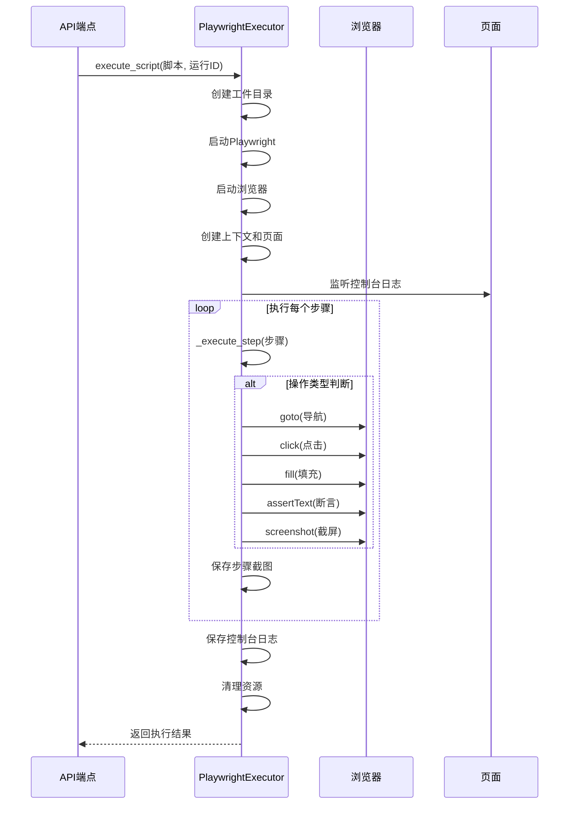
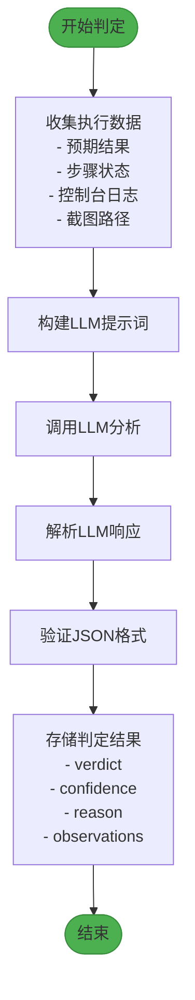
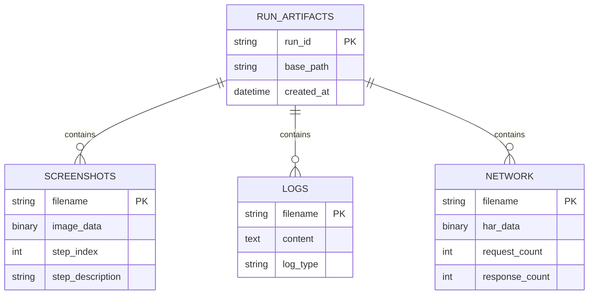

# 核心功能

<cite>
**本文档引用的文件**
- [llm_service.py](file://backend/app/services/llm_service.py)
- [playwright_executor.py](file://backend/app/services/playwright_executor.py)
- [test_cases.py](file://backend/app/api/endpoints/test_cases.py)
- [test_runs.py](file://backend/app/api/endpoints/test_runs.py)
- [config.py](file://backend/app/config.py)
</cite>

## 目录
1. [自然语言处理模块](#自然语言处理模块)
2. [Playwright执行引擎](#playwright执行引擎)
3. [LLM结果判定机制](#llm结果判定机制)
4. [工件管理系统](#工件管理系统)
5. [API端点集成](#api端点集成)

## 自然语言处理模块

该模块通过`llm_service.py`中的`LLMService`类实现，负责将用户输入的自然语言描述转换为结构化的测试用例。系统使用大型语言模型（LLM）作为核心处理引擎，支持OpenAI和Anthropic等提供商。

当用户提交自然语言描述时，系统构建一个包含被测站点URL和用户描述的提示词（prompt），并发送给LLM。提示词中明确要求返回JSON格式的结构化测试用例，包含用例名称、描述、标准化步骤数组和预期结果。标准化步骤包含操作类型（如goto、click、fill等）、CSS选择器、输入值和预期结果等字段。

`generate_test_case_from_nl`方法是该功能的核心，它调用`_build_nl_to_case_prompt`方法构建提示词，然后通过`_call_llm`方法与LLM API交互。响应结果经过`_parse_case_response`方法解析，提取JSON内容并验证格式正确性。

**Section sources**
- [llm_service.py](file://backend/app/services/llm_service.py#L35-L48)
- [llm_service.py](file://backend/app/services/llm_service.py#L121-L189)

## Playwright执行引擎

Playwright执行引擎由`playwright_executor.py`中的`PlaywrightExecutor`类实现，负责解析测试步骤并驱动浏览器执行。引擎接收由LLM生成的Playwright脚本配置，该配置包含浏览器类型、视口尺寸和步骤数组。

`execute_script`方法是执行的核心，它首先根据运行ID创建工件存储目录，然后启动Playwright并根据配置启动指定的浏览器（Chromium、Firefox或WebKit）。执行器创建具有指定视口尺寸的浏览器上下文，并启用HAR网络记录功能。

在执行过程中，执行器监听控制台日志并将最后20条日志保存到文件。对于每个步骤，`_execute_step`方法根据操作类型调用相应的Playwright API，如`goto`导航到URL、`click`点击元素、`fill`填充输入框等。每个步骤执行前后会自动截屏（除非明确禁用），截图按步骤序号命名并保存。



**Diagram sources**
- [playwright_executor.py](file://backend/app/services/playwright_executor.py#L27-L120)
- [playwright_executor.py](file://backend/app/services/playwright_executor.py#L122-L199)

**Section sources**
- [playwright_executor.py](file://backend/app/services/playwright_executor.py#L27-L120)
- [playwright_executor.py](file://backend/app/services/playwright_executor.py#L122-L199)

## LLM结果判定机制

LLM结果判定机制通过`LLMService`类的`analyze_test_result`方法实现，负责分析执行日志、截图和网络数据并给出智能判断。该机制在测试执行完成后被调用，综合多种证据进行判定。

判定过程接收预期结果描述、步骤截图路径列表、控制台日志和步骤执行状态作为输入。系统构建一个详细的提示词，包含预期结果、所有步骤的执行状态（包括错误信息）、最后20条控制台日志和截图数量。LLM被要求分析这些信息并返回JSON格式的判定结果，包含判定结果（通过/失败/未知）、置信度、详细理由和观察到的问题。

判定规则明确：如果所有步骤成功且无明显错误，则判定为"passed"；如果有步骤失败或有严重错误日志，则判定为"failed"；如果无法确定，则判定为"unknown"。判定结果包括详细的观察列表，指出具体的问题或成功点，以及严重程度。



**Diagram sources**
- [llm_service.py](file://backend/app/services/llm_service.py#L71-L92)
- [llm_service.py](file://backend/app/services/llm_service.py#L254-L299)

**Section sources**
- [llm_service.py](file://backend/app/services/llm_service.py#L71-L92)
- [llm_service.py](file://backend/app/services/llm_service.py#L254-L299)

## 工件管理系统

工件管理系统负责配置存储路径并采集执行过程中的各种工件，包括截图、日志和HAR文件。系统通过`config.py`中的`ARTIFACTS_PATH`配置项定义基础存储路径，默认为"../artifacts"。

`PlaywrightExecutor`在初始化时接收此基础路径，并在执行测试时为每次运行创建独立的子目录。目录结构按`runs/{run_id}`组织，下设`screenshots`、`logs`和`network`三个子目录分别存储截图、控制台日志和网络流量数据。

执行过程中，系统自动为每个步骤生成全页截图，文件名为`step_{index}.png`。控制台日志被实时收集并保存为`console.log`文件。通过Playwright的`record_har_path`选项，所有网络请求被记录到`traffic.har`文件中，便于后续分析。



**Diagram sources**
- [config.py](file://backend/app/config.py#L35-L35)
- [playwright_executor.py](file://backend/app/services/playwright_executor.py#L14-L25)

**Section sources**
- [config.py](file://backend/app/config.py#L35-L35)
- [playwright_executor.py](file://backend/app/services/playwright_executor.py#L14-L25)

## API端点集成

各功能模块通过API端点暴露给前端，形成完整的测试自动化闭环。系统使用FastAPI框架，通过`test_cases.py`和`test_runs.py`中的路由定义提供RESTful接口。

自然语言处理功能通过`/cases/generate-from-nl`端点暴露，接收项目ID和自然语言描述，返回结构化测试用例。Playwright脚本生成功能通过`/cases/generate-script`端点提供，接收测试用例ID并返回Playwright脚本配置。

测试执行功能通过`/cases/{case_id}/execute`端点实现，采用后台任务模式执行长时间运行的测试。执行结果通过`/runs/{run_id}`和`/runs/{run_id}/steps`端点提供查询，返回包含LLM判定结果的详细执行信息。

```mermaid
graph TB
Frontend[前端应用] --> |POST /generate-from-nl| API1[/cases/generate-from-nl]
Frontend --> |POST /generate-script| API2[/cases/generate-script]
Frontend --> |POST /execute| API3[/cases/{id}/execute]
Frontend --> |GET /runs/{id}| API4[/runs/{id}]
API1 --> LLMService[LLMService]
API2 --> LLMService
API3 --> BackgroundTask[后台任务]
BackgroundTask --> PlaywrightExecutor[PlaywrightExecutor]
PlaywrightExecutor --> Artifacts[工件存储]
PlaywrightExecutor --> LLMService[结果判定]
subgraph Backend
API1
API2
API3
API4
LLMService
PlaywrightExecutor
Artifacts
BackgroundTask
end
style Frontend fill:#2196F3,stroke:#1976D2
style Backend fill:#FFC107,stroke:#FFA000
```

**Diagram sources**
- [test_cases.py](file://backend/app/api/endpoints/test_cases.py#L150-L190)
- [test_runs.py](file://backend/app/api/endpoints/test_runs.py#L100-L150)

**Section sources**
- [test_cases.py](file://backend/app/api/endpoints/test_cases.py#L150-L190)
- [test_runs.py](file://backend/app/api/endpoints/test_runs.py#L100-L150)