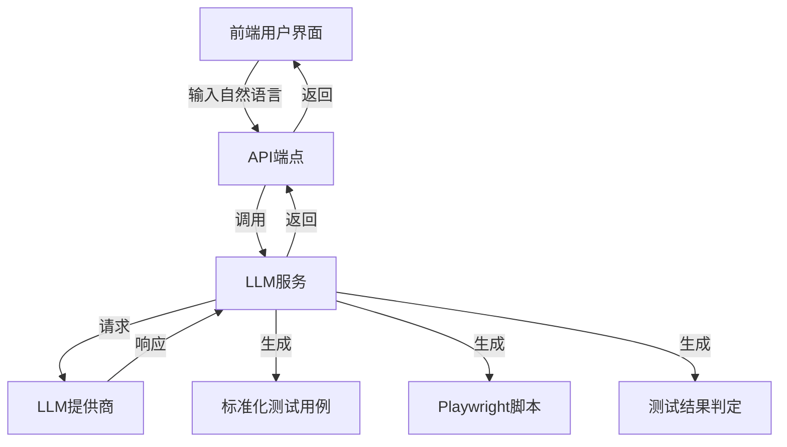
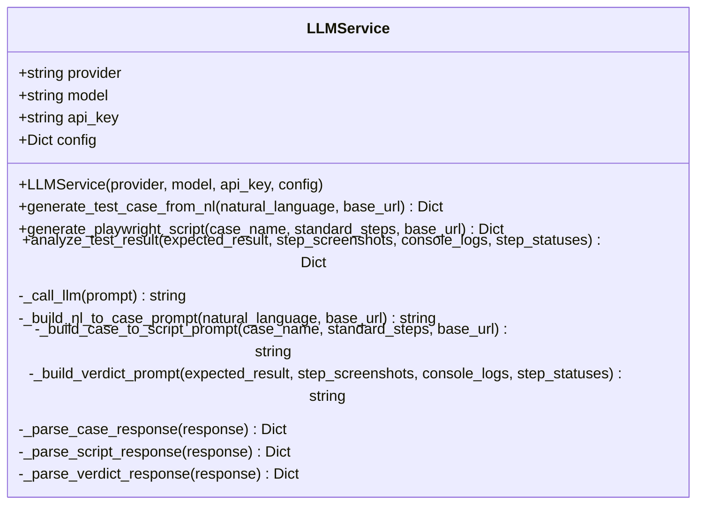
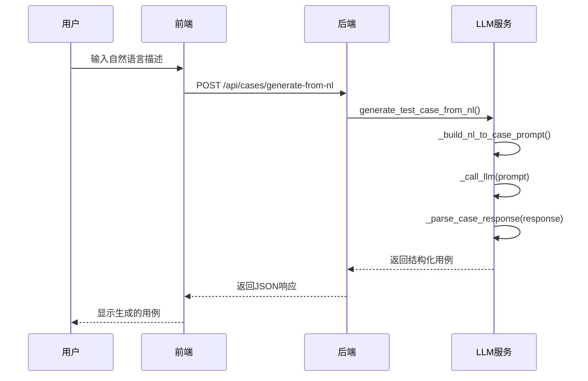
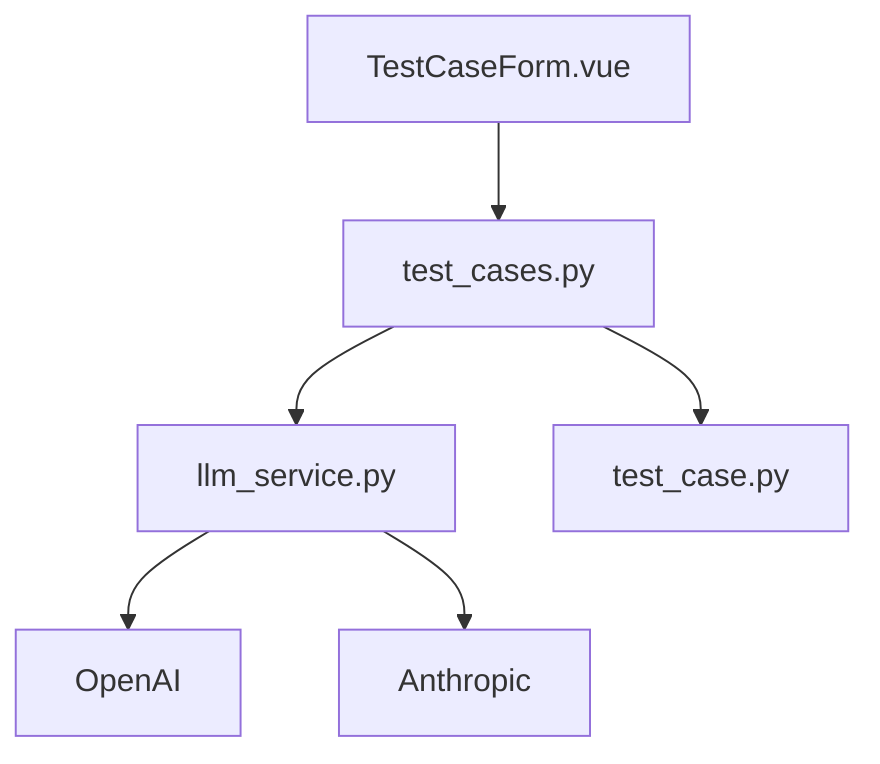

# 自然语言处理模块

<cite>
**Referenced Files in This Document**   
- [llm_service.py](file://backend/app/services/llm_service.py)
- [test_cases.py](file://backend/app/api/endpoints/test_cases.py)
- [TestCaseForm.vue](file://frontend/src/views/TestCaseForm.vue)
- [test_case.py](file://backend/app/schemas/test_case.py)
- [API_EXAMPLES.md](file://API_EXAMPLES.md)
</cite>

## 目录
1. [简介](#简介)
2. [核心组件](#核心组件)
3. [架构概览](#架构概览)
4. [详细组件分析](#详细组件分析)
5. [依赖分析](#依赖分析)
6. [性能考虑](#性能考虑)
7. [故障排除指南](#故障排除指南)
8. [结论](#结论)

## 简介
自然语言处理模块是测试自动化平台的核心功能之一，它允许用户通过自然语言描述来创建自动化测试用例。该模块利用大型语言模型（LLM）将非结构化的自然语言输入转换为结构化的测试用例，极大地降低了测试自动化的门槛。用户只需描述测试场景，系统就能自动生成标准化的测试步骤和可执行的Playwright脚本。该模块与前端界面和后端API紧密集成，形成了一个完整的从需求到执行的自动化测试工作流。

## 核心组件
本模块的核心是`LLMService`类，它封装了与大型语言模型交互的所有逻辑。该服务提供了三个主要功能：从自然语言生成测试用例、从标准化用例生成Playwright脚本、以及分析测试执行结果。前端通过`TestCaseForm.vue`组件提供用户友好的交互界面，引导用户完成从输入描述到生成脚本的完整流程。后端通过`test_cases.py`中的API端点暴露这些功能，实现了前后端的解耦和标准化通信。

**Section sources**
- [llm_service.py](file://backend/app/services/llm_service.py#L9-L325)
- [test_cases.py](file://backend/app/api/endpoints/test_cases.py#L1-L246)
- [TestCaseForm.vue](file://frontend/src/views/TestCaseForm.vue#L1-L248)

## 架构概览

**Diagram sources **
- [llm_service.py](file://backend/app/services/llm_service.py#L9-L325)
- [test_cases.py](file://backend/app/api/endpoints/test_cases.py#L1-L246)
- [TestCaseForm.vue](file://frontend/src/views/TestCaseForm.vue#L1-L248)

## 详细组件分析

### LLMService类分析
`LLMService`类是自然语言处理模块的引擎，负责协调与LLM的交互。它通过精心设计的提示词（prompt）模板，引导LLM生成符合预期格式的结构化输出。

#### 类图

**Diagram sources **
- [llm_service.py](file://backend/app/services/llm_service.py#L9-L325)

#### _prompt模板设计原理
`_build_nl_to_case_prompt`方法构建了将自然语言转换为测试用例的关键提示词。该模板的设计遵循了以下原则：
- **角色定义**：明确指定LLM扮演“专业的测试工程师”角色，以引导其以专业视角思考。
- **上下文提供**：包含被测站点的基础URL，确保生成的步骤与实际环境一致。
- **结构化输出要求**：强制要求输出为JSON格式，并明确定义了每个字段的含义和数据类型。
- **示例引导**：提供一个完整的示例输出，帮助LLM理解期望的格式和内容。
- **操作类型标准化**：预定义了一组标准的`action`类型，如`goto`、`click`、`fill`、`select`、`assertText`、`assertVisible`等，确保生成的步骤具有可执行性。

**Section sources**
- [llm_service.py](file://backend/app/services/llm_service.py#L121-L189)

#### 从自然语言到JSON的转换流程
1. 用户在前端输入自然语言描述，例如“访问登录页面，输入用户名admin和密码admin，点击登录按钮，验证成功跳转到主页”。
2. 前端调用`/api/cases/generate-from-nl` API端点。
3. 后端创建`LLMService`实例，并调用`generate_test_case_from_nl`方法。
4. 该方法调用`_build_nl_to_case_prompt`构建提示词，然后通过`_call_llm`发送给LLM。
5. LLM返回一个包含JSON的响应，可能被包裹在代码块中。
6. `_parse_case_response`方法解析响应，提取并验证JSON内容，最终返回结构化的测试用例字典。

**Diagram sources **
- [llm_service.py](file://backend/app/services/llm_service.py#L35-L48)
- [test_cases.py](file://backend/app/api/endpoints/test_cases.py#L159-L196)
- [TestCaseForm.vue](file://frontend/src/views/TestCaseForm.vue#L115-L163)

### 错误处理机制
该模块在多个层面实现了健壮的错误处理：
- **LLM调用异常**：`_call_llm`方法使用try-catch块捕获网络错误或API错误，并抛出带有详细信息的异常。
- **响应解析失败**：`_parse_case_response`方法在`json.loads()`调用周围使用try-catch，并在失败时抛出包含原始响应内容的`ValueError`，便于调试。
- **API层错误**：API端点捕获`LLMService`抛出的任何异常，并将其转换为HTTP 500错误响应，向用户返回清晰的错误信息。

**Section sources**
- [llm_service.py](file://backend/app/services/llm_service.py#L94-L119)
- [llm_service.py](file://backend/app/services/llm_service.py#L301-L317)
- [test_cases.py](file://backend/app/api/endpoints/test_cases.py#L159-L196)

### 与前端的集成
前端通过`TestCaseForm.vue`组件实现了多步骤向导，引导用户完成测试用例的创建。该组件与后端API紧密协作：
1. **步骤1**：用户输入自然语言描述。
2. **步骤2**：调用`generateFromNL` API，将生成的用例显示给用户进行审查和编辑。
3. **步骤3**：调用`generateScript` API，生成可执行的Playwright脚本。
4. **步骤4**：保存完整的测试用例。

这种设计确保了用户对自动化过程的控制权，同时保持了流程的流畅性。

**Section sources**
- [TestCaseForm.vue](file://frontend/src/views/TestCaseForm.vue#L1-L248)

### 实际使用示例
根据`API_EXAMPLES.md`中的示例，一个典型的使用场景如下：
- **输入**：`"访问登录页面，输入用户名admin和密码admin，点击登录按钮，验证成功跳转到主页"`
- **输出**：一个包含5个标准化步骤的JSON对象，包括`goto`、`fill`、`click`和`assertVisible`操作，以及清晰的预期结果描述。

**Section sources**
- [API_EXAMPLES.md](file://API_EXAMPLES.md#L123-L190)

### LLM提供商配置与模型调优
`LLMService`类支持通过构造函数参数灵活切换LLM提供商（如OpenAI或Anthropic）。配置通过`config`参数传入，支持`temperature`和`max_tokens`等关键参数的调优：
- **temperature**：控制输出的随机性。较低的值（如0.3）使输出更确定和一致，适合生成标准化的测试步骤；较高的值（如0.7）增加创造性，但可能导致格式不一致。
- **max_tokens**：限制响应长度，防止LLM生成过长的无关内容。

项目级别的LLM配置存储在数据库中，允许不同项目使用不同的模型和参数。

**Section sources**
- [llm_service.py](file://backend/app/services/llm_service.py#L12-L33)
- [test_cases.py](file://backend/app/api/endpoints/test_cases.py#L159-L196)

## 依赖分析

**Diagram sources **
- [llm_service.py](file://backend/app/services/llm_service.py#L9-L325)
- [test_cases.py](file://backend/app/api/endpoints/test_cases.py#L1-L246)
- [test_case.py](file://backend/app/schemas/test_case.py#L1-L89)
- [TestCaseForm.vue](file://frontend/src/views/TestCaseForm.vue#L1-L248)

## 性能考虑
该模块的性能主要受LLM API调用延迟的影响。为了优化用户体验，前端采用了加载状态指示器（`generating`标志），并在后台异步执行LLM调用。建议在生产环境中对LLM API调用进行缓存，以避免对相同或相似的自然语言描述重复调用。

## 故障排除指南
- **LLM调用失败**：检查API密钥是否正确，网络连接是否正常，以及LLM提供商的服务状态。
- **响应解析失败**：检查LLM返回的内容是否为有效的JSON。如果LLM未遵循提示词要求，可能需要调整提示词或降低`temperature`值。
- **生成的步骤不准确**：尝试提供更详细和具体的自然语言描述，或调整`temperature`参数以获得更稳定的结果。

**Section sources**
- [llm_service.py](file://backend/app/services/llm_service.py#L94-L119)
- [llm_service.py](file://backend/app/services/llm_service.py#L301-L317)

## 结论
自然语言处理模块成功地将复杂的测试自动化任务简化为直观的自然语言输入。通过`LLMService`类、精心设计的提示词模板和与前后端的无缝集成，该模块为用户提供了一个强大而易用的工具来创建自动化测试。其模块化的设计和灵活的配置使其能够适应不同的LLM提供商和项目需求，为平台的可扩展性奠定了坚实的基础。