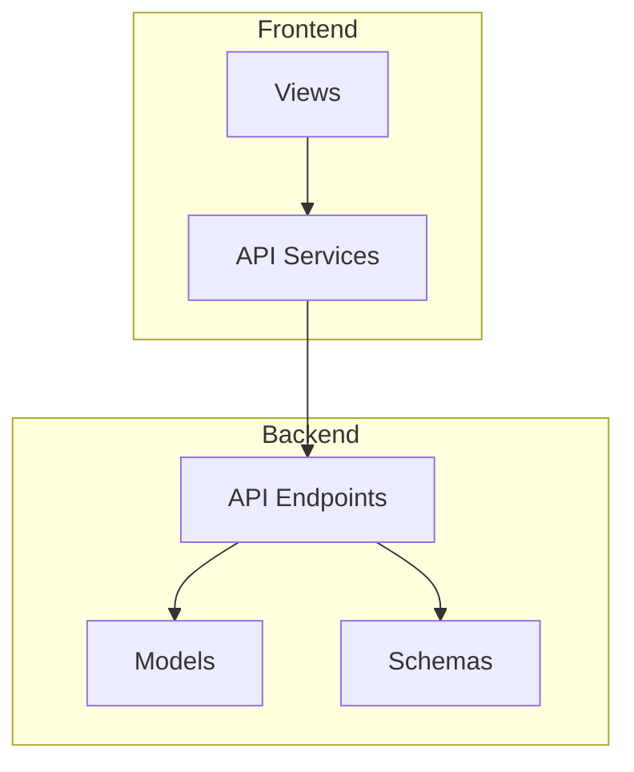
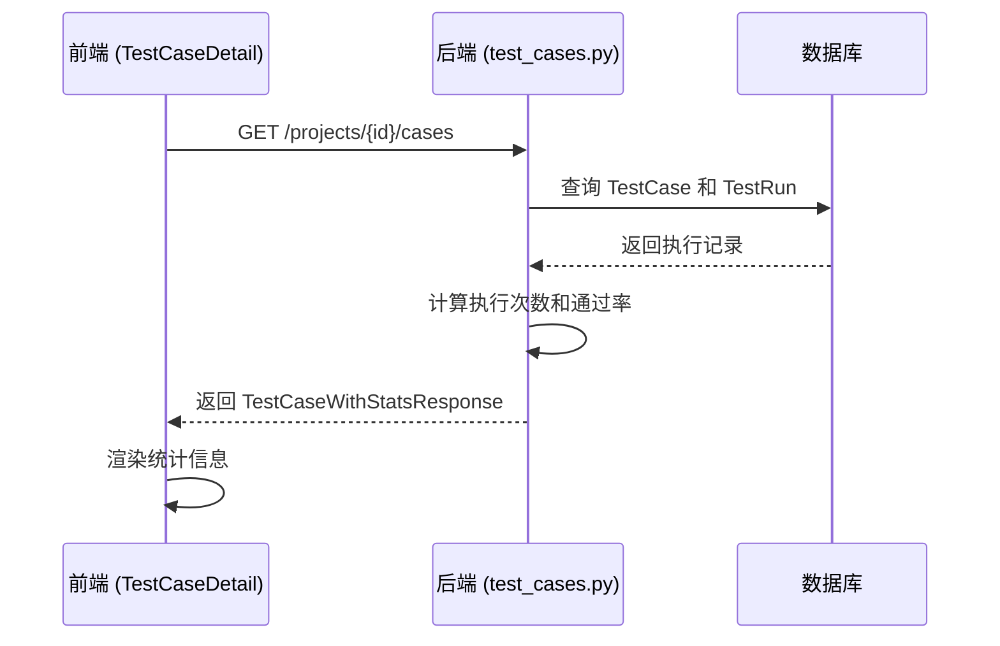
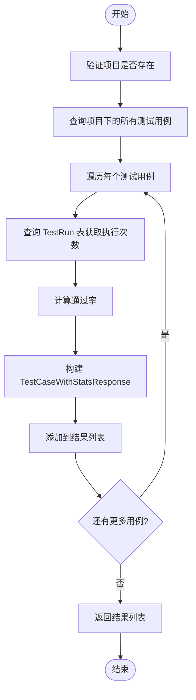
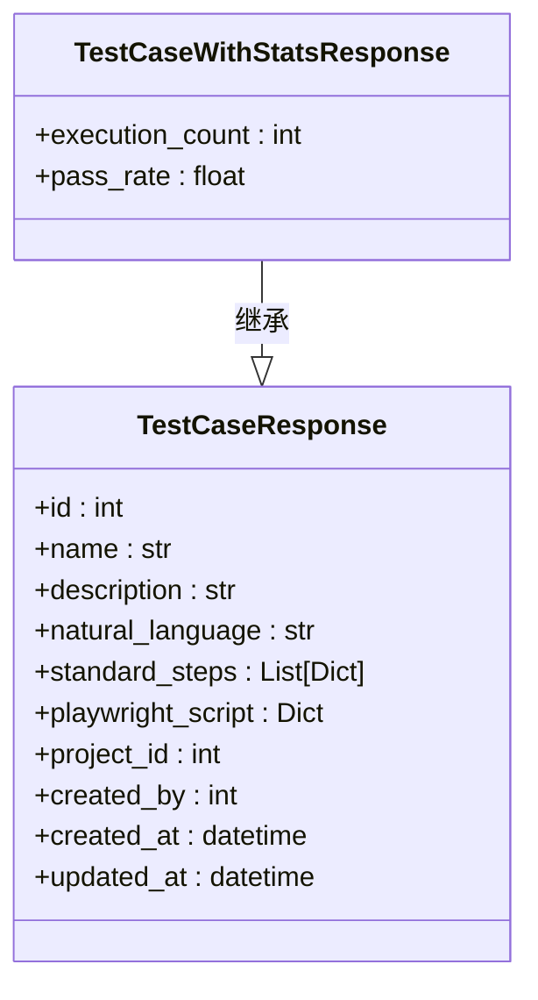
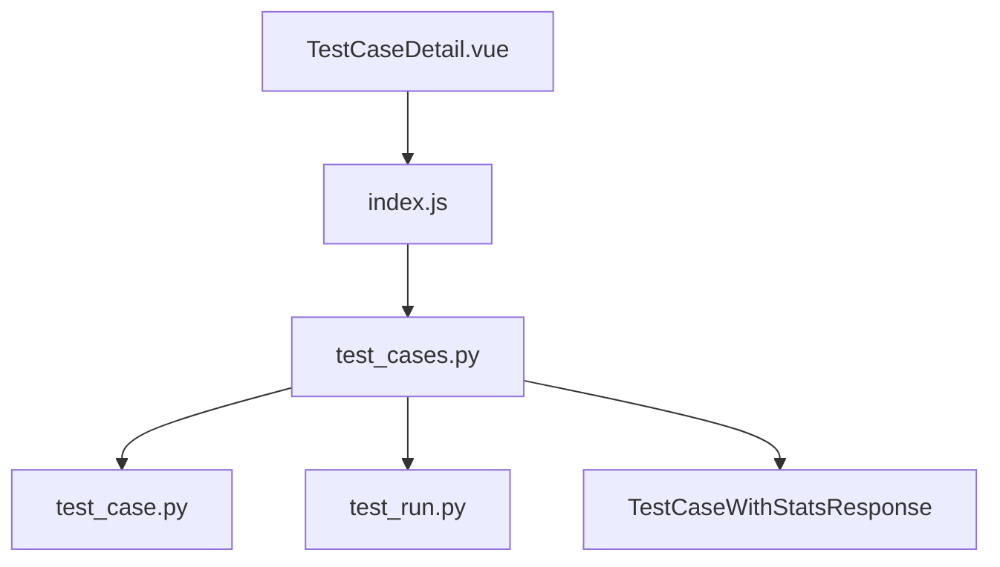

# 测试用例统计

<cite>
**本文档引用的文件**  
- [test_cases.py](file://backend/app/api/endpoints/test_cases.py)
- [test_case.py](file://backend/app/models/test_case.py)
- [test_case.py](file://backend/app/schemas/test_case.py)
- [test_testcase_stats.py](file://backend/test_testcase_stats.py)
- [TestCaseDetail.vue](file://frontend/src/views/TestCaseDetail.vue)
- [index.js](file://frontend/src/api/index.js)
</cite>

## 目录
1. [简介](#简介)
2. [项目结构](#项目结构)
3. [核心组件](#核心组件)
4. [架构概述](#架构概述)
5. [详细组件分析](#详细组件分析)
6. [依赖分析](#依赖分析)
7. [性能考虑](#性能考虑)
8. [故障排除指南](#故障排除指南)
9. [结论](#结论)

## 简介
测试用例统计功能是本系统中用于评估测试用例执行效果的核心模块。该功能通过收集和分析测试用例的执行历史，提供执行次数、通过率等关键指标，帮助团队监控测试覆盖率和稳定性。前端通过 `TestCaseDetail.vue` 展示统计信息，后端通过 `/projects/{project_id}/cases` 接口提供数据支持。

## 项目结构
测试用例统计功能主要分布在后端的 `api/endpoints` 和 `models` 模块，以及前端的 `views` 和 `api` 模块中。后端负责数据计算和接口提供，前端负责数据展示和用户交互。

**图示来源**  
- [test_cases.py](file://backend/app/api/endpoints/test_cases.py#L1-L277)
- [TestCaseDetail.vue](file://frontend/src/views/TestCaseDetail.vue#L1-L495)

**本节来源**  
- [test_cases.py](file://backend/app/api/endpoints/test_cases.py#L1-L277)
- [TestCaseDetail.vue](file://frontend/src/views/TestCaseDetail.vue#L1-L495)

## 核心组件
测试用例统计功能的核心在于后端 `test_cases.py` 中的 `list_test_cases` 接口，该接口在返回测试用例列表的同时，附加执行次数和通过率等统计信息。统计逻辑基于 `TestRun` 表中的执行记录进行聚合计算。

**本节来源**  
- [test_cases.py](file://backend/app/api/endpoints/test_cases.py#L15-L80)
- [test_case.py](file://backend/app/models/test_case.py#L1-L33)

## 架构概述
系统采用前后端分离架构，前端通过 API 调用获取带统计信息的测试用例列表，并在详情页面展示。后端使用 SQLAlchemy 进行数据库查询，通过 `func.count` 和条件过滤实现统计计算。

**图示来源**  
- [test_cases.py](file://backend/app/api/endpoints/test_cases.py#L15-L80)
- [TestCaseDetail.vue](file://frontend/src/views/TestCaseDetail.vue#L1-L495)

## 详细组件分析

### 测试用例统计接口分析
`list_test_cases` 接口是统计功能的核心，它不仅返回测试用例的基本信息，还动态计算并附加执行统计数据。

#### 接口实现逻辑

**图示来源**  
- [test_cases.py](file://backend/app/api/endpoints/test_cases.py#L15-L80)
- [test_case.py](file://backend/app/models/test_case.py#L1-L33)

#### 响应数据结构

**图示来源**  
- [test_case.py](file://backend/app/schemas/test_case.py#L1-L96)

**本节来源**  
- [test_cases.py](file://backend/app/api/endpoints/test_cases.py#L15-L80)
- [test_case.py](file://backend/app/schemas/test_case.py#L1-L96)

### 前端展示分析
前端通过 `TestCaseDetail.vue` 组件展示测试用例及其统计信息。组件通过 `testCaseAPI.listByProject` 调用后端接口获取数据，并在界面中渲染。

**本节来源**  
- [TestCaseDetail.vue](file://frontend/src/views/TestCaseDetail.vue#L1-L495)
- [index.js](file://frontend/src/api/index.js#L1-L152)

## 依赖分析
测试用例统计功能依赖于多个模块的协同工作。后端依赖 `TestRun` 模型进行数据统计，前端依赖 API 服务进行数据获取。

**图示来源**  
- [test_cases.py](file://backend/app/api/endpoints/test_cases.py#L1-L277)
- [TestCaseDetail.vue](file://frontend/src/views/TestCaseDetail.vue#L1-L495)

**本节来源**  
- [test_cases.py](file://backend/app/api/endpoints/test_cases.py#L1-L277)
- [TestCaseDetail.vue](file://frontend/src/views/TestCaseDetail.vue#L1-L495)

## 性能考虑
统计功能在每次获取测试用例列表时都会执行数据库聚合查询。对于测试用例数量较多的项目，建议考虑缓存机制或异步计算统计值，以避免影响接口响应速度。

## 故障排除指南
当测试用例统计数据显示异常时，可按以下步骤排查：
1. 确认 `TestRun` 表中存在对应的执行记录
2. 检查 `LLMVerdict` 枚举值是否正确设置
3. 验证数据库查询逻辑是否正确关联 `test_case_id`
4. 查看后端日志是否有查询错误

**本节来源**  
- [test_testcase_stats.py](file://backend/test_testcase_stats.py#L1-L42)
- [test_cases.py](file://backend/app/api/endpoints/test_cases.py#L15-L80)

## 结论
测试用例统计功能通过整合执行历史数据，为测试管理提供了有价值的洞察。该功能实现清晰，前后端职责分明，具备良好的可维护性和扩展性。未来可考虑增加更多维度的统计分析，如失败原因分布、执行时长趋势等。