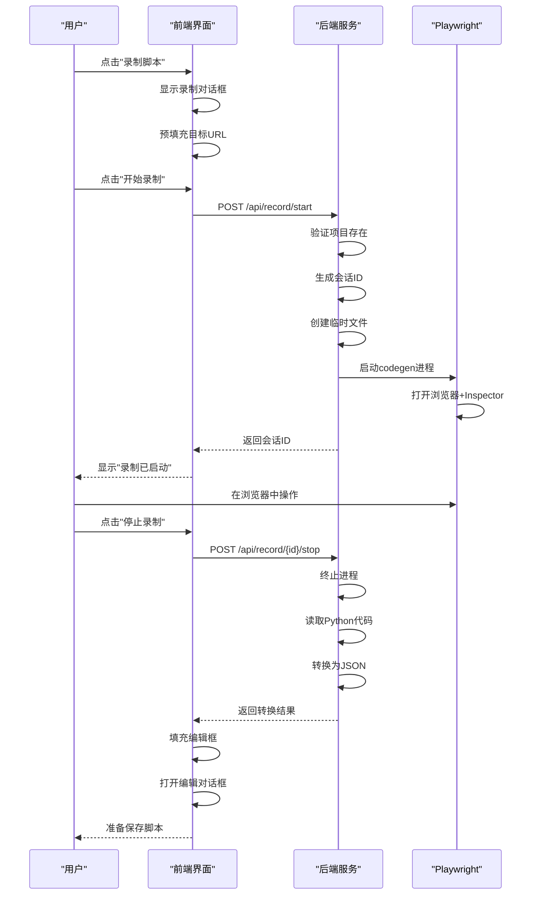

# 测试脚本录制

<cite>
**本文档引用文件**  
- [recorder.py](file://backend/app/api/endpoints/recorder.py)
- [TestCaseDetail.vue](file://frontend/src/views/TestCaseDetail.vue)
- [SIMPLIFIED_RECORD_FEATURE.md](file://SIMPLIFIED_RECORD_FEATURE.md)
- [RECORD_FIX.md](file://RECORD_FIX.md)
- [RECORD_FEATURE_SUMMARY.md](file://RECORD_FEATURE_SUMMARY.md)
- [PLAYWRIGHT_RECORD_GUIDE.md](file://PLAYWRIGHT_RECORD_GUIDE.md)
</cite>

## 目录
1. [简介](#简介)
2. [功能说明](#功能说明)
3. [使用流程](#使用流程)
4. [API接口](#api接口)
5. [集成模式](#集成模式)
6. [实际示例](#实际示例)
7. [故障排除指南](#故障排除指南)
8. [未来改进方向](#未来改进方向)

## 简介

测试脚本录制功能是自动化测试系统中的核心功能之一，旨在通过Playwright Codegen工具简化测试脚本的创建过程。该功能允许用户通过可视化操作自动生成测试脚本，显著降低了编写自动化测试脚本的技术门槛。系统经过多次迭代优化，已从最初的手动复制粘贴模式演进为全自动转换模式，极大提升了用户体验和工作效率。

## 功能说明

测试脚本录制功能允许用户通过直观的浏览器操作自动生成标准化的Playwright测试脚本。用户无需手动编写代码，只需在浏览器中执行测试步骤，系统会自动记录操作并转换为JSON格式的测试脚本。

该功能主要特点包括：
- **一键启动**：用户点击"开始录制"按钮即可启动录制会话
- **自动转换**：系统自动将Playwright生成的Python代码转换为JSON格式
- **智能填充**：自动从测试用例描述中提取目标URL并预填充
- **无缝集成**：录制完成后自动填充到脚本编辑框，准备保存

**功能优势**：
- 降低技术门槛，无需掌握Playwright语法
- 精确获取元素选择器，减少定位错误
- 快速生成测试脚本，提高测试开发效率
- 可视化操作，直观易懂
- 生成后可手动调整优化

**功能限制**：
- 服务器需要支持图形界面以显示浏览器窗口
- 复杂操作可能需要手动调整生成的脚本
- 录制的选择器可能不够稳定，需要优化
- 不自动生成断言，需要手动添加

**Section sources**
- [SIMPLIFIED_RECORD_FEATURE.md](file://SIMPLIFIED_RECORD_FEATURE.md#L0-L97)
- [RECORD_FEATURE_SUMMARY.md](file://RECORD_FEATURE_SUMMARY.md#L0-L86)

## 使用流程

```mermaid
flowchart TD
A[用户点击"录制脚本"] --> B[输入目标网址]
B --> C[点击"开始录制"]
C --> D[系统启动Playwright]
D --> E[浏览器窗口打开]
E --> F[用户在浏览器中操作]
F --> G[点击"停止录制"]
G --> H[系统读取Python代码]
H --> I[转换为JSON格式]
I --> J[自动填充到编辑框]
J --> K[用户检查并保存]
```

**Diagram sources**
- [SIMPLIFIED_RECORD_FEATURE.md](file://SIMPLIFIED_RECORD_FEATURE.md#L0-L97)
- [TestCaseDetail.vue](file://frontend/src/views/TestCaseDetail.vue#L394-L493)

### 详细步骤

1. **启动录制**
   - 在测试用例详情页点击"🎥 录制脚本"按钮
   - 系统自动提取项目基础URL或从用例描述中识别目标网址
   - 用户可手动修改目标网址

2. **配置录制参数**
   - 在弹出的对话框中确认目标网址
   - 支持三种URL格式：
     - `ai.42lab.cn` - 自动添加https://前缀
     - `https://ai.42lab.cn` - 完整HTTPS地址
     - `http://example.com` - 完整HTTP地址

3. **开始录制**
   - 点击"开始录制"按钮
   - 系统在服务器端启动Playwright Codegen进程
   - 浏览器窗口和Playwright Inspector自动打开

4. **执行测试操作**
   - 在浏览器中执行测试步骤：
     - 导航页面
     - 输入文本
     - 点击按钮
     - 选择下拉菜单
     - 等待元素出现

5. **停止录制**
   - 操作完成后点击"停止录制"按钮
   - 系统终止录制进程并读取生成的Python代码

6. **自动转换**
   - 系统将Python代码转换为JSON格式的Playwright脚本
   - 自动填充到脚本编辑框
   - 打开编辑对话框供用户检查

7. **保存脚本**
   - 用户检查生成的脚本
   - 可手动调整步骤、选择器或添加断言
   - 点击"保存"完成整个流程

**Section sources**
- [SIMPLIFIED_RECORD_FEATURE.md](file://SIMPLIFIED_RECORD_FEATURE.md#L0-L97)
- [PLAYWRIGHT_RECORD_GUIDE.md](file://PLAYWRIGHT_RECORD_GUIDE.md#L0-L321)

## API接口

### 启动录制会话

**接口**: `POST /api/record/start`

**功能**: 启动新的录制会话

**请求参数**:
```json
{
  "target_url": "string",
  "project_id": "integer"
}
```

**参数说明**:
- `target_url`: 目标网站地址，必须包含协议（http://或https://）
- `project_id`: 所属项目ID，用于获取项目配置

**成功响应**:
```json
{
  "session_id": "string",
  "status": "string",
  "message": "string"
}
```

**响应字段**:
- `session_id`: 录制会话唯一标识符（UUID格式）
- `status`: 状态标识，固定为"recording"
- `message`: 状态描述信息

**错误响应**:
- `404 Not Found`: 项目不存在
- `500 Internal Server Error`: Playwright未安装或启动失败

**Section sources**
- [recorder.py](file://backend/app/api/endpoints/recorder.py#L337-L381)
- [SIMPLIFIED_RECORD_FEATURE.md](file://SIMPLIFIED_RECORD_FEATURE.md#L191-L260)

### 停止录制会话

**接口**: `POST /api/record/{session_id}/stop`

**功能**: 停止指定的录制会话并获取转换结果

**路径参数**:
- `session_id`: 录制会话ID，从启动接口获取

**成功响应**:
```json
{
  "status": "string",
  "playwright_code": "string",
  "playwright_script": "object"
}
```

**响应字段**:
- `status`: 状态标识，固定为"stopped"
- `playwright_code`: 原始的Playwright Python代码
- `playwright_script`: 转换后的JSON格式脚本

**错误响应**:
- `404 Not Found`: 录制会话不存在
- `500 Internal Server Error`: 读取代码或转换失败

**Section sources**
- [recorder.py](file://backend/app/api/endpoints/recorder.py#L383-L420)
- [TEST_CASE_CREATION_WITH_RECORD.md](file://TEST_CASE_CREATION_WITH_RECORD.md#L179-L252)

### 获取录制指南

**接口**: `GET /api/record/guide`

**功能**: 获取录制功能使用指南

**成功响应**:
```json
{
  "title": "string",
  "description": "string",
  "steps": ["string"],
  "tips": ["string"]
}
```

**响应字段**:
- `title`: 指南标题
- `description`: 功能描述
- `steps`: 使用步骤列表
- `tips`: 使用提示列表

**Section sources**
- [recorder.py](file://backend/app/api/endpoints/recorder.py#L422-L464)

## 集成模式

### 前后端交互流程



**Diagram sources**
- [TestCaseDetail.vue](file://frontend/src/views/TestCaseDetail.vue#L394-L493)
- [recorder.py](file://backend/app/api/endpoints/recorder.py#L337-L420)

### 脚本转换机制

系统采用双层转换策略确保脚本转换的准确性和可靠性：

1. **优先使用LLM转换**：
   - 检查项目是否配置了LLM服务
   - 使用LLM服务将Python代码转换为JSON
   - 提供更智能的描述生成和格式化

2. **回退到规则转换**：
   - 当LLM未配置时使用简单规则转换
   - 基于正则表达式匹配和字符串解析
   - 确保基本转换功能可用

**转换映射表**：

| Playwright操作 | JSON action | 说明 |
|----------------|-----------|------|
| `page.goto(url)` | goto | 导航到指定URL |
| `page.fill(selector, value)` | fill | 在输入框中填写内容 |
| `page.click(selector)` | click | 点击指定元素 |
| `page.select_option(selector, value)` | select | 选择下拉选项 |
| `page.wait_for_selector(selector)` | waitForSelector | 等待元素出现 |
| `page.wait_for_timeout(ms)` | waitTime | 等待指定毫秒数 |

**自动添加字段**：
- `index`: 步骤序号，从1开始递增
- `screenshot`: 截图标志，默认为true
- `description`: 步骤描述，自动生成
- `browser`: 浏览器类型，默认为chromium
- `viewport`: 视口尺寸，默认1280x720

**Section sources**
- [recorder.py](file://backend/app/api/endpoints/recorder.py#L100-L335)
- [SIMPLIFIED_RECORD_FEATURE.md](file://SIMPLIFIED_RECORD_FEATURE.md#L261-L339)

## 实际示例

### 示例：录制登录流程

**场景描述**：录制用户登录系统的测试脚本

**操作步骤**：
1. 访问测试用例详情页
2. 点击"🎥 录制脚本"按钮
3. 确认目标网址为`https://ai.42lab.cn/`
4. 点击"开始录制"
5. 在打开的浏览器中：
   - 输入用户名
   - 输入密码
   - 点击登录按钮
6. 返回页面点击"停止录制"
7. 检查生成的脚本并保存

**生成的JSON脚本**：
```json
{
  "browser": "chromium",
  "viewport": {
    "width": 1280,
    "height": 720
  },
  "steps": [
    {
      "index": 1,
      "action": "goto",
      "selector": null,
      "value": "https://ai.42lab.cn/",
      "description": "打开页面 https://ai.42lab.cn/",
      "screenshot": true
    },
    {
      "index": 2,
      "action": "fill",
      "selector": "#username",
      "value": "Aidan",
      "description": "输入: Aidan",
      "screenshot": true
    },
    {
      "index": 3,
      "action": "fill",
      "selector": "#password",
      "value": "Deep2025",
      "description": "输入: Deep2025",
      "screenshot": true
    },
    {
      "index": 4,
      "action": "click",
      "selector": "button:has-text('登录')",
      "value": null,
      "description": "点击元素",
      "screenshot": true
    }
  ]
}
```

**Section sources**
- [PLAYWRIGHT_RECORD_GUIDE.md](file://PLAYWRIGHT_RECORD_GUIDE.md#L262-L321)
- [SIMPLIFIED_RECORD_FEATURE.md](file://SIMPLIFIED_RECORD_FEATURE.md#L261-L339)

## 故障排除指南

### 常见问题及解决方案

**Q1: 点击"开始录制"后没有反应？**

**可能原因及解决方案**：
- **Playwright未安装**：确保已安装Playwright及其浏览器驱动
  ```bash
  python -m playwright install chromium
  ```
- **后端服务异常**：检查后端日志中的错误信息
  ```
  录制启动异常: ...
  ```
- **端口冲突**：确保后端服务运行在8000端口
- **网络问题**：确认目标URL可以正常访问

**Q2: 浏览器窗口没有弹出？**

**解决方案**：
- 确认服务器有图形界面支持
- 对于远程服务器，建议使用本地环境进行录制
- 检查Playwright安装是否完整

**Q3: 录制的选择器太复杂？**

**优化建议**：
- 在Playwright Inspector中手动修改选择器
- 优先使用稳定的标识符：
  - `id`属性
  - `data-testid`属性
  - `aria-label`属性
- 避免使用`nth-child`等易变的选择器

**Q4: 生成的脚本不完整？**

**可能原因**：
- 录制过程中未完成所有操作就停止
- 某些复杂操作无法被Playwright准确识别
- 网络延迟导致操作未完全记录

**解决方案**：
- 重新录制，确保操作完整
- 手动补充缺失的步骤
- 在关键步骤后添加适当的等待

**Q5: 如何录制文件上传？**

**操作方法**：
- Playwright会自动生成文件上传代码：
  ```python
  page.set_input_files("input[type='file']", "path/to/file.png")
  ```
- 转换为JSON后需要手动处理文件路径
- 建议使用相对路径或环境变量

**Section sources**
- [RECORD_FIX.md](file://RECORD_FIX.md#L66-L94)
- [PLAYWRIGHT_RECORD_GUIDE.md](file://PLAYWRIGHT_RECORD_GUIDE.md#L212-L261)

## 未来改进方向

### 计划中的功能

1. **远程录制支持**
   - 通过VNC或远程桌面实现服务器端录制
   - 支持无图形界面服务器的录制需求
   - 提供录制会话管理界面

2. **智能选择器优化**
   - 自动分析并优化生成的选择器
   - 推荐最稳定的选择器策略
   - 提供选择器稳定性评分

3. **自动断言生成**
   - 基于操作结果自动生成断言
   - 支持视觉对比断言
   - 提供断言建议

4. **录制回放功能**
   - 在系统内直接回放录制的脚本
   - 实时显示执行结果
   - 提供执行性能分析

5. **多人协作录制**
   - 支持团队成员共享录制会话
   - 提供录制过程实时协作
   - 录制过程版本控制

6. **AI辅助优化**
   - 使用AI分析录制脚本并提出优化建议
   - 自动识别冗余操作并建议删除
   - 提供性能优化建议

这些改进将进一步提升测试脚本录制功能的易用性和实用性，为用户提供更加完整和高效的测试开发体验。

**Section sources**
- [RECORD_FEATURE_SUMMARY.md](file://RECORD_FEATURE_SUMMARY.md#L158-L183)