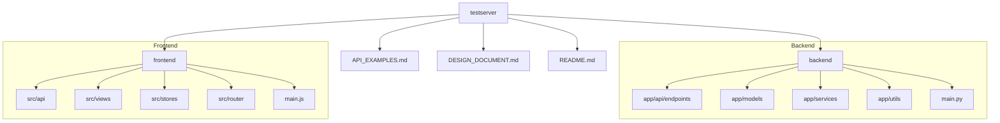
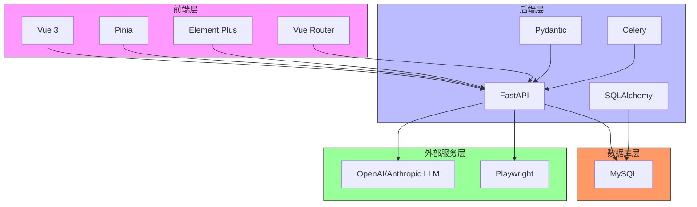
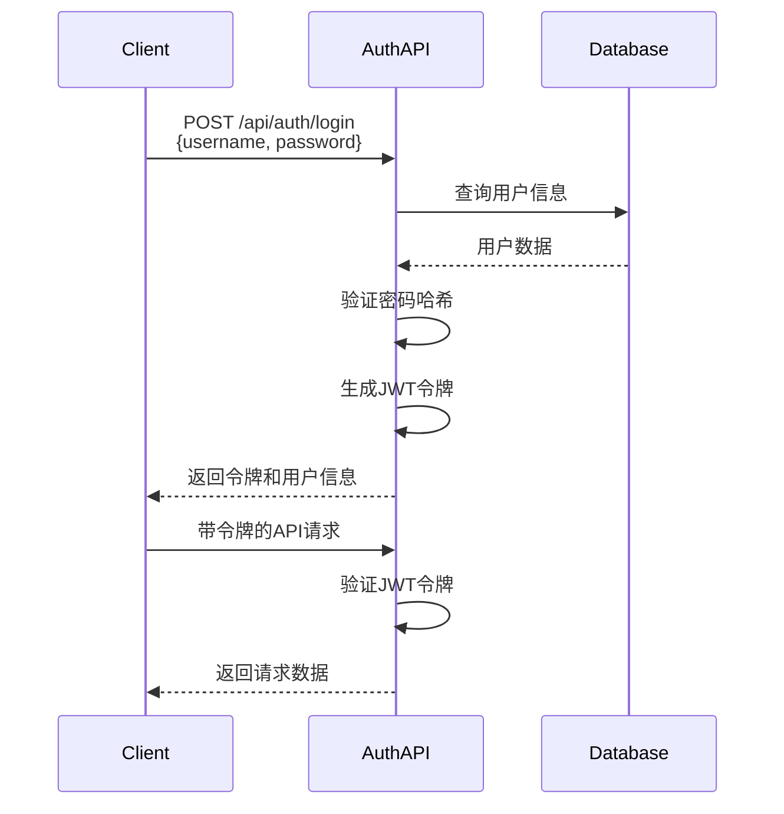
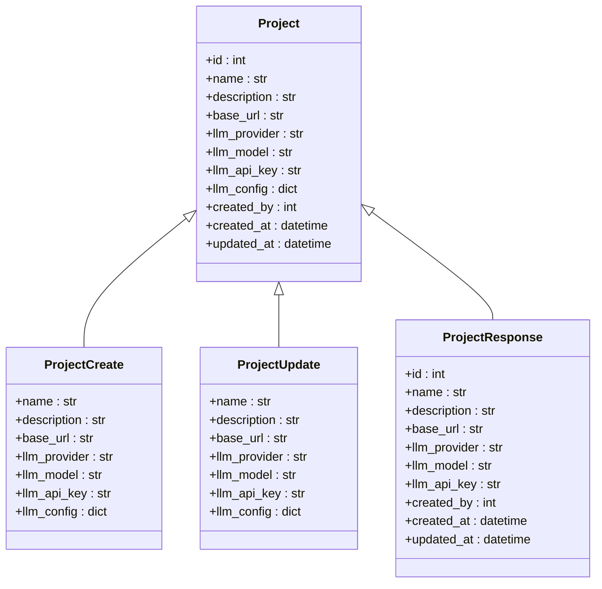
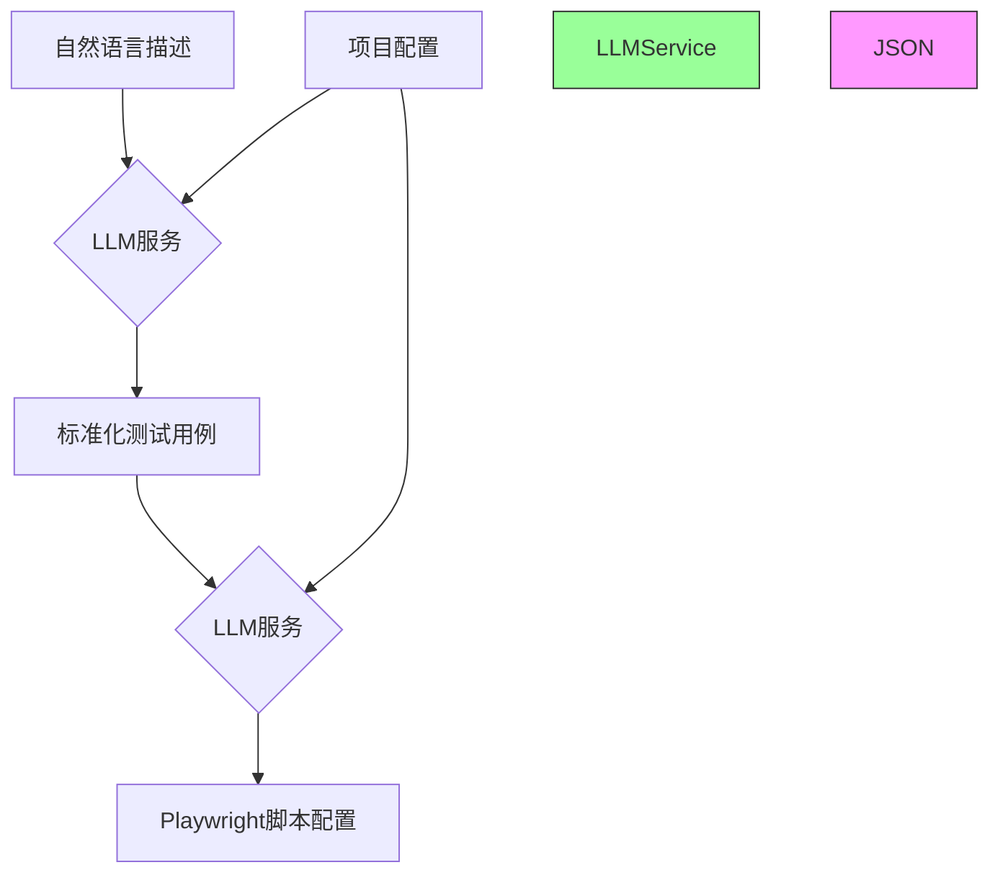
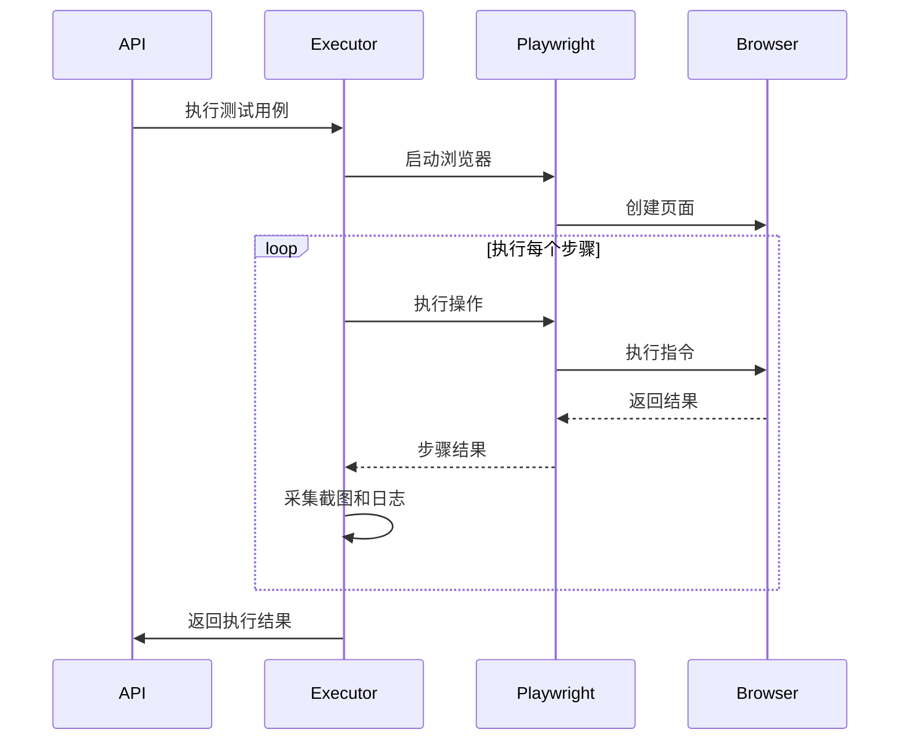
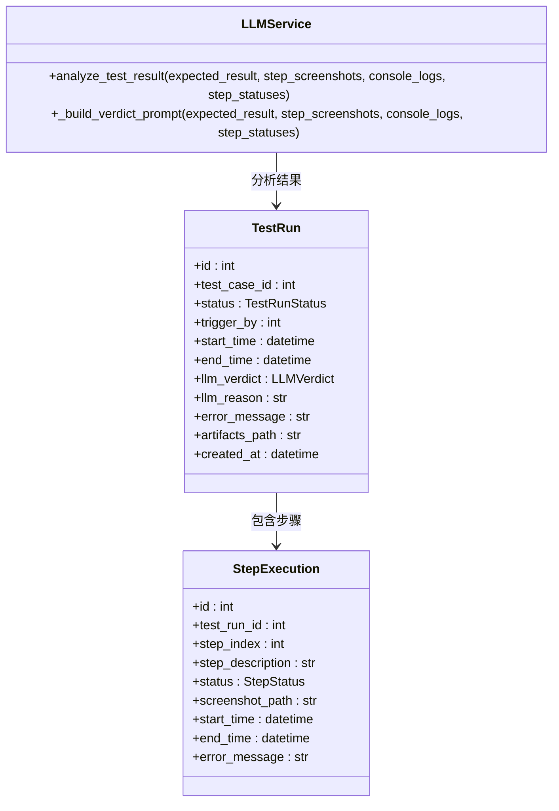
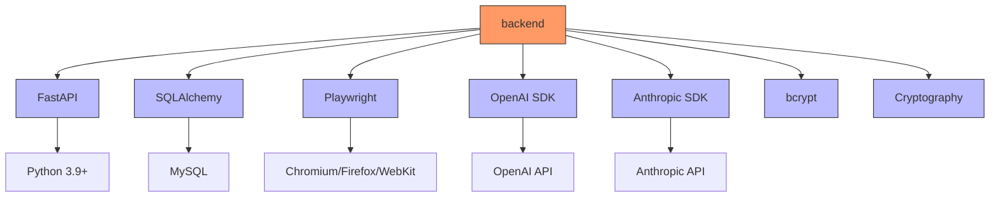

# 系统概述

<cite>
**本文档引用文件**   
- [README.md](file://README.md)
- [DESIGN_DOCUMENT.md](file://DESIGN_DOCUMENT.md)
- [API_EXAMPLES.md](file://API_EXAMPLES.md)
- [main.py](file://backend/main.py)
- [llm_service.py](file://backend/app/services/llm_service.py)
- [playwright_executor.py](file://backend/app/services/playwright_executor.py)
- [auth.py](file://backend/app/api/endpoints/auth.py)
- [projects.py](file://backend/app/api/endpoints/projects.py)
- [test_cases.py](file://backend/app/api/endpoints/test_cases.py)
- [test_runs.py](file://backend/app/api/endpoints/test_runs.py)
- [test_case.py](file://backend/app/models/test_case.py)
- [test_run.py](file://backend/app/models/test_run.py)
- [project.py](file://backend/app/models/project.py)
- [user.py](file://backend/app/models/user.py)
- [step_execution.py](file://backend/app/models/step_execution.py)
- [config.py](file://backend/app/config.py)
- [main.js](file://frontend/src/main.js)
</cite>

## 目录
1. [引言](#引言)
2. [项目结构](#项目结构)
3. [核心组件](#核心组件)
4. [架构概览](#架构概览)
5. [详细组件分析](#详细组件分析)
6. [依赖分析](#依赖分析)
7. [性能考量](#性能考量)
8. [故障排除指南](#故障排除指南)
9. [结论](#结论)

## 引言
testserver系统是一个创新的基于自然语言驱动的UI自动化测试平台，旨在通过人工智能技术简化测试流程。该系统允许测试人员使用自然语言描述测试场景，自动将其转换为标准化测试用例，并生成可执行的Playwright脚本进行自动化测试。系统结合大型语言模型（LLM）对测试结果进行智能分析和判定，实现了从测试设计到执行再到结果分析的全流程自动化。本系统采用前后端分离架构，后端基于Python FastAPI框架，前端使用Vue 3技术栈，支持与OpenAI和Anthropic等主流LLM提供商集成。当前版本为MVP（最小可行产品），已实现用户认证、项目管理、测试用例生成、测试执行和结果智能判定等核心功能，为测试自动化领域提供了一种全新的解决方案。

## 项目结构
testserver系统采用清晰的前后端分离架构，代码组织遵循功能模块化原则。后端服务位于`backend`目录，采用FastAPI框架构建RESTful API，包含API端点、数据模型、业务逻辑服务和工具函数等模块。前端应用位于`frontend`目录，基于Vue 3框架构建用户界面，包含API客户端、路由配置、状态管理、视图组件等。系统还包含数据库初始化脚本、API使用示例和设计文档等辅助文件。

**图示来源**
- [README.md](file://README.md)
- [DESIGN_DOCUMENT.md](file://DESIGN_DOCUMENT.md)

**本节来源**
- [README.md](file://README.md#L0-L305)
- [DESIGN_DOCUMENT.md](file://DESIGN_DOCUMENT.md#L0-L498)

## 核心组件
系统的核心组件包括用户认证、项目管理、测试用例生成、测试执行和结果智能判定五大功能模块。用户认证模块基于JWT实现安全的无状态认证机制，确保系统访问的安全性。项目管理模块支持多项目配置，每个项目可独立设置LLM提供商、模型和API密钥等参数。测试用例生成模块是系统的核心创新点，通过LLM服务将自然语言描述转换为结构化的标准化测试用例。测试执行模块利用Playwright引擎执行生成的测试脚本，并采集截图、日志和网络请求等测试证据。结果智能判定模块再次调用LLM，结合执行过程中的各种证据对测试结果进行智能分析和判定，提供详细的判定理由。

**本节来源**
- [README.md](file://README.md#L0-L305)
- [DESIGN_DOCUMENT.md](file://DESIGN_DOCUMENT.md#L0-L498)
- [API_EXAMPLES.md](file://API_EXAMPLES.md#L0-L483)

## 架构概览
testserver系统采用分层架构设计，从前端用户界面到后端服务，再到外部集成组件，形成了清晰的技术栈。系统整体架构分为前端层、后端层、数据库层和外部服务层四个主要部分。

**图示来源**
- [README.md](file://README.md#L0-L305)
- [DESIGN_DOCUMENT.md](file://DESIGN_DOCUMENT.md#L0-L498)

## 详细组件分析

### 用户认证模块分析
用户认证模块负责系统的安全访问控制，基于JWT（JSON Web Token）实现无状态认证机制。模块包含登录、登出和获取当前用户信息三个主要API端点，通过bcrypt算法对用户密码进行哈希存储，确保密码安全。认证流程中，用户提交用户名和密码后，系统验证凭据并生成JWT令牌返回给客户端，后续请求需在Authorization头中携带此令牌进行身份验证。

**图示来源**
- [auth.py](file://backend/app/api/endpoints/auth.py#L0-L55)
- [user.py](file://backend/app/models/user.py#L0-L33)

**本节来源**
- [auth.py](file://backend/app/api/endpoints/auth.py#L0-L55)
- [user.py](file://backend/app/models/user.py#L0-L33)
- [config.py](file://backend/app/config.py#L0-L41)

### 项目管理模块分析
项目管理模块支持多项目配置和管理，每个项目可独立设置测试环境和LLM集成参数。模块提供创建、读取、更新和删除项目的完整CRUD操作，仅管理员角色可执行创建、更新和删除操作。项目配置中包含被测站点URL、LLM提供商、模型名称、API密钥和额外配置参数，其中API密钥使用AES-256加密存储，确保敏感信息安全。

**图示来源**
- [projects.py](file://backend/app/api/endpoints/projects.py#L0-L142)
- [project.py](file://backend/app/models/project.py#L0-L28)

**本节来源**
- [projects.py](file://backend/app/api/endpoints/projects.py#L0-L142)
- [project.py](file://backend/app/models/project.py#L0-L28)
- [encryption.py](file://backend/app/utils/encryption.py)

### 测试用例生成模块分析
测试用例生成模块是系统的核心创新点，通过LLM服务将自然语言描述转换为结构化的标准化测试用例。模块提供两个主要功能：从自然语言生成标准化测试用例和从标准化用例生成Playwright执行脚本。系统通过精心设计的提示词（prompt）引导LLM生成符合要求的JSON格式输出，确保生成结果的结构化和一致性。

**图示来源**
- [llm_service.py](file://backend/app/services/llm_service.py#L0-L326)
- [test_cases.py](file://backend/app/api/endpoints/test_cases.py#L0-L246)

**本节来源**
- [llm_service.py](file://backend/app/services/llm_service.py#L0-L326)
- [test_cases.py](file://backend/app/api/endpoints/test_cases.py#L0-L246)
- [DESIGN_DOCUMENT.md](file://DESIGN_DOCUMENT.md#L0-L498)

### 测试执行模块分析
测试执行模块负责执行生成的Playwright脚本并采集测试证据。模块通过Playwright执行器服务启动浏览器实例，按照脚本定义的步骤顺序执行测试操作，包括页面导航、元素交互、断言验证等。执行过程中，系统自动采集每步的截图、控制台日志和网络请求数据（HAR文件），并记录详细的执行状态和时间信息。

**图示来源**
- [playwright_executor.py](file://backend/app/services/playwright_executor.py#L0-L214)
- [test_runs.py](file://backend/app/api/endpoints/test_runs.py#L0-L259)

**本节来源**
- [playwright_executor.py](file://backend/app/services/playwright_executor.py#L0-L214)
- [test_runs.py](file://backend/app/api/endpoints/test_runs.py#L0-L259)
- [step_execution.py](file://backend/app/models/step_execution.py#L0-L33)

### 结果智能判定模块分析
结果智能判定模块利用LLM对测试执行结果进行智能分析和判定。系统将预期结果、实际执行步骤、控制台日志和截图等证据提供给LLM，由其分析测试是否通过，并生成详细的判定理由。这种基于AI的判定方式能够理解上下文和语义，相比传统基于规则的断言更加灵活和智能，能够发现一些传统方法难以检测的问题。

**图示来源**
- [llm_service.py](file://backend/app/services/llm_service.py#L0-L326)
- [test_run.py](file://backend/app/models/test_run.py#L0-L45)
- [step_execution.py](file://backend/app/models/step_execution.py#L0-L33)

**本节来源**
- [llm_service.py](file://backend/app/services/llm_service.py#L0-L326)
- [test_run.py](file://backend/app/models/test_run.py#L0-L45)
- [test_runs.py](file://backend/app/api/endpoints/test_runs.py#L0-L259)

## 依赖分析
系统依赖关系清晰，各组件之间耦合度适中，便于维护和扩展。后端服务依赖于多个外部库和框架，包括FastAPI、SQLAlchemy、Playwright、OpenAI SDK和Anthropic SDK等。数据库使用MySQL存储系统数据，通过SQLAlchemy ORM进行数据访问。系统通过环境变量配置外部依赖，如数据库连接信息和LLM API密钥，提高了配置的灵活性和安全性。

**图示来源**
- [requirements.txt](file://backend/requirements.txt)
- [DESIGN_DOCUMENT.md](file://DESIGN_DOCUMENT.md#L0-L498)
- [README.md](file://README.md#L0-L305)

**本节来源**
- [requirements.txt](file://backend/requirements.txt)
- [DESIGN_DOCUMENT.md](file://DESIGN_DOCUMENT.md#L0-L498)
- [README.md](file://README.md#L0-L305)

## 性能考量
系统在性能方面进行了多项优化设计。测试执行采用后台任务模式，避免了长时间运行阻塞API请求，提高了系统的响应性和可扩展性。Playwright以无头模式运行，减少了资源消耗，提高了执行效率。系统对LLM调用进行了封装和错误处理，避免了因外部服务不稳定导致的系统故障。数据库查询使用索引优化，确保在数据量增长时仍能保持良好的查询性能。工件存储采用文件系统而非数据库存储，提高了大文件读写效率。

## 故障排除指南
当系统出现故障时，可按照以下步骤进行排查：首先检查后端服务是否正常运行，查看日志文件中的错误信息；其次验证数据库连接是否正常，确认数据库服务是否启动；然后检查LLM API密钥是否正确配置，网络连接是否正常；最后确认Playwright浏览器是否正确安装。对于测试执行失败的情况，可查看详细的执行日志、截图和网络请求数据，分析具体失败原因。系统提供了健康检查API（/health）用于快速验证系统状态。

**本节来源**
- [main.py](file://backend/main.py#L0-L56)
- [test_runs.py](file://backend/app/api/endpoints/test_runs.py#L0-L259)
- [playwright_executor.py](file://backend/app/services/playwright_executor.py#L0-L214)

## 结论
testserver系统作为一个基于自然语言驱动的UI自动化测试平台，成功实现了从自然语言描述到自动化测试执行的全流程自动化。系统通过创新性地结合LLM技术和Playwright自动化引擎，为测试人员提供了一种全新的测试方式，大大降低了自动化测试的门槛。当前MVP版本已实现核心功能，包括用户认证、项目管理、测试用例生成、测试执行和结果智能判定。系统采用前后端分离架构，技术栈先进，代码结构清晰，具有良好的可维护性和扩展性。未来可在此基础上增加CI/CD集成、消息通知、数据统计可视化等高级功能，进一步提升系统的实用价值。