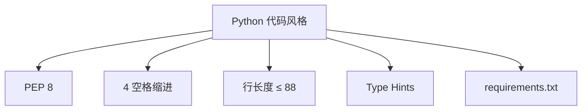
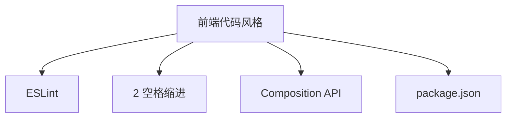
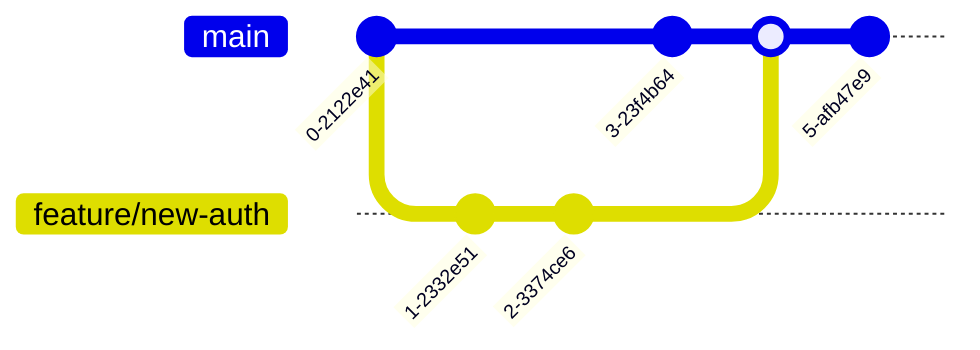
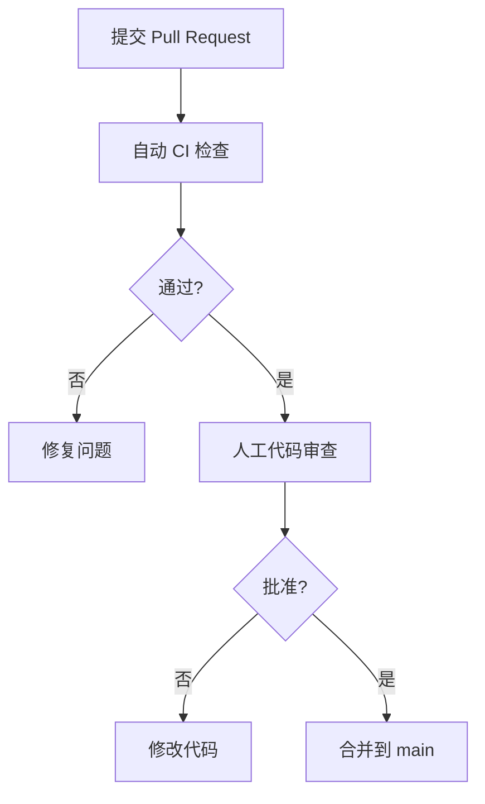

# 贡献指南

<cite>
**本文档引用的文件**  
- [README.md](file://README.md)
- [backend/requirements.txt](file://backend/requirements.txt)
- [frontend/package.json](file://frontend/package.json)
- [backend/main.py](file://backend/main.py)
- [backend/app/config.py](file://backend/app/config.py)
- [backend/app/database.py](file://backend/app/database.py)
- [frontend/vite.config.js](file://frontend/vite.config.js)
- [frontend/src/api/client.js](file://frontend/src/api/client.js)
- [backend/app/api/endpoints/auth.py](file://backend/app/api/endpoints/auth.py)
</cite>

## 目录
1. [简介](#简介)
2. [问题与功能请求](#问题与功能请求)
3. [拉取请求流程](#拉取请求流程)
4. [代码风格规范](#代码风格规范)
5. [提交信息规范](#提交信息规范)
6. [分支管理策略](#分支管理策略)
7. [本地开发环境搭建](#本地开发环境搭建)
8. [测试套件运行](#测试套件运行)
9. [代码审查与合并标准](#代码审查与合并标准)
10. [社区沟通渠道](#社区沟通渠道)

## 简介
欢迎参与 testserver 项目的开发！本指南旨在为社区贡献者提供清晰的参与路径，涵盖从问题报告到代码合并的完整流程。testserver 是一个基于 Web 的自然语言驱动 UI 测试平台，采用前后端分离架构，后端使用 FastAPI (Python)，前端使用 Vue 3。

**Section sources**
- [README.md](file://README.md#L0-L305)

## 问题与功能请求
我们鼓励您通过 GitHub Issues 提交问题或功能请求。请在提交前检查是否已有类似议题。

### 报告问题
请使用 "Bug Report" 模板，提供以下信息：
- 问题描述
- 复现步骤
- 预期行为与实际行为
- 环境信息（Python/Node.js 版本、操作系统）
- 相关错误日志

### 提交功能请求
请使用 "Feature Request" 模板，详细描述：
- 功能目的
- 使用场景
- 建议的实现方式
- 相关截图或示意图（可选）

**Section sources**
- [README.md](file://README.md#L280-L285)

## 拉取请求流程
1. Fork 本仓库
2. 创建新分支（见[分支管理策略](#分支管理策略)）
3. 实现您的更改
4. 确保通过所有测试
5. 提交符合规范的提交信息
6. 创建 Pull Request
7. 参与代码审查讨论
8. 根据反馈修改代码
9. 等待合并

**Section sources**
- [README.md](file://README.md#L280-L285)

## 代码风格规范
为保持代码一致性，请遵守以下风格指南：

### Python 代码
- 遵循 PEP 8 规范
- 使用 4 个空格缩进
- 行长度不超过 88 字符
- 使用 type hints
- 依赖包定义在 `backend/requirements.txt`



**Diagram sources**
- [backend/requirements.txt](file://backend/requirements.txt#L0-L32)
- [backend/main.py](file://backend/main.py#L0-L56)

### JavaScript/TypeScript 代码
- 遵循 ESLint 默认规则
- 使用 2 个空格缩进
- Vue 组件使用 Composition API
- 依赖包定义在 `frontend/package.json`



**Diagram sources**
- [frontend/package.json](file://frontend/package.json#L0-L23)
- [frontend/vite.config.js](file://frontend/vite.config.js#L0-L21)

## 提交信息规范
提交信息应清晰描述更改内容，格式如下：

```
<类型>: <简短描述>

<详细描述>

<关联的 Issue>
```

### 类型选项
- `feat`: 新功能
- `fix`: 问题修复
- `docs`: 文档更新
- `style`: 代码格式调整
- `refactor`: 代码重构
- `test`: 测试相关
- `chore`: 构建或辅助工具变动

**Section sources**
- [README.md](file://README.md#L280-L285)

## 分支管理策略
我们采用简单的分支模型：



- `main` 分支：主分支，保持稳定
- `feature/*` 分支：功能开发分支，命名如 `feature/user-auth`
- `bugfix/*` 分支：问题修复分支，命名如 `bugfix/login-error`

**Diagram sources**
- [README.md](file://README.md#L280-L285)

## 本地开发环境搭建
### 前置要求
- Python 3.9+
- Node.js 16+
- MySQL 8.0+
- npm 或 yarn

### 后端设置
```bash
cd backend
pip install -r requirements.txt
playwright install chromium
cp .env.example .env  # 配置环境变量
python main.py
```

### 前端设置
```bash
cd frontend
npm install
npm run dev
```

**Section sources**
- [README.md](file://README.md#L75-L115)
- [backend/requirements.txt](file://backend/requirements.txt#L0-L32)
- [frontend/package.json](file://frontend/package.json#L0-L23)

## 测试套件运行
### 后端测试
```bash
# 运行单元测试
pytest tests/

# 运行类型检查
mypy app/

# 检查代码风格
flake8 app/
```

### 前端测试
```bash
# 运行单元测试
npm run test:unit

# 检查代码风格
npm run lint
```

确保在提交前所有测试通过。

**Section sources**
- [README.md](file://README.md#L280-L285)

## 代码审查与合并标准
所有 Pull Request 需满足以下条件方可合并：

### 自动检查
- 所有 CI/CD 流水线通过
- 代码风格检查通过
- 测试覆盖率不低于 80%
- 无安全漏洞

### 人工审查
- 代码逻辑正确
- 符合架构设计
- 有适当的错误处理
- 包含必要的测试
- 文档更新（如需要）
- 至少一位核心维护者批准



**Diagram sources**
- [README.md](file://README.md#L280-L285)

## 社区沟通渠道
我们致力于营造开放协作的社区氛围。

### 联系方式
- **问题跟踪**: GitHub Issues
- **代码贡献**: GitHub Pull Requests
- **紧急联系**: admin@testserver.dev

### 沟通原则
- 尊重每位贡献者
- 及时响应问题
- 开放讨论技术方案
- 鼓励新人参与
- 保持专业和友善

我们期待您的贡献，共同打造更优秀的测试平台！

**Section sources**
- [README.md](file://README.md#L280-L295)