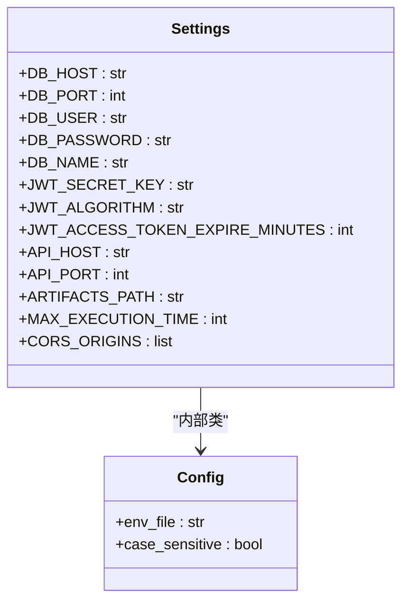
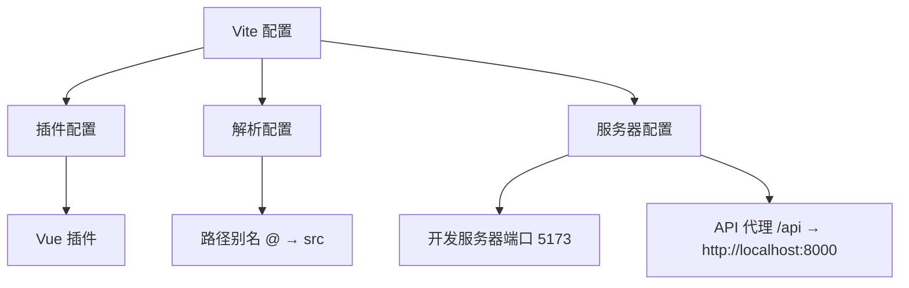
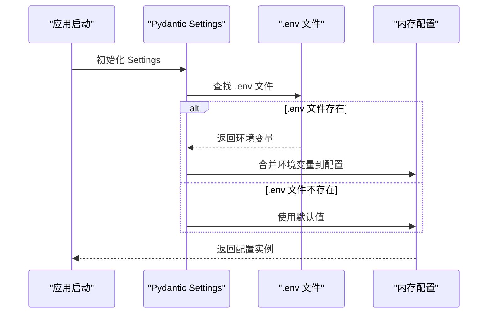
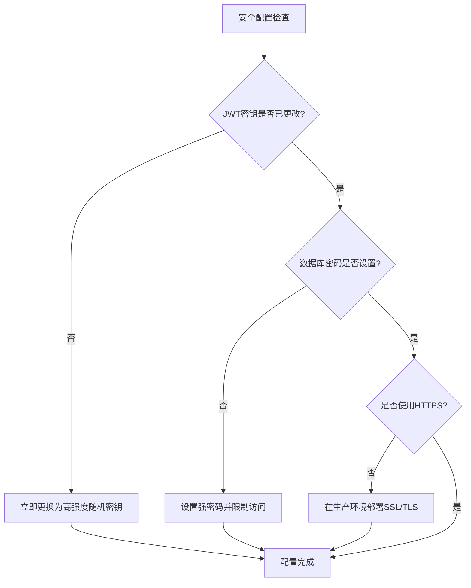
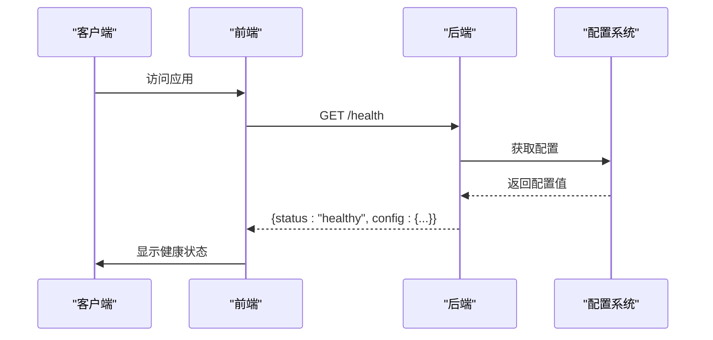

# 配置管理

<cite>
**Referenced Files in This Document**   
- [config.py](file://backend/app/config.py)
- [vite.config.js](file://frontend/vite.config.js)
- [main.py](file://backend/main.py)
- [client.js](file://frontend/src/api/client.js)
</cite>

## 目录
1. [后端配置](#后端配置)
2. [前端配置](#前端配置)
3. [环境变量覆盖](#环境变量覆盖)
4. [配置项列表](#配置项列表)
5. [安全建议](#安全建议)
6. [配置验证方法](#配置验证方法)

## 后端配置

后端配置通过 `config.py` 文件实现，基于 Pydantic Settings 模块提供类型安全的配置管理。配置项通过 `Settings` 类定义，并通过 `settings` 实例在应用中全局使用。



**Diagram sources**
- [config.py](file://backend/app/config.py#L7-L37)

**Section sources**
- [config.py](file://backend/app/config.py#L1-L40)
- [main.py](file://backend/main.py#L1-L57)

### 数据库连接配置

数据库连接配置包含主机地址、端口、用户名、密码和数据库名称。默认配置适用于本地开发环境，生产环境需要根据实际数据库部署情况进行修改。

### JWT安全配置

JWT（JSON Web Token）用于用户认证和会话管理。配置包括密钥、加密算法和令牌过期时间。密钥是安全的核心，必须在生产环境中更换为高强度的随机字符串。

### 服务器配置

服务器配置定义了API服务的监听地址和端口。默认监听所有网络接口（0.0.0.0）上的8000端口，允许外部访问。

### 工件存储路径

`ARTIFACTS_PATH` 配置指定测试执行过程中生成的工件（如截图、日志、视频等）的存储路径。路径可以是相对路径或绝对路径。

### 执行超时设置

`MAX_EXECUTION_TIME` 配置定义了单个测试执行的最大时间（秒）。超过此时间的测试将被强制终止，防止长时间运行的测试占用系统资源。

## 前端配置

前端配置通过 `vite.config.js` 文件实现，基于 Vite 构建工具提供开发服务器和构建配置。



**Diagram sources**
- [vite.config.js](file://frontend/vite.config.js#L1-L22)

**Section sources**
- [vite.config.js](file://frontend/vite.config.js#L1-L22)
- [client.js](file://frontend/src/api/client.js#L1-L45)

### 代理设置

开发服务器通过代理设置解决跨域问题。所有以 `/api` 开头的请求都被代理到后端API服务器（http://localhost:8000），实现了前后端分离开发的无缝集成。

### 环境变量

前端通过 Vite 的环境变量机制管理配置。环境变量以 `VITE_` 开头，可以在代码中通过 `import.meta.env` 访问。

### 构建配置

构建配置定义了源码别名（`@` 指向 `src` 目录），简化了模块导入路径，提高了代码可读性和维护性。

## 环境变量覆盖

系统支持通过 `.env` 文件覆盖默认配置，实现环境特定的配置管理。



**Diagram sources**
- [config.py](file://backend/app/config.py#L35-L36)
- [main.py](file://backend/main.py#L1-L57)

**Section sources**
- [config.py](file://backend/app/config.py#L35-L36)

### 覆盖机制

配置系统按照以下优先级加载配置：
1. 环境变量（最高优先级）
2. `.env` 文件
3. 默认配置值（最低优先级）

这种分层配置机制允许在不同环境（开发、测试、生产）中灵活调整配置，而无需修改代码。

## 配置项列表

### 后端配置项

| 配置项 | 默认值 | 说明 |
|--------|--------|------|
| `DB_HOST` | "localhost" | 数据库主机地址 |
| `DB_PORT` | 3306 | 数据库端口 |
| `DB_USER` | "root" | 数据库用户名 |
| `DB_PASSWORD` | "" | 数据库密码 |
| `DB_NAME` | "ui_test_platform" | 数据库名称 |
| `JWT_SECRET_KEY` | "your-secret-key-change-in-production" | JWT密钥 |
| `JWT_ALGORITHM` | "HS256" | JWT加密算法 |
| `JWT_ACCESS_TOKEN_EXPIRE_MINUTES` | 1440 | JWT令牌过期时间（分钟） |
| `API_HOST` | "0.0.0.0" | API服务器监听地址 |
| `API_PORT` | 8000 | API服务器监听端口 |
| `ARTIFACTS_PATH` | "../artifacts" | 工件存储路径 |
| `MAX_EXECUTION_TIME` | 300 | 最大执行时间（秒） |
| `CORS_ORIGINS` | ["http://localhost:5173", "http://localhost:3000"] | 允许的CORS源 |

### 前端配置项

| 配置项 | 默认值 | 说明 |
|--------|--------|------|
| `server.port` | 5173 | 开发服务器端口 |
| `server.proxy` | /api → http://localhost:8000 | API代理配置 |
| `resolve.alias.@` | path.resolve(__dirname, 'src') | 源码路径别名 |

## 安全建议

为确保系统安全，特别是生产环境部署时，应遵循以下安全建议：



**Diagram sources**
- [config.py](file://backend/app/config.py#L20-L22)

**Section sources**
- [config.py](file://backend/app/config.py#L20-L22)

### JWT密钥安全

生产环境中必须更换默认的JWT密钥。建议使用高强度的随机字符串（至少32字符），可以通过以下命令生成：
```bash
openssl rand -base64 32
```

### 数据库安全

数据库配置不应在代码中硬编码密码。应通过环境变量或密钥管理服务提供数据库凭证，并限制数据库用户的权限。

### CORS安全

根据实际部署环境更新 `CORS_ORIGINS` 配置，只允许受信任的前端域名访问API，防止跨站请求伪造攻击。

## 配置验证方法

系统提供多种方式验证配置是否正确加载和应用。



**Diagram sources**
- [main.py](file://backend/main.py#L50-L56)
- [client.js](file://frontend/src/api/client.js#L1-L45)

**Section sources**
- [main.py](file://backend/main.py#L50-L56)
- [client.js](file://frontend/src/api/client.js#L1-L45)

### 健康检查端点

通过 `/health` 端点可以验证后端服务和配置是否正常。该端点返回服务状态，间接验证了配置系统的可用性。

### 配置调试

在开发过程中，可以通过打印 `settings` 实例来检查当前生效的配置值，确保环境变量正确覆盖了默认值。

### 环境变量验证

启动应用前，可以通过检查环境变量来验证配置：
```bash
echo $JWT_SECRET_KEY
echo $DB_HOST
```