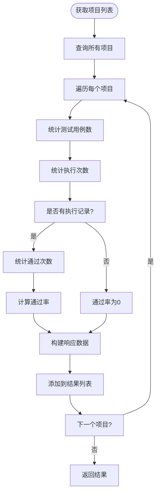
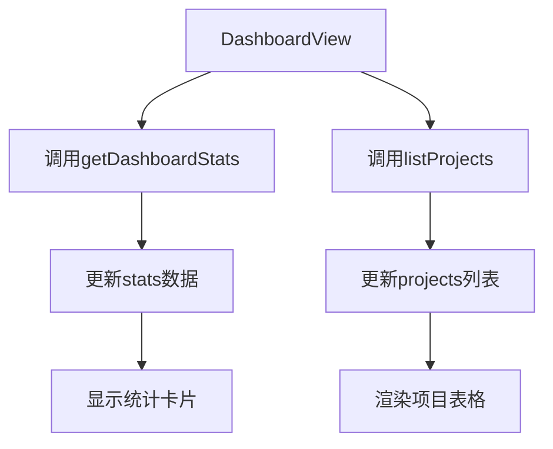
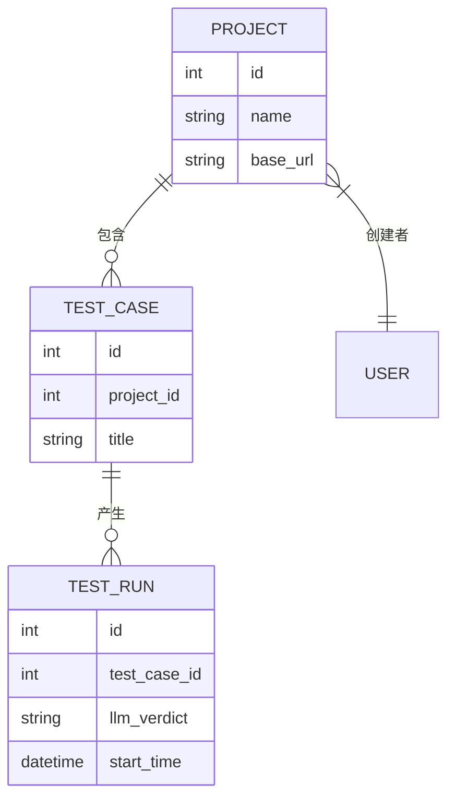

# 项目统计

<cite>
**本文档引用的文件**  
- [projects.py](file://backend/app/api/endpoints/projects.py)
- [project.py](file://backend/app/models/project.py)
- [project.py](file://backend/app/schemas/project.py)
- [test_project_stats.py](file://backend/test_project_stats.py)
- [DashboardView.vue](file://frontend/src/views/DashboardView.vue)
- [index.js](file://frontend/src/api/index.js)
</cite>

## 目录
1. [简介](#简介)
2. [功能概述](#功能概述)
3. [后端实现细节](#后端实现细节)
4. [前端集成与展示](#前端集成与展示)
5. [API接口说明](#api接口说明)
6. [数据统计逻辑](#数据统计逻辑)
7. [实际应用示例](#实际应用示例)
8. [故障排查指南](#故障排查指南)
9. [总结](#总结)

## 简介
本系统提供全面的项目统计功能，用于展示测试平台的整体运行状况和各项目的详细执行指标。统计功能覆盖项目总数、测试用例数量、执行次数及通过率等关键指标，并通过前后端协同实现数据的实时展示。

## 功能概述
项目统计功能主要包含两个层面：
- **仪表盘级全局统计**：展示整个系统的项目、测试用例、执行次数和整体通过率。
- **项目级详细统计**：每个项目在列表中显示其专属的测试用例数、执行次数和通过率。

该功能服务于管理员和普通用户，帮助快速了解测试活动的整体健康状况和趋势。

**Section sources**
- [projects.py](file://backend/app/api/endpoints/projects.py#L186-L214)
- [DashboardView.vue](file://frontend/src/views/DashboardView.vue#L1-L221)

## 后端实现细节

### 数据模型
`Project` 模型定义了项目的基本属性，包括名称、描述、基础URL、LLM配置等。通过 `test_cases` 关系字段与 `TestCase` 模型建立一对多关联。

**Section sources**
- [project.py](file://backend/app/models/project.py#L1-L31)

### 统计响应Schema
`ProjectWithStatsResponse` 类继承自 `ProjectResponse`，扩展了三个统计字段：
- `test_case_count`：测试用例数量
- `execution_count`：执行次数
- `pass_rate`：通过率（百分比）

**Section sources**
- [project.py](file://backend/app/schemas/project.py#L56-L60)

### 统计计算逻辑
后端通过SQL聚合函数动态计算统计数据：
- 使用 `func.count()` 统计记录数量
- 通过 `join` 关联 `TestRun` 和 `TestCase` 表获取执行数据
- 根据 `LLMVerdict.PASSED` 判定通过状态



**Diagram sources**
- [projects.py](file://backend/app/api/endpoints/projects.py#L20-L62)

## 前端集成与展示

### 仪表盘UI设计
前端使用Element Plus组件库构建响应式仪表盘，包含四个关键指标卡片：
- 项目总数
- 测试用例数
- 执行次数
- 通过率

项目列表表格中每行显示单个项目的统计信息，通过率以颜色编码的标签形式展示（绿色≥80%，黄色≥60%，红色<60%）。



**Diagram sources**
- [DashboardView.vue](file://frontend/src/views/DashboardView.vue#L1-L221)

**Section sources**
- [DashboardView.vue](file://frontend/src/views/DashboardView.vue#L1-L221)

## API接口说明

### 获取仪表盘统计数据
- **URL**: `GET /projects/stats/dashboard`
- **权限**: 需登录用户
- **响应示例**:
```json
{
  "projects": 5,
  "testCases": 42,
  "totalRuns": 156,
  "passRate": 87.18
}
```

### 获取项目列表（含统计）
- **URL**: `GET /projects`
- **权限**: 需登录用户
- **响应示例**:
```json
[
  {
    "id": 1,
    "name": "用户管理模块",
    "description": "核心用户功能测试",
    "base_url": "https://example.com",
    "llm_provider": "openai",
    "llm_model": "gpt-4",
    "created_by": 1,
    "created_at": "2024-01-01T10:00:00Z",
    "updated_at": "2024-01-01T10:00:00Z",
    "test_case_count": 15,
    "execution_count": 45,
    "pass_rate": 93.33
  }
]
```

**Section sources**
- [projects.py](file://backend/app/api/endpoints/projects.py#L20-L62)
- [projects.py](file://backend/app/api/endpoints/projects.py#L186-L214)
- [index.js](file://frontend/src/api/index.js#L38-L54)

## 数据统计逻辑

### 通过率计算公式
$$
通过率 = \left( \frac{通过的执行次数}{总执行次数} \right) \times 100\%
$$

当总执行次数为0时，通过率默认为0。

### 数据关联关系


**Diagram sources**
- [project.py](file://backend/app/models/project.py#L1-L31)
- [test_run.py](file://backend/app/models/test_run.py#L19-L23)

**Section sources**
- [projects.py](file://backend/app/api/endpoints/projects.py#L20-L62)
- [test_project_stats.py](file://backend/test_project_stats.py#L1-L53)

## 实际应用示例

### 场景：每日晨会数据汇报
1. 用户登录系统
2. 进入仪表盘页面
3. 系统自动调用 `getDashboardStats` 获取全局指标
4. 同时加载项目列表及其统计信息
5. 团队可快速评估测试覆盖率和质量趋势

### 前端调用示例
```javascript
import { projectAPI } from '@/api'

// 获取仪表盘数据
const loadDashboardData = async () => {
  try {
    const stats = await projectAPI.getDashboardStats()
    const projects = await projectAPI.list()
    // 更新UI
  } catch (error) {
    console.error('加载数据失败:', error)
  }
}
```

**Section sources**
- [index.js](file://frontend/src/api/index.js#L38-L54)
- [DashboardView.vue](file://frontend/src/views/DashboardView.vue#L100-L130)

## 故障排查指南

### 常见问题

#### 问题1：统计数据显示为0或NaN
- **可能原因**：数据库查询结果为空或类型转换错误
- **解决方案**：检查 `scalar() or 0` 默认值处理逻辑，确保空值正确处理

#### 问题2：通过率计算不准确
- **可能原因**：`LLMVerdict` 枚举值不匹配
- **解决方案**：确认 `TestRun.llm_verdict` 字段值为 `"passed"`、`"failed"` 或 `"unknown"`

#### 问题3：接口返回500错误
- **可能原因**：数据库连接失败或SQL语法错误
- **解决方案**：检查 `db.query()` 语句和表关联关系

**Section sources**
- [projects.py](file://backend/app/api/endpoints/projects.py#L20-L62)
- [test_project_stats.py](file://backend/test_project_stats.py#L1-L53)

## 总结
项目统计功能通过前后端紧密协作，实现了测试数据的可视化呈现。后端采用高效的SQL聚合查询，前端通过清晰的UI设计展示关键指标，为团队提供了有价值的测试质量洞察。该功能易于扩展，可在未来添加更多维度的统计分析。